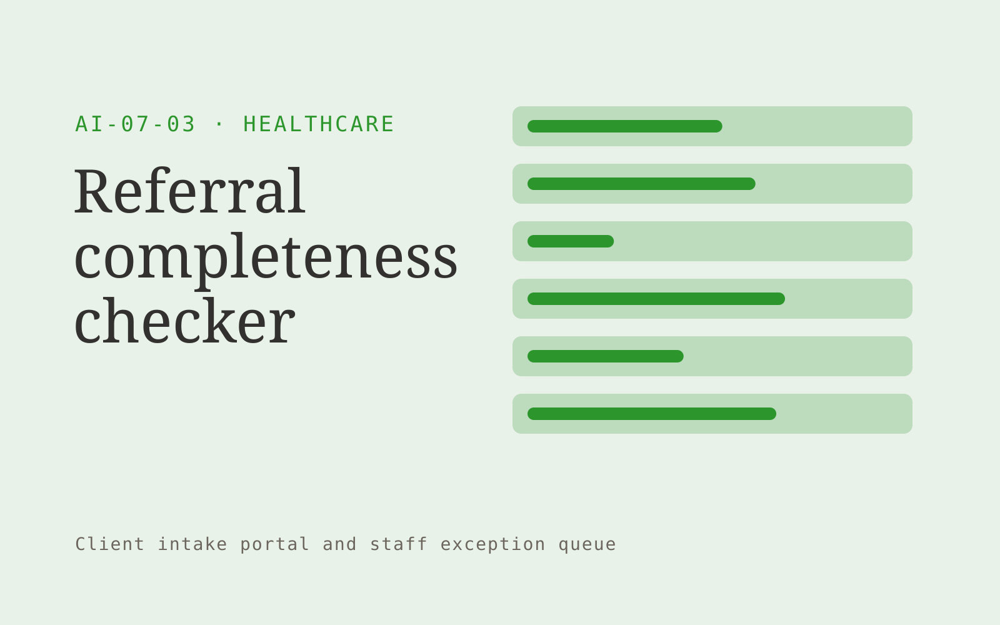

# Referral completeness checker

**Healthcare** · Also fits: Education; Operations; Customer Support

> For referral coordinators at specialist practices, turn referral forms and clinic-defined intake requirements into referral preparation pack and missing-item list. Address the recurring problem: missing administrative details delay referral processing. The value hypothesis is a more complete, reviewable deliverable with less repeated preparation; the pilot must establish whether that benefit is real.

| | |
|---|---|
| **Buyer** | Referral coordinators at specialist practices |
| **Problem** | Missing administrative details delay referral processing. |
| **Format** | Client intake portal and staff exception queue |
| **USP** | Completeness checks separated from clinical triage. |

## The product
Key screens: Referral queue, missing fields, sender follow-up. Give submitters a mobile-friendly step-by-step form with document uploads and a visible completeness checklist. Staff see a queue with missing items and extracted fields. Place the original document beside each uncertain value. Show submitted, clarification required and ready-for-review states. In this product, the first view is referral queue, followed by missing fields and sender follow-up.

## Core functionality
1. Extract patient identifiers.
2. Check required attachments.
3. Identify duplicates.
4. Flag unreadable fields.
5. Draft clarification requests.
6. Prepare staff handoff.

## Customer workflow
Choose the request type, collect declared facts and required documents, extract relevant fields, show missing or inconsistent information, let the submitter correct it, and route the complete package to an authorized reviewer. Start with referral forms and clinic-defined intake requirements and finish with referral preparation pack and missing-item list.

## AI and human review
Classify submitted material, extract candidate fields and draft clarification questions. Deterministic rules test required fields and formats. Keep uncertain extraction visible and preserve the original statement. Do not infer missing material facts.

## Customer inputs
Referral forms and clinic-defined intake requirements

## Customer deliverables
Referral preparation pack and missing-item list

## Accounts and administration
Secure uploads, configurable checklists, progress saving, duplicate handling, reviewer assignments, clarification threads, deadlines and submission history.

## MVP scope
Begin with referral coordinators at specialist practices and one recurring use case. Build the first two modules: extract patient identifiers; check required attachments. Provide operator assistance for the third module: identify duplicates. Deliver referral preparation pack and missing-item list through a manual review queue. Perform other necessary full-scope functions manually during the pilot. Include all applicable access, accuracy and professional-review controls from the start.

## After MVP validation
After paid pilots establish value, automate the remaining modules: flag unreadable fields; draft clarification requests; prepare staff handoff. Add one validated source integration, reusable customer configuration and recurring delivery. Expand to additional teams, document formats or languages only after testing the new scope.

## Build dependencies
Secure upload handling, reliable extraction, versioned completeness rules, submitter identity and staff routing. Third-party checklist changes require maintenance.

## Integrations and data access
Clinic-approved content and administrative exports. Clinical integrations require separate assessment. Case management, customer records, document storage and notification systems. Begin with an exportable review pack before automating destination writes. These are candidate integration categories, not verified supported connectors.

## Defensibility
Document-type expertise, tested completeness rules and a low-friction client experience embedded in a repeat administrative process. For this idea, build around completeness checks separated from clinical triage. This advantage requires execution and accumulated customer trust; the base model alone is not a defensible asset.

## Alternatives and positioning
Email collection, generic web forms, spreadsheets and existing case management systems. Differentiate on this specific proposed advantage: completeness checks separated from clinical triage. Test it against the buyer's current method on the same task. Competitor coverage and uniqueness have not been established.

## Revenue model and test pricing (USD)
Test USD 500-2,000 setup plus USD 150-750 monthly for one form family and a capped submission volume. Quote specialist review and unusual document formats separately. Prices are experimental.

## Main delivery costs
Document processing, storage, exception review, support, checklist maintenance and customer-specific integration work.

## Marketing message to test
> Referral completeness checker for referral coordinators at specialist practices. Completeness checks separated from clinical triage. Demonstrate the claim through an anonymized referral completeness audit.

## Acquisition channels
Specialist practice administrators

## Lead magnet
An anonymized referral completeness audit

## First 30 days of marketing
- Week 1: interview five prospective buyers in this segment: referral coordinators at specialist practices. Ask to see a recent example of the problem and their current process.
- Week 2: prepare this demonstration using authorized or synthetic material: an anonymized referral completeness audit.
- Week 3: present it through specialist practice administrators and seek one narrowly scoped paid pilot.
- Week 4: review complete referrals, administrative turnaround, total delivery effort and a concrete renewal decision before increasing scope.

## Paid pilot and validation
Process a bounded set of historical and new submissions. Include missing, duplicate and unreadable documents. Compare complete submissions and clarification effort with the current intake method. For this idea, use referral forms and clinic-defined intake requirements and evaluate referral preparation pack and missing-item list. Agree success thresholds with the buyer before starting; collect a baseline for complete referrals, administrative turnaround. A positive signal is payment and repeat use with acceptable quality and delivery cost, not a favorable demo reaction alone.

## Success metrics
Complete referrals, administrative turnaround

## Retention and expansion
Review incomplete submissions and simplify recurring friction. Expand to another form or document family after the first workflow reliably produces review-ready cases.

## Operating controls and limitations
Begin with administrative scope or clinician-reviewed material. Minimize sensitive patient data, restrict access and obtain required organizational review before connecting clinical systems. Validate source access and reviewer availability during the pilot. Maintain customer-level access, data deletion controls and a record of final approvals.

## Brand style (concept)

- Colors: `#279131` primary · `#c354c9` accent · `#e4f1e6` surface · `#22201e` ink
- Type: Manrope for headings, Manrope for text
- Voice: Careful, kind, clinically plain
- Demo site: [https://nexibeo.com/ideas/referral-completeness-checker/demo/](https://nexibeo.com/ideas/referral-completeness-checker/demo/)

## Investment indication

Indicative build budget, from MVP to full product. This is a planning range, not a quote; it excludes running costs such as model usage, hosting and reviewer hours.

| Phase | Scope | Timeline | Indicative budget |
|---|---|---|---|
| MVP | One buyer segment, one recurring use case; first modules: extract patient identifiers; check required attachments. Manual review in the loop. | 6 weeks | $11,500 |
| Paid pilot | Accounts, roles, review states, audit trail and the first integration, hardened for two to three paying pilot customers. | 8 weeks | $15,000 |
| Full product | Remaining modules: flag unreadable fields; draft clarification requests; prepare staff handoff. Self-serve onboarding, billing, monitoring and the wider integration set. | 13 weeks | $21,000 |
| **Total** | | 27 weeks | **$47,500** |

**Co-create this project with us:** [contact Nexibeo](https://nexibeo.com/ideas/referral-completeness-checker/#apply) and we build it with you.

## Research status
Concept proposal expanded from the 315-idea conversation. Demand, pricing, differentiation, build scope and integration feasibility are hypotheses, not verified market findings. Category link is inspiration rather than evidence of business viability.

## Credits and next steps

- **Estimation and building this idea:** see the full idea page on [nexibeo.com](https://nexibeo.com/ideas/referral-completeness-checker/) for more detail on estimation, and to co-create and build this idea with Nexibeo.
- **Become an AI-optimized specialist for Healthcare:** [Complete AI Training](https://completeaitraining.com/certification/12b-ai-certification-for-healthcare-specialists/).
- Field news: [AI news for Healthcare](https://completeaitraining.com/all-ai-news-for-healthcare/).
