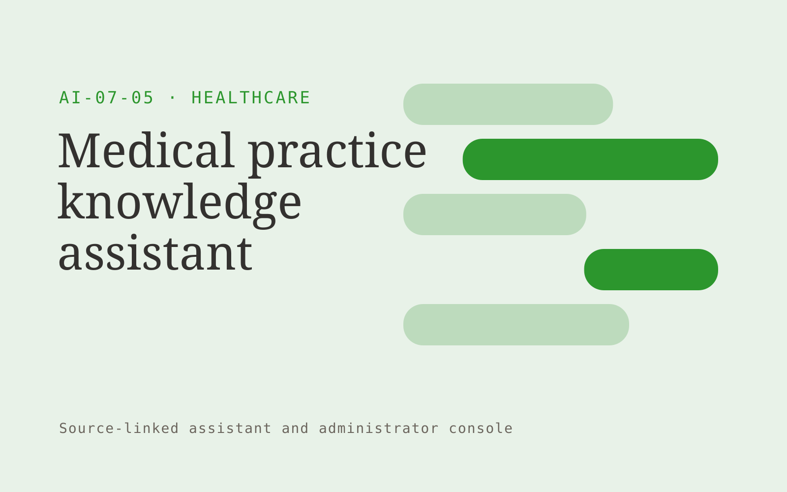

# Medical practice knowledge assistant

**Healthcare** · Also fits: Education; Operations; IT and Development

> For practice managers at multi-location clinics, turn approved internal procedures and access permissions into staff guidance with procedure references. Address the recurring problem: staff cannot reliably locate the current operating procedure. The value hypothesis is a more complete, reviewable deliverable with less repeated preparation; the pilot must establish whether that benefit is real.

| | |
|---|---|
| **Buyer** | Practice managers at multi-location clinics |
| **Problem** | Staff cannot reliably locate the current operating procedure. |
| **Format** | Source-linked assistant and administrator console |
| **USP** | Procedure answers respect role access and source ownership. |

## The product
Key screens: Staff search, cited procedure, ownership panel. Give end users a simple search or conversation surface with short answers and expandable citations. Administrators get source status, unanswered questions and handoff queues. Show the source date beside relevant answers. Keep conversation context available to the staff member receiving an escalation. In this product, the first view is staff search, followed by cited procedure and ownership panel.

## Core functionality
1. Retrieve role-appropriate guidance.
2. Cite current versions.
3. Flag conflicting documents.
4. Show owners.
5. Route unresolved questions.
6. Track update needs.

## Customer workflow
Add an approved collection, assign source owners and access rules, test representative questions, let users ask questions, retrieve supporting passages, answer or request clarification, and hand off unresolved cases with their context. Start with approved internal procedures and access permissions and finish with staff guidance with procedure references.

## AI and human review
Retrieve permitted passages and generate answers constrained to those sources. Use structured rules for transactional facts. Detect missing context and refuse to invent unsupported details. Store reviewer corrections for evaluation and controlled knowledge updates.

## Customer inputs
Approved internal procedures and access permissions

## Customer deliverables
Staff guidance with procedure references

## Accounts and administration
Source ownership, document permissions, freshness checks, conversation history, human handoff, feedback, test questions, usage limits and access logs.

## MVP scope
Begin with practice managers at multi-location clinics and one recurring use case. Build the first two modules: retrieve role-appropriate guidance; cite current versions. Provide operator assistance for the third module: flag conflicting documents. Deliver staff guidance with procedure references through a manual review queue. Perform other necessary full-scope functions manually during the pilot. Include all applicable access, accuracy and professional-review controls from the start.

## After MVP validation
After paid pilots establish value, automate the remaining modules: show owners; route unresolved questions; track update needs. Add one validated source integration, reusable customer configuration and recurring delivery. Expand to additional teams, document formats or languages only after testing the new scope.

## Build dependencies
Permission-filtered retrieval, document versioning, a question evaluation set, staff handoff and a source update process. Reliability depends on source quality and scope.

## Integrations and data access
Clinic-approved content and administrative exports. Clinical integrations require separate assessment. Approved knowledge repositories, websites, service desks and staff messaging systems. Validate access inheritance and use read-only ingestion for the initial deployment. These are candidate integration categories, not verified supported connectors.

## Defensibility
A maintained domain knowledge collection, realistic evaluation questions, useful escalation paths and integrations in the customer’s daily work. For this idea, build around procedure answers respect role access and source ownership. This advantage requires execution and accumulated customer trust; the base model alone is not a defensible asset.

## Alternatives and positioning
Manual search, static FAQs, general chat tools and support or intranet suites. Differentiate on this specific proposed advantage: procedure answers respect role access and source ownership. Test it against the buyer's current method on the same task. Competitor coverage and uniqueness have not been established.

## Revenue model and test pricing (USD)
Test USD 500-2,000 setup plus USD 150-600 monthly for one defined source collection and usage allowance. Price multi-location deployments and specialist support separately. Validate willingness to pay; these are hypotheses.

## Main delivery costs
Document ingestion, retrieval and generation, source maintenance, support, evaluation and staff time handling unresolved cases.

## Marketing message to test
> Medical practice knowledge assistant for practice managers at multi-location clinics. Procedure answers respect role access and source ownership. Demonstrate the claim through a cited answer demonstration from clinic procedures.

## Acquisition channels
Practice operations consultants

## Lead magnet
A cited answer demonstration from clinic procedures

## First 30 days of marketing
- Week 1: interview five prospective buyers in this segment: practice managers at multi-location clinics. Ask to see a recent example of the problem and their current process.
- Week 2: prepare this demonstration using authorized or synthetic material: a cited answer demonstration from clinic procedures.
- Week 3: present it through practice operations consultants and seek one narrowly scoped paid pilot.
- Week 4: review correct retrieval, stale-source incidents, total delivery effort and a concrete renewal decision before increasing scope.

## Paid pilot and validation
Restrict the assistant to one collection and test answered, ambiguous and unanswerable questions. Run supervised use before wider rollout. Measure correctness, escalation quality and staff effort. For this idea, use approved internal procedures and access permissions and evaluate staff guidance with procedure references. Agree success thresholds with the buyer before starting; collect a baseline for correct retrieval, stale-source incidents. A positive signal is payment and repeat use with acceptable quality and delivery cost, not a favorable demo reaction alone.

## Success metrics
Correct retrieval, stale-source incidents

## Retention and expansion
Review unanswered questions and source freshness monthly. Expand to another source collection or team only after the existing assistant meets its agreed accuracy and handoff criteria.

## Operating controls and limitations
Begin with administrative scope or clinician-reviewed material. Minimize sensitive patient data, restrict access and obtain required organizational review before connecting clinical systems. Validate source access and reviewer availability during the pilot. Maintain customer-level access, data deletion controls and a record of final approvals.

## Brand style (concept)

- Colors: `#279127` primary · `#c954c1` accent · `#e4f1e4` surface · `#22201e` ink
- Type: Manrope for headings, Manrope for text
- Voice: Careful, kind, clinically plain
- Demo site: [https://nexibeo.com/solutions/medical-practice-knowledge-assistant/demo/](https://nexibeo.com/solutions/medical-practice-knowledge-assistant/demo/)

## Investment indication

Indicative build budget, from MVP to full product. This is a planning range, not a quote; it excludes running costs such as model usage, hosting and reviewer hours. Built with Nexibeo's AI software development factory, most implementations take days to a few weeks of creation time, depending on availability.

| Phase | Scope | Creation time | Indicative budget |
|---|---|---|---|
| MVP | One buyer segment, one recurring use case; first modules: retrieve role-appropriate guidance; cite current versions. Manual review in the loop. | 6 days | $11,000 |
| Paid pilot | Accounts, roles, review states, audit trail and the first integration, hardened for two to three paying pilot customers. | 7 days | $14,500 |
| Full product | Remaining modules: show owners; route unresolved questions; track update needs. Self-serve onboarding, billing, monitoring and the wider integration set. | 3 weeks | $19,500 |
| **Total** | | about 5 weeks | **$45,000** |

### Running costs per month (rough indication, untested)

| Stage | Hosting and infrastructure | AI usage | Total per month |
|---|---|---|---|
| MVP and paid pilot (about 3 customers) | $50–$100 | $60–$120 | **$110–$220** |
| Full product (about 50 customers) | $190–$380 | $530–$1,050 | **$720–$1,430** |

**Get this built:** [contact Nexibeo](https://nexibeo.com/solutions/medical-practice-knowledge-assistant/#apply). We build it with our AI software factory, usually in days to a few weeks, for you to run internally or offer to your clients.

## Research status
Concept proposal expanded from the 315-idea conversation. Demand, pricing, differentiation, build scope and integration feasibility are hypotheses, not verified market findings. Category link is inspiration rather than evidence of business viability.

## Credits and next steps

- **Estimation and having it built:** see the full solution page on [nexibeo.com](https://nexibeo.com/solutions/medical-practice-knowledge-assistant/) for more detail on estimation. Nexibeo builds it for you as a custom AI implementation, to run internally or to offer to your own clients.
- **Become an AI-optimized specialist for Healthcare:** [Complete AI Training](https://completeaitraining.com/certification/12b-ai-certification-for-healthcare-specialists/).
- Field news: [AI news for Healthcare](https://completeaitraining.com/all-ai-news-for-healthcare/).
