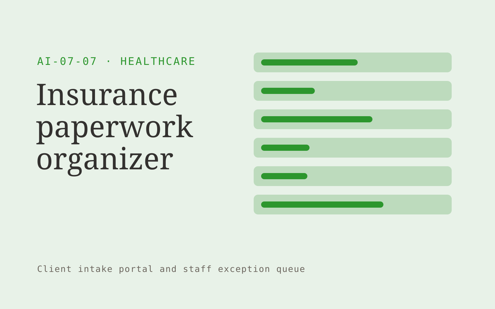

# Insurance paperwork organizer

**Healthcare** · Also fits: Education; Operations; Customer Support

> For billing managers at outpatient practices, turn authorized billing documents and payer-specific checklists into billing review document package. Address the recurring problem: billing cases stall because supporting paperwork is incomplete. The value hypothesis is a more complete, reviewable deliverable with less repeated preparation; the pilot must establish whether that benefit is real.

| | |
|---|---|
| **Buyer** | Billing managers at outpatient practices |
| **Problem** | Billing cases stall because supporting paperwork is incomplete. |
| **Format** | Client intake portal and staff exception queue |
| **USP** | Payer-specific administrative completeness with source traceability. |

## The product
Key screens: Case checklist, document evidence, billing handoff. Give submitters a mobile-friendly step-by-step form with document uploads and a visible completeness checklist. Staff see a queue with missing items and extracted fields. Place the original document beside each uncertain value. Show submitted, clarification required and ready-for-review states. In this product, the first view is case checklist, followed by document evidence and billing handoff.

## Core functionality
1. Collect documents.
2. Extract identifiers.
3. Check required fields.
4. Compare checklist versions.
5. Flag missing evidence.
6. Assemble review packs.

## Customer workflow
Choose the request type, collect declared facts and required documents, extract relevant fields, show missing or inconsistent information, let the submitter correct it, and route the complete package to an authorized reviewer. Start with authorized billing documents and payer-specific checklists and finish with billing review document package.

## AI and human review
Classify submitted material, extract candidate fields and draft clarification questions. Deterministic rules test required fields and formats. Keep uncertain extraction visible and preserve the original statement. Do not infer missing material facts.

## Customer inputs
Authorized billing documents and payer-specific checklists

## Customer deliverables
Billing review document package

## Accounts and administration
Secure uploads, configurable checklists, progress saving, duplicate handling, reviewer assignments, clarification threads, deadlines and submission history.

## MVP scope
Begin with billing managers at outpatient practices and one recurring use case. Build the first two modules: collect documents; extract identifiers. Provide operator assistance for the third module: check required fields. Deliver billing review document package through a manual review queue. Perform other necessary full-scope functions manually during the pilot. Include all applicable access, accuracy and professional-review controls from the start.

## After MVP validation
After paid pilots establish value, automate the remaining modules: compare checklist versions; flag missing evidence; assemble review packs. Add one validated source integration, reusable customer configuration and recurring delivery. Expand to additional teams, document formats or languages only after testing the new scope.

## Build dependencies
Secure upload handling, reliable extraction, versioned completeness rules, submitter identity and staff routing. Third-party checklist changes require maintenance.

## Integrations and data access
Clinic-approved content and administrative exports. Clinical integrations require separate assessment. Case management, customer records, document storage and notification systems. Begin with an exportable review pack before automating destination writes. These are candidate integration categories, not verified supported connectors.

## Defensibility
Document-type expertise, tested completeness rules and a low-friction client experience embedded in a repeat administrative process. For this idea, build around payer-specific administrative completeness with source traceability. This advantage requires execution and accumulated customer trust; the base model alone is not a defensible asset.

## Alternatives and positioning
Email collection, generic web forms, spreadsheets and existing case management systems. Differentiate on this specific proposed advantage: payer-specific administrative completeness with source traceability. Test it against the buyer's current method on the same task. Competitor coverage and uniqueness have not been established.

## Revenue model and test pricing (USD)
Test USD 500-2,000 setup plus USD 150-750 monthly for one form family and a capped submission volume. Quote specialist review and unusual document formats separately. Prices are experimental.

## Main delivery costs
Document processing, storage, exception review, support, checklist maintenance and customer-specific integration work.

## Marketing message to test
> Insurance paperwork organizer for billing managers at outpatient practices. Payer-specific administrative completeness with source traceability. Demonstrate the claim through a de-identified billing document checklist.

## Acquisition channels
Medical billing service partnerships

## Lead magnet
A de-identified billing document checklist

## First 30 days of marketing
- Week 1: interview five prospective buyers in this segment: billing managers at outpatient practices. Ask to see a recent example of the problem and their current process.
- Week 2: prepare this demonstration using authorized or synthetic material: a de-identified billing document checklist.
- Week 3: present it through medical billing service partnerships and seek one narrowly scoped paid pilot.
- Week 4: review complete case rate, clarification rounds, total delivery effort and a concrete renewal decision before increasing scope.

## Paid pilot and validation
Process a bounded set of historical and new submissions. Include missing, duplicate and unreadable documents. Compare complete submissions and clarification effort with the current intake method. For this idea, use authorized billing documents and payer-specific checklists and evaluate billing review document package. Agree success thresholds with the buyer before starting; collect a baseline for complete case rate, clarification rounds. A positive signal is payment and repeat use with acceptable quality and delivery cost, not a favorable demo reaction alone.

## Success metrics
Complete case rate, clarification rounds

## Retention and expansion
Review incomplete submissions and simplify recurring friction. Expand to another form or document family after the first workflow reliably produces review-ready cases.

## Operating controls and limitations
Begin with administrative scope or clinician-reviewed material. Minimize sensitive patient data, restrict access and obtain required organizational review before connecting clinical systems. Validate source access and reviewer availability during the pilot. Maintain customer-level access, data deletion controls and a record of final approvals.

## Brand style (concept)

- Colors: `#319127` primary · `#c954b4` accent · `#e6f1e4` surface · `#22201e` ink
- Type: Manrope for headings, Manrope for text
- Voice: Careful, kind, clinically plain
- Demo site: [https://nexibeo.com/solutions/insurance-paperwork-organizer/demo/](https://nexibeo.com/solutions/insurance-paperwork-organizer/demo/)

## Investment indication

Indicative build budget, from MVP to full product. This is a planning range, not a quote; it excludes running costs such as model usage, hosting and reviewer hours. Built with Nexibeo's AI software development factory, most implementations take days to a few weeks of creation time, depending on availability.

| Phase | Scope | Creation time | Indicative budget |
|---|---|---|---|
| MVP | One buyer segment, one recurring use case; first modules: collect documents; extract identifiers. Manual review in the loop. | 7 days | $11,500 |
| Paid pilot | Accounts, roles, review states, audit trail and the first integration, hardened for two to three paying pilot customers. | 8 days | $15,000 |
| Full product | Remaining modules: compare checklist versions; flag missing evidence; assemble review packs. Self-serve onboarding, billing, monitoring and the wider integration set. | 3 weeks | $21,000 |
| **Total** | | about 6 weeks | **$47,500** |

### Running costs per month (rough indication, untested)

| Stage | Hosting and infrastructure | AI usage | Total per month |
|---|---|---|---|
| MVP and paid pilot (about 3 customers) | $50–$100 | $40–$90 | **$90–$190** |
| Full product (about 50 customers) | $190–$380 | $280–$560 | **$470–$940** |

**Get this built:** [contact Nexibeo](https://nexibeo.com/solutions/insurance-paperwork-organizer/#apply). We build it with our AI software factory, usually in days to a few weeks, for you to run internally or offer to your clients.

## Research status
Concept proposal expanded from the 315-idea conversation. Demand, pricing, differentiation, build scope and integration feasibility are hypotheses, not verified market findings. Category link is inspiration rather than evidence of business viability.

## Credits and next steps

- **Estimation and having it built:** see the full solution page on [nexibeo.com](https://nexibeo.com/solutions/insurance-paperwork-organizer/) for more detail on estimation. Nexibeo builds it for you as a custom AI implementation, to run internally or to offer to your own clients.
- **Become an AI-optimized specialist for Healthcare:** [Complete AI Training](https://completeaitraining.com/certification/12b-ai-certification-for-healthcare-specialists/).
- Field news: [AI news for Healthcare](https://completeaitraining.com/all-ai-news-for-healthcare/).
