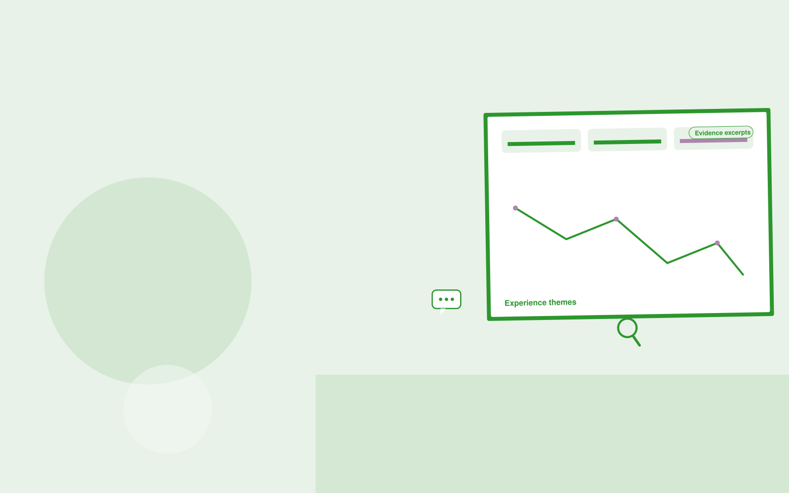

# Clinic feedback analyzer

**AI-07-09 · Healthcare** · Also fits: Education; Operations; Science and Research

> For patient experience managers at clinic groups, turn authorized surveys and de-identified experience comments into experience improvement report. Address the recurring problem: feedback is collected without clear operational follow-through. The value hypothesis is a more complete, reviewable deliverable with less repeated preparation; the pilot must establish whether that benefit is real.

| | |
|---|---|
| **Buyer** | Patient experience managers at clinic groups |
| **Problem** | Feedback is collected without clear operational follow-through. |
| **Format** | Evidence-backed analysis and reporting workspace |
| **USP** | Focuses on actionable patient experience processes rather than clinical judgments. |

## The product
Key screens: Experience themes, evidence excerpts, action owners. Open with a compact overview and filters for the relevant period or segment. Let users drill from each theme or metric into underlying records. Keep source definitions and missing-data notes near the result. Use an action panel to assign investigations and record what was learned. In this product, the first view is experience themes, followed by evidence excerpts and action owners.

## Core functionality
1. Group administrative issues.
2. Protect identifying details.
3. Compare locations carefully.
4. Retain source evidence.
5. Assign improvements.
6. Track recurrence.

## Customer workflow
Agree definitions, import authorized data, validate coverage and identifiers, compute transparent measures, group relevant evidence, review findings, assign investigations or improvements, and repeat on a comparable period. Start with authorized surveys and de-identified experience comments and finish with experience improvement report.

## AI and human review
Classify text, summarize evidence and propose explanations to investigate. Compute financial or operational measures with deterministic code. Separate observed patterns from causal claims and preserve examples that contradict the summary.

## Customer inputs
Authorized surveys and de-identified experience comments

## Customer deliverables
Experience improvement report

## Accounts and administration
Dataset permissions, field mappings, metric definitions, source drill-down, saved filters, reviewer annotations, recurring reports and action ownership.

## MVP scope
Begin with patient experience managers at clinic groups and one recurring use case. Build the first two modules: group administrative issues; protect identifying details. Provide operator assistance for the third module: compare locations carefully. Deliver experience improvement report through a manual review queue. Perform other necessary full-scope functions manually during the pilot. Include all applicable access, accuracy and professional-review controls from the start.

## After MVP validation
After paid pilots establish value, automate the remaining modules: retain source evidence; assign improvements; track recurrence. Add one validated source integration, reusable customer configuration and recurring delivery. Expand to additional teams, document formats or languages only after testing the new scope.

## Build dependencies
Stable identifiers, consistent metric definitions, deterministic calculations, source lineage and representative review samples. Poor coverage must remain visible.

## Integrations and data access
Clinic-approved content and administrative exports. Clinical integrations require separate assessment. Read-only business data exports, reporting databases and task trackers. Reconcile source totals before scheduling recurring data refreshes. These are candidate integration categories, not verified supported connectors.

## Defensibility
Domain-specific definitions, trusted source mappings and a history connecting findings to actions and observed results. For this idea, build around focuses on actionable patient experience processes rather than clinical judgments. This advantage requires execution and accumulated customer trust; the base model alone is not a defensible asset.

## Alternatives and positioning
Analysts, business intelligence dashboards, spreadsheets and general text summarization tools. Differentiate on this specific proposed advantage: focuses on actionable patient experience processes rather than clinical judgments. Test it against the buyer's current method on the same task. Competitor coverage and uniqueness have not been established.

## Revenue model and test pricing (USD)
Test USD 500-2,000 for an initial analysis of one bounded dataset. Offer USD 250-1,000 monthly for repeat reporting at agreed volume. Data cleanup and specialist analysis are separately priced. These are test ranges.

## Main delivery costs
Data preparation, reconciliation, classification, expert interpretation, customer-specific definitions and recurring reporting support.

## Marketing message to test
> Clinic feedback analyzer for patient experience managers at clinic groups. Focuses on actionable patient experience processes rather than clinical judgments. Demonstrate the claim through a de-identified patient experience brief.

## Acquisition channels
Healthcare experience consultancies

## Lead magnet
A de-identified patient experience brief

## First 30 days of marketing
- Week 1: interview five prospective buyers in this segment: patient experience managers at clinic groups. Ask to see a recent example of the problem and their current process.
- Week 2: prepare this demonstration using authorized or synthetic material: a de-identified patient experience brief.
- Week 3: present it through healthcare experience consultancies and seek one narrowly scoped paid pilot.
- Week 4: review reviewer agreement, completed improvements, total delivery effort and a concrete renewal decision before increasing scope.

## Paid pilot and validation
Analyze one historical period and review findings with the responsible domain owner. Reconcile headline measures, inspect counterexamples and ask the buyer to choose a concrete follow-up action. For this idea, use authorized surveys and de-identified experience comments and evaluate experience improvement report. Agree success thresholds with the buyer before starting; collect a baseline for reviewer agreement, completed improvements. A positive signal is payment and repeat use with acceptable quality and delivery cost, not a favorable demo reaction alone.

## Success metrics
Reviewer agreement, completed improvements

## Retention and expansion
Repeat the same definitions each reporting period and track whether findings lead to useful action. Expand data sources without breaking historical comparability.

## Operating controls and limitations
Begin with administrative scope or clinician-reviewed material. Minimize sensitive patient data, restrict access and obtain required organizational review before connecting clinical systems. Validate source access and reviewer availability during the pilot. Maintain customer-level access, data deletion controls and a record of final approvals.

## Brand style (concept)

- Colors: `#27913a` primary · `#c954c5` accent · `#e4f1e7` surface · `#22201e` ink
- Type: Archivo for headings, Lora for text
- Voice: Careful, kind, clinically plain
- Demo site: [https://nexibeo.com/ideas/clinic-feedback-analyzer/demo/](https://nexibeo.com/ideas/clinic-feedback-analyzer/demo/)

## Investment indication

Indicative build budget, from MVP to full product. This is a planning range, not a quote; it excludes running costs such as model usage, hosting and reviewer hours.

| Phase | Scope | Timeline | Indicative budget |
|---|---|---|---|
| MVP | One buyer segment, one recurring use case; first modules: group administrative issues; protect identifying details. Manual review in the loop. | 6 weeks | $11,500 |
| Paid pilot | Accounts, roles, review states, audit trail and the first integration, hardened for two to three paying pilot customers. | 8 weeks | $15,000 |
| Full product | Remaining modules: retain source evidence; assign improvements; track recurrence. Self-serve onboarding, billing, monitoring and the wider integration set. | 13 weeks | $20,500 |
| **Total** | | 27 weeks | **$47,000** |

**Co-create this project with us:** [contact Nexibeo](https://nexibeo.com/ideas/clinic-feedback-analyzer/#apply) and we build it with you.

## Research status
Concept proposal expanded from the 315-idea conversation. Demand, pricing, differentiation, build scope and integration feasibility are hypotheses, not verified market findings. Category link is inspiration rather than evidence of business viability.

## Credits and next steps

- **Estimation and building this idea:** see the full idea page on [nexibeo.com](https://nexibeo.com/ideas/clinic-feedback-analyzer/) for more detail on estimation, and to co-create and build this idea with Nexibeo.
- **Become an AI-optimized specialist for Healthcare:** [Complete AI Training](https://completeaitraining.com/certification/12b-ai-certification-for-healthcare-specialists/).
- Field news: [AI news for Healthcare](https://completeaitraining.com/all-ai-news-for-healthcare/).
