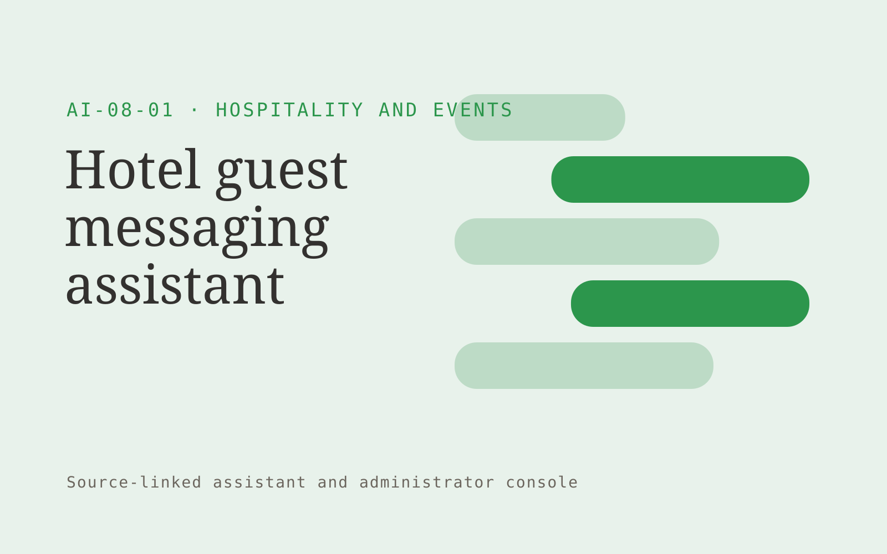

# Hotel guest messaging assistant

**Hospitality and Events** · Also fits: Customer Support; Sales; IT and Development

> For managers of independent boutique hotels, turn property facts, service policies and approved local information into guest responses and service requests. Address the recurring problem: repetitive guest questions interrupt front-desk work. The value hypothesis is a more complete, reviewable deliverable with less repeated preparation; the pilot must establish whether that benefit is real.

| | |
|---|---|
| **Buyer** | Managers of independent boutique hotels |
| **Problem** | Repetitive guest questions interrupt front-desk work. |
| **Format** | Source-linked assistant and administrator console |
| **USP** | Property-specific multilingual answers with accountable staff handoffs. |

## The product
Key screens: Guest inbox, property knowledge, staff requests. Give end users a simple search or conversation surface with short answers and expandable citations. Administrators get source status, unanswered questions and handoff queues. Show the source date beside relevant answers. Keep conversation context available to the staff member receiving an escalation. In this product, the first view is guest inbox, followed by property knowledge and staff requests.

## Core functionality
1. Answer property questions.
2. Identify booking context.
3. Explain service hours.
4. Collect special requests.
5. Hand off exceptions.
6. Track unanswered topics.

## Customer workflow
Add an approved collection, assign source owners and access rules, test representative questions, let users ask questions, retrieve supporting passages, answer or request clarification, and hand off unresolved cases with their context. Start with property facts, service policies and approved local information and finish with guest responses and service requests.

## AI and human review
Retrieve permitted passages and generate answers constrained to those sources. Use structured rules for transactional facts. Detect missing context and refuse to invent unsupported details. Store reviewer corrections for evaluation and controlled knowledge updates.

## Customer inputs
Property facts, service policies and approved local information

## Customer deliverables
Guest responses and service requests

## Accounts and administration
Source ownership, document permissions, freshness checks, conversation history, human handoff, feedback, test questions, usage limits and access logs.

## MVP scope
Begin with managers of independent boutique hotels and one recurring use case. Build the first two modules: answer property questions; identify booking context. Provide operator assistance for the third module: explain service hours. Deliver guest responses and service requests through a manual review queue. Perform other necessary full-scope functions manually during the pilot. Include all applicable access, accuracy and professional-review controls from the start.

## After MVP validation
After paid pilots establish value, automate the remaining modules: collect special requests; hand off exceptions; track unanswered topics. Add one validated source integration, reusable customer configuration and recurring delivery. Expand to additional teams, document formats or languages only after testing the new scope.

## Build dependencies
Permission-filtered retrieval, document versioning, a question evaluation set, staff handoff and a source update process. Reliability depends on source quality and scope.

## Integrations and data access
Property records, event schedules, reservation exports and supplier information. Approved knowledge repositories, websites, service desks and staff messaging systems. Validate access inheritance and use read-only ingestion for the initial deployment. These are candidate integration categories, not verified supported connectors.

## Defensibility
A maintained domain knowledge collection, realistic evaluation questions, useful escalation paths and integrations in the customer’s daily work. For this idea, build around property-specific multilingual answers with accountable staff handoffs. This advantage requires execution and accumulated customer trust; the base model alone is not a defensible asset.

## Alternatives and positioning
Manual search, static FAQs, general chat tools and support or intranet suites. Differentiate on this specific proposed advantage: property-specific multilingual answers with accountable staff handoffs. Test it against the buyer's current method on the same task. Competitor coverage and uniqueness have not been established.

## Revenue model and test pricing (USD)
Test USD 500-2,000 setup plus USD 150-600 monthly for one defined source collection and usage allowance. Price multi-location deployments and specialist support separately. Validate willingness to pay; these are hypotheses.

## Main delivery costs
Document ingestion, retrieval and generation, source maintenance, support, evaluation and staff time handling unresolved cases.

## Marketing message to test
> Hotel guest messaging assistant for managers of independent boutique hotels. Property-specific multilingual answers with accountable staff handoffs. Demonstrate the claim through a demonstration using one hotel's approved guest guide.

## Acquisition channels
Boutique hotel associations

## Lead magnet
A demonstration using one hotel's approved guest guide

## First 30 days of marketing
- Week 1: interview five prospective buyers in this segment: managers of independent boutique hotels. Ask to see a recent example of the problem and their current process.
- Week 2: prepare this demonstration using authorized or synthetic material: a demonstration using one hotel's approved guest guide.
- Week 3: present it through boutique hotel associations and seek one narrowly scoped paid pilot.
- Week 4: review correct answers, staff handling time, total delivery effort and a concrete renewal decision before increasing scope.

## Paid pilot and validation
Restrict the assistant to one collection and test answered, ambiguous and unanswerable questions. Run supervised use before wider rollout. Measure correctness, escalation quality and staff effort. For this idea, use property facts, service policies and approved local information and evaluate guest responses and service requests. Agree success thresholds with the buyer before starting; collect a baseline for correct answers, staff handling time. A positive signal is payment and repeat use with acceptable quality and delivery cost, not a favorable demo reaction alone.

## Success metrics
Correct answers, staff handling time

## Retention and expansion
Review unanswered questions and source freshness monthly. Expand to another source collection or team only after the existing assistant meets its agreed accuracy and handoff criteria.

## Operating controls and limitations
Verify property facts, availability and supplier conditions. Staff approve commercial exceptions and consequential booking changes. Validate source access and reviewer availability during the pilot. Maintain customer-level access, data deletion controls and a record of final approvals.

## Brand style (concept)

- Colors: `#27913c` primary · `#c954a0` accent · `#e4f1e7` surface · `#22201e` ink
- Type: Space Grotesk for headings, Inter for text
- Voice: Welcoming, lively, attentive
- Demo site: [https://nexibeo.com/solutions/hotel-guest-messaging-assistant/demo/](https://nexibeo.com/solutions/hotel-guest-messaging-assistant/demo/)

## Investment indication

Indicative build budget, from MVP to full product. This is a planning range, not a quote; it excludes running costs such as model usage, hosting and reviewer hours. Built with Nexibeo's AI software development factory, most implementations take days to a few weeks of creation time, depending on availability.

| Phase | Scope | Creation time | Indicative budget |
|---|---|---|---|
| MVP | One buyer segment, one recurring use case; first modules: answer property questions; identify booking context. Manual review in the loop. | 3 days | $6,500 |
| Paid pilot | Accounts, roles, review states, audit trail and the first integration, hardened for two to three paying pilot customers. | 4 days | $6,500 |
| Full product | Remaining modules: collect special requests; hand off exceptions; track unanswered topics. Self-serve onboarding, billing, monitoring and the wider integration set. | 7 days | $9,500 |
| **Total** | | about 3 weeks | **$22,500** |

### Running costs per month (rough indication, untested)

| Stage | Hosting and infrastructure | AI usage | Total per month |
|---|---|---|---|
| MVP and paid pilot (about 3 customers) | $30–$60 | $60–$120 | **$90–$180** |
| Full product (about 50 customers) | $110–$210 | $530–$1,050 | **$640–$1,260** |

**Get this built:** [contact Nexibeo](https://nexibeo.com/solutions/hotel-guest-messaging-assistant/#apply). We build it with our AI software factory, usually in days to a few weeks, for you to run internally or offer to your clients.

## Research status
Concept proposal expanded from the 315-idea conversation. Demand, pricing, differentiation, build scope and integration feasibility are hypotheses, not verified market findings. Category link is inspiration rather than evidence of business viability.

## Credits and next steps

- **Estimation and having it built:** see the full solution page on [nexibeo.com](https://nexibeo.com/solutions/hotel-guest-messaging-assistant/) for more detail on estimation. Nexibeo builds it for you as a custom AI implementation, to run internally or to offer to your own clients.
- **Become an AI-optimized specialist for Hospitality and Events:** [Complete AI Training](https://completeaitraining.com/certification/12b-ai-certification-for-hospitality-and-events-specialists/).
- Field news: [AI news for Hospitality and Events](https://completeaitraining.com/all-ai-news-for-hospitality-and-events/).
