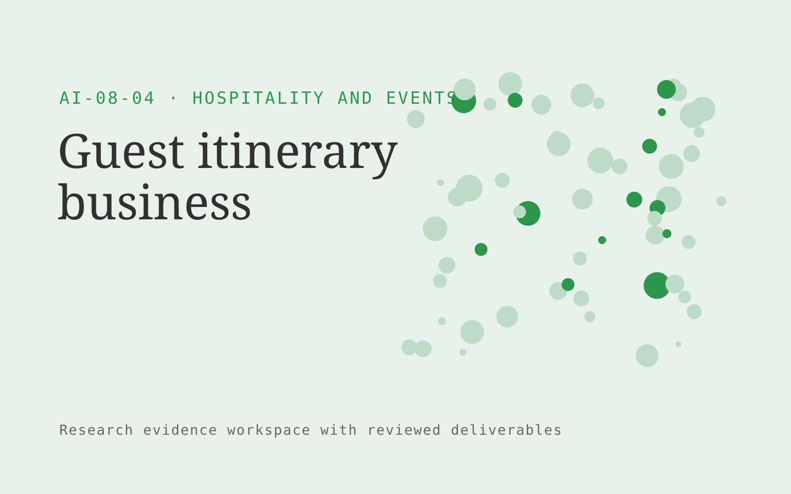

# Guest itinerary business

**AI-08-04 · Hospitality and Events** · Also fits: Customer Support; Sales; Science and Research

> For concierge teams serving premium independent travelers, turn guest brief and verified local supplier information into verified itinerary and booking checklist. Address the recurring problem: generic travel plans ignore practical timing and preferences. The value hypothesis is a more complete, reviewable deliverable with less repeated preparation; the pilot must establish whether that benefit is real.

| | |
|---|---|
| **Buyer** | Concierge teams serving premium independent travelers |
| **Problem** | Generic travel plans ignore practical timing and preferences. |
| **Format** | Research evidence workspace with reviewed deliverables |
| **USP** | Personalized plans with explicit verification dates and booking status. |

## The product
Key screens: Preference intake, map itinerary, booking checklist. Organize work by research question. Show a source library, an evidence matrix and a draft findings panel with linked quotations. Keep contradictory findings and unanswered questions visible. Allow reviewers to inspect the original context before accepting an interpretation. In this product, the first view is preference intake, followed by map itinerary and booking checklist.

## Core functionality
1. Capture travel preferences.
2. Organize daily routes.
3. Verify operating details.
4. Flag booking dependencies.
5. Suggest alternatives.
6. Export mobile guides.

## Customer workflow
Agree the decision and research questions, define permitted sources or participants, collect evidence, code findings, compare supporting and contradictory material, review interpretations, and deliver a cited brief with next questions. Start with guest brief and verified local supplier information and finish with verified itinerary and booking checklist.

## AI and human review
Assist with retrieval, transcription, structured extraction and thematic synthesis. Preserve source passages and methodological context. Human researchers validate inclusion, quotations and conclusions. Use real participants when customer research is required.

## Customer inputs
Guest brief and verified local supplier information

## Customer deliverables
Verified itinerary and booking checklist

## Accounts and administration
Source provenance, participant consent where applicable, research questions, coding definitions, reviewer disagreements, citations and versioned conclusions.

## MVP scope
Begin with concierge teams serving premium independent travelers and one recurring use case. Build the first two modules: capture travel preferences; organize daily routes. Provide operator assistance for the third module: verify operating details. Deliver verified itinerary and booking checklist through a manual review queue. Perform other necessary full-scope functions manually during the pilot. Include all applicable access, accuracy and professional-review controls from the start.

## After MVP validation
After paid pilots establish value, automate the remaining modules: flag booking dependencies; suggest alternatives; export mobile guides. Add one validated source integration, reusable customer configuration and recurring delivery. Expand to additional teams, document formats or languages only after testing the new scope.

## Build dependencies
A clear research protocol, source access, citation tracking and qualified interpretation. Interview work also needs relevant participants and consent management.

## Integrations and data access
Property records, event schedules, reservation exports and supplier information. Permitted research libraries, interview recording imports, citation exports and document editors. Preserve original source metadata throughout the workflow. These are candidate integration categories, not verified supported connectors.

## Defensibility
Niche research protocols, credible researcher relationships and a rights-cleared evidence archive with consistent interpretation methods. For this idea, build around personalized plans with explicit verification dates and booking status. This advantage requires execution and accumulated customer trust; the base model alone is not a defensible asset.

## Alternatives and positioning
Research consultants, internal analysts, literature databases and general search or summarization tools. Differentiate on this specific proposed advantage: personalized plans with explicit verification dates and booking status. Test it against the buyer's current method on the same task. Competitor coverage and uniqueness have not been established.

## Revenue model and test pricing (USD)
Test USD 75-300 for one researched digital itinerary with a defined destination, trip length and revision allowance. Offer a concierge partner retainer for recurring orders. Booking charges and any disclosed commissions are separate. Prices are hypotheses.

## Main delivery costs
Researcher time, source access, participant recruitment, transcription, evidence coding, expert review and report revisions.

## Marketing message to test
> Guest itinerary business for concierge teams serving premium independent travelers. Personalized plans with explicit verification dates and booking status. Demonstrate the claim through a sample one-day itinerary with confirmed logistics.

## Acquisition channels
Travel advisers and accommodation partners

## Lead magnet
A sample one-day itinerary with confirmed logistics

## First 30 days of marketing
- Week 1: interview five prospective buyers in this segment: concierge teams serving premium independent travelers. Ask to see a recent example of the problem and their current process.
- Week 2: prepare this demonstration using authorized or synthetic material: a sample one-day itinerary with confirmed logistics.
- Week 3: present it through travel advisers and accommodation partners and seek one narrowly scoped paid pilot.
- Week 4: review guest acceptance, information corrections, total delivery effort and a concrete renewal decision before increasing scope.

## Paid pilot and validation
Answer one practical question using a bounded evidence set. Ask a domain expert to review citations and reasoning, identify contrary evidence and assess whether the deliverable supports the intended decision. For this idea, use guest brief and verified local supplier information and evaluate verified itinerary and booking checklist. Agree success thresholds with the buyer before starting; collect a baseline for guest acceptance, information corrections. A positive signal is payment and repeat use with acceptable quality and delivery cost, not a favorable demo reaction alone.

## Success metrics
Guest acceptance, information corrections

## Retention and expansion
Maintain the research question and evidence archive, offer follow-up studies and refresh important sources. Build repeat work around the buyer’s decision cycle.

## Operating controls and limitations
Verify property facts, availability and supplier conditions. Staff approve commercial exceptions and consequential booking changes. Validate source access and reviewer availability during the pilot. Maintain customer-level access, data deletion controls and a record of final approvals.

## Brand style (concept)

- Colors: `#279141` primary · `#c954c1` accent · `#e4f1e8` surface · `#22201e` ink
- Type: Playfair Display for headings, Source Sans 3 for text
- Voice: Welcoming, lively, attentive
- Demo site: [https://nexibeo.com/ideas/guest-itinerary-business/demo/](https://nexibeo.com/ideas/guest-itinerary-business/demo/)

## Investment indication

Indicative build budget, from MVP to full product. This is a planning range, not a quote; it excludes running costs such as model usage, hosting and reviewer hours.

| Phase | Scope | Timeline | Indicative budget |
|---|---|---|---|
| MVP | One buyer segment, one recurring use case; first modules: capture travel preferences; organize daily routes. Manual review in the loop. | 5 weeks | $9,000 |
| Paid pilot | Accounts, roles, review states, audit trail and the first integration, hardened for two to three paying pilot customers. | 6 weeks | $10,500 |
| Full product | Remaining modules: flag booking dependencies; suggest alternatives; export mobile guides. Self-serve onboarding, billing, monitoring and the wider integration set. | 10 weeks | $14,500 |
| **Total** | | 21 weeks | **$34,000** |

**Co-create this project with us:** [contact Nexibeo](https://nexibeo.com/ideas/guest-itinerary-business/#apply) and we build it with you.

## Research status
Concept proposal expanded from the 315-idea conversation. Demand, pricing, differentiation, build scope and integration feasibility are hypotheses, not verified market findings. Category link is inspiration rather than evidence of business viability.

## Credits and next steps

- **Estimation and building this idea:** see the full idea page on [nexibeo.com](https://nexibeo.com/ideas/guest-itinerary-business/) for more detail on estimation, and to co-create and build this idea with Nexibeo.
- **Become an AI-optimized specialist for Hospitality and Events:** [Complete AI Training](https://completeaitraining.com/certification/12b-ai-certification-for-hospitality-and-events-specialists/).
- Field news: [AI news for Hospitality and Events](https://completeaitraining.com/all-ai-news-for-hospitality-and-events/).
