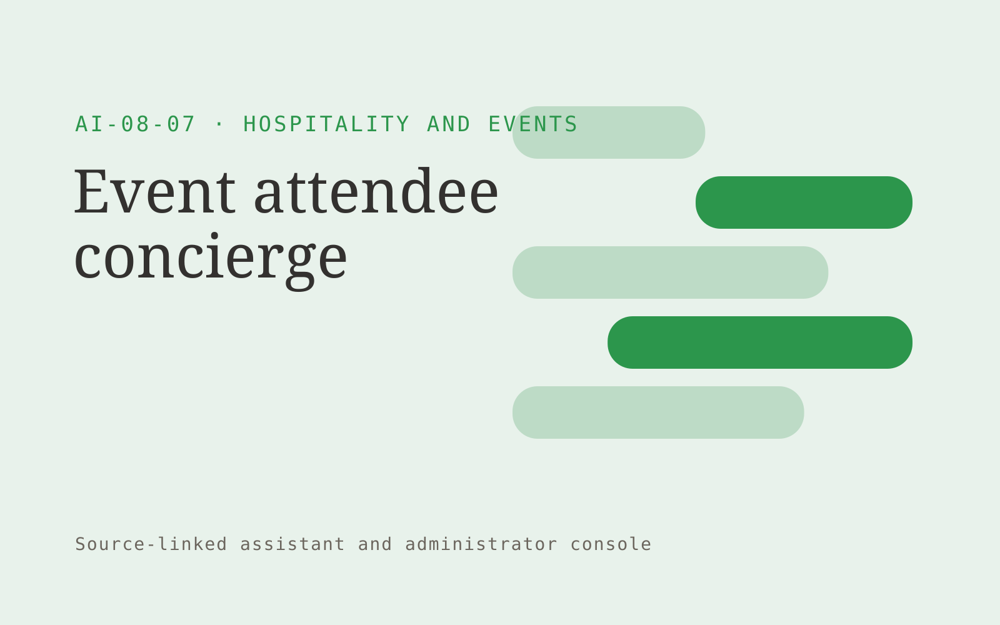

# Event attendee concierge

**AI-08-07 · Hospitality and Events** · Also fits: Customer Support; Sales; IT and Development

> For conference organizers with complex agendas, turn approved agenda, venue map and event policies into attendee guidance and organizer escalations. Address the recurring problem: attendees cannot quickly find relevant logistical information. The value hypothesis is a more complete, reviewable deliverable with less repeated preparation; the pilot must establish whether that benefit is real.

| | |
|---|---|
| **Buyer** | Conference organizers with complex agendas |
| **Problem** | Attendees cannot quickly find relevant logistical information. |
| **Format** | Source-linked assistant and administrator console |
| **USP** | Agenda-aware answers with organizer-controlled updates. |

## The product
Key screens: Mobile event chat, personal agenda, help handoff. Give end users a simple search or conversation surface with short answers and expandable citations. Administrators get source status, unanswered questions and handoff queues. Show the source date beside relevant answers. Keep conversation context available to the staff member receiving an escalation. In this product, the first view is mobile event chat, followed by personal agenda and help handoff.

## Core functionality
1. Find sessions.
2. Explain venue routes.
3. Answer accessibility questions.
4. Surface schedule changes.
5. Save attendee interests.
6. Route organizer help.

## Customer workflow
Add an approved collection, assign source owners and access rules, test representative questions, let users ask questions, retrieve supporting passages, answer or request clarification, and hand off unresolved cases with their context. Start with approved agenda, venue map and event policies and finish with attendee guidance and organizer escalations.

## AI and human review
Retrieve permitted passages and generate answers constrained to those sources. Use structured rules for transactional facts. Detect missing context and refuse to invent unsupported details. Store reviewer corrections for evaluation and controlled knowledge updates.

## Customer inputs
Approved agenda, venue map and event policies

## Customer deliverables
Attendee guidance and organizer escalations

## Accounts and administration
Source ownership, document permissions, freshness checks, conversation history, human handoff, feedback, test questions, usage limits and access logs.

## MVP scope
Begin with conference organizers with complex agendas and one recurring use case. Build the first two modules: find sessions; explain venue routes. Provide operator assistance for the third module: answer accessibility questions. Deliver attendee guidance and organizer escalations through a manual review queue. Perform other necessary full-scope functions manually during the pilot. Include all applicable access, accuracy and professional-review controls from the start.

## After MVP validation
After paid pilots establish value, automate the remaining modules: surface schedule changes; save attendee interests; route organizer help. Add one validated source integration, reusable customer configuration and recurring delivery. Expand to additional teams, document formats or languages only after testing the new scope.

## Build dependencies
Permission-filtered retrieval, document versioning, a question evaluation set, staff handoff and a source update process. Reliability depends on source quality and scope.

## Integrations and data access
Property records, event schedules, reservation exports and supplier information. Approved knowledge repositories, websites, service desks and staff messaging systems. Validate access inheritance and use read-only ingestion for the initial deployment. These are candidate integration categories, not verified supported connectors.

## Defensibility
A maintained domain knowledge collection, realistic evaluation questions, useful escalation paths and integrations in the customer’s daily work. For this idea, build around agenda-aware answers with organizer-controlled updates. This advantage requires execution and accumulated customer trust; the base model alone is not a defensible asset.

## Alternatives and positioning
Manual search, static FAQs, general chat tools and support or intranet suites. Differentiate on this specific proposed advantage: agenda-aware answers with organizer-controlled updates. Test it against the buyer's current method on the same task. Competitor coverage and uniqueness have not been established.

## Revenue model and test pricing (USD)
Test USD 500-2,000 setup plus USD 150-600 monthly for one defined source collection and usage allowance. Price multi-location deployments and specialist support separately. Validate willingness to pay; these are hypotheses.

## Main delivery costs
Document ingestion, retrieval and generation, source maintenance, support, evaluation and staff time handling unresolved cases.

## Marketing message to test
> Event attendee concierge for conference organizers with complex agendas. Agenda-aware answers with organizer-controlled updates. Demonstrate the claim through an interactive concierge for a sample conference.

## Acquisition channels
Conference production agencies

## Lead magnet
An interactive concierge for a sample conference

## First 30 days of marketing
- Week 1: interview five prospective buyers in this segment: conference organizers with complex agendas. Ask to see a recent example of the problem and their current process.
- Week 2: prepare this demonstration using authorized or synthetic material: an interactive concierge for a sample conference.
- Week 3: present it through conference production agencies and seek one narrowly scoped paid pilot.
- Week 4: review correct answers, organizer help volume, total delivery effort and a concrete renewal decision before increasing scope.

## Paid pilot and validation
Restrict the assistant to one collection and test answered, ambiguous and unanswerable questions. Run supervised use before wider rollout. Measure correctness, escalation quality and staff effort. For this idea, use approved agenda, venue map and event policies and evaluate attendee guidance and organizer escalations. Agree success thresholds with the buyer before starting; collect a baseline for correct answers, organizer help volume. A positive signal is payment and repeat use with acceptable quality and delivery cost, not a favorable demo reaction alone.

## Success metrics
Correct answers, organizer help volume

## Retention and expansion
Review unanswered questions and source freshness monthly. Expand to another source collection or team only after the existing assistant meets its agreed accuracy and handoff criteria.

## Operating controls and limitations
Verify property facts, availability and supplier conditions. Staff approve commercial exceptions and consequential booking changes. Validate source access and reviewer availability during the pilot. Maintain customer-level access, data deletion controls and a record of final approvals.

## Brand style (concept)

- Colors: `#279147` primary · `#c95495` accent · `#e4f1e8` surface · `#22201e` ink
- Type: Playfair Display for headings, Source Sans 3 for text
- Voice: Welcoming, lively, attentive
- Demo site: [https://nexibeo.com/ideas/event-attendee-concierge/demo/](https://nexibeo.com/ideas/event-attendee-concierge/demo/)

## Investment indication

Indicative build budget, from MVP to full product. This is a planning range, not a quote; it excludes running costs such as model usage, hosting and reviewer hours.

| Phase | Scope | Timeline | Indicative budget |
|---|---|---|---|
| MVP | One buyer segment, one recurring use case; first modules: find sessions; explain venue routes. Manual review in the loop. | 4 weeks | $6,500 |
| Paid pilot | Accounts, roles, review states, audit trail and the first integration, hardened for two to three paying pilot customers. | 5 weeks | $6,500 |
| Full product | Remaining modules: surface schedule changes; save attendee interests; route organizer help. Self-serve onboarding, billing, monitoring and the wider integration set. | 8 weeks | $9,500 |
| **Total** | | 17 weeks | **$22,500** |

**Co-create this project with us:** [contact Nexibeo](https://nexibeo.com/ideas/event-attendee-concierge/#apply) and we build it with you.

## Research status
Concept proposal expanded from the 315-idea conversation. Demand, pricing, differentiation, build scope and integration feasibility are hypotheses, not verified market findings. Category link is inspiration rather than evidence of business viability.

## Credits and next steps

- **Estimation and building this idea:** see the full idea page on [nexibeo.com](https://nexibeo.com/ideas/event-attendee-concierge/) for more detail on estimation, and to co-create and build this idea with Nexibeo.
- **Become an AI-optimized specialist for Hospitality and Events:** [Complete AI Training](https://completeaitraining.com/certification/12b-ai-certification-for-hospitality-and-events-specialists/).
- Field news: [AI news for Hospitality and Events](https://completeaitraining.com/all-ai-news-for-hospitality-and-events/).
