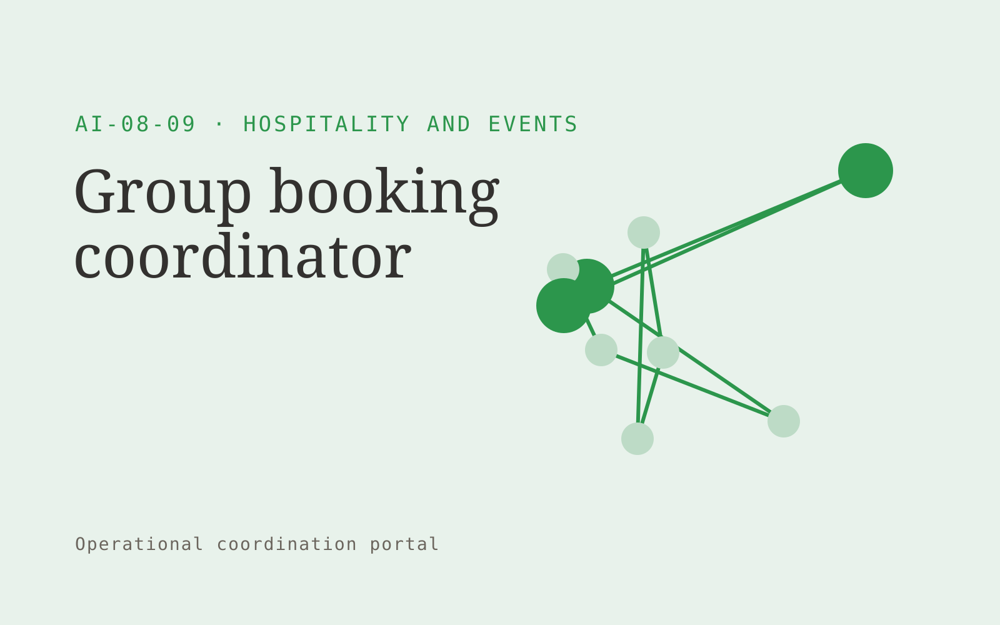

# Group booking coordinator

**Hospitality and Events** · Also fits: Customer Support; Sales; Management

> For reservation teams handling retreats and weddings, turn group requirements, room inventory and guest forms into confirmed rooming lists and change history. Address the recurring problem: rooming lists and booking changes arrive through scattered messages. The value hypothesis is a more complete, reviewable deliverable with less repeated preparation; the pilot must establish whether that benefit is real.

| | |
|---|---|
| **Buyer** | Reservation teams handling retreats and weddings |
| **Problem** | Rooming lists and booking changes arrive through scattered messages. |
| **Format** | Operational coordination portal |
| **USP** | A single versioned group record shared with authorized organizers. |

## The product
Key screens: Group dashboard, rooming list, change queue. Use a queue or timeline as the opening view, with clear owners, dates and current states. Each case opens into its source context, proposed actions and discussion. Give external participants a limited form or status page. Make the next required action visible without opening every record. In this product, the first view is group dashboard, followed by rooming list and change queue.

## Core functionality
1. Collect attendee details.
2. Map room preferences.
3. Flag conflicts.
4. Track deposits.
5. Manage approved changes.
6. Export supplier lists.

## Customer workflow
Create a case from approved inputs, identify required actions, confirm owners and dates, request missing information, approve proposed communications or changes, track completion, and retain a handover record. Start with group requirements, room inventory and guest forms and finish with confirmed rooming lists and change history.

## AI and human review
Extract candidate actions and relevant context, classify requests and draft communications. Use explicit rules for scheduling, state transitions and permissions. People confirm obligations and approve consequential actions before execution.

## Customer inputs
Group requirements, room inventory and guest forms

## Customer deliverables
Confirmed rooming lists and change history

## Accounts and administration
Role permissions, task ownership, deadlines, reminders, approval gates, exception handling, action history, duplicate prevention and reversible configuration.

## MVP scope
Begin with reservation teams handling retreats and weddings and one recurring use case. Build the first two modules: collect attendee details; map room preferences. Provide operator assistance for the third module: flag conflicts. Deliver confirmed rooming lists and change history through a manual review queue. Perform other necessary full-scope functions manually during the pilot. Include all applicable access, accuracy and professional-review controls from the start.

## After MVP validation
After paid pilots establish value, automate the remaining modules: track deposits; manage approved changes; export supplier lists. Add one validated source integration, reusable customer configuration and recurring delivery. Expand to additional teams, document formats or languages only after testing the new scope.

## Build dependencies
Explicit state definitions, owner mapping, approval rules, idempotent actions, notifications and recovery procedures. Workflow reliability matters more than fluent text.

## Integrations and data access
Property records, event schedules, reservation exports and supplier information. Calendars, email, task managers and relevant business records. Use draft actions and supervised handoffs first, then enable only specifically authorized writes. These are candidate integration categories, not verified supported connectors.

## Defensibility
Customer-specific workflow rules, reliable handoffs, operational history and integrations that make the service part of daily work. For this idea, build around a single versioned group record shared with authorized organizers. This advantage requires execution and accumulated customer trust; the base model alone is not a defensible asset.

## Alternatives and positioning
Shared inboxes, spreadsheets, task boards and existing workflow automation products. Differentiate on this specific proposed advantage: a single versioned group record shared with authorized organizers. Test it against the buyer's current method on the same task. Competitor coverage and uniqueness have not been established.

## Revenue model and test pricing (USD)
Test USD 750-2,500 setup plus USD 200-800 monthly for one bounded workflow and team. Cap case volume and implementation scope. Larger operational integrations need separate quotes. Prices are hypotheses.

## Main delivery costs
Workflow configuration, integration maintenance, model calls, notification delivery, exception support and monitoring.

## Marketing message to test
> Group booking coordinator for reservation teams handling retreats and weddings. A single versioned group record shared with authorized organizers. Demonstrate the claim through a group booking workspace demo.

## Acquisition channels
Retreat planners and wedding coordinators

## Lead magnet
A group booking workspace demo

## First 30 days of marketing
- Week 1: interview five prospective buyers in this segment: reservation teams handling retreats and weddings. Ask to see a recent example of the problem and their current process.
- Week 2: prepare this demonstration using authorized or synthetic material: a group booking workspace demo.
- Week 3: present it through retreat planners and wedding coordinators and seek one narrowly scoped paid pilot.
- Week 4: review list errors, coordination hours, total delivery effort and a concrete renewal decision before increasing scope.

## Paid pilot and validation
Run one recurring workflow with a small team. Track every handoff and exception, verify completed actions, and compare handling time and missed commitments with the prior process. For this idea, use group requirements, room inventory and guest forms and evaluate confirmed rooming lists and change history. Agree success thresholds with the buyer before starting; collect a baseline for list errors, coordination hours. A positive signal is payment and repeat use with acceptable quality and delivery cost, not a favorable demo reaction alone.

## Success metrics
List errors, coordination hours

## Retention and expansion
Report completed actions and recurring exceptions. Maintain the workflow as policies change, then add one adjacent handoff with clear ownership.

## Operating controls and limitations
Verify property facts, availability and supplier conditions. Staff approve commercial exceptions and consequential booking changes. Validate source access and reviewer availability during the pilot. Maintain customer-level access, data deletion controls and a record of final approvals.

## Brand style (concept)

- Colors: `#27913c` primary · `#bd54c9` accent · `#e4f1e7` surface · `#22201e` ink
- Type: Playfair Display for headings, Source Sans 3 for text
- Voice: Welcoming, lively, attentive
- Demo site: [https://nexibeo.com/ideas/group-booking-coordinator/demo/](https://nexibeo.com/ideas/group-booking-coordinator/demo/)

## Investment indication

Indicative build budget, from MVP to full product. This is a planning range, not a quote; it excludes running costs such as model usage, hosting and reviewer hours.

| Phase | Scope | Timeline | Indicative budget |
|---|---|---|---|
| MVP | One buyer segment, one recurring use case; first modules: collect attendee details; map room preferences. Manual review in the loop. | 5 weeks | $9,500 |
| Paid pilot | Accounts, roles, review states, audit trail and the first integration, hardened for two to three paying pilot customers. | 6 weeks | $11,500 |
| Full product | Remaining modules: track deposits; manage approved changes; export supplier lists. Self-serve onboarding, billing, monitoring and the wider integration set. | 11 weeks | $15,500 |
| **Total** | | 22 weeks | **$36,500** |

### Running costs per month (rough indication, untested)

| Stage | Hosting and infrastructure | AI usage | Total per month |
|---|---|---|---|
| MVP and paid pilot (about 3 customers) | $30–$60 | $40–$90 | **$70–$150** |
| Full product (about 50 customers) | $110–$210 | $280–$560 | **$390–$770** |

**Co-create this project with us:** [contact Nexibeo](https://nexibeo.com/ideas/group-booking-coordinator/#apply) and we build it with you.

## Research status
Concept proposal expanded from the 315-idea conversation. Demand, pricing, differentiation, build scope and integration feasibility are hypotheses, not verified market findings. Category link is inspiration rather than evidence of business viability.

## Credits and next steps

- **Estimation and building this idea:** see the full idea page on [nexibeo.com](https://nexibeo.com/ideas/group-booking-coordinator/) for more detail on estimation, and to co-create and build this idea with Nexibeo.
- **Become an AI-optimized specialist for Hospitality and Events:** [Complete AI Training](https://completeaitraining.com/certification/12b-ai-certification-for-hospitality-and-events-specialists/).
- Field news: [AI news for Hospitality and Events](https://completeaitraining.com/all-ai-news-for-hospitality-and-events/).
