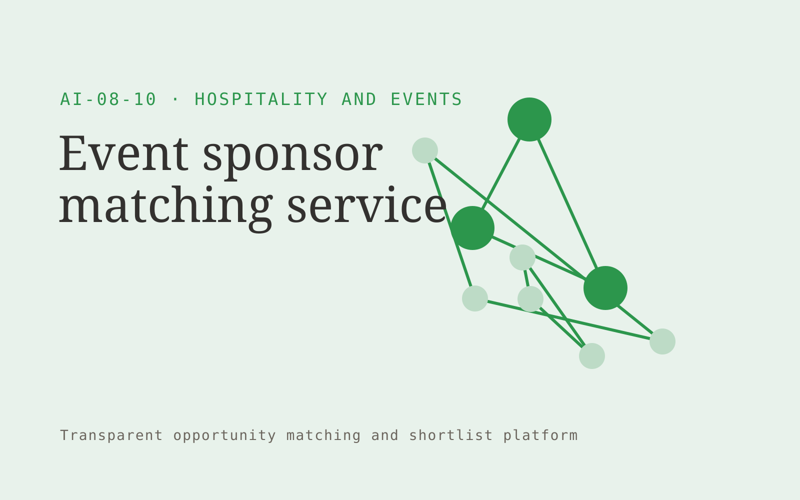

# Event sponsor matching service

**AI-08-10 · Hospitality and Events** · Also fits: Customer Support; Sales

> For organizers of specialist professional conferences, turn event audience evidence and public sponsor information into sponsor shortlist and partnership briefs. Address the recurring problem: sponsor lists lack credible audience and commercial fit. The value hypothesis is a more complete, reviewable deliverable with less repeated preparation; the pilot must establish whether that benefit is real.

| | |
|---|---|
| **Buyer** | Organizers of specialist professional conferences |
| **Problem** | Sponsor lists lack credible audience and commercial fit. |
| **Format** | Transparent opportunity matching and shortlist platform |
| **USP** | Audience evidence supports each proposed sponsor relationship. |

## The product
Key screens: Sponsor shortlist, fit brief, proposal builder. Open with a filterable opportunity feed and clear fit explanations. Each profile shows source evidence, eligibility conditions and missing information. Keep saved, rejected and needs-review states. Include a deadline or next-action view without hiding the basis of recommendations. In this product, the first view is sponsor shortlist, followed by fit brief and proposal builder.

## Core functionality
1. Define sponsorship goals.
2. Map audience overlap.
3. Research brand activity.
4. Suggest package fit.
5. Document mutual value.
6. Prepare proposal drafts.

## Customer workflow
Define buyer-selected criteria, gather authorized opportunity information, apply explicit eligibility rules, propose matches with evidence, let the user review uncertain conditions, save a shortlist and track the resulting conversations or applications. Start with event audience evidence and public sponsor information and finish with sponsor shortlist and partnership briefs.

## AI and human review
Extract criteria, normalize opportunity descriptions and explain possible fit. Use explicit rules for hard requirements. Do not invent missing eligibility facts or represent a suggested match as a verified qualification.

## Customer inputs
Event audience evidence and public sponsor information

## Customer deliverables
Sponsor shortlist and partnership briefs

## Accounts and administration
Editable criteria, dated sources, eligibility evidence, missing-data flags, saved shortlists, rejection reasons, deadline alerts and owner follow-up.

## MVP scope
Begin with organizers of specialist professional conferences and one recurring use case. Build the first two modules: define sponsorship goals; map audience overlap. Provide operator assistance for the third module: research brand activity. Deliver sponsor shortlist and partnership briefs through a manual review queue. Perform other necessary full-scope functions manually during the pilot. Include all applicable access, accuracy and professional-review controls from the start.

## After MVP validation
After paid pilots establish value, automate the remaining modules: suggest package fit; document mutual value; prepare proposal drafts. Add one validated source integration, reusable customer configuration and recurring delivery. Expand to additional teams, document formats or languages only after testing the new scope.

## Build dependencies
Current source information, explicit eligibility rules, entity identity checks and inspectable fit reasoning. Sparse evidence limits match quality.

## Integrations and data access
Property records, event schedules, reservation exports and supplier information. Permitted opportunity feeds, customer profiles, calendars and CRM exports. Keep initial outreach or applications as user-reviewed drafts. These are candidate integration categories, not verified supported connectors.

## Defensibility
A maintained niche opportunity dataset and documented relevance feedback, supported by relationships with the intended buyer community. For this idea, build around audience evidence supports each proposed sponsor relationship. This advantage requires execution and accumulated customer trust; the base model alone is not a defensible asset.

## Alternatives and positioning
Manual research, directories, generic databases, referrals and existing opportunity marketplaces. Differentiate on this specific proposed advantage: audience evidence supports each proposed sponsor relationship. Test it against the buyer's current method on the same task. Competitor coverage and uniqueness have not been established.

## Revenue model and test pricing (USD)
Test USD 150-600 monthly for one narrow opportunity feed, or USD 750-2,500 for a bespoke researched shortlist. Price manual verification and custom research explicitly. These are pricing hypotheses.

## Main delivery costs
Source collection, profile updates, entity resolution, eligibility verification, analyst research and customer feedback review.

## Marketing message to test
> Event sponsor matching service for organizers of specialist professional conferences. Audience evidence supports each proposed sponsor relationship. Demonstrate the claim through five sponsor concepts tied to the event audience.

## Acquisition channels
Niche conference communities

## Lead magnet
Five sponsor concepts tied to the event audience

## First 30 days of marketing
- Week 1: interview five prospective buyers in this segment: organizers of specialist professional conferences. Ask to see a recent example of the problem and their current process.
- Week 2: prepare this demonstration using authorized or synthetic material: five sponsor concepts tied to the event audience.
- Week 3: present it through niche conference communities and seek one narrowly scoped paid pilot.
- Week 4: review qualified sponsor discussions, proposal acceptance, total delivery effort and a concrete renewal decision before increasing scope.

## Paid pilot and validation
Produce a small shortlist and ask the buyer to verify fit independently. Record why each option is accepted or rejected and whether it leads to a useful next step. Review missed eligible options too. For this idea, use event audience evidence and public sponsor information and evaluate sponsor shortlist and partnership briefs. Agree success thresholds with the buyer before starting; collect a baseline for qualified sponsor discussions, proposal acceptance. A positive signal is payment and repeat use with acceptable quality and delivery cost, not a favorable demo reaction alone.

## Success metrics
Qualified sponsor discussions, proposal acceptance

## Retention and expansion
Refresh opportunity profiles, improve criteria from accepted and rejected matches, and offer deeper verification for shortlisted options.

## Operating controls and limitations
Verify property facts, availability and supplier conditions. Staff approve commercial exceptions and consequential booking changes. Validate source access and reviewer availability during the pilot. Maintain customer-level access, data deletion controls and a record of final approvals.

## Brand style (concept)

- Colors: `#279143` primary · `#c95499` accent · `#e4f1e8` surface · `#22201e` ink
- Type: Sora for headings, Work Sans for text
- Voice: Welcoming, lively, attentive
- Demo site: [https://nexibeo.com/ideas/event-sponsor-matching-service/demo/](https://nexibeo.com/ideas/event-sponsor-matching-service/demo/)

## Investment indication

Indicative build budget, from MVP to full product. This is a planning range, not a quote; it excludes running costs such as model usage, hosting and reviewer hours.

| Phase | Scope | Timeline | Indicative budget |
|---|---|---|---|
| MVP | One buyer segment, one recurring use case; first modules: define sponsorship goals; map audience overlap. Manual review in the loop. | 5 weeks | $9,000 |
| Paid pilot | Accounts, roles, review states, audit trail and the first integration, hardened for two to three paying pilot customers. | 6 weeks | $10,500 |
| Full product | Remaining modules: suggest package fit; document mutual value; prepare proposal drafts. Self-serve onboarding, billing, monitoring and the wider integration set. | 11 weeks | $15,000 |
| **Total** | | 22 weeks | **$34,500** |

**Co-create this project with us:** [contact Nexibeo](https://nexibeo.com/ideas/event-sponsor-matching-service/#apply) and we build it with you.

## Research status
Concept proposal expanded from the 315-idea conversation. Demand, pricing, differentiation, build scope and integration feasibility are hypotheses, not verified market findings. Category link is inspiration rather than evidence of business viability.

## Credits and next steps

- **Estimation and building this idea:** see the full idea page on [nexibeo.com](https://nexibeo.com/ideas/event-sponsor-matching-service/) for more detail on estimation, and to co-create and build this idea with Nexibeo.
- **Become an AI-optimized specialist for Hospitality and Events:** [Complete AI Training](https://completeaitraining.com/certification/12b-ai-certification-for-hospitality-and-events-specialists/).
- Field news: [AI news for Hospitality and Events](https://completeaitraining.com/all-ai-news-for-hospitality-and-events/).
