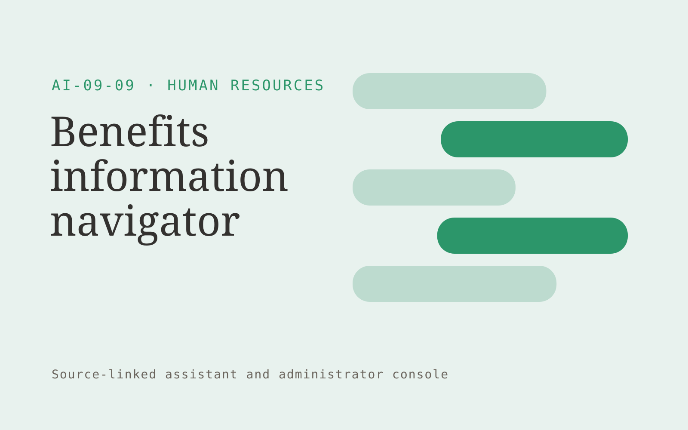

# Benefits information navigator

**AI-09-09 · Human Resources** · Also fits: Education; Operations; IT and Development

> For benefits managers at multi-location employers, turn employer-approved benefits documents and plan dates into cited benefit information and specialist referrals. Address the recurring problem: employees struggle to interpret supplied plan information. The value hypothesis is a more complete, reviewable deliverable with less repeated preparation; the pilot must establish whether that benefit is real.

| | |
|---|---|
| **Buyer** | Benefits managers at multi-location employers |
| **Problem** | Employees struggle to interpret supplied plan information. |
| **Format** | Source-linked assistant and administrator console |
| **USP** | Source-grounded benefit explanations with specialist routing for individual circumstances. |

## The product
Key screens: Benefit search, source comparison, specialist handoff. Give end users a simple search or conversation surface with short answers and expandable citations. Administrators get source status, unanswered questions and handoff queues. Show the source date beside relevant answers. Keep conversation context available to the staff member receiving an escalation. In this product, the first view is benefit search, followed by source comparison and specialist handoff.

## Core functionality
1. Explain defined terms.
2. Retrieve enrollment steps.
3. Display plan dates.
4. Compare supplied features.
5. Route personal advice questions.
6. Flag missing guidance.

## Customer workflow
Add an approved collection, assign source owners and access rules, test representative questions, let users ask questions, retrieve supporting passages, answer or request clarification, and hand off unresolved cases with their context. Start with employer-approved benefits documents and plan dates and finish with cited benefit information and specialist referrals.

## AI and human review
Retrieve permitted passages and generate answers constrained to those sources. Use structured rules for transactional facts. Detect missing context and refuse to invent unsupported details. Store reviewer corrections for evaluation and controlled knowledge updates.

## Customer inputs
Employer-approved benefits documents and plan dates

## Customer deliverables
Cited benefit information and specialist referrals

## Accounts and administration
Source ownership, document permissions, freshness checks, conversation history, human handoff, feedback, test questions, usage limits and access logs.

## MVP scope
Begin with benefits managers at multi-location employers and one recurring use case. Build the first two modules: explain defined terms; retrieve enrollment steps. Provide operator assistance for the third module: display plan dates. Deliver cited benefit information and specialist referrals through a manual review queue. Perform other necessary full-scope functions manually during the pilot. Include all applicable access, accuracy and professional-review controls from the start.

## After MVP validation
After paid pilots establish value, automate the remaining modules: compare supplied features; route personal advice questions; flag missing guidance. Add one validated source integration, reusable customer configuration and recurring delivery. Expand to additional teams, document formats or languages only after testing the new scope.

## Build dependencies
Permission-filtered retrieval, document versioning, a question evaluation set, staff handoff and a source update process. Reliability depends on source quality and scope.

## Integrations and data access
Approved HR documents, employee directories and learning records. Approved knowledge repositories, websites, service desks and staff messaging systems. Validate access inheritance and use read-only ingestion for the initial deployment. These are candidate integration categories, not verified supported connectors.

## Defensibility
A maintained domain knowledge collection, realistic evaluation questions, useful escalation paths and integrations in the customer’s daily work. For this idea, build around source-grounded benefit explanations with specialist routing for individual circumstances. This advantage requires execution and accumulated customer trust; the base model alone is not a defensible asset.

## Alternatives and positioning
Manual search, static FAQs, general chat tools and support or intranet suites. Differentiate on this specific proposed advantage: source-grounded benefit explanations with specialist routing for individual circumstances. Test it against the buyer's current method on the same task. Competitor coverage and uniqueness have not been established.

## Revenue model and test pricing (USD)
Test USD 500-2,000 setup plus USD 150-600 monthly for one defined source collection and usage allowance. Price multi-location deployments and specialist support separately. Validate willingness to pay; these are hypotheses.

## Main delivery costs
Document ingestion, retrieval and generation, source maintenance, support, evaluation and staff time handling unresolved cases.

## Marketing message to test
> Benefits information navigator for benefits managers at multi-location employers. Source-grounded benefit explanations with specialist routing for individual circumstances. Demonstrate the claim through a benefits enrollment question walkthrough.

## Acquisition channels
Benefits brokers and HR consultants

## Lead magnet
A benefits enrollment question walkthrough

## First 30 days of marketing
- Week 1: interview five prospective buyers in this segment: benefits managers at multi-location employers. Ask to see a recent example of the problem and their current process.
- Week 2: prepare this demonstration using authorized or synthetic material: a benefits enrollment question walkthrough.
- Week 3: present it through benefits brokers and HR consultants and seek one narrowly scoped paid pilot.
- Week 4: review correct guidance, unresolved questions, total delivery effort and a concrete renewal decision before increasing scope.

## Paid pilot and validation
Restrict the assistant to one collection and test answered, ambiguous and unanswerable questions. Run supervised use before wider rollout. Measure correctness, escalation quality and staff effort. For this idea, use employer-approved benefits documents and plan dates and evaluate cited benefit information and specialist referrals. Agree success thresholds with the buyer before starting; collect a baseline for correct guidance, unresolved questions. A positive signal is payment and repeat use with acceptable quality and delivery cost, not a favorable demo reaction alone.

## Success metrics
Correct guidance, unresolved questions

## Retention and expansion
Review unanswered questions and source freshness monthly. Expand to another source collection or team only after the existing assistant meets its agreed accuracy and handoff criteria.

## Operating controls and limitations
Keep employee data access explicit and confidential. Use human judgment for personnel decisions and do not infer protected traits or hidden personal characteristics. Validate source access and reviewer availability during the pilot. Maintain customer-level access, data deletion controls and a record of final approvals.

## Brand style (concept)

- Colors: `#279166` primary · `#c95468` accent · `#e4f1ec` surface · `#22201e` ink
- Type: Archivo for headings, Lora for text
- Voice: Fair, human, straightforward
- Demo site: [https://nexibeo.com/ideas/benefits-information-navigator/demo/](https://nexibeo.com/ideas/benefits-information-navigator/demo/)

## Investment indication

Indicative build budget, from MVP to full product. This is a planning range, not a quote; it excludes running costs such as model usage, hosting and reviewer hours.

| Phase | Scope | Timeline | Indicative budget |
|---|---|---|---|
| MVP | One buyer segment, one recurring use case; first modules: explain defined terms; retrieve enrollment steps. Manual review in the loop. | 3 weeks | $5,000 |
| Paid pilot | Accounts, roles, review states, audit trail and the first integration, hardened for two to three paying pilot customers. | 4 weeks | $4,500 |
| Full product | Remaining modules: compare supplied features; route personal advice questions; flag missing guidance. Self-serve onboarding, billing, monitoring and the wider integration set. | 6 weeks | $6,000 |
| **Total** | | 13 weeks | **$15,500** |

**Co-create this project with us:** [contact Nexibeo](https://nexibeo.com/ideas/benefits-information-navigator/#apply) and we build it with you.

## Research status
Concept proposal expanded from the 315-idea conversation. Demand, pricing, differentiation, build scope and integration feasibility are hypotheses, not verified market findings. Category link is inspiration rather than evidence of business viability.

## Credits and next steps

- **Estimation and building this idea:** see the full idea page on [nexibeo.com](https://nexibeo.com/ideas/benefits-information-navigator/) for more detail on estimation, and to co-create and build this idea with Nexibeo.
- **Become an AI-optimized specialist for Human Resources:** [Complete AI Training](https://completeaitraining.com/tag/human-resources/?contentType=ai-certification).
- Field news: [AI news for Human Resources](https://completeaitraining.com/all-ai-news-for-human-resources/).
