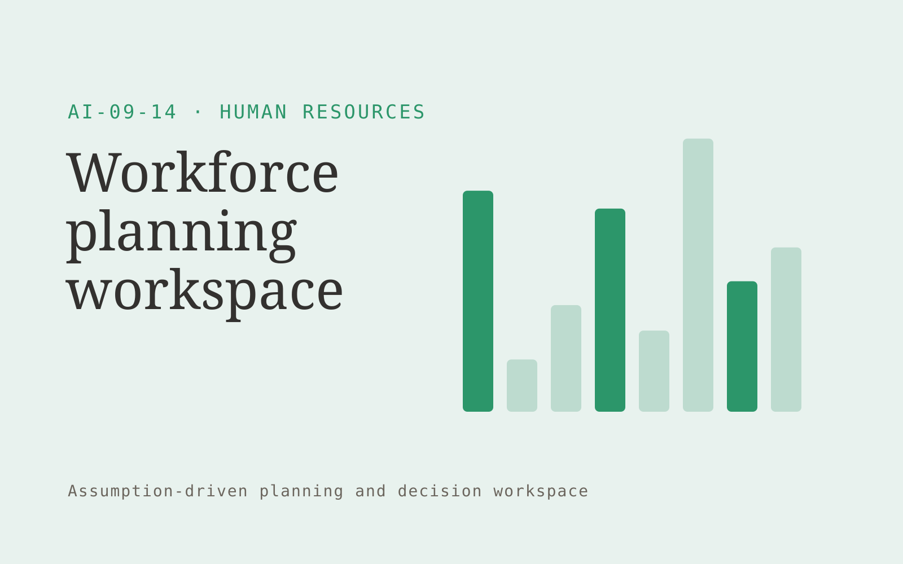

# Workforce planning workspace

**AI-09-14 · Human Resources** · Also fits: Education; Operations; Finance

> For operations and HR leads at service organizations, turn aggregate workload, capacity, budgets and hiring assumptions into workforce scenarios for management review. Address the recurring problem: staffing decisions lack transparent workload assumptions. The value hypothesis is a more complete, reviewable deliverable with less repeated preparation; the pilot must establish whether that benefit is real.

| | |
|---|---|
| **Buyer** | Operations and HR leads at service organizations |
| **Problem** | Staffing decisions lack transparent workload assumptions. |
| **Format** | Assumption-driven planning and decision workspace |
| **USP** | Aggregate planning with explicit assumptions and no individual employment scoring. |

## The product
Key screens: Demand drivers, capacity scenarios, assumption history. Place editable drivers and constraints beside a clearly labeled scenario output. Include a baseline view, comparison chart or schedule, and an assumptions history. Let users trace a proposed quantity or date back to its inputs. Keep forecasts distinct from actual results. In this product, the first view is demand drivers, followed by capacity scenarios and assumption history.

## Core functionality
1. Normalize workload units.
2. Calculate capacity gaps.
3. Model hiring timing.
4. Compare contractor options.
5. Expose budget effects.
6. Track actual demand.

## Customer workflow
Validate baseline inputs, confirm definitions and constraints, select editable assumptions, calculate feasible alternatives, inspect sensitivities, let the responsible person approve a plan, and compare later actuals with the recorded assumptions. Start with aggregate workload, capacity, budgets and hiring assumptions and finish with workforce scenarios for management review.

## AI and human review
Extract input context and explain scenario differences. Use deterministic calculations or explicit optimization for quantities, compatibility, dates and prices. Show uncertain assumptions. Never let generated prose silently change the calculation rules.

## Customer inputs
Aggregate workload, capacity, budgets and hiring assumptions

## Customer deliverables
Workforce scenarios for management review

## Accounts and administration
Scenario versions, baseline reconciliation, constraint checks, assumption ownership, reviewer approvals, plan exports and actual-versus-plan tracking.

## MVP scope
Begin with operations and HR leads at service organizations and one recurring use case. Build the first two modules: normalize workload units; calculate capacity gaps. Provide operator assistance for the third module: model hiring timing. Deliver workforce scenarios for management review through a manual review queue. Perform other necessary full-scope functions manually during the pilot. Include all applicable access, accuracy and professional-review controls from the start.

## After MVP validation
After paid pilots establish value, automate the remaining modules: compare contractor options; expose budget effects; track actual demand. Add one validated source integration, reusable customer configuration and recurring delivery. Expand to additional teams, document formats or languages only after testing the new scope.

## Build dependencies
A defensible calculation model, explicit units, constraint validation and representative boundary tests. Advanced forecasting or optimization needs adequate historical data.

## Integrations and data access
Approved HR documents, employee directories and learning records. Read-only operational exports, calendars and finance or inventory records as relevant. Start with plan exports and retain human approval for execution. These are candidate integration categories, not verified supported connectors.

## Defensibility
A validated domain model, customer-approved constraints and forecast or decision history that improves practical planning. For this idea, build around aggregate planning with explicit assumptions and no individual employment scoring. This advantage requires execution and accumulated customer trust; the base model alone is not a defensible asset.

## Alternatives and positioning
Spreadsheets, planners, specialist forecasting tools and existing scheduling or configuration software. Differentiate on this specific proposed advantage: aggregate planning with explicit assumptions and no individual employment scoring. Test it against the buyer's current method on the same task. Competitor coverage and uniqueness have not been established.

## Revenue model and test pricing (USD)
Test USD 750-3,000 for a scoped planning setup and review, then USD 200-900 monthly for refreshes within agreed complexity. Data integration and optimization are separately scoped. All ranges are hypotheses.

## Main delivery costs
Data preparation, domain modeling, validation, scenario computation, reviewer support and ongoing assumption maintenance.

## Marketing message to test
> Workforce planning workspace for operations and HR leads at service organizations. Aggregate planning with explicit assumptions and no individual employment scoring. Demonstrate the claim through a workload-to-capacity scenario model.

## Acquisition channels
Workforce planning advisers

## Lead magnet
A workload-to-capacity scenario model

## First 30 days of marketing
- Week 1: interview five prospective buyers in this segment: operations and HR leads at service organizations. Ask to see a recent example of the problem and their current process.
- Week 2: prepare this demonstration using authorized or synthetic material: a workload-to-capacity scenario model.
- Week 3: present it through workforce planning advisers and seek one narrowly scoped paid pilot.
- Week 4: review forecast error, reconciled capacity assumptions, total delivery effort and a concrete renewal decision before increasing scope.

## Paid pilot and validation
Reproduce a known historical plan, test missing inputs and boundary constraints, then run a new scenario. Compare feasibility, reconciliation and observed error rather than judging the quality of the explanation alone. For this idea, use aggregate workload, capacity, budgets and hiring assumptions and evaluate workforce scenarios for management review. Agree success thresholds with the buyer before starting; collect a baseline for forecast error, reconciled capacity assumptions. A positive signal is payment and repeat use with acceptable quality and delivery cost, not a favorable demo reaction alone.

## Success metrics
Forecast error, reconciled capacity assumptions

## Retention and expansion
Refresh inputs, compare recorded assumptions with actual outcomes and refine validated constraints. Expand scenario complexity only when the buyer uses it for a decision.

## Operating controls and limitations
Keep employee data access explicit and confidential. Use human judgment for personnel decisions and do not infer protected traits or hidden personal characteristics. Validate source access and reviewer availability during the pilot. Maintain customer-level access, data deletion controls and a record of final approvals.

## Brand style (concept)

- Colors: `#279158` primary · `#c954ac` accent · `#e4f1ea` surface · `#22201e` ink
- Type: Fraunces for headings, Inter for text
- Voice: Fair, human, straightforward
- Demo site: [https://nexibeo.com/ideas/workforce-planning-workspace/demo/](https://nexibeo.com/ideas/workforce-planning-workspace/demo/)

## Investment indication

Indicative build budget, from MVP to full product. This is a planning range, not a quote; it excludes running costs such as model usage, hosting and reviewer hours.

| Phase | Scope | Timeline | Indicative budget |
|---|---|---|---|
| MVP | One buyer segment, one recurring use case; first modules: normalize workload units; calculate capacity gaps. Manual review in the loop. | 3 weeks | $6,000 |
| Paid pilot | Accounts, roles, review states, audit trail and the first integration, hardened for two to three paying pilot customers. | 4 weeks | $5,500 |
| Full product | Remaining modules: compare contractor options; expose budget effects; track actual demand. Self-serve onboarding, billing, monitoring and the wider integration set. | 7 weeks | $7,500 |
| **Total** | | 14 weeks | **$19,000** |

**Co-create this project with us:** [contact Nexibeo](https://nexibeo.com/ideas/workforce-planning-workspace/#apply) and we build it with you.

## Research status
Concept proposal expanded from the 315-idea conversation. Demand, pricing, differentiation, build scope and integration feasibility are hypotheses, not verified market findings. Category link is inspiration rather than evidence of business viability.

## Credits and next steps

- **Estimation and building this idea:** see the full idea page on [nexibeo.com](https://nexibeo.com/ideas/workforce-planning-workspace/) for more detail on estimation, and to co-create and build this idea with Nexibeo.
- **Become an AI-optimized specialist for Human Resources:** [Complete AI Training](https://completeaitraining.com/tag/human-resources/?contentType=ai-certification).
- Field news: [AI news for Human Resources](https://completeaitraining.com/all-ai-news-for-human-resources/).
