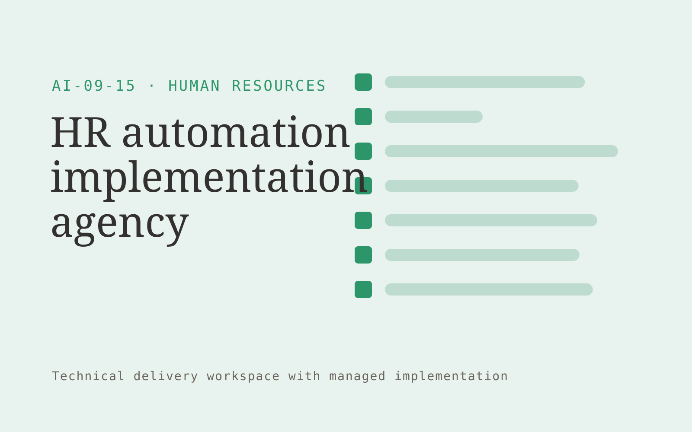

# HR automation implementation agency

**Human Resources** · Also fits: Education; Operations; IT and Development

> For small employers with fragmented HR administration, turn process maps, approved tools and access requirements into maintained HR workflows and operating documentation. Address the recurring problem: manual handoffs between HR tools repeatedly fail. The value hypothesis is a more complete, reviewable deliverable with less repeated preparation; the pilot must establish whether that benefit is real.

| | |
|---|---|
| **Buyer** | Small employers with fragmented HR administration |
| **Problem** | Manual handoffs between HR tools repeatedly fail. |
| **Format** | Technical delivery workspace with managed implementation |
| **USP** | Ongoing reliability and handover documentation alongside implementation. |

## The product
Key screens: Workflow map, implementation backlog, monitoring console. Show a work backlog, proposed changes and verification results. Link each item to its source configuration, code or data mapping. Provide execution logs and an owner-facing health view. Keep environments and approval states clearly separated so a draft cannot be mistaken for a live change. In this product, the first view is workflow map, followed by implementation backlog and monitoring console.

## Core functionality
1. Audit repetitive tasks.
2. Configure approved integrations.
3. Validate field mappings.
4. Test access boundaries.
5. Monitor failures.
6. Document owner responsibilities.

## Customer workflow
Scope one technical task, inspect authorized material, propose an implementation, build in a controlled environment, run relevant checks, obtain the required change approval, deliver with recovery instructions, and monitor the agreed operating scope. Start with process maps, approved tools and access requirements and finish with maintained HR workflows and operating documentation.

## AI and human review
Explain code or configuration, draft transformations and propose technical changes. Execute deterministic validation and meaningful tests. Engineers review correctness, access handling and failure behavior before deployment.

## Customer inputs
Process maps, approved tools and access requirements

## Customer deliverables
Maintained HR workflows and operating documentation

## Accounts and administration
Project access, environment separation, versioned changes, test evidence, owner approvals, execution logs, rollback instructions and incident handling.

## MVP scope
Begin with small employers with fragmented HR administration and one recurring use case. Build the first two modules: audit repetitive tasks; configure approved integrations. Provide operator assistance for the third module: validate field mappings. Deliver maintained HR workflows and operating documentation through a manual review queue. Perform other necessary full-scope functions manually during the pilot. Include all applicable access, accuracy and professional-review controls from the start.

## After MVP validation
After paid pilots establish value, automate the remaining modules: test access boundaries; monitor failures; document owner responsibilities. Add one validated source integration, reusable customer configuration and recurring delivery. Expand to additional teams, document formats or languages only after testing the new scope.

## Build dependencies
Authorized technical access, suitable test environments, documented APIs or schemas, secrets management, meaningful checks and recovery procedures.

## Integrations and data access
Approved HR documents, employee directories and learning records. Approved repositories, application APIs, execution platforms and monitoring systems. Validate current API access and behavior during discovery before promising compatibility. These are candidate integration categories, not verified supported connectors.

## Defensibility
Reliable niche implementations, integration knowledge, representative tests and ongoing operational responsibility. For this idea, build around ongoing reliability and handover documentation alongside implementation. This advantage requires execution and accumulated customer trust; the base model alone is not a defensible asset.

## Alternatives and positioning
Developers, system integrators, existing automation products and internal engineering work. Differentiate on this specific proposed advantage: ongoing reliability and handover documentation alongside implementation. Test it against the buyer's current method on the same task. Competitor coverage and uniqueness have not been established.

## Revenue model and test pricing (USD)
Test USD 1,000-4,000 for one bounded implementation or technical review, then USD 200-1,000 monthly for defined maintenance. Hosting, vendor fees and major feature changes are separate. Prices are hypotheses.

## Main delivery costs
Engineering, testing, cloud execution, third-party API fees, monitoring, incident response and vendor-change maintenance.

## Marketing message to test
> HR automation implementation agency for small employers with fragmented HR administration. Ongoing reliability and handover documentation alongside implementation. Demonstrate the claim through a working automation for one administrative handoff.

## Acquisition channels
HR software implementers

## Lead magnet
A working automation for one administrative handoff

## First 30 days of marketing
- Week 1: interview five prospective buyers in this segment: small employers with fragmented HR administration. Ask to see a recent example of the problem and their current process.
- Week 2: prepare this demonstration using authorized or synthetic material: a working automation for one administrative handoff.
- Week 3: present it through HR software implementers and seek one narrowly scoped paid pilot.
- Week 4: review successful executions, manual intervention time, total delivery effort and a concrete renewal decision before increasing scope.

## Paid pilot and validation
Implement one bounded task in a safe test environment. Demonstrate normal operation, failure handling and recovery with representative inputs. Have the responsible technical owner review the results. For this idea, use process maps, approved tools and access requirements and evaluate maintained HR workflows and operating documentation. Agree success thresholds with the buyer before starting; collect a baseline for successful executions, manual intervention time. A positive signal is payment and repeat use with acceptable quality and delivery cost, not a favorable demo reaction alone.

## Success metrics
Successful executions, manual intervention time

## Retention and expansion
Maintain agreed integrations or technical assets, review failures and upstream changes, and sell additional scoped work only after the first implementation is stable.

## Operating controls and limitations
Keep employee data access explicit and confidential. Use human judgment for personnel decisions and do not infer protected traits or hidden personal characteristics. Validate source access and reviewer availability during the pilot. Maintain customer-level access, data deletion controls and a record of final approvals.

## Brand style (concept)

- Colors: `#279168` primary · `#c9548d` accent · `#e4f1ec` surface · `#22201e` ink
- Type: Fraunces for headings, Inter for text
- Voice: Fair, human, straightforward
- Demo site: [https://nexibeo.com/ideas/hr-automation-implementation-agency/demo/](https://nexibeo.com/ideas/hr-automation-implementation-agency/demo/)

## Investment indication

Indicative build budget, from MVP to full product. This is a planning range, not a quote; it excludes running costs such as model usage, hosting and reviewer hours.

| Phase | Scope | Timeline | Indicative budget |
|---|---|---|---|
| MVP | One buyer segment, one recurring use case; first modules: audit repetitive tasks; configure approved integrations. Manual review in the loop. | 5 weeks | $9,500 |
| Paid pilot | Accounts, roles, review states, audit trail and the first integration, hardened for two to three paying pilot customers. | 7 weeks | $12,000 |
| Full product | Remaining modules: test access boundaries; monitor failures; document owner responsibilities. Self-serve onboarding, billing, monitoring and the wider integration set. | 11 weeks | $16,000 |
| **Total** | | 23 weeks | **$37,500** |

### Running costs per month (rough indication, untested)

| Stage | Hosting and infrastructure | AI usage | Total per month |
|---|---|---|---|
| MVP and paid pilot (about 3 customers) | $30–$60 | $60–$120 | **$90–$180** |
| Full product (about 50 customers) | $110–$210 | $530–$1,050 | **$640–$1,260** |

**Co-create this project with us:** [contact Nexibeo](https://nexibeo.com/ideas/hr-automation-implementation-agency/#apply) and we build it with you.

## Research status
Concept proposal expanded from the 315-idea conversation. Demand, pricing, differentiation, build scope and integration feasibility are hypotheses, not verified market findings. Category link is inspiration rather than evidence of business viability.

## Credits and next steps

- **Estimation and building this idea:** see the full idea page on [nexibeo.com](https://nexibeo.com/ideas/hr-automation-implementation-agency/) for more detail on estimation, and to co-create and build this idea with Nexibeo.
- **Become an AI-optimized specialist for Human Resources:** [Complete AI Training](https://completeaitraining.com/tag/human-resources/?contentType=ai-certification).
- Field news: [AI news for Human Resources](https://completeaitraining.com/all-ai-news-for-human-resources/).
