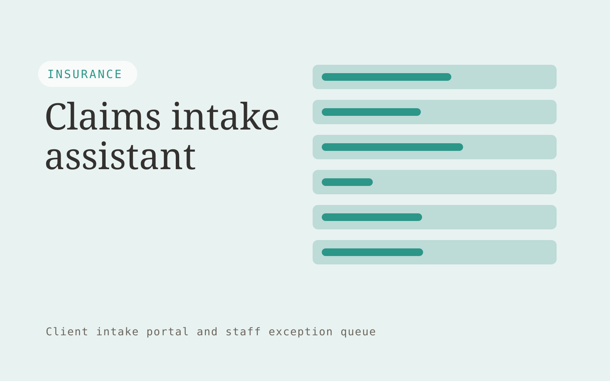

# Claims intake assistant

**Insurance** · Also fits: Operations; Customer Support

> For claims administrators at insurance agencies, turn claim forms, claimant uploads and approved requirements into structured claims intake record. Address the recurring problem: initial claims arrive without usable supporting information. The value hypothesis is a more complete, reviewable deliverable with less repeated preparation; the pilot must establish whether that benefit is real.

| | |
|---|---|
| **Buyer** | Claims administrators at insurance agencies |
| **Problem** | Initial claims arrive without usable supporting information. |
| **Format** | Client intake portal and staff exception queue |
| **USP** | Complete structured intake while coverage decisions remain with authorized staff. |

## The product
Key screens: Claim portal, evidence checklist, handler queue. Give submitters a mobile-friendly step-by-step form with document uploads and a visible completeness checklist. Staff see a queue with missing items and extracted fields. Place the original document beside each uncertain value. Show submitted, clarification required and ready-for-review states. In this product, the first view is claim portal, followed by evidence checklist and handler queue.

## Core functionality
1. Collect incident facts.
2. Organize documents.
3. Extract identifiers.
4. Flag missing evidence.
5. Detect duplicate submissions.
6. Route claims handlers.

## Customer workflow
Choose the request type, collect declared facts and required documents, extract relevant fields, show missing or inconsistent information, let the submitter correct it, and route the complete package to an authorized reviewer. Start with claim forms, claimant uploads and approved requirements and finish with structured claims intake record.

## AI and human review
Classify submitted material, extract candidate fields and draft clarification questions. Deterministic rules test required fields and formats. Keep uncertain extraction visible and preserve the original statement. Do not infer missing material facts.

## Customer inputs
Claim forms, claimant uploads and approved requirements

## Customer deliverables
Structured claims intake record

## Accounts and administration
Secure uploads, configurable checklists, progress saving, duplicate handling, reviewer assignments, clarification threads, deadlines and submission history.

## MVP scope
Begin with claims administrators at insurance agencies and one recurring use case. Build the first two modules: collect incident facts; organize documents. Provide operator assistance for the third module: extract identifiers. Deliver structured claims intake record through a manual review queue. Perform other necessary full-scope functions manually during the pilot. Include all applicable access, accuracy and professional-review controls from the start.

## After MVP validation
After paid pilots establish value, automate the remaining modules: flag missing evidence; detect duplicate submissions; route claims handlers. Add one validated source integration, reusable customer configuration and recurring delivery. Expand to additional teams, document formats or languages only after testing the new scope.

## Build dependencies
Secure upload handling, reliable extraction, versioned completeness rules, submitter identity and staff routing. Third-party checklist changes require maintenance.

## Integrations and data access
Broker-approved policy documents, case records and carrier requirements. Case management, customer records, document storage and notification systems. Begin with an exportable review pack before automating destination writes. These are candidate integration categories, not verified supported connectors.

## Defensibility
Document-type expertise, tested completeness rules and a low-friction client experience embedded in a repeat administrative process. For this idea, build around complete structured intake while coverage decisions remain with authorized staff. This advantage requires execution and accumulated customer trust; the base model alone is not a defensible asset.

## Alternatives and positioning
Email collection, generic web forms, spreadsheets and existing case management systems. Differentiate on this specific proposed advantage: complete structured intake while coverage decisions remain with authorized staff. Test it against the buyer's current method on the same task. Competitor coverage and uniqueness have not been established.

## Revenue model and test pricing (USD)
Test USD 500-2,000 setup plus USD 150-750 monthly for one form family and a capped submission volume. Quote specialist review and unusual document formats separately. Prices are experimental.

## Main delivery costs
Document processing, storage, exception review, support, checklist maintenance and customer-specific integration work.

## Marketing message to test
> Claims intake assistant for claims administrators at insurance agencies. Complete structured intake while coverage decisions remain with authorized staff. Demonstrate the claim through a claimant-to-handler intake demonstration.

## Acquisition channels
Claims administration partners

## Lead magnet
A claimant-to-handler intake demonstration

## First 30 days of marketing
- Week 1: interview five prospective buyers in this segment: claims administrators at insurance agencies. Ask to see a recent example of the problem and their current process.
- Week 2: prepare this demonstration using authorized or synthetic material: a claimant-to-handler intake demonstration.
- Week 3: present it through claims administration partners and seek one narrowly scoped paid pilot.
- Week 4: review first-pass completeness, clarification messages, total delivery effort and a concrete renewal decision before increasing scope.

## Paid pilot and validation
Process a bounded set of historical and new submissions. Include missing, duplicate and unreadable documents. Compare complete submissions and clarification effort with the current intake method. For this idea, use claim forms, claimant uploads and approved requirements and evaluate structured claims intake record. Agree success thresholds with the buyer before starting; collect a baseline for first-pass completeness, clarification messages. A positive signal is payment and repeat use with acceptable quality and delivery cost, not a favorable demo reaction alone.

## Success metrics
First-pass completeness, clarification messages

## Retention and expansion
Review incomplete submissions and simplify recurring friction. Expand to another form or document family after the first workflow reliably produces review-ready cases.

## Operating controls and limitations
Separate document preparation from coverage, underwriting and claims decisions. Authorized professionals review policy meaning and customer commitments. Validate source access and reviewer availability during the pilot. Maintain customer-level access, data deletion controls and a record of final approvals.

## Brand style (concept)

- Colors: `#279181` primary · `#c95489` accent · `#e4f1ef` surface · `#22201e` ink
- Type: Space Grotesk for headings, Inter for text
- Voice: Reassuring, clear, no small print
- Demo site: [https://nexibeo.com/solutions/claims-intake-assistant/demo/](https://nexibeo.com/solutions/claims-intake-assistant/demo/)

## Investment indication

Indicative build budget, from MVP to full product. This is a planning range, not a quote; it excludes running costs such as model usage, hosting and reviewer hours. Built with Nexibeo's AI software development factory, most implementations take days to a few weeks of creation time, depending on availability.

| Phase | Scope | Creation time | Indicative budget |
|---|---|---|---|
| MVP | One buyer segment, one recurring use case; first modules: collect incident facts; organize documents. Manual review in the loop. | 6 days | $10,500 |
| Paid pilot | Accounts, roles, review states, audit trail and the first integration, hardened for two to three paying pilot customers. | 7 days | $13,000 |
| Full product | Remaining modules: flag missing evidence; detect duplicate submissions; route claims handlers. Self-serve onboarding, billing, monitoring and the wider integration set. | 3 weeks | $18,000 |
| **Total** | | about 5 weeks | **$41,500** |

### Running costs per month (rough indication, untested)

| Stage | Hosting and infrastructure | AI usage | Total per month |
|---|---|---|---|
| MVP and paid pilot (about 3 customers) | $50–$100 | $40–$90 | **$90–$190** |
| Full product (about 50 customers) | $190–$380 | $280–$560 | **$470–$940** |

**Get this built:** [contact Nexibeo](https://nexibeo.com/solutions/claims-intake-assistant/#apply). We build it with our AI software factory, usually in days to a few weeks, for you to run internally or offer to your clients.

## Research status
Concept proposal expanded from the 315-idea conversation. Demand, pricing, differentiation, build scope and integration feasibility are hypotheses, not verified market findings. Category link is inspiration rather than evidence of business viability.

## Credits and next steps

- **Estimation and having it built:** see the full solution page on [nexibeo.com](https://nexibeo.com/solutions/claims-intake-assistant/) for more detail on estimation. Nexibeo builds it for you as a custom AI implementation, to run internally or to offer to your own clients.
- **Become an AI-optimized specialist for Insurance:** [Complete AI Training](https://completeaitraining.com/certification/12b-ai-certification-for-insurance-specialists/).
- Field news: [AI news for Insurance](https://completeaitraining.com/all-ai-news-for-insurance/).
