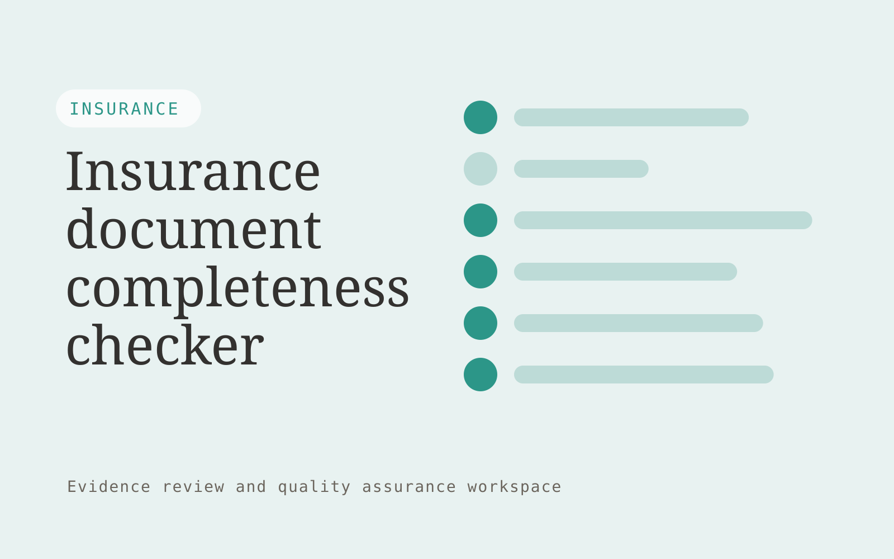

# Insurance document completeness checker

**Insurance** · Also fits: Operations; Customer Support

> For insurance operations teams processing applications, turn application packages and approved document checklists into document completeness report. Address the recurring problem: incomplete administrative fields generate repeated rework. The value hypothesis is a more complete, reviewable deliverable with less repeated preparation; the pilot must establish whether that benefit is real.

| | |
|---|---|
| **Buyer** | Insurance operations teams processing applications |
| **Problem** | Incomplete administrative fields generate repeated rework. |
| **Format** | Evidence review and quality assurance workspace |
| **USP** | Document-type-specific completeness with transparent checklist versions. |

## The product
Key screens: Submission queue, missing fields, review evidence. Open on a review queue ordered by reviewer-selected priorities. Show each finding beside the original evidence and applicable rule. Provide accept, dismiss and needs-information controls with reasons. A separate report view summarizes confirmed findings and unresolved items, not raw AI flags. In this product, the first view is submission queue, followed by missing fields and review evidence.

## Core functionality
1. Check signatures.
2. Validate identifiers.
3. Detect absent attachments.
4. Flag unreadable pages.
5. Apply versioned checklists.
6. Record corrections.

## Customer workflow
Agree review criteria, ingest a sample, generate candidate findings, inspect supporting evidence, let reviewers confirm or dismiss each item, assign corrections, and recheck the affected material. Start with application packages and approved document checklists and finish with document completeness report.

## AI and human review
Propose possible inconsistencies, omissions and rubric matches. Combine extraction with deterministic checks where rules are explicit. Reviewers make the final judgment. Keep false positives and missed cases visible during evaluation.

## Customer inputs
Application packages and approved document checklists

## Customer deliverables
Document completeness report

## Accounts and administration
Versioned review criteria, evidence links, reviewer decisions, disagreement handling, correction assignments, recheck status and exportable review history.

## MVP scope
Begin with insurance operations teams processing applications and one recurring use case. Build the first two modules: check signatures; validate identifiers. Provide operator assistance for the third module: detect absent attachments. Deliver document completeness report through a manual review queue. Perform other necessary full-scope functions manually during the pilot. Include all applicable access, accuracy and professional-review controls from the start.

## After MVP validation
After paid pilots establish value, automate the remaining modules: flag unreadable pages; apply versioned checklists; record corrections. Add one validated source integration, reusable customer configuration and recurring delivery. Expand to additional teams, document formats or languages only after testing the new scope.

## Build dependencies
Evidence coordinates, versioned rules, reviewer decisions and a representative reference set. Measure misses as well as confirmed findings before scaling.

## Integrations and data access
Broker-approved policy documents, case records and carrier requirements. Source repositories, task trackers and report exports. Keep findings as review proposals until authorized owners accept the resulting actions. These are candidate integration categories, not verified supported connectors.

## Defensibility
A domain-specific review rubric and rights-cleared examples of confirmed defects, false alarms and reviewer reasoning. For this idea, build around document-type-specific completeness with transparent checklist versions. This advantage requires execution and accumulated customer trust; the base model alone is not a defensible asset.

## Alternatives and positioning
Manual reviewers, checklists, generic scanning tools and specialist audit services. Differentiate on this specific proposed advantage: document-type-specific completeness with transparent checklist versions. Test it against the buyer's current method on the same task. Competitor coverage and uniqueness have not been established.

## Revenue model and test pricing (USD)
Test USD 500-2,000 for a defined audit sample and report. Offer recurring review priced by reviewed items and specialist hours. Software-only access can follow a reliable reviewed service. All prices require validation.

## Main delivery costs
Document or media processing, model evaluation, expert review, false-positive handling, rechecks and customer-specific rubric calibration.

## Marketing message to test
> Insurance document completeness checker for insurance operations teams processing applications. Document-type-specific completeness with transparent checklist versions. Demonstrate the claim through a historical application completeness audit.

## Acquisition channels
Insurance process consultants

## Lead magnet
A historical application completeness audit

## First 30 days of marketing
- Week 1: interview five prospective buyers in this segment: insurance operations teams processing applications. Ask to see a recent example of the problem and their current process.
- Week 2: prepare this demonstration using authorized or synthetic material: a historical application completeness audit.
- Week 3: present it through insurance process consultants and seek one narrowly scoped paid pilot.
- Week 4: review confirmed omissions, false alarms, total delivery effort and a concrete renewal decision before increasing scope.

## Paid pilot and validation
Have a qualified reviewer independently assess the same sample. Compare confirmed findings, false alarms and omissions. Repeat on unseen material before agreeing recurring volume. For this idea, use application packages and approved document checklists and evaluate document completeness report. Agree success thresholds with the buyer before starting; collect a baseline for confirmed omissions, false alarms. A positive signal is payment and repeat use with acceptable quality and delivery cost, not a favorable demo reaction alone.

## Success metrics
Confirmed omissions, false alarms

## Retention and expansion
Offer recurring reviews and rechecks of previously confirmed issues. Expand document or case types after validating the new rubric with qualified reviewers.

## Operating controls and limitations
Separate document preparation from coverage, underwriting and claims decisions. Authorized professionals review policy meaning and customer commitments. Validate source access and reviewer availability during the pilot. Maintain customer-level access, data deletion controls and a record of final approvals.

## Brand style (concept)

- Colors: `#279176` primary · `#c9547b` accent · `#e4f1ee` surface · `#22201e` ink
- Type: Space Grotesk for headings, Inter for text
- Voice: Reassuring, clear, no small print
- Demo site: [https://nexibeo.com/ideas/insurance-document-completeness-checker/demo/](https://nexibeo.com/ideas/insurance-document-completeness-checker/demo/)

## Investment indication

Indicative build budget, from MVP to full product. This is a planning range, not a quote; it excludes running costs such as model usage, hosting and reviewer hours. Built with Nexibeo's AI software development factory, most implementations take days to a few weeks of creation time, depending on availability.

| Phase | Scope | Creation time | Indicative budget |
|---|---|---|---|
| MVP | One buyer segment, one recurring use case; first modules: check signatures; validate identifiers. Manual review in the loop. | 6 days | $10,000 |
| Paid pilot | Accounts, roles, review states, audit trail and the first integration, hardened for two to three paying pilot customers. | 7 days | $12,500 |
| Full product | Remaining modules: flag unreadable pages; apply versioned checklists; record corrections. Self-serve onboarding, billing, monitoring and the wider integration set. | 2 weeks | $17,000 |
| **Total** | | about 5 weeks | **$39,500** |

### Running costs per month (rough indication, untested)

| Stage | Hosting and infrastructure | AI usage | Total per month |
|---|---|---|---|
| MVP and paid pilot (about 3 customers) | $50–$100 | $80–$160 | **$130–$260** |
| Full product (about 50 customers) | $190–$380 | $880–$1,750 | **$1,070–$2,130** |

**Co-create this project with us:** [contact Nexibeo](https://nexibeo.com/ideas/insurance-document-completeness-checker/#apply) and we build it with you.

## Research status
Concept proposal expanded from the 315-idea conversation. Demand, pricing, differentiation, build scope and integration feasibility are hypotheses, not verified market findings. Category link is inspiration rather than evidence of business viability.

## Credits and next steps

- **Estimation and building this idea:** see the full idea page on [nexibeo.com](https://nexibeo.com/ideas/insurance-document-completeness-checker/) for more detail on estimation, and to co-create and build this idea with Nexibeo.
- **Become an AI-optimized specialist for Insurance:** [Complete AI Training](https://completeaitraining.com/certification/12b-ai-certification-for-insurance-specialists/).
- Field news: [AI news for Insurance](https://completeaitraining.com/all-ai-news-for-insurance/).
