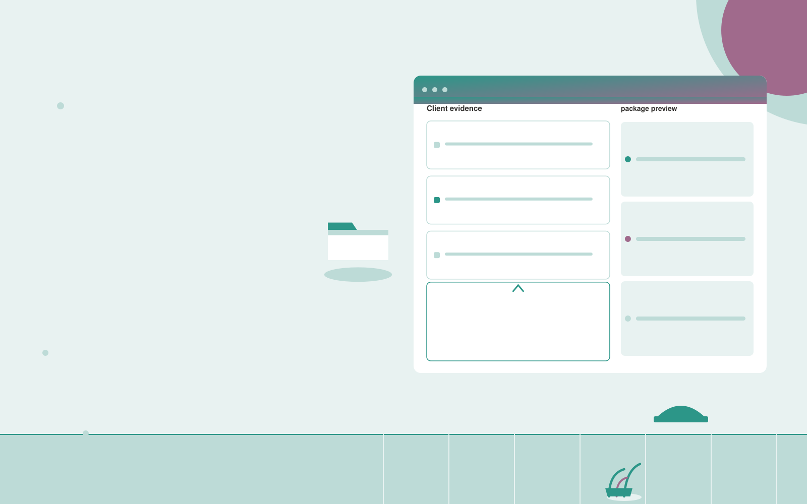

# Commercial submission organizer

**Insurance** · Also fits: Operations; Customer Support

> For brokers serving one commercial trade, turn client documents and carrier-specific submission requirements into carrier-specific submission packages. Address the recurring problem: underwriting submissions arrive in inconsistent formats. The value hypothesis is a more complete, reviewable deliverable with less repeated preparation; the pilot must establish whether that benefit is real.

| | |
|---|---|
| **Buyer** | Brokers serving one commercial trade |
| **Problem** | Underwriting submissions arrive in inconsistent formats. |
| **Format** | Client intake portal and staff exception queue |
| **USP** | One client record adapted transparently to different submission checklists. |

## The product
Key screens: Client evidence, carrier checklist, package preview. Give submitters a mobile-friendly step-by-step form with document uploads and a visible completeness checklist. Staff see a queue with missing items and extracted fields. Place the original document beside each uncertain value. Show submitted, clarification required and ready-for-review states. In this product, the first view is client evidence, followed by carrier checklist and package preview.

## Core functionality
1. Extract business details.
2. Map required attachments.
3. Compare prior information.
4. Flag unanswered questions.
5. Assemble carrier variants.
6. Preserve evidence links.

## Customer workflow
Choose the request type, collect declared facts and required documents, extract relevant fields, show missing or inconsistent information, let the submitter correct it, and route the complete package to an authorized reviewer. Start with client documents and carrier-specific submission requirements and finish with carrier-specific submission packages.

## AI and human review
Classify submitted material, extract candidate fields and draft clarification questions. Deterministic rules test required fields and formats. Keep uncertain extraction visible and preserve the original statement. Do not infer missing material facts.

## Customer inputs
Client documents and carrier-specific submission requirements

## Customer deliverables
Carrier-specific submission packages

## Accounts and administration
Secure uploads, configurable checklists, progress saving, duplicate handling, reviewer assignments, clarification threads, deadlines and submission history.

## MVP scope
Begin with brokers serving one commercial trade and one recurring use case. Build the first two modules: extract business details; map required attachments. Provide operator assistance for the third module: compare prior information. Deliver carrier-specific submission packages through a manual review queue. Perform other necessary full-scope functions manually during the pilot. Include all applicable access, accuracy and professional-review controls from the start.

## After MVP validation
After paid pilots establish value, automate the remaining modules: flag unanswered questions; assemble carrier variants; preserve evidence links. Add one validated source integration, reusable customer configuration and recurring delivery. Expand to additional teams, document formats or languages only after testing the new scope.

## Build dependencies
Secure upload handling, reliable extraction, versioned completeness rules, submitter identity and staff routing. Third-party checklist changes require maintenance.

## Integrations and data access
Broker-approved policy documents, case records and carrier requirements. Case management, customer records, document storage and notification systems. Begin with an exportable review pack before automating destination writes. These are candidate integration categories, not verified supported connectors.

## Defensibility
Document-type expertise, tested completeness rules and a low-friction client experience embedded in a repeat administrative process. For this idea, build around one client record adapted transparently to different submission checklists. This advantage requires execution and accumulated customer trust; the base model alone is not a defensible asset.

## Alternatives and positioning
Email collection, generic web forms, spreadsheets and existing case management systems. Differentiate on this specific proposed advantage: one client record adapted transparently to different submission checklists. Test it against the buyer's current method on the same task. Competitor coverage and uniqueness have not been established.

## Revenue model and test pricing (USD)
Test USD 500-2,000 setup plus USD 150-750 monthly for one form family and a capped submission volume. Quote specialist review and unusual document formats separately. Prices are experimental.

## Main delivery costs
Document processing, storage, exception review, support, checklist maintenance and customer-specific integration work.

## Marketing message to test
> Commercial submission organizer for brokers serving one commercial trade. One client record adapted transparently to different submission checklists. Demonstrate the claim through a structured submission pack from sample documents.

## Acquisition channels
Trade-focused broker networks

## Lead magnet
A structured submission pack from sample documents

## First 30 days of marketing
- Week 1: interview five prospective buyers in this segment: brokers serving one commercial trade. Ask to see a recent example of the problem and their current process.
- Week 2: prepare this demonstration using authorized or synthetic material: a structured submission pack from sample documents.
- Week 3: present it through trade-focused broker networks and seek one narrowly scoped paid pilot.
- Week 4: review underwriter clarification requests, preparation time, total delivery effort and a concrete renewal decision before increasing scope.

## Paid pilot and validation
Process a bounded set of historical and new submissions. Include missing, duplicate and unreadable documents. Compare complete submissions and clarification effort with the current intake method. For this idea, use client documents and carrier-specific submission requirements and evaluate carrier-specific submission packages. Agree success thresholds with the buyer before starting; collect a baseline for underwriter clarification requests, preparation time. A positive signal is payment and repeat use with acceptable quality and delivery cost, not a favorable demo reaction alone.

## Success metrics
Underwriter clarification requests, preparation time

## Retention and expansion
Review incomplete submissions and simplify recurring friction. Expand to another form or document family after the first workflow reliably produces review-ready cases.

## Operating controls and limitations
Separate document preparation from coverage, underwriting and claims decisions. Authorized professionals review policy meaning and customer commitments. Validate source access and reviewer availability during the pilot. Maintain customer-level access, data deletion controls and a record of final approvals.

## Brand style (concept)

- Colors: `#279171` primary · `#c9548f` accent · `#e4f1ed` surface · `#22201e` ink
- Type: Space Grotesk for headings, Inter for text
- Voice: Reassuring, clear, no small print
- Demo site: [https://nexibeo.com/ideas/commercial-submission-organizer/demo/](https://nexibeo.com/ideas/commercial-submission-organizer/demo/)

## Investment indication

Indicative build budget, from MVP to full product. This is a planning range, not a quote; it excludes running costs such as model usage, hosting and reviewer hours.

| Phase | Scope | Timeline | Indicative budget |
|---|---|---|---|
| MVP | One buyer segment, one recurring use case; first modules: extract business details; map required attachments. Manual review in the loop. | 5 weeks | $10,500 |
| Paid pilot | Accounts, roles, review states, audit trail and the first integration, hardened for two to three paying pilot customers. | 7 weeks | $13,000 |
| Full product | Remaining modules: flag unanswered questions; assemble carrier variants; preserve evidence links. Self-serve onboarding, billing, monitoring and the wider integration set. | 12 weeks | $18,500 |
| **Total** | | 24 weeks | **$42,000** |

### Running costs per month (rough indication, untested)

| Stage | Hosting and infrastructure | AI usage | Total per month |
|---|---|---|---|
| MVP and paid pilot (about 3 customers) | $50–$100 | $40–$90 | **$90–$190** |
| Full product (about 50 customers) | $190–$380 | $280–$560 | **$470–$940** |

**Co-create this project with us:** [contact Nexibeo](https://nexibeo.com/ideas/commercial-submission-organizer/#apply) and we build it with you.

## Research status
Concept proposal expanded from the 315-idea conversation. Demand, pricing, differentiation, build scope and integration feasibility are hypotheses, not verified market findings. Category link is inspiration rather than evidence of business viability.

## Credits and next steps

- **Estimation and building this idea:** see the full idea page on [nexibeo.com](https://nexibeo.com/ideas/commercial-submission-organizer/) for more detail on estimation, and to co-create and build this idea with Nexibeo.
- **Become an AI-optimized specialist for Insurance:** [Complete AI Training](https://completeaitraining.com/certification/12b-ai-certification-for-insurance-specialists/).
- Field news: [AI news for Insurance](https://completeaitraining.com/all-ai-news-for-insurance/).
