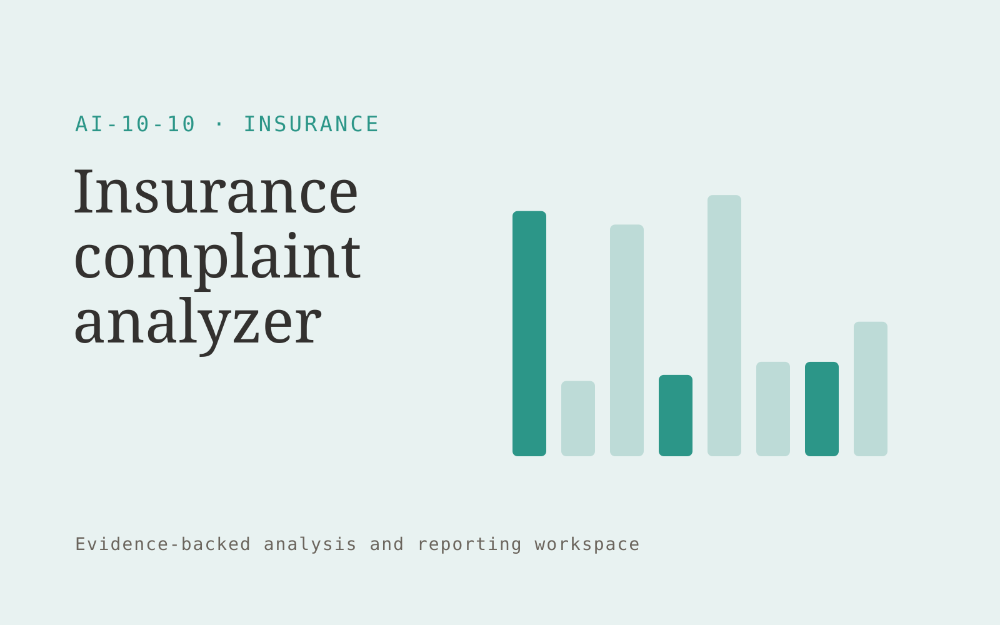

# Insurance complaint analyzer

**Insurance** · Also fits: Operations; Customer Support; Science and Research

> For insurance customer experience teams, turn authorized complaint records and service categories into service improvement evidence report. Address the recurring problem: repeated service failures are obscured by unstructured complaints. The value hypothesis is a more complete, reviewable deliverable with less repeated preparation; the pilot must establish whether that benefit is real.

| | |
|---|---|
| **Buyer** | Insurance customer experience teams |
| **Problem** | Repeated service failures are obscured by unstructured complaints. |
| **Format** | Evidence-backed analysis and reporting workspace |
| **USP** | Connects complaints to specific administrative process stages. |

## The product
Key screens: Complaint themes, process evidence, improvement owners. Open with a compact overview and filters for the relevant period or segment. Let users drill from each theme or metric into underlying records. Keep source definitions and missing-data notes near the result. Use an action panel to assign investigations and record what was learned. In this product, the first view is complaint themes, followed by process evidence and improvement owners.

## Core functionality
1. Group issues.
2. Identify process stages.
3. Preserve complaint context.
4. Compare consistent periods.
5. Assign investigations.
6. Monitor recurrence.

## Customer workflow
Agree definitions, import authorized data, validate coverage and identifiers, compute transparent measures, group relevant evidence, review findings, assign investigations or improvements, and repeat on a comparable period. Start with authorized complaint records and service categories and finish with service improvement evidence report.

## AI and human review
Classify text, summarize evidence and propose explanations to investigate. Compute financial or operational measures with deterministic code. Separate observed patterns from causal claims and preserve examples that contradict the summary.

## Customer inputs
Authorized complaint records and service categories

## Customer deliverables
Service improvement evidence report

## Accounts and administration
Dataset permissions, field mappings, metric definitions, source drill-down, saved filters, reviewer annotations, recurring reports and action ownership.

## MVP scope
Begin with insurance customer experience teams and one recurring use case. Build the first two modules: group issues; identify process stages. Provide operator assistance for the third module: preserve complaint context. Deliver service improvement evidence report through a manual review queue. Perform other necessary full-scope functions manually during the pilot. Include all applicable access, accuracy and professional-review controls from the start.

## After MVP validation
After paid pilots establish value, automate the remaining modules: compare consistent periods; assign investigations; monitor recurrence. Add one validated source integration, reusable customer configuration and recurring delivery. Expand to additional teams, document formats or languages only after testing the new scope.

## Build dependencies
Stable identifiers, consistent metric definitions, deterministic calculations, source lineage and representative review samples. Poor coverage must remain visible.

## Integrations and data access
Broker-approved policy documents, case records and carrier requirements. Read-only business data exports, reporting databases and task trackers. Reconcile source totals before scheduling recurring data refreshes. These are candidate integration categories, not verified supported connectors.

## Defensibility
Domain-specific definitions, trusted source mappings and a history connecting findings to actions and observed results. For this idea, build around connects complaints to specific administrative process stages. This advantage requires execution and accumulated customer trust; the base model alone is not a defensible asset.

## Alternatives and positioning
Analysts, business intelligence dashboards, spreadsheets and general text summarization tools. Differentiate on this specific proposed advantage: connects complaints to specific administrative process stages. Test it against the buyer's current method on the same task. Competitor coverage and uniqueness have not been established.

## Revenue model and test pricing (USD)
Test USD 500-2,000 for an initial analysis of one bounded dataset. Offer USD 250-1,000 monthly for repeat reporting at agreed volume. Data cleanup and specialist analysis are separately priced. These are test ranges.

## Main delivery costs
Data preparation, reconciliation, classification, expert interpretation, customer-specific definitions and recurring reporting support.

## Marketing message to test
> Insurance complaint analyzer for insurance customer experience teams. Connects complaints to specific administrative process stages. Demonstrate the claim through an anonymized complaint-to-process analysis.

## Acquisition channels
Insurance operations consultancies

## Lead magnet
An anonymized complaint-to-process analysis

## First 30 days of marketing
- Week 1: interview five prospective buyers in this segment: insurance customer experience teams. Ask to see a recent example of the problem and their current process.
- Week 2: prepare this demonstration using authorized or synthetic material: an anonymized complaint-to-process analysis.
- Week 3: present it through insurance operations consultancies and seek one narrowly scoped paid pilot.
- Week 4: review confirmed themes, repeated issue volume, total delivery effort and a concrete renewal decision before increasing scope.

## Paid pilot and validation
Analyze one historical period and review findings with the responsible domain owner. Reconcile headline measures, inspect counterexamples and ask the buyer to choose a concrete follow-up action. For this idea, use authorized complaint records and service categories and evaluate service improvement evidence report. Agree success thresholds with the buyer before starting; collect a baseline for confirmed themes, repeated issue volume. A positive signal is payment and repeat use with acceptable quality and delivery cost, not a favorable demo reaction alone.

## Success metrics
Confirmed themes, repeated issue volume

## Retention and expansion
Repeat the same definitions each reporting period and track whether findings lead to useful action. Expand data sources without breaking historical comparability.

## Operating controls and limitations
Separate document preparation from coverage, underwriting and claims decisions. Authorized professionals review policy meaning and customer commitments. Validate source access and reviewer availability during the pilot. Maintain customer-level access, data deletion controls and a record of final approvals.

## Brand style (concept)

- Colors: `#279178` primary · `#c95654` accent · `#e4f1ee` surface · `#22201e` ink
- Type: Playfair Display for headings, Source Sans 3 for text
- Voice: Reassuring, clear, no small print
- Demo site: [https://nexibeo.com/solutions/insurance-complaint-analyzer/demo/](https://nexibeo.com/solutions/insurance-complaint-analyzer/demo/)

## Investment indication

Indicative build budget, from MVP to full product. This is a planning range, not a quote; it excludes running costs such as model usage, hosting and reviewer hours. Built with Nexibeo's AI software development factory, most implementations take days to a few weeks of creation time, depending on availability.

| Phase | Scope | Creation time | Indicative budget |
|---|---|---|---|
| MVP | One buyer segment, one recurring use case; first modules: group issues; identify process stages. Manual review in the loop. | 6 days | $10,000 |
| Paid pilot | Accounts, roles, review states, audit trail and the first integration, hardened for two to three paying pilot customers. | 7 days | $12,500 |
| Full product | Remaining modules: compare consistent periods; assign investigations; monitor recurrence. Self-serve onboarding, billing, monitoring and the wider integration set. | 2 weeks | $17,500 |
| **Total** | | about 5 weeks | **$40,000** |

### Running costs per month (rough indication, untested)

| Stage | Hosting and infrastructure | AI usage | Total per month |
|---|---|---|---|
| MVP and paid pilot (about 3 customers) | $50–$100 | $80–$160 | **$130–$260** |
| Full product (about 50 customers) | $190–$380 | $880–$1,750 | **$1,070–$2,130** |

**Get this built:** [contact Nexibeo](https://nexibeo.com/solutions/insurance-complaint-analyzer/#apply). We build it with our AI software factory, usually in days to a few weeks, for you to run internally or offer to your clients.

## Research status
Concept proposal expanded from the 315-idea conversation. Demand, pricing, differentiation, build scope and integration feasibility are hypotheses, not verified market findings. Category link is inspiration rather than evidence of business viability.

## Credits and next steps

- **Estimation and having it built:** see the full solution page on [nexibeo.com](https://nexibeo.com/solutions/insurance-complaint-analyzer/) for more detail on estimation. Nexibeo builds it for you as a custom AI implementation, to run internally or to offer to your own clients.
- **Become an AI-optimized specialist for Insurance:** [Complete AI Training](https://completeaitraining.com/certification/12b-ai-certification-for-insurance-specialists/).
- Field news: [AI news for Insurance](https://completeaitraining.com/all-ai-news-for-insurance/).
