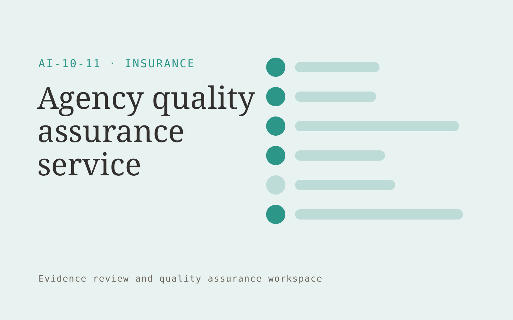

# Agency quality assurance service

**Insurance** · Also fits: Operations; Customer Support

> For operations managers at insurance brokerages, turn agency files and approved quality standards into quality review report and action log. Address the recurring problem: file review checklists are applied inconsistently. The value hypothesis is a more complete, reviewable deliverable with less repeated preparation; the pilot must establish whether that benefit is real.

| | |
|---|---|
| **Buyer** | Operations managers at insurance brokerages |
| **Problem** | File review checklists are applied inconsistently. |
| **Format** | Evidence review and quality assurance workspace |
| **USP** | Agency-specific standards with challengeable evidence for each finding. |

## The product
Key screens: Review queue, evidence findings, remediation tracker. Open on a review queue ordered by reviewer-selected priorities. Show each finding beside the original evidence and applicable rule. Provide accept, dismiss and needs-information controls with reasons. A separate report view summarizes confirmed findings and unresolved items, not raw AI flags. In this product, the first view is review queue, followed by evidence findings and remediation tracker.

## Core functionality
1. Apply file checklists.
2. Link findings to evidence.
3. Flag missing notes.
4. Sample uncertain cases.
5. Capture reviewer decisions.
6. Track remediation.

## Customer workflow
Agree review criteria, ingest a sample, generate candidate findings, inspect supporting evidence, let reviewers confirm or dismiss each item, assign corrections, and recheck the affected material. Start with agency files and approved quality standards and finish with quality review report and action log.

## AI and human review
Propose possible inconsistencies, omissions and rubric matches. Combine extraction with deterministic checks where rules are explicit. Reviewers make the final judgment. Keep false positives and missed cases visible during evaluation.

## Customer inputs
Agency files and approved quality standards

## Customer deliverables
Quality review report and action log

## Accounts and administration
Versioned review criteria, evidence links, reviewer decisions, disagreement handling, correction assignments, recheck status and exportable review history.

## MVP scope
Begin with operations managers at insurance brokerages and one recurring use case. Build the first two modules: apply file checklists; link findings to evidence. Provide operator assistance for the third module: flag missing notes. Deliver quality review report and action log through a manual review queue. Perform other necessary full-scope functions manually during the pilot. Include all applicable access, accuracy and professional-review controls from the start.

## After MVP validation
After paid pilots establish value, automate the remaining modules: sample uncertain cases; capture reviewer decisions; track remediation. Add one validated source integration, reusable customer configuration and recurring delivery. Expand to additional teams, document formats or languages only after testing the new scope.

## Build dependencies
Evidence coordinates, versioned rules, reviewer decisions and a representative reference set. Measure misses as well as confirmed findings before scaling.

## Integrations and data access
Broker-approved policy documents, case records and carrier requirements. Source repositories, task trackers and report exports. Keep findings as review proposals until authorized owners accept the resulting actions. These are candidate integration categories, not verified supported connectors.

## Defensibility
A domain-specific review rubric and rights-cleared examples of confirmed defects, false alarms and reviewer reasoning. For this idea, build around agency-specific standards with challengeable evidence for each finding. This advantage requires execution and accumulated customer trust; the base model alone is not a defensible asset.

## Alternatives and positioning
Manual reviewers, checklists, generic scanning tools and specialist audit services. Differentiate on this specific proposed advantage: agency-specific standards with challengeable evidence for each finding. Test it against the buyer's current method on the same task. Competitor coverage and uniqueness have not been established.

## Revenue model and test pricing (USD)
Test USD 500-2,000 for a defined audit sample and report. Offer recurring review priced by reviewed items and specialist hours. Software-only access can follow a reliable reviewed service. All prices require validation.

## Main delivery costs
Document or media processing, model evaluation, expert review, false-positive handling, rechecks and customer-specific rubric calibration.

## Marketing message to test
> Agency quality assurance service for operations managers at insurance brokerages. Agency-specific standards with challengeable evidence for each finding. Demonstrate the claim through a sample file review with documented findings.

## Acquisition channels
Broker practice advisers

## Lead magnet
A sample file review with documented findings

## First 30 days of marketing
- Week 1: interview five prospective buyers in this segment: operations managers at insurance brokerages. Ask to see a recent example of the problem and their current process.
- Week 2: prepare this demonstration using authorized or synthetic material: a sample file review with documented findings.
- Week 3: present it through broker practice advisers and seek one narrowly scoped paid pilot.
- Week 4: review reviewer agreement, repeat defects, total delivery effort and a concrete renewal decision before increasing scope.

## Paid pilot and validation
Have a qualified reviewer independently assess the same sample. Compare confirmed findings, false alarms and omissions. Repeat on unseen material before agreeing recurring volume. For this idea, use agency files and approved quality standards and evaluate quality review report and action log. Agree success thresholds with the buyer before starting; collect a baseline for reviewer agreement, repeat defects. A positive signal is payment and repeat use with acceptable quality and delivery cost, not a favorable demo reaction alone.

## Success metrics
Reviewer agreement, repeat defects

## Retention and expansion
Offer recurring reviews and rechecks of previously confirmed issues. Expand document or case types after validating the new rubric with qualified reviewers.

## Operating controls and limitations
Separate document preparation from coverage, underwriting and claims decisions. Authorized professionals review policy meaning and customer commitments. Validate source access and reviewer availability during the pilot. Maintain customer-level access, data deletion controls and a record of final approvals.

## Brand style (concept)

- Colors: `#279188` primary · `#c95483` accent · `#e4f1f0` surface · `#22201e` ink
- Type: Playfair Display for headings, Source Sans 3 for text
- Voice: Reassuring, clear, no small print
- Demo site: [https://nexibeo.com/ideas/agency-quality-assurance-service/demo/](https://nexibeo.com/ideas/agency-quality-assurance-service/demo/)

## Investment indication

Indicative build budget, from MVP to full product. This is a planning range, not a quote; it excludes running costs such as model usage, hosting and reviewer hours.

| Phase | Scope | Timeline | Indicative budget |
|---|---|---|---|
| MVP | One buyer segment, one recurring use case; first modules: apply file checklists; link findings to evidence. Manual review in the loop. | 5 weeks | $10,000 |
| Paid pilot | Accounts, roles, review states, audit trail and the first integration, hardened for two to three paying pilot customers. | 7 weeks | $12,500 |
| Full product | Remaining modules: sample uncertain cases; capture reviewer decisions; track remediation. Self-serve onboarding, billing, monitoring and the wider integration set. | 12 weeks | $17,500 |
| **Total** | | 24 weeks | **$40,000** |

**Co-create this project with us:** [contact Nexibeo](https://nexibeo.com/ideas/agency-quality-assurance-service/#apply) and we build it with you.

## Research status
Concept proposal expanded from the 315-idea conversation. Demand, pricing, differentiation, build scope and integration feasibility are hypotheses, not verified market findings. Category link is inspiration rather than evidence of business viability.

## Credits and next steps

- **Estimation and building this idea:** see the full idea page on [nexibeo.com](https://nexibeo.com/ideas/agency-quality-assurance-service/) for more detail on estimation, and to co-create and build this idea with Nexibeo.
- **Become an AI-optimized specialist for Insurance:** [Complete AI Training](https://completeaitraining.com/certification/12b-ai-certification-for-insurance-specialists/).
- Field news: [AI news for Insurance](https://completeaitraining.com/all-ai-news-for-insurance/).
