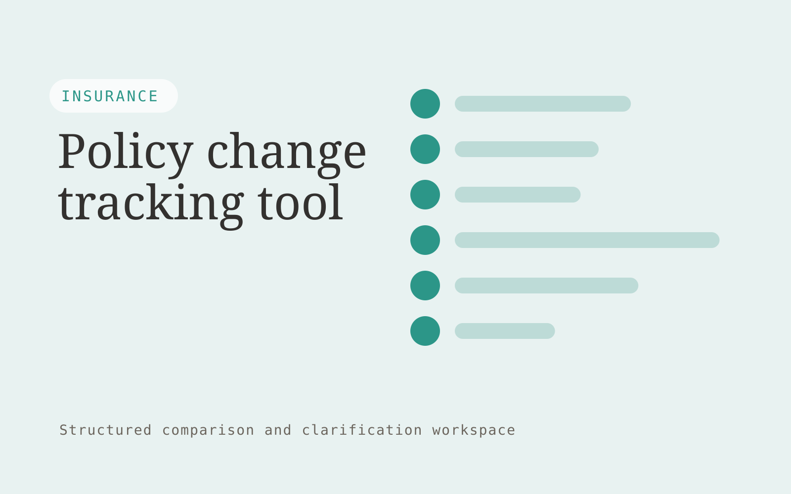

# Policy change tracking tool

**AI-10-14 · Insurance** · Also fits: Operations; Customer Support

> For brokers reviewing annual policy revisions, turn prior and current policy documents into policy change report for professional review. Address the recurring problem: small wording changes are hard to distinguish from layout changes. The value hypothesis is a more complete, reviewable deliverable with less repeated preparation; the pilot must establish whether that benefit is real.

| | |
|---|---|
| **Buyer** | Brokers reviewing annual policy revisions |
| **Problem** | Small wording changes are hard to distinguish from layout changes. |
| **Format** | Structured comparison and clarification workspace |
| **USP** | Clause-level evidence with wording changes separated from formatting noise. |

## The product
Key screens: Version comparison, clause changes, reviewer notes. Use a side-by-side matrix with the same fields for every document or option. Clicking a value reveals its original passage. Highlight missing, different and uncertain items separately. Provide a clarification queue and reviewer annotations before exporting a decision pack. In this product, the first view is version comparison, followed by clause changes and reviewer notes.

## Core functionality
1. Align clauses.
2. Ignore layout-only changes.
3. Highlight changed wording.
4. Preserve original text.
5. Group affected topics.
6. Export review notes.

## Customer workflow
Define comparison fields, upload source versions or offers, extract candidate values, normalize only agreed units, inspect differences, resolve questions with reviewers, and export an evidence-linked comparison. Start with prior and current policy documents and finish with policy change report for professional review.

## AI and human review
Align document sections and extract proposed comparable fields. Deterministic checks handle units and arithmetic. Preserve original wording and label assumptions. Professional reviewers assess the meaning and significance of differences.

## Customer inputs
Prior and current policy documents

## Customer deliverables
Policy change report for professional review

## Accounts and administration
Document versions, field definitions, source references, reviewer corrections, unresolved questions, comparison history and exportable matrices.

## MVP scope
Begin with brokers reviewing annual policy revisions and one recurring use case. Build the first two modules: align clauses; ignore layout-only changes. Provide operator assistance for the third module: highlight changed wording. Deliver policy change report for professional review through a manual review queue. Perform other necessary full-scope functions manually during the pilot. Include all applicable access, accuracy and professional-review controls from the start.

## After MVP validation
After paid pilots establish value, automate the remaining modules: preserve original text; group affected topics; export review notes. Add one validated source integration, reusable customer configuration and recurring delivery. Expand to additional teams, document formats or languages only after testing the new scope.

## Build dependencies
Document alignment, field provenance, unit normalization, missing-value handling and reviewer correction. Similar-looking documents may contain materially different terms.

## Integrations and data access
Broker-approved policy documents, case records and carrier requirements. Document repositories, procurement or contract records and spreadsheet exports. Preserve originals and avoid writing back interpretations without approval. These are candidate integration categories, not verified supported connectors.

## Defensibility
A niche comparison schema, reviewed extraction examples and clear handling of the differences that matter to a specific buyer. For this idea, build around clause-level evidence with wording changes separated from formatting noise. This advantage requires execution and accumulated customer trust; the base model alone is not a defensible asset.

## Alternatives and positioning
Spreadsheet comparisons, professional reviewers, document diff tools and manual quote or contract review. Differentiate on this specific proposed advantage: clause-level evidence with wording changes separated from formatting noise. Test it against the buyer's current method on the same task. Competitor coverage and uniqueness have not been established.

## Revenue model and test pricing (USD)
Test USD 300-1,500 for one bounded comparison package, then USD 150-600 monthly for recurring volume with review limits. Complex expert interpretation is separately priced. Figures are hypotheses.

## Main delivery costs
Document parsing, field alignment, source verification, expert interpretation, clarification rounds and changing document formats.

## Marketing message to test
> Policy change tracking tool for brokers reviewing annual policy revisions. Clause-level evidence with wording changes separated from formatting noise. Demonstrate the claim through an annotated annual policy comparison.

## Acquisition channels
Insurance legal and product advisers

## Lead magnet
An annotated annual policy comparison

## First 30 days of marketing
- Week 1: interview five prospective buyers in this segment: brokers reviewing annual policy revisions. Ask to see a recent example of the problem and their current process.
- Week 2: prepare this demonstration using authorized or synthetic material: an annotated annual policy comparison.
- Week 3: present it through insurance legal and product advisers and seek one narrowly scoped paid pilot.
- Week 4: review meaningful change detection, false alarms, total delivery effort and a concrete renewal decision before increasing scope.

## Paid pilot and validation
Compare a known set already reviewed by a domain expert. Check meaningful differences, false alarms and missing fields. Measure reviewer time including corrections rather than extraction speed alone. For this idea, use prior and current policy documents and evaluate policy change report for professional review. Agree success thresholds with the buyer before starting; collect a baseline for meaningful change detection, false alarms. A positive signal is payment and repeat use with acceptable quality and delivery cost, not a favorable demo reaction alone.

## Success metrics
Meaningful change detection, false alarms

## Retention and expansion
Save reviewer-approved comparison fields and recurring document formats. Offer repeat comparisons and explicit updates when the source options change.

## Operating controls and limitations
Separate document preparation from coverage, underwriting and claims decisions. Authorized professionals review policy meaning and customer commitments. Validate source access and reviewer availability during the pilot. Maintain customer-level access, data deletion controls and a record of final approvals.

## Brand style (concept)

- Colors: `#27918d` primary · `#c95456` accent · `#e4f1f0` surface · `#22201e` ink
- Type: Playfair Display for headings, Source Sans 3 for text
- Voice: Reassuring, clear, no small print
- Demo site: [https://nexibeo.com/ideas/policy-change-tracking-tool/demo/](https://nexibeo.com/ideas/policy-change-tracking-tool/demo/)

## Investment indication

Indicative build budget, from MVP to full product. This is a planning range, not a quote; it excludes running costs such as model usage, hosting and reviewer hours.

| Phase | Scope | Timeline | Indicative budget |
|---|---|---|---|
| MVP | One buyer segment, one recurring use case; first modules: align clauses; ignore layout-only changes. Manual review in the loop. | 5 weeks | $10,000 |
| Paid pilot | Accounts, roles, review states, audit trail and the first integration, hardened for two to three paying pilot customers. | 7 weeks | $12,500 |
| Full product | Remaining modules: preserve original text; group affected topics; export review notes. Self-serve onboarding, billing, monitoring and the wider integration set. | 12 weeks | $17,500 |
| **Total** | | 24 weeks | **$40,000** |

**Co-create this project with us:** [contact Nexibeo](https://nexibeo.com/ideas/policy-change-tracking-tool/#apply) and we build it with you.

## Research status
Concept proposal expanded from the 315-idea conversation. Demand, pricing, differentiation, build scope and integration feasibility are hypotheses, not verified market findings. Category link is inspiration rather than evidence of business viability.

## Credits and next steps

- **Estimation and building this idea:** see the full idea page on [nexibeo.com](https://nexibeo.com/ideas/policy-change-tracking-tool/) for more detail on estimation, and to co-create and build this idea with Nexibeo.
- **Become an AI-optimized specialist for Insurance:** [Complete AI Training](https://completeaitraining.com/certification/12b-ai-certification-for-insurance-specialists/).
- Field news: [AI news for Insurance](https://completeaitraining.com/all-ai-news-for-insurance/).
