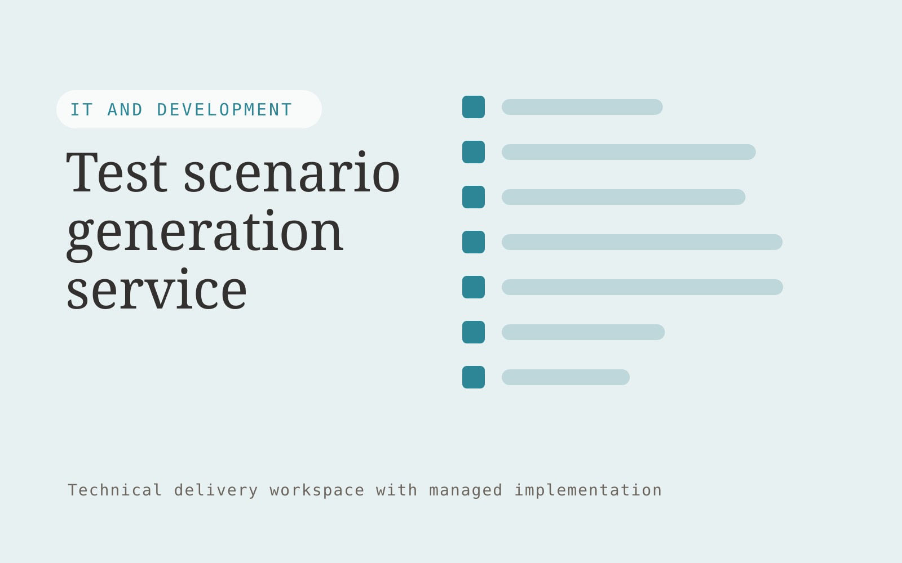

# Test scenario generation service

**AI-11-03 · IT and Development** · Also fits: Operations; Customer Support

> For quality leads at small software companies, turn requirements, historical bugs and test conventions into reviewed test scenarios and coverage notes. Address the recurring problem: requirements do not translate into adequate failure coverage. The value hypothesis is a more complete, reviewable deliverable with less repeated preparation; the pilot must establish whether that benefit is real.

| | |
|---|---|
| **Buyer** | Quality leads at small software companies |
| **Problem** | Requirements do not translate into adequate failure coverage. |
| **Format** | Technical delivery workspace with managed implementation |
| **USP** | Coverage tied to requirements and actual failure history. |

## The product
Key screens: Requirement map, scenario editor, coverage review. Show a work backlog, proposed changes and verification results. Link each item to its source configuration, code or data mapping. Provide execution logs and an owner-facing health view. Keep environments and approval states clearly separated so a draft cannot be mistaken for a live change. In this product, the first view is requirement map, followed by scenario editor and coverage review.

## Core functionality
1. Extract acceptance conditions.
2. Propose boundary cases.
3. Reuse failure patterns.
4. Generate fixtures.
5. Flag untested assumptions.
6. Export reviewed test cases.

## Customer workflow
Scope one technical task, inspect authorized material, propose an implementation, build in a controlled environment, run relevant checks, obtain the required change approval, deliver with recovery instructions, and monitor the agreed operating scope. Start with requirements, historical bugs and test conventions and finish with reviewed test scenarios and coverage notes.

## AI and human review
Explain code or configuration, draft transformations and propose technical changes. Execute deterministic validation and meaningful tests. Engineers review correctness, access handling and failure behavior before deployment.

## Customer inputs
Requirements, historical bugs and test conventions

## Customer deliverables
Reviewed test scenarios and coverage notes

## Accounts and administration
Project access, environment separation, versioned changes, test evidence, owner approvals, execution logs, rollback instructions and incident handling.

## MVP scope
Begin with quality leads at small software companies and one recurring use case. Build the first two modules: extract acceptance conditions; propose boundary cases. Provide operator assistance for the third module: reuse failure patterns. Deliver reviewed test scenarios and coverage notes through a manual review queue. Perform other necessary full-scope functions manually during the pilot. Include all applicable access, accuracy and professional-review controls from the start.

## After MVP validation
After paid pilots establish value, automate the remaining modules: generate fixtures; flag untested assumptions; export reviewed test cases. Add one validated source integration, reusable customer configuration and recurring delivery. Expand to additional teams, document formats or languages only after testing the new scope.

## Build dependencies
Authorized technical access, suitable test environments, documented APIs or schemas, secrets management, meaningful checks and recovery procedures.

## Integrations and data access
Authorized repositories, technical documentation, application APIs and logs. Approved repositories, application APIs, execution platforms and monitoring systems. Validate current API access and behavior during discovery before promising compatibility. These are candidate integration categories, not verified supported connectors.

## Defensibility
Reliable niche implementations, integration knowledge, representative tests and ongoing operational responsibility. For this idea, build around coverage tied to requirements and actual failure history. This advantage requires execution and accumulated customer trust; the base model alone is not a defensible asset.

## Alternatives and positioning
Developers, system integrators, existing automation products and internal engineering work. Differentiate on this specific proposed advantage: coverage tied to requirements and actual failure history. Test it against the buyer's current method on the same task. Competitor coverage and uniqueness have not been established.

## Revenue model and test pricing (USD)
Test USD 1,000-4,000 for one bounded implementation or technical review, then USD 200-1,000 monthly for defined maintenance. Hosting, vendor fees and major feature changes are separate. Prices are hypotheses.

## Main delivery costs
Engineering, testing, cloud execution, third-party API fees, monitoring, incident response and vendor-change maintenance.

## Marketing message to test
> Test scenario generation service for quality leads at small software companies. Coverage tied to requirements and actual failure history. Demonstrate the claim through a boundary-case review for one feature.

## Acquisition channels
QA consultancies

## Lead magnet
A boundary-case review for one feature

## First 30 days of marketing
- Week 1: interview five prospective buyers in this segment: quality leads at small software companies. Ask to see a recent example of the problem and their current process.
- Week 2: prepare this demonstration using authorized or synthetic material: a boundary-case review for one feature.
- Week 3: present it through QA consultancies and seek one narrowly scoped paid pilot.
- Week 4: review useful cases accepted, defects caught, total delivery effort and a concrete renewal decision before increasing scope.

## Paid pilot and validation
Implement one bounded task in a safe test environment. Demonstrate normal operation, failure handling and recovery with representative inputs. Have the responsible technical owner review the results. For this idea, use requirements, historical bugs and test conventions and evaluate reviewed test scenarios and coverage notes. Agree success thresholds with the buyer before starting; collect a baseline for useful cases accepted, defects caught. A positive signal is payment and repeat use with acceptable quality and delivery cost, not a favorable demo reaction alone.

## Success metrics
Useful cases accepted, defects caught

## Retention and expansion
Maintain agreed integrations or technical assets, review failures and upstream changes, and sell additional scoped work only after the first implementation is stable.

## Operating controls and limitations
Protect secrets, customer data and source code. Use controlled environments, technical review and a recoverable deployment process. Validate source access and reviewer availability during the pilot. Maintain customer-level access, data deletion controls and a record of final approvals.

## Brand style (concept)

- Colors: `#279191` primary · `#c97b54` accent · `#e4f1f1` surface · `#22201e` ink
- Type: Manrope for headings, Manrope for text
- Voice: Technical, direct, no hype
- Demo site: [https://nexibeo.com/ideas/test-scenario-generation-service/demo/](https://nexibeo.com/ideas/test-scenario-generation-service/demo/)

## Investment indication

Indicative build budget, from MVP to full product. This is a planning range, not a quote; it excludes running costs such as model usage, hosting and reviewer hours.

| Phase | Scope | Timeline | Indicative budget |
|---|---|---|---|
| MVP | One buyer segment, one recurring use case; first modules: extract acceptance conditions; propose boundary cases. Manual review in the loop. | 6 weeks | $11,000 |
| Paid pilot | Accounts, roles, review states, audit trail and the first integration, hardened for two to three paying pilot customers. | 7 weeks | $14,000 |
| Full product | Remaining modules: generate fixtures; flag untested assumptions; export reviewed test cases. Self-serve onboarding, billing, monitoring and the wider integration set. | 13 weeks | $19,500 |
| **Total** | | 26 weeks | **$44,500** |

**Co-create this project with us:** [contact Nexibeo](https://nexibeo.com/ideas/test-scenario-generation-service/#apply) and we build it with you.

## Research status
Concept proposal expanded from the 315-idea conversation. Demand, pricing, differentiation, build scope and integration feasibility are hypotheses, not verified market findings. Category link is inspiration rather than evidence of business viability.

## Credits and next steps

- **Estimation and building this idea:** see the full idea page on [nexibeo.com](https://nexibeo.com/ideas/test-scenario-generation-service/) for more detail on estimation, and to co-create and build this idea with Nexibeo.
- **Become an AI-optimized specialist for IT and Development:** [Complete AI Training](https://completeaitraining.com/certification/12b-ai-certification-for-it-and-development-specialists/).
- Field news: [AI news for IT and Development](https://completeaitraining.com/all-ai-news-for-it-and-development/).
