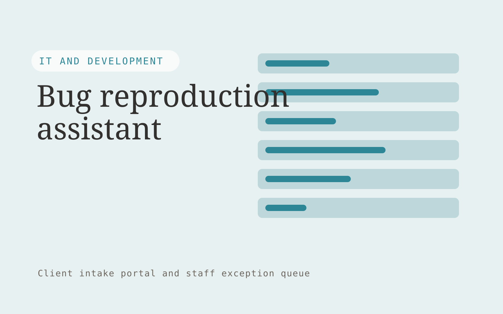

# Bug reproduction assistant

**IT and Development** · Also fits: Operations; Customer Support

> For support engineers at B2B software companies, turn ticket details, environment logs and reproduction templates into structured reproduction report. Address the recurring problem: bug reports omit context developers need to reproduce failures. The value hypothesis is a more complete, reviewable deliverable with less repeated preparation; the pilot must establish whether that benefit is real.

| | |
|---|---|
| **Buyer** | Support engineers at B2B software companies |
| **Problem** | Bug reports omit context developers need to reproduce failures. |
| **Format** | Client intake portal and staff exception queue |
| **USP** | A complete reproducibility package before engineering triage. |

## The product
Key screens: Bug inbox, evidence checklist, developer handoff. Give submitters a mobile-friendly step-by-step form with document uploads and a visible completeness checklist. Staff see a queue with missing items and extracted fields. Place the original document beside each uncertain value. Show submitted, clarification required and ready-for-review states. In this product, the first view is bug inbox, followed by evidence checklist and developer handoff.

## Core functionality
1. Extract expected behavior.
2. Record actual behavior.
3. Identify environment details.
4. Request missing steps.
5. Redact secrets.
6. Assemble reproduction briefs.

## Customer workflow
Choose the request type, collect declared facts and required documents, extract relevant fields, show missing or inconsistent information, let the submitter correct it, and route the complete package to an authorized reviewer. Start with ticket details, environment logs and reproduction templates and finish with structured reproduction report.

## AI and human review
Classify submitted material, extract candidate fields and draft clarification questions. Deterministic rules test required fields and formats. Keep uncertain extraction visible and preserve the original statement. Do not infer missing material facts.

## Customer inputs
Ticket details, environment logs and reproduction templates

## Customer deliverables
Structured reproduction report

## Accounts and administration
Secure uploads, configurable checklists, progress saving, duplicate handling, reviewer assignments, clarification threads, deadlines and submission history.

## MVP scope
Begin with support engineers at B2B software companies and one recurring use case. Build the first two modules: extract expected behavior; record actual behavior. Provide operator assistance for the third module: identify environment details. Deliver structured reproduction report through a manual review queue. Perform other necessary full-scope functions manually during the pilot. Include all applicable access, accuracy and professional-review controls from the start.

## After MVP validation
After paid pilots establish value, automate the remaining modules: request missing steps; redact secrets; assemble reproduction briefs. Add one validated source integration, reusable customer configuration and recurring delivery. Expand to additional teams, document formats or languages only after testing the new scope.

## Build dependencies
Secure upload handling, reliable extraction, versioned completeness rules, submitter identity and staff routing. Third-party checklist changes require maintenance.

## Integrations and data access
Authorized repositories, technical documentation, application APIs and logs. Case management, customer records, document storage and notification systems. Begin with an exportable review pack before automating destination writes. These are candidate integration categories, not verified supported connectors.

## Defensibility
Document-type expertise, tested completeness rules and a low-friction client experience embedded in a repeat administrative process. For this idea, build around a complete reproducibility package before engineering triage. This advantage requires execution and accumulated customer trust; the base model alone is not a defensible asset.

## Alternatives and positioning
Email collection, generic web forms, spreadsheets and existing case management systems. Differentiate on this specific proposed advantage: a complete reproducibility package before engineering triage. Test it against the buyer's current method on the same task. Competitor coverage and uniqueness have not been established.

## Revenue model and test pricing (USD)
Test USD 500-2,000 setup plus USD 150-750 monthly for one form family and a capped submission volume. Quote specialist review and unusual document formats separately. Prices are experimental.

## Main delivery costs
Document processing, storage, exception review, support, checklist maintenance and customer-specific integration work.

## Marketing message to test
> Bug reproduction assistant for support engineers at B2B software companies. A complete reproducibility package before engineering triage. Demonstrate the claim through a vague-ticket-to-reproduction example.

## Acquisition channels
Technical support platform partners

## Lead magnet
A vague-ticket-to-reproduction example

## First 30 days of marketing
- Week 1: interview five prospective buyers in this segment: support engineers at B2B software companies. Ask to see a recent example of the problem and their current process.
- Week 2: prepare this demonstration using authorized or synthetic material: a vague-ticket-to-reproduction example.
- Week 3: present it through technical support platform partners and seek one narrowly scoped paid pilot.
- Week 4: review accepted bug reports, clarification rounds, total delivery effort and a concrete renewal decision before increasing scope.

## Paid pilot and validation
Process a bounded set of historical and new submissions. Include missing, duplicate and unreadable documents. Compare complete submissions and clarification effort with the current intake method. For this idea, use ticket details, environment logs and reproduction templates and evaluate structured reproduction report. Agree success thresholds with the buyer before starting; collect a baseline for accepted bug reports, clarification rounds. A positive signal is payment and repeat use with acceptable quality and delivery cost, not a favorable demo reaction alone.

## Success metrics
Accepted bug reports, clarification rounds

## Retention and expansion
Review incomplete submissions and simplify recurring friction. Expand to another form or document family after the first workflow reliably produces review-ready cases.

## Operating controls and limitations
Protect secrets, customer data and source code. Use controlled environments, technical review and a recoverable deployment process. Validate source access and reviewer availability during the pilot. Maintain customer-level access, data deletion controls and a record of final approvals.

## Brand style (concept)

- Colors: `#278191` primary · `#c9545c` accent · `#e4eff1` surface · `#22201e` ink
- Type: Manrope for headings, Manrope for text
- Voice: Technical, direct, no hype
- Demo site: [https://nexibeo.com/ideas/bug-reproduction-assistant/demo/](https://nexibeo.com/ideas/bug-reproduction-assistant/demo/)

## Investment indication

Indicative build budget, from MVP to full product. This is a planning range, not a quote; it excludes running costs such as model usage, hosting and reviewer hours.

| Phase | Scope | Timeline | Indicative budget |
|---|---|---|---|
| MVP | One buyer segment, one recurring use case; first modules: extract expected behavior; record actual behavior. Manual review in the loop. | 5 weeks | $9,000 |
| Paid pilot | Accounts, roles, review states, audit trail and the first integration, hardened for two to three paying pilot customers. | 6 weeks | $11,000 |
| Full product | Remaining modules: request missing steps; redact secrets; assemble reproduction briefs. Self-serve onboarding, billing, monitoring and the wider integration set. | 11 weeks | $15,500 |
| **Total** | | 22 weeks | **$35,500** |

**Co-create this project with us:** [contact Nexibeo](https://nexibeo.com/ideas/bug-reproduction-assistant/#apply) and we build it with you.

## Research status
Concept proposal expanded from the 315-idea conversation. Demand, pricing, differentiation, build scope and integration feasibility are hypotheses, not verified market findings. Category link is inspiration rather than evidence of business viability.

## Credits and next steps

- **Estimation and building this idea:** see the full idea page on [nexibeo.com](https://nexibeo.com/ideas/bug-reproduction-assistant/) for more detail on estimation, and to co-create and build this idea with Nexibeo.
- **Become an AI-optimized specialist for IT and Development:** [Complete AI Training](https://completeaitraining.com/certification/12b-ai-certification-for-it-and-development-specialists/).
- Field news: [AI news for IT and Development](https://completeaitraining.com/all-ai-news-for-it-and-development/).
