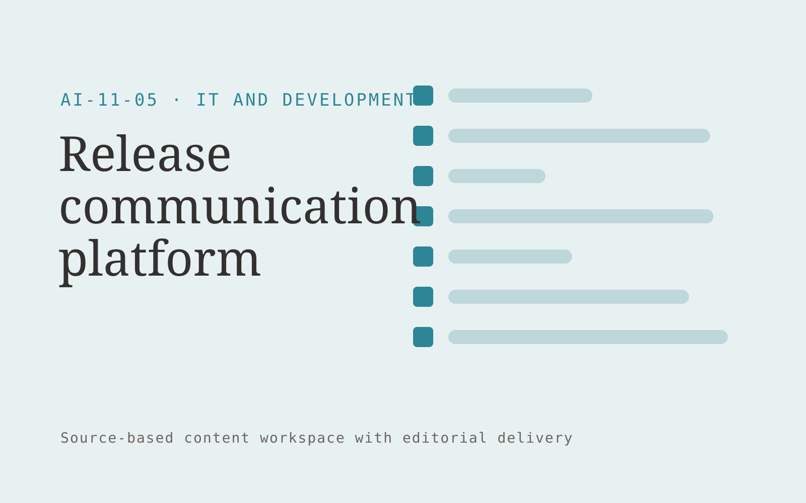

# Release communication platform

**IT and Development** · Also fits: Operations; Customer Support; Writers

> For product operations leads at frequently shipping software firms, turn verified merged changes and approved product terminology into approved release notes and internal briefings. Address the recurring problem: one technical change log cannot serve every audience. The value hypothesis is a more complete, reviewable deliverable with less repeated preparation; the pilot must establish whether that benefit is real.

| | |
|---|---|
| **Buyer** | Product operations leads at frequently shipping software firms |
| **Problem** | One technical change log cannot serve every audience. |
| **Format** | Source-based content workspace with editorial delivery |
| **USP** | Audience-specific release communication grounded in verified shipped work. |

## The product
Key screens: Release register, audience drafts, publication review. Use a project list and editorial calendar beside a document editor. Keep original material and supporting passages in a collapsible side panel. Show outline, draft, review and approved stages. Provide tracked edits, comments, version comparisons and an export preview that reflects the final delivery format. In this product, the first view is release register, followed by audience drafts and publication review.

## Core functionality
1. Group shipped changes.
2. Distinguish fixes from features.
3. Draft customer summaries.
4. Produce internal briefs.
5. Link source changes.
6. Track approvals.

## Customer workflow
Collect a structured brief and source material, identify unanswered questions, approve an outline, generate a draft, verify claims, gather reviewer edits, approve a final version and export the agreed formats. Start with verified merged changes and approved product terminology and finish with approved release notes and internal briefings.

## AI and human review
Extract and organize information, propose structure, draft prose and adapt approved content to audiences. Attach evidence to factual claims. Keep names, dates, amounts and quoted wording linked to their source. Editors resolve ambiguity and approve publication.

## Customer inputs
Verified merged changes and approved product terminology

## Customer deliverables
Approved release notes and internal briefings

## Accounts and administration
Client workspaces, source permissions, editorial assignments, change history, reviewer comments, approval gates, revision allowances and export templates.

## MVP scope
Begin with product operations leads at frequently shipping software firms and one recurring use case. Build the first two modules: group shipped changes; distinguish fixes from features. Provide operator assistance for the third module: draft customer summaries. Deliver approved release notes and internal briefings through a manual review queue. Perform other necessary full-scope functions manually during the pilot. Include all applicable access, accuracy and professional-review controls from the start.

## After MVP validation
After paid pilots establish value, automate the remaining modules: produce internal briefs; link source changes; track approvals. Add one validated source integration, reusable customer configuration and recurring delivery. Expand to additional teams, document formats or languages only after testing the new scope.

## Build dependencies
Document parsing, a source-linked editor, tracked revisions, reviewer workflow and reliable document export. Rich presentation or print output needs format-specific QA.

## Integrations and data access
Authorized repositories, technical documentation, application APIs and logs. Document storage, word processor export, content management systems and approved publishing channels. Pilot with uploads and downloadable drafts before adding write integrations. These are candidate integration categories, not verified supported connectors.

## Defensibility
Customer-approved terminology, reusable structures, source libraries and editorial feedback tied to a specific audience and recurring publishing workflow. For this idea, build around audience-specific release communication grounded in verified shipped work. This advantage requires execution and accumulated customer trust; the base model alone is not a defensible asset.

## Alternatives and positioning
Writers, editors, agencies, internal document templates and general-purpose chat tools. Differentiate on this specific proposed advantage: audience-specific release communication grounded in verified shipped work. Test it against the buyer's current method on the same task. Competitor coverage and uniqueness have not been established.

## Revenue model and test pricing (USD)
Test USD 400-1,500 for a tightly scoped initial content package. Convert repeated work to a monthly retainer with explicit deliverable and revision limits. Specialist review and substantial research are separately scoped. Prices are hypotheses.

## Main delivery costs
Research and interview time, transcription, model usage, factual verification, subject-matter review, editing and revisions.

## Marketing message to test
> Release communication platform for product operations leads at frequently shipping software firms. Audience-specific release communication grounded in verified shipped work. Demonstrate the claim through one release adapted for customers and support teams.

## Acquisition channels
Product operations communities

## Lead magnet
One release adapted for customers and support teams

## First 30 days of marketing
- Week 1: interview five prospective buyers in this segment: product operations leads at frequently shipping software firms. Ask to see a recent example of the problem and their current process.
- Week 2: prepare this demonstration using authorized or synthetic material: one release adapted for customers and support teams.
- Week 3: present it through product operations communities and seek one narrowly scoped paid pilot.
- Week 4: review correction rate, release communication time, total delivery effort and a concrete renewal decision before increasing scope.

## Paid pilot and validation
Complete one existing brief using the customer’s actual sources. Record reviewer edits, factual corrections and preparation time. Ask the same buyer to commission a second comparable deliverable. For this idea, use verified merged changes and approved product terminology and evaluate approved release notes and internal briefings. Agree success thresholds with the buyer before starting; collect a baseline for correction rate, release communication time. A positive signal is payment and repeat use with acceptable quality and delivery cost, not a favorable demo reaction alone.

## Success metrics
Correction rate, release communication time

## Retention and expansion
Maintain the approved source and voice library, schedule recurring editorial work, and expand into additional formats only after the core deliverable is repeatedly accepted.

## Operating controls and limitations
Protect secrets, customer data and source code. Use controlled environments, technical review and a recoverable deployment process. Validate source access and reviewer availability during the pilot. Maintain customer-level access, data deletion controls and a record of final approvals.

## Brand style (concept)

- Colors: `#277191` primary · `#c96a54` accent · `#e4edf1` surface · `#22201e` ink
- Type: Manrope for headings, Manrope for text
- Voice: Technical, direct, no hype
- Demo site: [https://nexibeo.com/ideas/release-communication-platform/demo/](https://nexibeo.com/ideas/release-communication-platform/demo/)

## Investment indication

Indicative build budget, from MVP to full product. This is a planning range, not a quote; it excludes running costs such as model usage, hosting and reviewer hours.

| Phase | Scope | Timeline | Indicative budget |
|---|---|---|---|
| MVP | One buyer segment, one recurring use case; first modules: group shipped changes; distinguish fixes from features. Manual review in the loop. | 5 weeks | $9,000 |
| Paid pilot | Accounts, roles, review states, audit trail and the first integration, hardened for two to three paying pilot customers. | 6 weeks | $11,000 |
| Full product | Remaining modules: produce internal briefs; link source changes; track approvals. Self-serve onboarding, billing, monitoring and the wider integration set. | 11 weeks | $15,500 |
| **Total** | | 22 weeks | **$35,500** |

### Running costs per month (rough indication, untested)

| Stage | Hosting and infrastructure | AI usage | Total per month |
|---|---|---|---|
| MVP and paid pilot (about 3 customers) | $30–$60 | $70–$140 | **$100–$200** |
| Full product (about 50 customers) | $110–$210 | $700–$1,400 | **$810–$1,610** |

**Co-create this project with us:** [contact Nexibeo](https://nexibeo.com/ideas/release-communication-platform/#apply) and we build it with you.

## Research status
Concept proposal expanded from the 315-idea conversation. Demand, pricing, differentiation, build scope and integration feasibility are hypotheses, not verified market findings. Category link is inspiration rather than evidence of business viability.

## Credits and next steps

- **Estimation and building this idea:** see the full idea page on [nexibeo.com](https://nexibeo.com/ideas/release-communication-platform/) for more detail on estimation, and to co-create and build this idea with Nexibeo.
- **Become an AI-optimized specialist for IT and Development:** [Complete AI Training](https://completeaitraining.com/certification/12b-ai-certification-for-it-and-development-specialists/).
- Field news: [AI news for IT and Development](https://completeaitraining.com/all-ai-news-for-it-and-development/).
