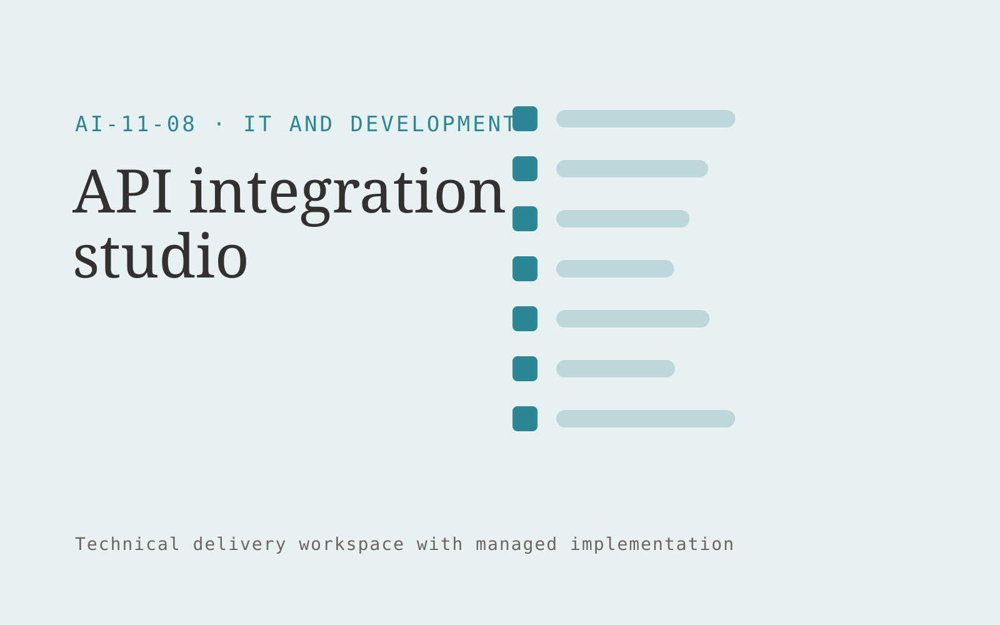

# API integration studio

**IT and Development** · Also fits: Operations; Customer Support

> For operators of niche service businesses, turn approved API documentation and workflow requirements into maintained integration and operating runbook. Address the recurring problem: critical tools require repeated manual data transfers. The value hypothesis is a more complete, reviewable deliverable with less repeated preparation; the pilot must establish whether that benefit is real.

| | |
|---|---|
| **Buyer** | Operators of niche service businesses |
| **Problem** | Critical tools require repeated manual data transfers. |
| **Format** | Technical delivery workspace with managed implementation |
| **USP** | A maintained integration package for one recurring industry software combination. |

## The product
Key screens: Workflow canvas, field mapping, execution logs. Show a work backlog, proposed changes and verification results. Link each item to its source configuration, code or data mapping. Provide execution logs and an owner-facing health view. Keep environments and approval states clearly separated so a draft cannot be mistaken for a live change. In this product, the first view is workflow canvas, followed by field mapping and execution logs.

## Core functionality
1. Map data contracts.
2. Configure authentication.
3. Validate field transforms.
4. Handle retries.
5. Prevent duplicate writes.
6. Document operational ownership.

## Customer workflow
Scope one technical task, inspect authorized material, propose an implementation, build in a controlled environment, run relevant checks, obtain the required change approval, deliver with recovery instructions, and monitor the agreed operating scope. Start with approved API documentation and workflow requirements and finish with maintained integration and operating runbook.

## AI and human review
Explain code or configuration, draft transformations and propose technical changes. Execute deterministic validation and meaningful tests. Engineers review correctness, access handling and failure behavior before deployment.

## Customer inputs
Approved API documentation and workflow requirements

## Customer deliverables
Maintained integration and operating runbook

## Accounts and administration
Project access, environment separation, versioned changes, test evidence, owner approvals, execution logs, rollback instructions and incident handling.

## MVP scope
Begin with operators of niche service businesses and one recurring use case. Build the first two modules: map data contracts; configure authentication. Provide operator assistance for the third module: validate field transforms. Deliver maintained integration and operating runbook through a manual review queue. Perform other necessary full-scope functions manually during the pilot. Include all applicable access, accuracy and professional-review controls from the start.

## After MVP validation
After paid pilots establish value, automate the remaining modules: handle retries; prevent duplicate writes; document operational ownership. Add one validated source integration, reusable customer configuration and recurring delivery. Expand to additional teams, document formats or languages only after testing the new scope.

## Build dependencies
Authorized technical access, suitable test environments, documented APIs or schemas, secrets management, meaningful checks and recovery procedures.

## Integrations and data access
Authorized repositories, technical documentation, application APIs and logs. Approved repositories, application APIs, execution platforms and monitoring systems. Validate current API access and behavior during discovery before promising compatibility. These are candidate integration categories, not verified supported connectors.

## Defensibility
Reliable niche implementations, integration knowledge, representative tests and ongoing operational responsibility. For this idea, build around a maintained integration package for one recurring industry software combination. This advantage requires execution and accumulated customer trust; the base model alone is not a defensible asset.

## Alternatives and positioning
Developers, system integrators, existing automation products and internal engineering work. Differentiate on this specific proposed advantage: a maintained integration package for one recurring industry software combination. Test it against the buyer's current method on the same task. Competitor coverage and uniqueness have not been established.

## Revenue model and test pricing (USD)
Test USD 1,000-4,000 for one bounded implementation or technical review, then USD 200-1,000 monthly for defined maintenance. Hosting, vendor fees and major feature changes are separate. Prices are hypotheses.

## Main delivery costs
Engineering, testing, cloud execution, third-party API fees, monitoring, incident response and vendor-change maintenance.

## Marketing message to test
> API integration studio for operators of niche service businesses. A maintained integration package for one recurring industry software combination. Demonstrate the claim through a working sandbox integration between two tools.

## Acquisition channels
Vertical software consultants

## Lead magnet
A working sandbox integration between two tools

## First 30 days of marketing
- Week 1: interview five prospective buyers in this segment: operators of niche service businesses. Ask to see a recent example of the problem and their current process.
- Week 2: prepare this demonstration using authorized or synthetic material: a working sandbox integration between two tools.
- Week 3: present it through vertical software consultants and seek one narrowly scoped paid pilot.
- Week 4: review successful transfers, manual corrections, total delivery effort and a concrete renewal decision before increasing scope.

## Paid pilot and validation
Implement one bounded task in a safe test environment. Demonstrate normal operation, failure handling and recovery with representative inputs. Have the responsible technical owner review the results. For this idea, use approved API documentation and workflow requirements and evaluate maintained integration and operating runbook. Agree success thresholds with the buyer before starting; collect a baseline for successful transfers, manual corrections. A positive signal is payment and repeat use with acceptable quality and delivery cost, not a favorable demo reaction alone.

## Success metrics
Successful transfers, manual corrections

## Retention and expansion
Maintain agreed integrations or technical assets, review failures and upstream changes, and sell additional scoped work only after the first implementation is stable.

## Operating controls and limitations
Protect secrets, customer data and source code. Use controlled environments, technical review and a recoverable deployment process. Validate source access and reviewer availability during the pilot. Maintain customer-level access, data deletion controls and a record of final approvals.

## Brand style (concept)

- Colors: `#276c91` primary · `#c99754` accent · `#e4ecf1` surface · `#22201e` ink
- Type: Manrope for headings, Manrope for text
- Voice: Technical, direct, no hype
- Demo site: [https://nexibeo.com/solutions/api-integration-studio/demo/](https://nexibeo.com/solutions/api-integration-studio/demo/)

## Investment indication

Indicative build budget, from MVP to full product. This is a planning range, not a quote; it excludes running costs such as model usage, hosting and reviewer hours. Built with Nexibeo's AI software development factory, most implementations take days to a few weeks of creation time, depending on availability.

| Phase | Scope | Creation time | Indicative budget |
|---|---|---|---|
| MVP | One buyer segment, one recurring use case; first modules: map data contracts; configure authentication. Manual review in the loop. | 6 days | $11,000 |
| Paid pilot | Accounts, roles, review states, audit trail and the first integration, hardened for two to three paying pilot customers. | 7 days | $14,000 |
| Full product | Remaining modules: handle retries; prevent duplicate writes; document operational ownership. Self-serve onboarding, billing, monitoring and the wider integration set. | 3 weeks | $19,500 |
| **Total** | | about 5 weeks | **$44,500** |

### Running costs per month (rough indication, untested)

| Stage | Hosting and infrastructure | AI usage | Total per month |
|---|---|---|---|
| MVP and paid pilot (about 3 customers) | $30–$60 | $60–$120 | **$90–$180** |
| Full product (about 50 customers) | $110–$210 | $530–$1,050 | **$640–$1,260** |

**Get this built:** [contact Nexibeo](https://nexibeo.com/solutions/api-integration-studio/#apply). We build it with our AI software factory, usually in days to a few weeks, for you to run internally or offer to your clients.

## Research status
Concept proposal expanded from the 315-idea conversation. Demand, pricing, differentiation, build scope and integration feasibility are hypotheses, not verified market findings. Category link is inspiration rather than evidence of business viability.

## Credits and next steps

- **Estimation and having it built:** see the full solution page on [nexibeo.com](https://nexibeo.com/solutions/api-integration-studio/) for more detail on estimation. Nexibeo builds it for you as a custom AI implementation, to run internally or to offer to your own clients.
- **Become an AI-optimized specialist for IT and Development:** [Complete AI Training](https://completeaitraining.com/certification/12b-ai-certification-for-it-and-development-specialists/).
- Field news: [AI news for IT and Development](https://completeaitraining.com/all-ai-news-for-it-and-development/).
