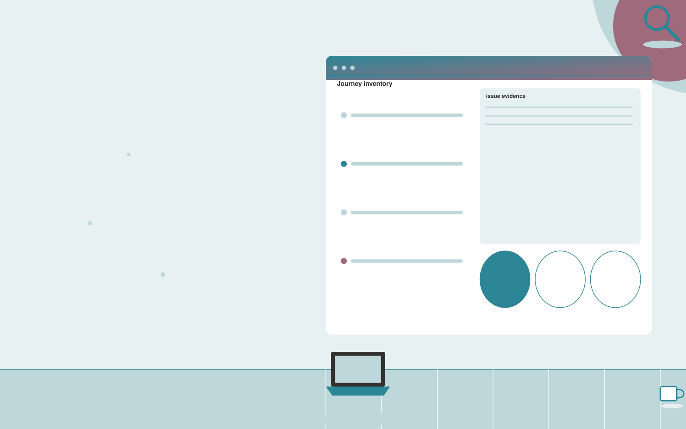

# Accessibility testing service

**IT and Development** · Also fits: Operations; Customer Support

> For web agencies delivering customer sites, turn authorized sites, user journeys and agreed testing criteria into accessibility findings and retest evidence. Address the recurring problem: automated scans miss contextual accessibility problems. The value hypothesis is a more complete, reviewable deliverable with less repeated preparation; the pilot must establish whether that benefit is real.

| | |
|---|---|
| **Buyer** | Web agencies delivering customer sites |
| **Problem** | Automated scans miss contextual accessibility problems. |
| **Format** | Evidence review and quality assurance workspace |
| **USP** | Combines journey-based manual review with reproducible automated findings. |

## The product
Key screens: Journey inventory, issue evidence, fix verification. Open on a review queue ordered by reviewer-selected priorities. Show each finding beside the original evidence and applicable rule. Provide accept, dismiss and needs-information controls with reasons. A separate report view summarizes confirmed findings and unresolved items, not raw AI flags. In this product, the first view is journey inventory, followed by issue evidence and fix verification.

## Core functionality
1. Run automated checks.
2. Inspect keyboard flows.
3. Review semantics.
4. Document user impact.
5. Prioritize fixes.
6. Retest remediations.

## Customer workflow
Agree review criteria, ingest a sample, generate candidate findings, inspect supporting evidence, let reviewers confirm or dismiss each item, assign corrections, and recheck the affected material. Start with authorized sites, user journeys and agreed testing criteria and finish with accessibility findings and retest evidence.

## AI and human review
Propose possible inconsistencies, omissions and rubric matches. Combine extraction with deterministic checks where rules are explicit. Reviewers make the final judgment. Keep false positives and missed cases visible during evaluation.

## Customer inputs
Authorized sites, user journeys and agreed testing criteria

## Customer deliverables
Accessibility findings and retest evidence

## Accounts and administration
Versioned review criteria, evidence links, reviewer decisions, disagreement handling, correction assignments, recheck status and exportable review history.

## MVP scope
Begin with web agencies delivering customer sites and one recurring use case. Build the first two modules: run automated checks; inspect keyboard flows. Provide operator assistance for the third module: review semantics. Deliver accessibility findings and retest evidence through a manual review queue. Perform other necessary full-scope functions manually during the pilot. Include all applicable access, accuracy and professional-review controls from the start.

## After MVP validation
After paid pilots establish value, automate the remaining modules: document user impact; prioritize fixes; retest remediations. Add one validated source integration, reusable customer configuration and recurring delivery. Expand to additional teams, document formats or languages only after testing the new scope.

## Build dependencies
Evidence coordinates, versioned rules, reviewer decisions and a representative reference set. Measure misses as well as confirmed findings before scaling.

## Integrations and data access
Authorized repositories, technical documentation, application APIs and logs. Source repositories, task trackers and report exports. Keep findings as review proposals until authorized owners accept the resulting actions. These are candidate integration categories, not verified supported connectors.

## Defensibility
A domain-specific review rubric and rights-cleared examples of confirmed defects, false alarms and reviewer reasoning. For this idea, build around combines journey-based manual review with reproducible automated findings. This advantage requires execution and accumulated customer trust; the base model alone is not a defensible asset.

## Alternatives and positioning
Manual reviewers, checklists, generic scanning tools and specialist audit services. Differentiate on this specific proposed advantage: combines journey-based manual review with reproducible automated findings. Test it against the buyer's current method on the same task. Competitor coverage and uniqueness have not been established.

## Revenue model and test pricing (USD)
Test USD 500-2,000 for a defined audit sample and report. Offer recurring review priced by reviewed items and specialist hours. Software-only access can follow a reliable reviewed service. All prices require validation.

## Main delivery costs
Document or media processing, model evaluation, expert review, false-positive handling, rechecks and customer-specific rubric calibration.

## Marketing message to test
> Accessibility testing service for web agencies delivering customer sites. Combines journey-based manual review with reproducible automated findings. Demonstrate the claim through an annotated review of a checkout journey.

## Acquisition channels
Web agency partnerships

## Lead magnet
An annotated review of a checkout journey

## First 30 days of marketing
- Week 1: interview five prospective buyers in this segment: web agencies delivering customer sites. Ask to see a recent example of the problem and their current process.
- Week 2: prepare this demonstration using authorized or synthetic material: an annotated review of a checkout journey.
- Week 3: present it through web agency partnerships and seek one narrowly scoped paid pilot.
- Week 4: review verified issues resolved, false alarms, total delivery effort and a concrete renewal decision before increasing scope.

## Paid pilot and validation
Have a qualified reviewer independently assess the same sample. Compare confirmed findings, false alarms and omissions. Repeat on unseen material before agreeing recurring volume. For this idea, use authorized sites, user journeys and agreed testing criteria and evaluate accessibility findings and retest evidence. Agree success thresholds with the buyer before starting; collect a baseline for verified issues resolved, false alarms. A positive signal is payment and repeat use with acceptable quality and delivery cost, not a favorable demo reaction alone.

## Success metrics
Verified issues resolved, false alarms

## Retention and expansion
Offer recurring reviews and rechecks of previously confirmed issues. Expand document or case types after validating the new rubric with qualified reviewers.

## Operating controls and limitations
Protect secrets, customer data and source code. Use controlled environments, technical review and a recoverable deployment process. Validate source access and reviewer availability during the pilot. Maintain customer-level access, data deletion controls and a record of final approvals.

## Brand style (concept)

- Colors: `#277f91` primary · `#c97454` accent · `#e4eff1` surface · `#22201e` ink
- Type: Archivo for headings, Lora for text
- Voice: Technical, direct, no hype
- Demo site: [https://nexibeo.com/ideas/accessibility-testing-service/demo/](https://nexibeo.com/ideas/accessibility-testing-service/demo/)

## Investment indication

Indicative build budget, from MVP to full product. This is a planning range, not a quote; it excludes running costs such as model usage, hosting and reviewer hours. Built with Nexibeo's AI software development factory, most implementations take days to a few weeks of creation time, depending on availability.

| Phase | Scope | Creation time | Indicative budget |
|---|---|---|---|
| MVP | One buyer segment, one recurring use case; first modules: run automated checks; inspect keyboard flows. Manual review in the loop. | 5 days | $8,500 |
| Paid pilot | Accounts, roles, review states, audit trail and the first integration, hardened for two to three paying pilot customers. | 6 days | $10,500 |
| Full product | Remaining modules: document user impact; prioritize fixes; retest remediations. Self-serve onboarding, billing, monitoring and the wider integration set. | 10 days | $14,000 |
| **Total** | | about 4 weeks | **$33,000** |

### Running costs per month (rough indication, untested)

| Stage | Hosting and infrastructure | AI usage | Total per month |
|---|---|---|---|
| MVP and paid pilot (about 3 customers) | $30–$60 | $80–$160 | **$110–$220** |
| Full product (about 50 customers) | $110–$210 | $880–$1,750 | **$990–$1,960** |

**Co-create this project with us:** [contact Nexibeo](https://nexibeo.com/ideas/accessibility-testing-service/#apply) and we build it with you.

## Research status
Concept proposal expanded from the 315-idea conversation. Demand, pricing, differentiation, build scope and integration feasibility are hypotheses, not verified market findings. Category link is inspiration rather than evidence of business viability.

## Credits and next steps

- **Estimation and building this idea:** see the full idea page on [nexibeo.com](https://nexibeo.com/ideas/accessibility-testing-service/) for more detail on estimation, and to co-create and build this idea with Nexibeo.
- **Become an AI-optimized specialist for IT and Development:** [Complete AI Training](https://completeaitraining.com/certification/12b-ai-certification-for-it-and-development-specialists/).
- Field news: [AI news for IT and Development](https://completeaitraining.com/all-ai-news-for-it-and-development/).
