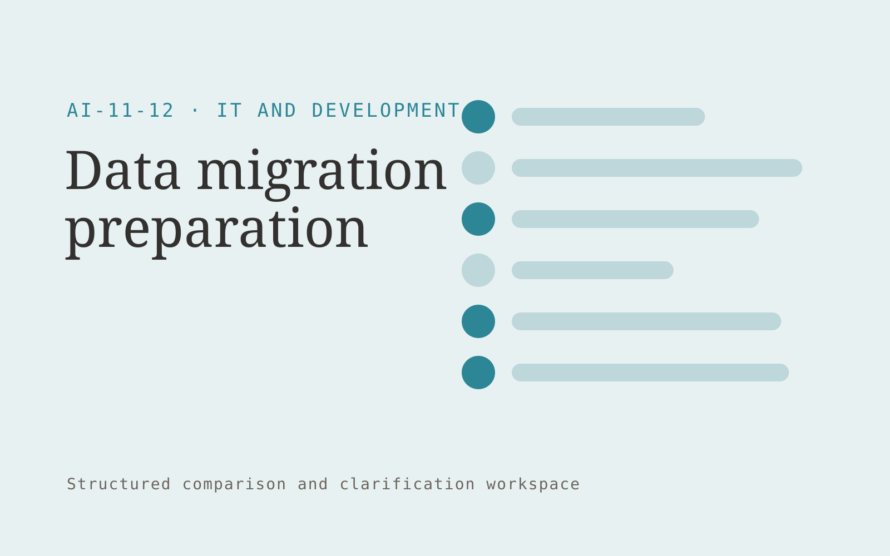

# Data migration preparation

**IT and Development** · Also fits: Operations; Customer Support

> For implementation consultants moving business systems, turn source exports, target schemas and approved transformation rules into approved migration mapping and exception report. Address the recurring problem: bad field mappings cause silent data loss. The value hypothesis is a more complete, reviewable deliverable with less repeated preparation; the pilot must establish whether that benefit is real.

| | |
|---|---|
| **Buyer** | Implementation consultants moving business systems |
| **Problem** | Bad field mappings cause silent data loss. |
| **Format** | Structured comparison and clarification workspace |
| **USP** | Reviewable mappings and preflight reconciliation before any migration writes. |

## The product
Key screens: Mapping matrix, sample preview, validation report. Use a side-by-side matrix with the same fields for every document or option. Clicking a value reveals its original passage. Highlight missing, different and uncertain items separately. Provide a clarification queue and reviewer annotations before exporting a decision pack. In this product, the first view is mapping matrix, followed by sample preview and validation report.

## Core functionality
1. Profile source fields.
2. Propose mappings.
3. Detect invalid values.
4. Preserve identifiers.
5. Test sample transforms.
6. Reconcile record counts.

## Customer workflow
Define comparison fields, upload source versions or offers, extract candidate values, normalize only agreed units, inspect differences, resolve questions with reviewers, and export an evidence-linked comparison. Start with source exports, target schemas and approved transformation rules and finish with approved migration mapping and exception report.

## AI and human review
Align document sections and extract proposed comparable fields. Deterministic checks handle units and arithmetic. Preserve original wording and label assumptions. Professional reviewers assess the meaning and significance of differences.

## Customer inputs
Source exports, target schemas and approved transformation rules

## Customer deliverables
Approved migration mapping and exception report

## Accounts and administration
Document versions, field definitions, source references, reviewer corrections, unresolved questions, comparison history and exportable matrices.

## MVP scope
Begin with implementation consultants moving business systems and one recurring use case. Build the first two modules: profile source fields; propose mappings. Provide operator assistance for the third module: detect invalid values. Deliver approved migration mapping and exception report through a manual review queue. Perform other necessary full-scope functions manually during the pilot. Include all applicable access, accuracy and professional-review controls from the start.

## After MVP validation
After paid pilots establish value, automate the remaining modules: preserve identifiers; test sample transforms; reconcile record counts. Add one validated source integration, reusable customer configuration and recurring delivery. Expand to additional teams, document formats or languages only after testing the new scope.

## Build dependencies
Document alignment, field provenance, unit normalization, missing-value handling and reviewer correction. Similar-looking documents may contain materially different terms.

## Integrations and data access
Authorized repositories, technical documentation, application APIs and logs. Document repositories, procurement or contract records and spreadsheet exports. Preserve originals and avoid writing back interpretations without approval. These are candidate integration categories, not verified supported connectors.

## Defensibility
A niche comparison schema, reviewed extraction examples and clear handling of the differences that matter to a specific buyer. For this idea, build around reviewable mappings and preflight reconciliation before any migration writes. This advantage requires execution and accumulated customer trust; the base model alone is not a defensible asset.

## Alternatives and positioning
Spreadsheet comparisons, professional reviewers, document diff tools and manual quote or contract review. Differentiate on this specific proposed advantage: reviewable mappings and preflight reconciliation before any migration writes. Test it against the buyer's current method on the same task. Competitor coverage and uniqueness have not been established.

## Revenue model and test pricing (USD)
Test USD 300-1,500 for one bounded comparison package, then USD 150-600 monthly for recurring volume with review limits. Complex expert interpretation is separately priced. Figures are hypotheses.

## Main delivery costs
Document parsing, field alignment, source verification, expert interpretation, clarification rounds and changing document formats.

## Marketing message to test
> Data migration preparation for implementation consultants moving business systems. Reviewable mappings and preflight reconciliation before any migration writes. Demonstrate the claim through a migration preflight on sample exports.

## Acquisition channels
Business system implementation partners

## Lead magnet
A migration preflight on sample exports

## First 30 days of marketing
- Week 1: interview five prospective buyers in this segment: implementation consultants moving business systems. Ask to see a recent example of the problem and their current process.
- Week 2: prepare this demonstration using authorized or synthetic material: a migration preflight on sample exports.
- Week 3: present it through business system implementation partners and seek one narrowly scoped paid pilot.
- Week 4: review mapping accuracy, reconciliation differences, total delivery effort and a concrete renewal decision before increasing scope.

## Paid pilot and validation
Compare a known set already reviewed by a domain expert. Check meaningful differences, false alarms and missing fields. Measure reviewer time including corrections rather than extraction speed alone. For this idea, use source exports, target schemas and approved transformation rules and evaluate approved migration mapping and exception report. Agree success thresholds with the buyer before starting; collect a baseline for mapping accuracy, reconciliation differences. A positive signal is payment and repeat use with acceptable quality and delivery cost, not a favorable demo reaction alone.

## Success metrics
Mapping accuracy, reconciliation differences

## Retention and expansion
Save reviewer-approved comparison fields and recurring document formats. Offer repeat comparisons and explicit updates when the source options change.

## Operating controls and limitations
Protect secrets, customer data and source code. Use controlled environments, technical review and a recoverable deployment process. Validate source access and reviewer availability during the pilot. Maintain customer-level access, data deletion controls and a record of final approvals.

## Brand style (concept)

- Colors: `#278a91` primary · `#c98354` accent · `#e4f0f1` surface · `#22201e` ink
- Type: Archivo for headings, Lora for text
- Voice: Technical, direct, no hype
- Demo site: [https://nexibeo.com/ideas/data-migration-preparation/demo/](https://nexibeo.com/ideas/data-migration-preparation/demo/)

## Investment indication

Indicative build budget, from MVP to full product. This is a planning range, not a quote; it excludes running costs such as model usage, hosting and reviewer hours.

| Phase | Scope | Timeline | Indicative budget |
|---|---|---|---|
| MVP | One buyer segment, one recurring use case; first modules: profile source fields; propose mappings. Manual review in the loop. | 5 weeks | $8,500 |
| Paid pilot | Accounts, roles, review states, audit trail and the first integration, hardened for two to three paying pilot customers. | 6 weeks | $10,500 |
| Full product | Remaining modules: preserve identifiers; test sample transforms; reconcile record counts. Self-serve onboarding, billing, monitoring and the wider integration set. | 10 weeks | $14,000 |
| **Total** | | 21 weeks | **$33,000** |

**Co-create this project with us:** [contact Nexibeo](https://nexibeo.com/ideas/data-migration-preparation/#apply) and we build it with you.

## Research status
Concept proposal expanded from the 315-idea conversation. Demand, pricing, differentiation, build scope and integration feasibility are hypotheses, not verified market findings. Category link is inspiration rather than evidence of business viability.

## Credits and next steps

- **Estimation and building this idea:** see the full idea page on [nexibeo.com](https://nexibeo.com/ideas/data-migration-preparation/) for more detail on estimation, and to co-create and build this idea with Nexibeo.
- **Become an AI-optimized specialist for IT and Development:** [Complete AI Training](https://completeaitraining.com/certification/12b-ai-certification-for-it-and-development-specialists/).
- Field news: [AI news for IT and Development](https://completeaitraining.com/all-ai-news-for-it-and-development/).
