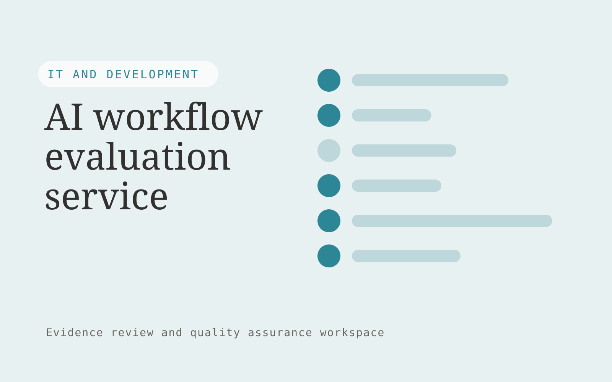

# AI workflow evaluation service

**IT and Development** · Also fits: Operations; Customer Support

> For businesses deploying customer-facing AI assistants, turn representative tasks, reference answers and acceptance criteria into evaluation suite and actionable failure report. Address the recurring problem: teams lack task-specific evidence of assistant reliability. The value hypothesis is a more complete, reviewable deliverable with less repeated preparation; the pilot must establish whether that benefit is real.

| | |
|---|---|
| **Buyer** | Businesses deploying customer-facing AI assistants |
| **Problem** | Teams lack task-specific evidence of assistant reliability. |
| **Format** | Evidence review and quality assurance workspace |
| **USP** | Evaluation centered on completed customer tasks and consequential failures. |

## The product
Key screens: Test set, run comparison, failure evidence. Open on a review queue ordered by reviewer-selected priorities. Show each finding beside the original evidence and applicable rule. Provide accept, dismiss and needs-information controls with reasons. A separate report view summarizes confirmed findings and unresolved items, not raw AI flags. In this product, the first view is test set, followed by run comparison and failure evidence.

## Core functionality
1. Define task rubrics.
2. Create edge cases.
3. Replay evaluations.
4. Inspect source use.
5. Compare versions.
6. Track regressions.

## Customer workflow
Agree review criteria, ingest a sample, generate candidate findings, inspect supporting evidence, let reviewers confirm or dismiss each item, assign corrections, and recheck the affected material. Start with representative tasks, reference answers and acceptance criteria and finish with evaluation suite and actionable failure report.

## AI and human review
Propose possible inconsistencies, omissions and rubric matches. Combine extraction with deterministic checks where rules are explicit. Reviewers make the final judgment. Keep false positives and missed cases visible during evaluation.

## Customer inputs
Representative tasks, reference answers and acceptance criteria

## Customer deliverables
Evaluation suite and actionable failure report

## Accounts and administration
Versioned review criteria, evidence links, reviewer decisions, disagreement handling, correction assignments, recheck status and exportable review history.

## MVP scope
Begin with businesses deploying customer-facing AI assistants and one recurring use case. Build the first two modules: define task rubrics; create edge cases. Provide operator assistance for the third module: replay evaluations. Deliver evaluation suite and actionable failure report through a manual review queue. Perform other necessary full-scope functions manually during the pilot. Include all applicable access, accuracy and professional-review controls from the start.

## After MVP validation
After paid pilots establish value, automate the remaining modules: inspect source use; compare versions; track regressions. Add one validated source integration, reusable customer configuration and recurring delivery. Expand to additional teams, document formats or languages only after testing the new scope.

## Build dependencies
Evidence coordinates, versioned rules, reviewer decisions and a representative reference set. Measure misses as well as confirmed findings before scaling.

## Integrations and data access
Authorized repositories, technical documentation, application APIs and logs. Source repositories, task trackers and report exports. Keep findings as review proposals until authorized owners accept the resulting actions. These are candidate integration categories, not verified supported connectors.

## Defensibility
A domain-specific review rubric and rights-cleared examples of confirmed defects, false alarms and reviewer reasoning. For this idea, build around evaluation centered on completed customer tasks and consequential failures. This advantage requires execution and accumulated customer trust; the base model alone is not a defensible asset.

## Alternatives and positioning
Manual reviewers, checklists, generic scanning tools and specialist audit services. Differentiate on this specific proposed advantage: evaluation centered on completed customer tasks and consequential failures. Test it against the buyer's current method on the same task. Competitor coverage and uniqueness have not been established.

## Revenue model and test pricing (USD)
Test USD 1,000-3,000 for a task-specific evaluation set and reviewed baseline report. Offer recurring release evaluations on a retainer tied to case count and review depth. Prices are hypotheses.

## Main delivery costs
Document or media processing, model evaluation, expert review, false-positive handling, rechecks and customer-specific rubric calibration.

## Marketing message to test
> AI workflow evaluation service for businesses deploying customer-facing AI assistants. Evaluation centered on completed customer tasks and consequential failures. Demonstrate the claim through a task-specific assistant evaluation report.

## Acquisition channels
AI implementation agencies

## Lead magnet
A task-specific assistant evaluation report

## First 30 days of marketing
- Week 1: interview five prospective buyers in this segment: businesses deploying customer-facing AI assistants. Ask to see a recent example of the problem and their current process.
- Week 2: prepare this demonstration using authorized or synthetic material: a task-specific assistant evaluation report.
- Week 3: present it through AI implementation agencies and seek one narrowly scoped paid pilot.
- Week 4: review accepted task success, regression detection, total delivery effort and a concrete renewal decision before increasing scope.

## Paid pilot and validation
Have a qualified reviewer independently assess the same sample. Compare confirmed findings, false alarms and omissions. Repeat on unseen material before agreeing recurring volume. For this idea, use representative tasks, reference answers and acceptance criteria and evaluate evaluation suite and actionable failure report. Agree success thresholds with the buyer before starting; collect a baseline for accepted task success, regression detection. A positive signal is payment and repeat use with acceptable quality and delivery cost, not a favorable demo reaction alone.

## Success metrics
Accepted task success, regression detection

## Retention and expansion
Offer recurring reviews and rechecks of previously confirmed issues. Expand document or case types after validating the new rubric with qualified reviewers.

## Operating controls and limitations
Protect secrets, customer data and source code. Use controlled environments, technical review and a recoverable deployment process. Validate source access and reviewer availability during the pilot. Maintain customer-level access, data deletion controls and a record of final approvals.

## Brand style (concept)

- Colors: `#27918d` primary · `#c95466` accent · `#e4f1f0` surface · `#22201e` ink
- Type: Archivo for headings, Lora for text
- Voice: Technical, direct, no hype
- Demo site: [https://nexibeo.com/solutions/ai-workflow-evaluation-service/demo/](https://nexibeo.com/solutions/ai-workflow-evaluation-service/demo/)

## Investment indication

Indicative build budget, from MVP to full product. This is a planning range, not a quote; it excludes running costs such as model usage, hosting and reviewer hours. Built with Nexibeo's AI software development factory, most implementations take days to a few weeks of creation time, depending on availability.

| Phase | Scope | Creation time | Indicative budget |
|---|---|---|---|
| MVP | One buyer segment, one recurring use case; first modules: define task rubrics; create edge cases. Manual review in the loop. | 5 days | $8,500 |
| Paid pilot | Accounts, roles, review states, audit trail and the first integration, hardened for two to three paying pilot customers. | 6 days | $10,500 |
| Full product | Remaining modules: inspect source use; compare versions; track regressions. Self-serve onboarding, billing, monitoring and the wider integration set. | 10 days | $14,000 |
| **Total** | | about 4 weeks | **$33,000** |

### Running costs per month (rough indication, untested)

| Stage | Hosting and infrastructure | AI usage | Total per month |
|---|---|---|---|
| MVP and paid pilot (about 3 customers) | $30–$60 | $80–$160 | **$110–$220** |
| Full product (about 50 customers) | $110–$210 | $880–$1,750 | **$990–$1,960** |

**Get this built:** [contact Nexibeo](https://nexibeo.com/solutions/ai-workflow-evaluation-service/#apply). We build it with our AI software factory, usually in days to a few weeks, for you to run internally or offer to your clients.

## Research status
Concept proposal expanded from the 315-idea conversation. Demand, pricing, differentiation, build scope and integration feasibility are hypotheses, not verified market findings. Category link is inspiration rather than evidence of business viability.

## Credits and next steps

- **Estimation and having it built:** see the full solution page on [nexibeo.com](https://nexibeo.com/solutions/ai-workflow-evaluation-service/) for more detail on estimation. Nexibeo builds it for you as a custom AI implementation, to run internally or to offer to your own clients.
- **Become an AI-optimized specialist for IT and Development:** [Complete AI Training](https://completeaitraining.com/certification/12b-ai-certification-for-it-and-development-specialists/).
- Field news: [AI news for IT and Development](https://completeaitraining.com/all-ai-news-for-it-and-development/).
