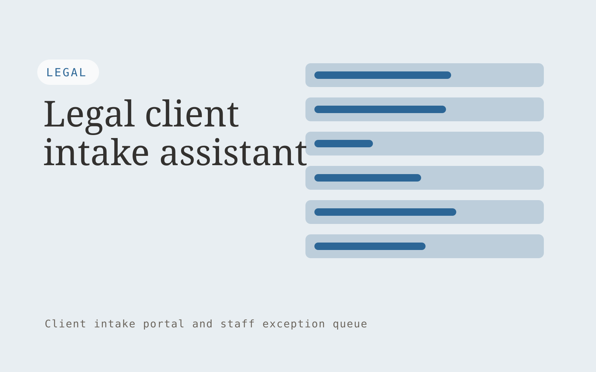

# Legal client intake assistant

**Legal** · Also fits: Operations; Management; Customer Support

> For small law firms handling routine commercial matters, turn firm-approved intake questions and client uploads into lawyer-ready intake brief. Address the recurring problem: consultations begin with incomplete facts and documents. The value hypothesis is a more complete, reviewable deliverable with less repeated preparation; the pilot must establish whether that benefit is real.

| | |
|---|---|
| **Buyer** | Small law firms handling routine commercial matters |
| **Problem** | Consultations begin with incomplete facts and documents. |
| **Format** | Client intake portal and staff exception queue |
| **USP** | Practice-specific intake that preserves client statements and professional boundaries. |

## The product
Key screens: Client questionnaire, document checklist, lawyer queue. Give submitters a mobile-friendly step-by-step form with document uploads and a visible completeness checklist. Staff see a queue with missing items and extracted fields. Place the original document beside each uncertain value. Show submitted, clarification required and ready-for-review states. In this product, the first view is client questionnaire, followed by document checklist and lawyer queue.

## Core functionality
1. Collect declared facts.
2. Organize uploads.
3. Flag missing details.
4. Detect date inconsistencies.
5. Route matter types.
6. Prepare consultation briefs.

## Customer workflow
Choose the request type, collect declared facts and required documents, extract relevant fields, show missing or inconsistent information, let the submitter correct it, and route the complete package to an authorized reviewer. Start with firm-approved intake questions and client uploads and finish with lawyer-ready intake brief.

## AI and human review
Classify submitted material, extract candidate fields and draft clarification questions. Deterministic rules test required fields and formats. Keep uncertain extraction visible and preserve the original statement. Do not infer missing material facts.

## Customer inputs
Firm-approved intake questions and client uploads

## Customer deliverables
Lawyer-ready intake brief

## Accounts and administration
Secure uploads, configurable checklists, progress saving, duplicate handling, reviewer assignments, clarification threads, deadlines and submission history.

## MVP scope
Begin with small law firms handling routine commercial matters and one recurring use case. Build the first two modules: collect declared facts; organize uploads. Provide operator assistance for the third module: flag missing details. Deliver lawyer-ready intake brief through a manual review queue. Perform other necessary full-scope functions manually during the pilot. Include all applicable access, accuracy and professional-review controls from the start.

## After MVP validation
After paid pilots establish value, automate the remaining modules: detect date inconsistencies; route matter types; prepare consultation briefs. Add one validated source integration, reusable customer configuration and recurring delivery. Expand to additional teams, document formats or languages only after testing the new scope.

## Build dependencies
Secure upload handling, reliable extraction, versioned completeness rules, submitter identity and staff routing. Third-party checklist changes require maintenance.

## Integrations and data access
Authorized matter files, firm templates and approved legal knowledge collections. Case management, customer records, document storage and notification systems. Begin with an exportable review pack before automating destination writes. These are candidate integration categories, not verified supported connectors.

## Defensibility
Document-type expertise, tested completeness rules and a low-friction client experience embedded in a repeat administrative process. For this idea, build around practice-specific intake that preserves client statements and professional boundaries. This advantage requires execution and accumulated customer trust; the base model alone is not a defensible asset.

## Alternatives and positioning
Email collection, generic web forms, spreadsheets and existing case management systems. Differentiate on this specific proposed advantage: practice-specific intake that preserves client statements and professional boundaries. Test it against the buyer's current method on the same task. Competitor coverage and uniqueness have not been established.

## Revenue model and test pricing (USD)
Test USD 500-2,000 setup plus USD 150-750 monthly for one form family and a capped submission volume. Quote specialist review and unusual document formats separately. Prices are experimental.

## Main delivery costs
Document processing, storage, exception review, support, checklist maintenance and customer-specific integration work.

## Marketing message to test
> Legal client intake assistant for small law firms handling routine commercial matters. Practice-specific intake that preserves client statements and professional boundaries. Demonstrate the claim through a branded intake flow for one matter type.

## Acquisition channels
Legal practice advisers

## Lead magnet
A branded intake flow for one matter type

## First 30 days of marketing
- Week 1: interview five prospective buyers in this segment: small law firms handling routine commercial matters. Ask to see a recent example of the problem and their current process.
- Week 2: prepare this demonstration using authorized or synthetic material: a branded intake flow for one matter type.
- Week 3: present it through legal practice advisers and seek one narrowly scoped paid pilot.
- Week 4: review complete intake rate, preparation time, total delivery effort and a concrete renewal decision before increasing scope.

## Paid pilot and validation
Process a bounded set of historical and new submissions. Include missing, duplicate and unreadable documents. Compare complete submissions and clarification effort with the current intake method. For this idea, use firm-approved intake questions and client uploads and evaluate lawyer-ready intake brief. Agree success thresholds with the buyer before starting; collect a baseline for complete intake rate, preparation time. A positive signal is payment and repeat use with acceptable quality and delivery cost, not a favorable demo reaction alone.

## Success metrics
Complete intake rate, preparation time

## Retention and expansion
Review incomplete submissions and simplify recurring friction. Expand to another form or document family after the first workflow reliably produces review-ready cases.

## Operating controls and limitations
Preserve matter confidentiality, access boundaries and original evidence. Qualified professionals review legal interpretations and final client documents. Validate source access and reviewer availability during the pilot. Maintain customer-level access, data deletion controls and a record of final approvals.

## Brand style (concept)

- Colors: `#277591` primary · `#c97d54` accent · `#e4edf1` surface · `#22201e` ink
- Type: Space Grotesk for headings, Inter for text
- Voice: Precise, measured, defensible
- Demo site: [https://nexibeo.com/ideas/legal-client-intake-assistant/demo/](https://nexibeo.com/ideas/legal-client-intake-assistant/demo/)

## Investment indication

Indicative build budget, from MVP to full product. This is a planning range, not a quote; it excludes running costs such as model usage, hosting and reviewer hours.

| Phase | Scope | Timeline | Indicative budget |
|---|---|---|---|
| MVP | One buyer segment, one recurring use case; first modules: collect declared facts; organize uploads. Manual review in the loop. | 5 weeks | $10,500 |
| Paid pilot | Accounts, roles, review states, audit trail and the first integration, hardened for two to three paying pilot customers. | 7 weeks | $13,500 |
| Full product | Remaining modules: detect date inconsistencies; route matter types; prepare consultation briefs. Self-serve onboarding, billing, monitoring and the wider integration set. | 12 weeks | $19,000 |
| **Total** | | 24 weeks | **$43,000** |

**Co-create this project with us:** [contact Nexibeo](https://nexibeo.com/ideas/legal-client-intake-assistant/#apply) and we build it with you.

## Research status
Concept proposal expanded from the 315-idea conversation. Demand, pricing, differentiation, build scope and integration feasibility are hypotheses, not verified market findings. Category link is inspiration rather than evidence of business viability.

## Credits and next steps

- **Estimation and building this idea:** see the full idea page on [nexibeo.com](https://nexibeo.com/ideas/legal-client-intake-assistant/) for more detail on estimation, and to co-create and build this idea with Nexibeo.
- **Become an AI-optimized specialist for Legal:** [Complete AI Training](https://completeaitraining.com/certification/12b-ai-certification-for-legal-specialists/).
- Field news: [AI news for Legal](https://completeaitraining.com/all-ai-news-for-legal/).
