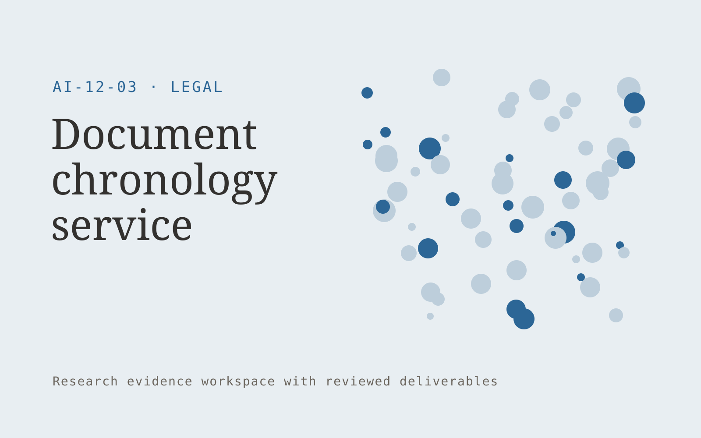

# Document chronology service

**Legal** · Also fits: Operations; Management; Science and Research

> For litigation teams reviewing large record sets, turn authorized case documents and event definitions into reviewed chronology with document references. Address the recurring problem: constructing a defensible event timeline requires extensive reading. The value hypothesis is a more complete, reviewable deliverable with less repeated preparation; the pilot must establish whether that benefit is real.

| | |
|---|---|
| **Buyer** | Litigation teams reviewing large record sets |
| **Problem** | Constructing a defensible event timeline requires extensive reading. |
| **Format** | Research evidence workspace with reviewed deliverables |
| **USP** | Every event remains traceable to its source and date interpretation. |

## The product
Key screens: Document explorer, dated timeline, evidence review. Organize work by research question. Show a source library, an evidence matrix and a draft findings panel with linked quotations. Keep contradictory findings and unanswered questions visible. Allow reviewers to inspect the original context before accepting an interpretation. In this product, the first view is document explorer, followed by dated timeline and evidence review.

## Core functionality
1. Extract candidate events.
2. Distinguish document and event dates.
3. Link passages.
4. Flag date ambiguity.
5. Merge duplicates.
6. Export reviewed timelines.

## Customer workflow
Agree the decision and research questions, define permitted sources or participants, collect evidence, code findings, compare supporting and contradictory material, review interpretations, and deliver a cited brief with next questions. Start with authorized case documents and event definitions and finish with reviewed chronology with document references.

## AI and human review
Assist with retrieval, transcription, structured extraction and thematic synthesis. Preserve source passages and methodological context. Human researchers validate inclusion, quotations and conclusions. Use real participants when customer research is required.

## Customer inputs
Authorized case documents and event definitions

## Customer deliverables
Reviewed chronology with document references

## Accounts and administration
Source provenance, participant consent where applicable, research questions, coding definitions, reviewer disagreements, citations and versioned conclusions.

## MVP scope
Begin with litigation teams reviewing large record sets and one recurring use case. Build the first two modules: extract candidate events; distinguish document and event dates. Provide operator assistance for the third module: link passages. Deliver reviewed chronology with document references through a manual review queue. Perform other necessary full-scope functions manually during the pilot. Include all applicable access, accuracy and professional-review controls from the start.

## After MVP validation
After paid pilots establish value, automate the remaining modules: flag date ambiguity; merge duplicates; export reviewed timelines. Add one validated source integration, reusable customer configuration and recurring delivery. Expand to additional teams, document formats or languages only after testing the new scope.

## Build dependencies
A clear research protocol, source access, citation tracking and qualified interpretation. Interview work also needs relevant participants and consent management.

## Integrations and data access
Authorized matter files, firm templates and approved legal knowledge collections. Permitted research libraries, interview recording imports, citation exports and document editors. Preserve original source metadata throughout the workflow. These are candidate integration categories, not verified supported connectors.

## Defensibility
Niche research protocols, credible researcher relationships and a rights-cleared evidence archive with consistent interpretation methods. For this idea, build around every event remains traceable to its source and date interpretation. This advantage requires execution and accumulated customer trust; the base model alone is not a defensible asset.

## Alternatives and positioning
Research consultants, internal analysts, literature databases and general search or summarization tools. Differentiate on this specific proposed advantage: every event remains traceable to its source and date interpretation. Test it against the buyer's current method on the same task. Competitor coverage and uniqueness have not been established.

## Revenue model and test pricing (USD)
Test USD 750-3,000 for one tightly bounded research question and evidence pack. Participant recruitment, specialist review and licensed data are separately scoped. Repeat tracking can become a retainer. Prices are hypotheses.

## Main delivery costs
Researcher time, source access, participant recruitment, transcription, evidence coding, expert review and report revisions.

## Marketing message to test
> Document chronology service for litigation teams reviewing large record sets. Every event remains traceable to its source and date interpretation. Demonstrate the claim through an evidence-linked sample chronology.

## Acquisition channels
Litigation support providers

## Lead magnet
An evidence-linked sample chronology

## First 30 days of marketing
- Week 1: interview five prospective buyers in this segment: litigation teams reviewing large record sets. Ask to see a recent example of the problem and their current process.
- Week 2: prepare this demonstration using authorized or synthetic material: an evidence-linked sample chronology.
- Week 3: present it through litigation support providers and seek one narrowly scoped paid pilot.
- Week 4: review verified event accuracy, reviewer hours, total delivery effort and a concrete renewal decision before increasing scope.

## Paid pilot and validation
Answer one practical question using a bounded evidence set. Ask a domain expert to review citations and reasoning, identify contrary evidence and assess whether the deliverable supports the intended decision. For this idea, use authorized case documents and event definitions and evaluate reviewed chronology with document references. Agree success thresholds with the buyer before starting; collect a baseline for verified event accuracy, reviewer hours. A positive signal is payment and repeat use with acceptable quality and delivery cost, not a favorable demo reaction alone.

## Success metrics
Verified event accuracy, reviewer hours

## Retention and expansion
Maintain the research question and evidence archive, offer follow-up studies and refresh important sources. Build repeat work around the buyer’s decision cycle.

## Operating controls and limitations
Preserve matter confidentiality, access boundaries and original evidence. Qualified professionals review legal interpretations and final client documents. Validate source access and reviewer availability during the pilot. Maintain customer-level access, data deletion controls and a record of final approvals.

## Brand style (concept)

- Colors: `#276591` primary · `#c99c54` accent · `#e4ecf1` surface · `#22201e` ink
- Type: Space Grotesk for headings, Inter for text
- Voice: Precise, measured, defensible
- Demo site: [https://nexibeo.com/ideas/document-chronology-service/demo/](https://nexibeo.com/ideas/document-chronology-service/demo/)

## Investment indication

Indicative build budget, from MVP to full product. This is a planning range, not a quote; it excludes running costs such as model usage, hosting and reviewer hours.

| Phase | Scope | Timeline | Indicative budget |
|---|---|---|---|
| MVP | One buyer segment, one recurring use case; first modules: extract candidate events; distinguish document and event dates. Manual review in the loop. | 5 weeks | $10,500 |
| Paid pilot | Accounts, roles, review states, audit trail and the first integration, hardened for two to three paying pilot customers. | 7 weeks | $13,500 |
| Full product | Remaining modules: flag date ambiguity; merge duplicates; export reviewed timelines. Self-serve onboarding, billing, monitoring and the wider integration set. | 12 weeks | $19,000 |
| **Total** | | 24 weeks | **$43,000** |

### Running costs per month (rough indication, untested)

| Stage | Hosting and infrastructure | AI usage | Total per month |
|---|---|---|---|
| MVP and paid pilot (about 3 customers) | $50–$100 | $80–$160 | **$130–$260** |
| Full product (about 50 customers) | $190–$380 | $880–$1,750 | **$1,070–$2,130** |

**Co-create this project with us:** [contact Nexibeo](https://nexibeo.com/ideas/document-chronology-service/#apply) and we build it with you.

## Research status
Concept proposal expanded from the 315-idea conversation. Demand, pricing, differentiation, build scope and integration feasibility are hypotheses, not verified market findings. Category link is inspiration rather than evidence of business viability.

## Credits and next steps

- **Estimation and building this idea:** see the full idea page on [nexibeo.com](https://nexibeo.com/ideas/document-chronology-service/) for more detail on estimation, and to co-create and build this idea with Nexibeo.
- **Become an AI-optimized specialist for Legal:** [Complete AI Training](https://completeaitraining.com/certification/12b-ai-certification-for-legal-specialists/).
- Field news: [AI news for Legal](https://completeaitraining.com/all-ai-news-for-legal/).
