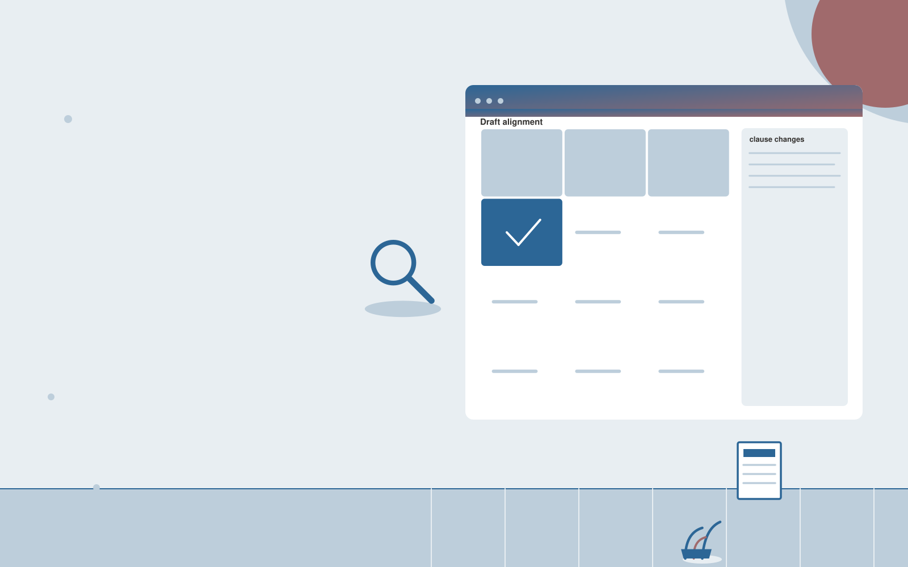

# Contract comparison workspace

**Legal** · Also fits: Operations; Management

> For commercial lawyers reviewing negotiated drafts, turn contract versions and clause taxonomy into annotated contract comparison. Address the recurring problem: meaningful changes are buried in formatting and renumbering. The value hypothesis is a more complete, reviewable deliverable with less repeated preparation; the pilot must establish whether that benefit is real.

| | |
|---|---|
| **Buyer** | Commercial lawyers reviewing negotiated drafts |
| **Problem** | Meaningful changes are buried in formatting and renumbering. |
| **Format** | Structured comparison and clarification workspace |
| **USP** | Clause-aware comparison across renumbered drafts. |

## The product
Key screens: Draft alignment, clause changes, reviewer notes. Use a side-by-side matrix with the same fields for every document or option. Clicking a value reveals its original passage. Highlight missing, different and uncertain items separately. Provide a clarification queue and reviewer annotations before exporting a decision pack. In this product, the first view is draft alignment, followed by clause changes and reviewer notes.

## Core functionality
1. Align clauses.
2. Detect moved sections.
3. Isolate wording changes.
4. Preserve originals.
5. Group changes by topic.
6. Export review annotations.

## Customer workflow
Define comparison fields, upload source versions or offers, extract candidate values, normalize only agreed units, inspect differences, resolve questions with reviewers, and export an evidence-linked comparison. Start with contract versions and clause taxonomy and finish with annotated contract comparison.

## AI and human review
Align document sections and extract proposed comparable fields. Deterministic checks handle units and arithmetic. Preserve original wording and label assumptions. Professional reviewers assess the meaning and significance of differences.

## Customer inputs
Contract versions and clause taxonomy

## Customer deliverables
Annotated contract comparison

## Accounts and administration
Document versions, field definitions, source references, reviewer corrections, unresolved questions, comparison history and exportable matrices.

## MVP scope
Begin with commercial lawyers reviewing negotiated drafts and one recurring use case. Build the first two modules: align clauses; detect moved sections. Provide operator assistance for the third module: isolate wording changes. Deliver annotated contract comparison through a manual review queue. Perform other necessary full-scope functions manually during the pilot. Include all applicable access, accuracy and professional-review controls from the start.

## After MVP validation
After paid pilots establish value, automate the remaining modules: preserve originals; group changes by topic; export review annotations. Add one validated source integration, reusable customer configuration and recurring delivery. Expand to additional teams, document formats or languages only after testing the new scope.

## Build dependencies
Document alignment, field provenance, unit normalization, missing-value handling and reviewer correction. Similar-looking documents may contain materially different terms.

## Integrations and data access
Authorized matter files, firm templates and approved legal knowledge collections. Document repositories, procurement or contract records and spreadsheet exports. Preserve originals and avoid writing back interpretations without approval. These are candidate integration categories, not verified supported connectors.

## Defensibility
A niche comparison schema, reviewed extraction examples and clear handling of the differences that matter to a specific buyer. For this idea, build around clause-aware comparison across renumbered drafts. This advantage requires execution and accumulated customer trust; the base model alone is not a defensible asset.

## Alternatives and positioning
Spreadsheet comparisons, professional reviewers, document diff tools and manual quote or contract review. Differentiate on this specific proposed advantage: clause-aware comparison across renumbered drafts. Test it against the buyer's current method on the same task. Competitor coverage and uniqueness have not been established.

## Revenue model and test pricing (USD)
Test USD 300-1,500 for one bounded comparison package, then USD 150-600 monthly for recurring volume with review limits. Complex expert interpretation is separately priced. Figures are hypotheses.

## Main delivery costs
Document parsing, field alignment, source verification, expert interpretation, clarification rounds and changing document formats.

## Marketing message to test
> Contract comparison workspace for commercial lawyers reviewing negotiated drafts. Clause-aware comparison across renumbered drafts. Demonstrate the claim through a comparison demonstrating moved and edited clauses.

## Acquisition channels
Legal technology consultants

## Lead magnet
A comparison demonstrating moved and edited clauses

## First 30 days of marketing
- Week 1: interview five prospective buyers in this segment: commercial lawyers reviewing negotiated drafts. Ask to see a recent example of the problem and their current process.
- Week 2: prepare this demonstration using authorized or synthetic material: a comparison demonstrating moved and edited clauses.
- Week 3: present it through legal technology consultants and seek one narrowly scoped paid pilot.
- Week 4: review useful change detection, false alarms, total delivery effort and a concrete renewal decision before increasing scope.

## Paid pilot and validation
Compare a known set already reviewed by a domain expert. Check meaningful differences, false alarms and missing fields. Measure reviewer time including corrections rather than extraction speed alone. For this idea, use contract versions and clause taxonomy and evaluate annotated contract comparison. Agree success thresholds with the buyer before starting; collect a baseline for useful change detection, false alarms. A positive signal is payment and repeat use with acceptable quality and delivery cost, not a favorable demo reaction alone.

## Success metrics
Useful change detection, false alarms

## Retention and expansion
Save reviewer-approved comparison fields and recurring document formats. Offer repeat comparisons and explicit updates when the source options change.

## Operating controls and limitations
Preserve matter confidentiality, access boundaries and original evidence. Qualified professionals review legal interpretations and final client documents. Validate source access and reviewer availability during the pilot. Maintain customer-level access, data deletion controls and a record of final approvals.

## Brand style (concept)

- Colors: `#275591` primary · `#c9ba54` accent · `#e4eaf1` surface · `#22201e` ink
- Type: Space Grotesk for headings, Inter for text
- Voice: Precise, measured, defensible
- Demo site: [https://nexibeo.com/ideas/contract-comparison-workspace/demo/](https://nexibeo.com/ideas/contract-comparison-workspace/demo/)

## Investment indication

Indicative build budget, from MVP to full product. This is a planning range, not a quote; it excludes running costs such as model usage, hosting and reviewer hours. Built with Nexibeo's AI software development factory, most implementations take days to a few weeks of creation time, depending on availability.

| Phase | Scope | Creation time | Indicative budget |
|---|---|---|---|
| MVP | One buyer segment, one recurring use case; first modules: align clauses; detect moved sections. Manual review in the loop. | 6 days | $10,000 |
| Paid pilot | Accounts, roles, review states, audit trail and the first integration, hardened for two to three paying pilot customers. | 7 days | $13,000 |
| Full product | Remaining modules: preserve originals; group changes by topic; export review annotations. Self-serve onboarding, billing, monitoring and the wider integration set. | 2 weeks | $18,000 |
| **Total** | | about 5 weeks | **$41,000** |

### Running costs per month (rough indication, untested)

| Stage | Hosting and infrastructure | AI usage | Total per month |
|---|---|---|---|
| MVP and paid pilot (about 3 customers) | $50–$100 | $50–$100 | **$100–$200** |
| Full product (about 50 customers) | $190–$380 | $350–$700 | **$540–$1,080** |

**Co-create this project with us:** [contact Nexibeo](https://nexibeo.com/ideas/contract-comparison-workspace/#apply) and we build it with you.

## Research status
Concept proposal expanded from the 315-idea conversation. Demand, pricing, differentiation, build scope and integration feasibility are hypotheses, not verified market findings. Category link is inspiration rather than evidence of business viability.

## Credits and next steps

- **Estimation and building this idea:** see the full idea page on [nexibeo.com](https://nexibeo.com/ideas/contract-comparison-workspace/) for more detail on estimation, and to co-create and build this idea with Nexibeo.
- **Become an AI-optimized specialist for Legal:** [Complete AI Training](https://completeaitraining.com/certification/12b-ai-certification-for-legal-specialists/).
- Field news: [AI news for Legal](https://completeaitraining.com/all-ai-news-for-legal/).
