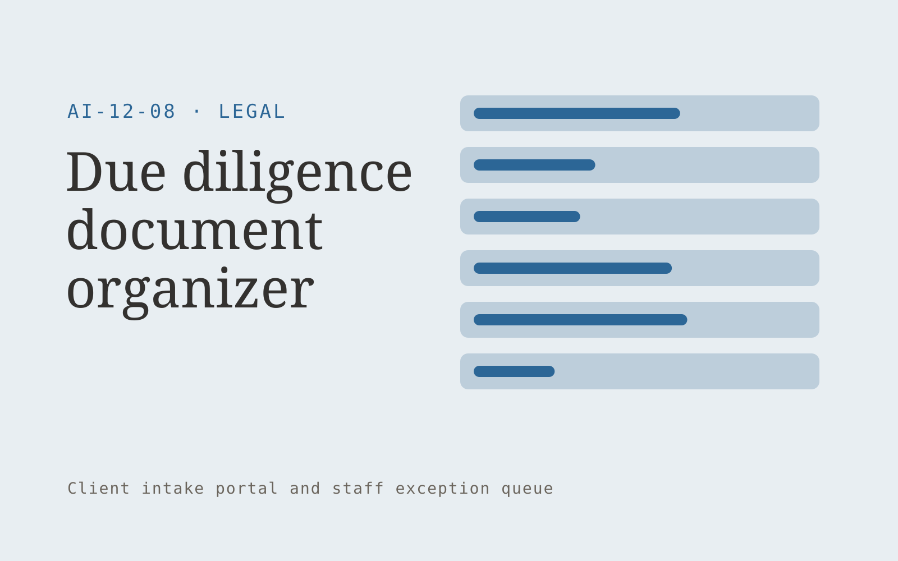

# Due diligence document organizer

**Legal** · Also fits: Operations; Management; Customer Support

> For transactional legal teams, turn diligence request lists and authorized document rooms into diligence index and open request list. Address the recurring problem: requested documents arrive without consistent indexing or completeness. The value hypothesis is a more complete, reviewable deliverable with less repeated preparation; the pilot must establish whether that benefit is real.

| | |
|---|---|
| **Buyer** | Transactional legal teams |
| **Problem** | Requested documents arrive without consistent indexing or completeness. |
| **Format** | Client intake portal and staff exception queue |
| **USP** | Request-level coverage with visible gaps and source document links. |

## The product
Key screens: Request matrix, document index, missing evidence. Give submitters a mobile-friendly step-by-step form with document uploads and a visible completeness checklist. Staff see a queue with missing items and extracted fields. Place the original document beside each uncertain value. Show submitted, clarification required and ready-for-review states. In this product, the first view is request matrix, followed by document index and missing evidence.

## Core functionality
1. Classify supplied records.
2. Map request coverage.
3. Detect duplicates.
4. Flag missing periods.
5. Maintain file versions.
6. Export review indexes.

## Customer workflow
Choose the request type, collect declared facts and required documents, extract relevant fields, show missing or inconsistent information, let the submitter correct it, and route the complete package to an authorized reviewer. Start with diligence request lists and authorized document rooms and finish with diligence index and open request list.

## AI and human review
Classify submitted material, extract candidate fields and draft clarification questions. Deterministic rules test required fields and formats. Keep uncertain extraction visible and preserve the original statement. Do not infer missing material facts.

## Customer inputs
Diligence request lists and authorized document rooms

## Customer deliverables
Diligence index and open request list

## Accounts and administration
Secure uploads, configurable checklists, progress saving, duplicate handling, reviewer assignments, clarification threads, deadlines and submission history.

## MVP scope
Begin with transactional legal teams and one recurring use case. Build the first two modules: classify supplied records; map request coverage. Provide operator assistance for the third module: detect duplicates. Deliver diligence index and open request list through a manual review queue. Perform other necessary full-scope functions manually during the pilot. Include all applicable access, accuracy and professional-review controls from the start.

## After MVP validation
After paid pilots establish value, automate the remaining modules: flag missing periods; maintain file versions; export review indexes. Add one validated source integration, reusable customer configuration and recurring delivery. Expand to additional teams, document formats or languages only after testing the new scope.

## Build dependencies
Secure upload handling, reliable extraction, versioned completeness rules, submitter identity and staff routing. Third-party checklist changes require maintenance.

## Integrations and data access
Authorized matter files, firm templates and approved legal knowledge collections. Case management, customer records, document storage and notification systems. Begin with an exportable review pack before automating destination writes. These are candidate integration categories, not verified supported connectors.

## Defensibility
Document-type expertise, tested completeness rules and a low-friction client experience embedded in a repeat administrative process. For this idea, build around request-level coverage with visible gaps and source document links. This advantage requires execution and accumulated customer trust; the base model alone is not a defensible asset.

## Alternatives and positioning
Email collection, generic web forms, spreadsheets and existing case management systems. Differentiate on this specific proposed advantage: request-level coverage with visible gaps and source document links. Test it against the buyer's current method on the same task. Competitor coverage and uniqueness have not been established.

## Revenue model and test pricing (USD)
Test USD 500-2,000 setup plus USD 150-750 monthly for one form family and a capped submission volume. Quote specialist review and unusual document formats separately. Prices are experimental.

## Main delivery costs
Document processing, storage, exception review, support, checklist maintenance and customer-specific integration work.

## Marketing message to test
> Due diligence document organizer for transactional legal teams. Request-level coverage with visible gaps and source document links. Demonstrate the claim through a diligence request coverage demonstration.

## Acquisition channels
Transaction advisory partners

## Lead magnet
A diligence request coverage demonstration

## First 30 days of marketing
- Week 1: interview five prospective buyers in this segment: transactional legal teams. Ask to see a recent example of the problem and their current process.
- Week 2: prepare this demonstration using authorized or synthetic material: a diligence request coverage demonstration.
- Week 3: present it through transaction advisory partners and seek one narrowly scoped paid pilot.
- Week 4: review correct mappings, missing items resolved, total delivery effort and a concrete renewal decision before increasing scope.

## Paid pilot and validation
Process a bounded set of historical and new submissions. Include missing, duplicate and unreadable documents. Compare complete submissions and clarification effort with the current intake method. For this idea, use diligence request lists and authorized document rooms and evaluate diligence index and open request list. Agree success thresholds with the buyer before starting; collect a baseline for correct mappings, missing items resolved. A positive signal is payment and repeat use with acceptable quality and delivery cost, not a favorable demo reaction alone.

## Success metrics
Correct mappings, missing items resolved

## Retention and expansion
Review incomplete submissions and simplify recurring friction. Expand to another form or document family after the first workflow reliably produces review-ready cases.

## Operating controls and limitations
Preserve matter confidentiality, access boundaries and original evidence. Qualified professionals review legal interpretations and final client documents. Validate source access and reviewer availability during the pilot. Maintain customer-level access, data deletion controls and a record of final approvals.

## Brand style (concept)

- Colors: `#276a91` primary · `#c98954` accent · `#e4ecf1` surface · `#22201e` ink
- Type: Playfair Display for headings, Source Sans 3 for text
- Voice: Precise, measured, defensible
- Demo site: [https://nexibeo.com/solutions/due-diligence-document-organizer/demo/](https://nexibeo.com/solutions/due-diligence-document-organizer/demo/)

## Investment indication

Indicative build budget, from MVP to full product. This is a planning range, not a quote; it excludes running costs such as model usage, hosting and reviewer hours. Built with Nexibeo's AI software development factory, most implementations take days to a few weeks of creation time, depending on availability.

| Phase | Scope | Creation time | Indicative budget |
|---|---|---|---|
| MVP | One buyer segment, one recurring use case; first modules: classify supplied records; map request coverage. Manual review in the loop. | 6 days | $10,500 |
| Paid pilot | Accounts, roles, review states, audit trail and the first integration, hardened for two to three paying pilot customers. | 7 days | $14,000 |
| Full product | Remaining modules: flag missing periods; maintain file versions; export review indexes. Self-serve onboarding, billing, monitoring and the wider integration set. | 3 weeks | $19,000 |
| **Total** | | about 5 weeks | **$43,500** |

### Running costs per month (rough indication, untested)

| Stage | Hosting and infrastructure | AI usage | Total per month |
|---|---|---|---|
| MVP and paid pilot (about 3 customers) | $50–$100 | $40–$90 | **$90–$190** |
| Full product (about 50 customers) | $190–$380 | $280–$560 | **$470–$940** |

**Get this built:** [contact Nexibeo](https://nexibeo.com/solutions/due-diligence-document-organizer/#apply). We build it with our AI software factory, usually in days to a few weeks, for you to run internally or offer to your clients.

## Research status
Concept proposal expanded from the 315-idea conversation. Demand, pricing, differentiation, build scope and integration feasibility are hypotheses, not verified market findings. Category link is inspiration rather than evidence of business viability.

## Credits and next steps

- **Estimation and having it built:** see the full solution page on [nexibeo.com](https://nexibeo.com/solutions/due-diligence-document-organizer/) for more detail on estimation. Nexibeo builds it for you as a custom AI implementation, to run internally or to offer to your own clients.
- **Become an AI-optimized specialist for Legal:** [Complete AI Training](https://completeaitraining.com/certification/12b-ai-certification-for-legal-specialists/).
- Field news: [AI news for Legal](https://completeaitraining.com/all-ai-news-for-legal/).
