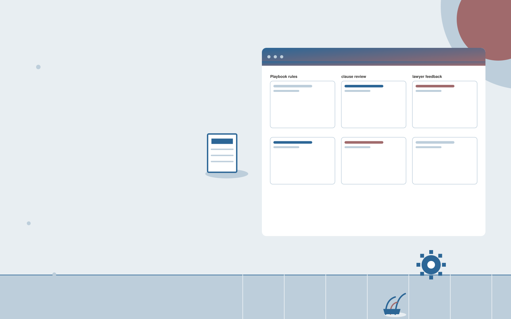

# Contract playbook implementation

**Legal** · Also fits: Operations; Management; IT and Development

> For in-house legal teams with repeat commercial contracts, turn legal playbook, templates and reviewed examples into configured contract review workflow. Address the recurring problem: approved negotiation positions are inconsistently applied. The value hypothesis is a more complete, reviewable deliverable with less repeated preparation; the pilot must establish whether that benefit is real.

| | |
|---|---|
| **Buyer** | In-house legal teams with repeat commercial contracts |
| **Problem** | Approved negotiation positions are inconsistently applied. |
| **Format** | Technical delivery workspace with managed implementation |
| **USP** | Team-specific guidance with reviewable playbook logic. |

## The product
Key screens: Playbook rules, clause review, lawyer feedback. Show a work backlog, proposed changes and verification results. Link each item to its source configuration, code or data mapping. Provide execution logs and an owner-facing health view. Keep environments and approval states clearly separated so a draft cannot be mistaken for a live change. In this product, the first view is playbook rules, followed by clause review and lawyer feedback.

## Core functionality
1. Encode approved positions.
2. Retrieve fallback language.
3. Flag deviations.
4. Show relevant rules.
5. Capture lawyer corrections.
6. Evaluate against reviewed examples.

## Customer workflow
Scope one technical task, inspect authorized material, propose an implementation, build in a controlled environment, run relevant checks, obtain the required change approval, deliver with recovery instructions, and monitor the agreed operating scope. Start with legal playbook, templates and reviewed examples and finish with configured contract review workflow.

## AI and human review
Explain code or configuration, draft transformations and propose technical changes. Execute deterministic validation and meaningful tests. Engineers review correctness, access handling and failure behavior before deployment.

## Customer inputs
Legal playbook, templates and reviewed examples

## Customer deliverables
Configured contract review workflow

## Accounts and administration
Project access, environment separation, versioned changes, test evidence, owner approvals, execution logs, rollback instructions and incident handling.

## MVP scope
Begin with in-house legal teams with repeat commercial contracts and one recurring use case. Build the first two modules: encode approved positions; retrieve fallback language. Provide operator assistance for the third module: flag deviations. Deliver configured contract review workflow through a manual review queue. Perform other necessary full-scope functions manually during the pilot. Include all applicable access, accuracy and professional-review controls from the start.

## After MVP validation
After paid pilots establish value, automate the remaining modules: show relevant rules; capture lawyer corrections; evaluate against reviewed examples. Add one validated source integration, reusable customer configuration and recurring delivery. Expand to additional teams, document formats or languages only after testing the new scope.

## Build dependencies
Authorized technical access, suitable test environments, documented APIs or schemas, secrets management, meaningful checks and recovery procedures.

## Integrations and data access
Authorized matter files, firm templates and approved legal knowledge collections. Approved repositories, application APIs, execution platforms and monitoring systems. Validate current API access and behavior during discovery before promising compatibility. These are candidate integration categories, not verified supported connectors.

## Defensibility
Reliable niche implementations, integration knowledge, representative tests and ongoing operational responsibility. For this idea, build around team-specific guidance with reviewable playbook logic. This advantage requires execution and accumulated customer trust; the base model alone is not a defensible asset.

## Alternatives and positioning
Developers, system integrators, existing automation products and internal engineering work. Differentiate on this specific proposed advantage: team-specific guidance with reviewable playbook logic. Test it against the buyer's current method on the same task. Competitor coverage and uniqueness have not been established.

## Revenue model and test pricing (USD)
Test USD 1,000-4,000 for one bounded implementation or technical review, then USD 200-1,000 monthly for defined maintenance. Hosting, vendor fees and major feature changes are separate. Prices are hypotheses.

## Main delivery costs
Engineering, testing, cloud execution, third-party API fees, monitoring, incident response and vendor-change maintenance.

## Marketing message to test
> Contract playbook implementation for in-house legal teams with repeat commercial contracts. Team-specific guidance with reviewable playbook logic. Demonstrate the claim through a playbook-driven review of sample clauses.

## Acquisition channels
Commercial legal operations consultants

## Lead magnet
A playbook-driven review of sample clauses

## First 30 days of marketing
- Week 1: interview five prospective buyers in this segment: in-house legal teams with repeat commercial contracts. Ask to see a recent example of the problem and their current process.
- Week 2: prepare this demonstration using authorized or synthetic material: a playbook-driven review of sample clauses.
- Week 3: present it through commercial legal operations consultants and seek one narrowly scoped paid pilot.
- Week 4: review lawyer agreement, review time, total delivery effort and a concrete renewal decision before increasing scope.

## Paid pilot and validation
Implement one bounded task in a safe test environment. Demonstrate normal operation, failure handling and recovery with representative inputs. Have the responsible technical owner review the results. For this idea, use legal playbook, templates and reviewed examples and evaluate configured contract review workflow. Agree success thresholds with the buyer before starting; collect a baseline for lawyer agreement, review time. A positive signal is payment and repeat use with acceptable quality and delivery cost, not a favorable demo reaction alone.

## Success metrics
Lawyer agreement, review time

## Retention and expansion
Maintain agreed integrations or technical assets, review failures and upstream changes, and sell additional scoped work only after the first implementation is stable.

## Operating controls and limitations
Preserve matter confidentiality, access boundaries and original evidence. Qualified professionals review legal interpretations and final client documents. Validate source access and reviewer availability during the pilot. Maintain customer-level access, data deletion controls and a record of final approvals.

## Brand style (concept)

- Colors: `#275a91` primary · `#c9a654` accent · `#e4eaf1` surface · `#22201e` ink
- Type: Playfair Display for headings, Source Sans 3 for text
- Voice: Precise, measured, defensible
- Demo site: [https://nexibeo.com/solutions/contract-playbook-implementation/demo/](https://nexibeo.com/solutions/contract-playbook-implementation/demo/)

## Investment indication

Indicative build budget, from MVP to full product. This is a planning range, not a quote; it excludes running costs such as model usage, hosting and reviewer hours. Built with Nexibeo's AI software development factory, most implementations take days to a few weeks of creation time, depending on availability.

| Phase | Scope | Creation time | Indicative budget |
|---|---|---|---|
| MVP | One buyer segment, one recurring use case; first modules: encode approved positions; retrieve fallback language. Manual review in the loop. | 7 days | $12,000 |
| Paid pilot | Accounts, roles, review states, audit trail and the first integration, hardened for two to three paying pilot customers. | 8 days | $16,000 |
| Full product | Remaining modules: show relevant rules; capture lawyer corrections; evaluate against reviewed examples. Self-serve onboarding, billing, monitoring and the wider integration set. | 3 weeks | $21,500 |
| **Total** | | about 6 weeks | **$49,500** |

### Running costs per month (rough indication, untested)

| Stage | Hosting and infrastructure | AI usage | Total per month |
|---|---|---|---|
| MVP and paid pilot (about 3 customers) | $50–$100 | $60–$120 | **$110–$220** |
| Full product (about 50 customers) | $190–$380 | $530–$1,050 | **$720–$1,430** |

**Get this built:** [contact Nexibeo](https://nexibeo.com/solutions/contract-playbook-implementation/#apply). We build it with our AI software factory, usually in days to a few weeks, for you to run internally or offer to your clients.

## Research status
Concept proposal expanded from the 315-idea conversation. Demand, pricing, differentiation, build scope and integration feasibility are hypotheses, not verified market findings. Category link is inspiration rather than evidence of business viability.

## Credits and next steps

- **Estimation and having it built:** see the full solution page on [nexibeo.com](https://nexibeo.com/solutions/contract-playbook-implementation/) for more detail on estimation. Nexibeo builds it for you as a custom AI implementation, to run internally or to offer to your own clients.
- **Become an AI-optimized specialist for Legal:** [Complete AI Training](https://completeaitraining.com/certification/12b-ai-certification-for-legal-specialists/).
- Field news: [AI news for Legal](https://completeaitraining.com/all-ai-news-for-legal/).
