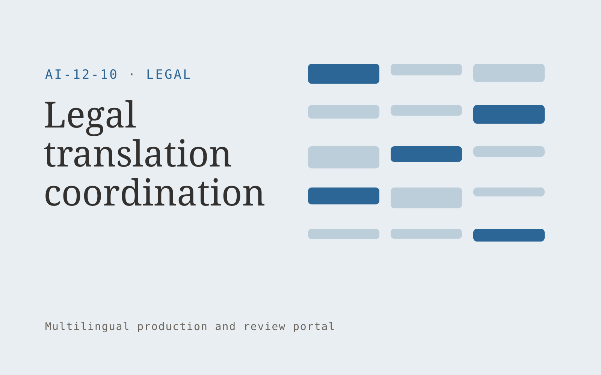

# Legal translation coordination

**AI-12-10 · Legal** · Also fits: Operations; Management; PR and Communications

> For law firms handling cross-border commercial documents, turn authorized documents and jurisdiction-specific terminology into professionally reviewed translations. Address the recurring problem: specialist translation review is fragmented across vendors. The value hypothesis is a more complete, reviewable deliverable with less repeated preparation; the pilot must establish whether that benefit is real.

| | |
|---|---|
| **Buyer** | Law firms handling cross-border commercial documents |
| **Problem** | Specialist translation review is fragmented across vendors. |
| **Format** | Multilingual production and review portal |
| **USP** | Clause alignment and terminology continuity across document families. |

## The product
Key screens: Bilingual clauses, terminology log, qualified review. Use aligned source and target language panes with shared terminology highlights. Include a language status grid, reviewer assignment queue, and layout or timeline preview. Show unresolved ambiguities next to the affected passage. Keep approvals separate for each language and version. In this product, the first view is bilingual clauses, followed by terminology log and qualified review.

## Core functionality
1. Align source paragraphs.
2. Draft translations.
3. Preserve defined terms.
4. Flag ambiguous language.
5. Assign qualified reviewers.
6. Maintain approved versions.

## Customer workflow
Upload authorized source content, confirm target languages and terminology, create translation drafts, assign qualified reviewers, reconcile source changes, check layout or timing, and deliver approved language versions. Start with authorized documents and jurisdiction-specific terminology and finish with professionally reviewed translations.

## AI and human review
Draft translations, transcribe media when applicable, suggest terminology and detect inconsistencies. Deterministic checks compare dates, numbers and identifiers. Qualified language reviewers decide idiomatic phrasing and specialist meaning. Voice work requires explicit permissions for the intended use.

## Customer inputs
Authorized documents and jurisdiction-specific terminology

## Customer deliverables
Professionally reviewed translations

## Accounts and administration
Language permissions, glossary versions, reviewer assignments, segment comments, source-change alerts, per-language approvals and delivery history.

## MVP scope
Begin with law firms handling cross-border commercial documents and one recurring use case. Build the first two modules: align source paragraphs; draft translations. Provide operator assistance for the third module: preserve defined terms. Deliver professionally reviewed translations through a manual review queue. Perform other necessary full-scope functions manually during the pilot. Include all applicable access, accuracy and professional-review controls from the start.

## After MVP validation
After paid pilots establish value, automate the remaining modules: flag ambiguous language; assign qualified reviewers; maintain approved versions. Add one validated source integration, reusable customer configuration and recurring delivery. Expand to additional teams, document formats or languages only after testing the new scope.

## Build dependencies
Segment alignment, glossary enforcement, multilingual text handling, comparison views and qualified reviewers. Media projects also need timing and audio/video QA.

## Integrations and data access
Authorized matter files, firm templates and approved legal knowledge collections. Document formats, subtitle formats, media storage and publishing systems. Confirm language, font and layout support for each requested output. These are candidate integration categories, not verified supported connectors.

## Defensibility
Customer-controlled approved terminology, reviewed translation examples and dependable specialist reviewer relationships. For this idea, build around clause alignment and terminology continuity across document families. This advantage requires execution and accumulated customer trust; the base model alone is not a defensible asset.

## Alternatives and positioning
Translation agencies, freelance linguists, generic machine translation and internal bilingual staff. Differentiate on this specific proposed advantage: clause alignment and terminology continuity across document families. Test it against the buyer's current method on the same task. Competitor coverage and uniqueness have not been established.

## Revenue model and test pricing (USD)
Quote an initial USD 300-1,200 batch for a defined word count or media duration and one target language. Charge separately for extra languages, specialist review and dubbing. Test recurring volume agreements after the pilot; prices are hypotheses.

## Main delivery costs
Source preparation, translation volume, transcription or dubbing, qualified reviewers, glossary maintenance and changed-source rework.

## Marketing message to test
> Legal translation coordination for law firms handling cross-border commercial documents. Clause alignment and terminology continuity across document families. Demonstrate the claim through a reviewed bilingual clause comparison.

## Acquisition channels
Cross-border legal service partners

## Lead magnet
A reviewed bilingual clause comparison

## First 30 days of marketing
- Week 1: interview five prospective buyers in this segment: law firms handling cross-border commercial documents. Ask to see a recent example of the problem and their current process.
- Week 2: prepare this demonstration using authorized or synthetic material: a reviewed bilingual clause comparison.
- Week 3: present it through cross-border legal service partners and seek one narrowly scoped paid pilot.
- Week 4: review qualified reviewer corrections, version consistency, total delivery effort and a concrete renewal decision before increasing scope.

## Paid pilot and validation
Translate a representative sample and have an independent qualified reviewer assess it. Include a source revision to measure update handling. Track corrections, meaning preservation and total delivery effort. For this idea, use authorized documents and jurisdiction-specific terminology and evaluate professionally reviewed translations. Agree success thresholds with the buyer before starting; collect a baseline for qualified reviewer corrections, version consistency. A positive signal is payment and repeat use with acceptable quality and delivery cost, not a favorable demo reaction alone.

## Success metrics
Qualified reviewer corrections, version consistency

## Retention and expansion
Maintain approved terminology and reviewer continuity. Charge for ongoing source updates and add languages only when the buyer has a real publishing need.

## Operating controls and limitations
Preserve matter confidentiality, access boundaries and original evidence. Qualified professionals review legal interpretations and final client documents. Validate source access and reviewer availability during the pilot. Maintain customer-level access, data deletion controls and a record of final approvals.

## Brand style (concept)

- Colors: `#275391` primary · `#c99554` accent · `#e4eaf1` surface · `#22201e` ink
- Type: Playfair Display for headings, Source Sans 3 for text
- Voice: Precise, measured, defensible
- Demo site: [https://nexibeo.com/ideas/legal-translation-coordination/demo/](https://nexibeo.com/ideas/legal-translation-coordination/demo/)

## Investment indication

Indicative build budget, from MVP to full product. This is a planning range, not a quote; it excludes running costs such as model usage, hosting and reviewer hours.

| Phase | Scope | Timeline | Indicative budget |
|---|---|---|---|
| MVP | One buyer segment, one recurring use case; first modules: align source paragraphs; draft translations. Manual review in the loop. | 6 weeks | $12,000 |
| Paid pilot | Accounts, roles, review states, audit trail and the first integration, hardened for two to three paying pilot customers. | 8 weeks | $16,000 |
| Full product | Remaining modules: flag ambiguous language; assign qualified reviewers; maintain approved versions. Self-serve onboarding, billing, monitoring and the wider integration set. | 14 weeks | $21,500 |
| **Total** | | 28 weeks | **$49,500** |

**Co-create this project with us:** [contact Nexibeo](https://nexibeo.com/ideas/legal-translation-coordination/#apply) and we build it with you.

## Research status
Concept proposal expanded from the 315-idea conversation. Demand, pricing, differentiation, build scope and integration feasibility are hypotheses, not verified market findings. Category link is inspiration rather than evidence of business viability.

## Credits and next steps

- **Estimation and building this idea:** see the full idea page on [nexibeo.com](https://nexibeo.com/ideas/legal-translation-coordination/) for more detail on estimation, and to co-create and build this idea with Nexibeo.
- **Become an AI-optimized specialist for Legal:** [Complete AI Training](https://completeaitraining.com/certification/12b-ai-certification-for-legal-specialists/).
- Field news: [AI news for Legal](https://completeaitraining.com/all-ai-news-for-legal/).
