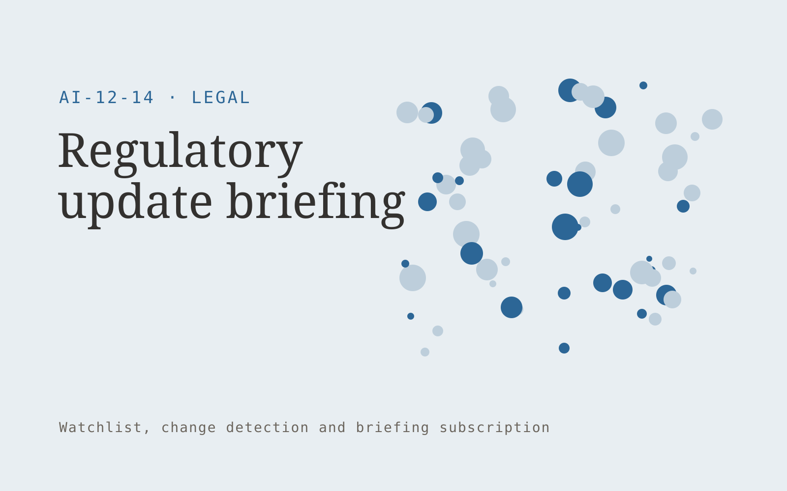

# Regulatory update briefing

**Legal** · Also fits: Operations; Management; Executives and Strategy

> For compliance teams in one regulated business niche, turn official publications and explicit jurisdiction scope into expert-reviewed regulatory briefing. Address the recurring problem: official updates are difficult to connect to relevant internal questions. The value hypothesis is a more complete, reviewable deliverable with less repeated preparation; the pilot must establish whether that benefit is real.

| | |
|---|---|
| **Buyer** | Compliance teams in one regulated business niche |
| **Problem** | Official updates are difficult to connect to relevant internal questions. |
| **Format** | Watchlist, change detection and briefing subscription |
| **USP** | Publication status and jurisdiction remain visible beside every update. |

## The product
Key screens: Jurisdiction watchlist, change evidence, expert review. Use a watchlist with source health and last-checked dates, a chronological change feed, and a reviewable briefing editor. Display original evidence beside each alert. Let users mute irrelevant topics and record whether a change led to action. In this product, the first view is jurisdiction watchlist, followed by change evidence and expert review.

## Core functionality
1. Track official releases.
2. Record effective dates.
3. Distinguish proposals from rules.
4. Cite source sections.
5. Flag affected topics.
6. Route specialist interpretation.

## Customer workflow
Agree a narrow watchlist, confirm lawful source access, collect dated snapshots, detect candidate changes, review relevance and accuracy, deliver a concise digest, and refine the watchlist from buyer feedback. Start with official publications and explicit jurisdiction scope and finish with expert-reviewed regulatory briefing.

## AI and human review
Classify source material, group related developments and summarize verified changes. Use deterministic snapshot comparison for factual changes where possible. Distinguish observed publication content from analyst interpretation and uncertain implications.

## Customer inputs
Official publications and explicit jurisdiction scope

## Customer deliverables
Expert-reviewed regulatory briefing

## Accounts and administration
Watchlist ownership, source health, dated evidence, deduplication, topic filters, editorial review, delivery preferences and alert feedback.

## MVP scope
Begin with compliance teams in one regulated business niche and one recurring use case. Build the first two modules: track official releases; record effective dates. Provide operator assistance for the third module: distinguish proposals from rules. Deliver expert-reviewed regulatory briefing through a manual review queue. Perform other necessary full-scope functions manually during the pilot. Include all applicable access, accuracy and professional-review controls from the start.

## After MVP validation
After paid pilots establish value, automate the remaining modules: cite source sections; flag affected topics; route specialist interpretation. Add one validated source integration, reusable customer configuration and recurring delivery. Expand to additional teams, document formats or languages only after testing the new scope.

## Build dependencies
Reliable permitted source access, change history, publication dates, deduplication and editorial QA. Coverage limits and inaccessible sources must be visible.

## Integrations and data access
Authorized matter files, firm templates and approved legal knowledge collections. Permitted feeds, published document sources, email digests and internal briefing channels. Verify collection rights and source reliability before selling coverage commitments. These are candidate integration categories, not verified supported connectors.

## Defensibility
A curated source network, historical change archive and buyer-specific relevance judgments within a narrow topic. For this idea, build around publication status and jurisdiction remain visible beside every update. This advantage requires execution and accumulated customer trust; the base model alone is not a defensible asset.

## Alternatives and positioning
Newsletters, search alerts, analysts and general media or website monitoring tools. Differentiate on this specific proposed advantage: publication status and jurisdiction remain visible beside every update. Test it against the buyer's current method on the same task. Competitor coverage and uniqueness have not been established.

## Revenue model and test pricing (USD)
Test USD 100-500 monthly for a narrow shared briefing, or USD 750-2,500 monthly for bespoke analyst coverage. Licensed source access and unusual collection requirements are extra. Prices require validation.

## Main delivery costs
Source licensing, collection reliability, change processing, analyst verification, missed-signal review and digest production.

## Marketing message to test
> Regulatory update briefing for compliance teams in one regulated business niche. Publication status and jurisdiction remain visible beside every update. Demonstrate the claim through a source-linked jurisdiction briefing.

## Acquisition channels
Specialist professional associations

## Lead magnet
A source-linked jurisdiction briefing

## First 30 days of marketing
- Week 1: interview five prospective buyers in this segment: compliance teams in one regulated business niche. Ask to see a recent example of the problem and their current process.
- Week 2: prepare this demonstration using authorized or synthetic material: a source-linked jurisdiction briefing.
- Week 3: present it through specialist professional associations and seek one narrowly scoped paid pilot.
- Week 4: review relevant updates, source accuracy, total delivery effort and a concrete renewal decision before increasing scope.

## Paid pilot and validation
Deliver several scheduled digests for a small watchlist. Have the buyer label useful and irrelevant items, independently check important missed developments and assess whether the briefing changes a decision. For this idea, use official publications and explicit jurisdiction scope and evaluate expert-reviewed regulatory briefing. Agree success thresholds with the buyer before starting; collect a baseline for relevant updates, source accuracy. A positive signal is payment and repeat use with acceptable quality and delivery cost, not a favorable demo reaction alone.

## Success metrics
Relevant updates, source accuracy

## Retention and expansion
Tune relevance from buyer feedback, preserve historical changes and offer deeper analyst review for selected topics. Add sources only when they improve useful coverage.

## Operating controls and limitations
Preserve matter confidentiality, access boundaries and original evidence. Qualified professionals review legal interpretations and final client documents. Validate source access and reviewer availability during the pilot. Maintain customer-level access, data deletion controls and a record of final approvals.

## Brand style (concept)

- Colors: `#276891` primary · `#c96254` accent · `#e4ecf1` surface · `#22201e` ink
- Type: Sora for headings, Work Sans for text
- Voice: Precise, measured, defensible
- Demo site: [https://nexibeo.com/solutions/regulatory-update-briefing/demo/](https://nexibeo.com/solutions/regulatory-update-briefing/demo/)

## Investment indication

Indicative build budget, from MVP to full product. This is a planning range, not a quote; it excludes running costs such as model usage, hosting and reviewer hours. Built with Nexibeo's AI software development factory, most implementations take days to a few weeks of creation time, depending on availability.

| Phase | Scope | Creation time | Indicative budget |
|---|---|---|---|
| MVP | One buyer segment, one recurring use case; first modules: track official releases; record effective dates. Manual review in the loop. | 5 days | $9,500 |
| Paid pilot | Accounts, roles, review states, audit trail and the first integration, hardened for two to three paying pilot customers. | 6 days | $11,500 |
| Full product | Remaining modules: cite source sections; flag affected topics; route specialist interpretation. Self-serve onboarding, billing, monitoring and the wider integration set. | 2 weeks | $16,000 |
| **Total** | | about 4 weeks | **$37,000** |

### Running costs per month (rough indication, untested)

| Stage | Hosting and infrastructure | AI usage | Total per month |
|---|---|---|---|
| MVP and paid pilot (about 3 customers) | $50–$100 | $50–$100 | **$100–$200** |
| Full product (about 50 customers) | $190–$380 | $350–$700 | **$540–$1,080** |

**Get this built:** [contact Nexibeo](https://nexibeo.com/solutions/regulatory-update-briefing/#apply). We build it with our AI software factory, usually in days to a few weeks, for you to run internally or offer to your clients.

## Research status
Concept proposal expanded from the 315-idea conversation. Demand, pricing, differentiation, build scope and integration feasibility are hypotheses, not verified market findings. Category link is inspiration rather than evidence of business viability.

## Credits and next steps

- **Estimation and having it built:** see the full solution page on [nexibeo.com](https://nexibeo.com/solutions/regulatory-update-briefing/) for more detail on estimation. Nexibeo builds it for you as a custom AI implementation, to run internally or to offer to your own clients.
- **Become an AI-optimized specialist for Legal:** [Complete AI Training](https://completeaitraining.com/certification/12b-ai-certification-for-legal-specialists/).
- Field news: [AI news for Legal](https://completeaitraining.com/all-ai-news-for-legal/).
