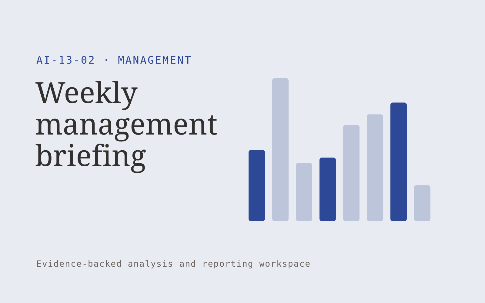

# Weekly management briefing

**Management** · Also fits: Operations; Human Resources; Science and Research

> For operations directors at service businesses, turn project updates, workload data and decision logs into management briefing and decision list. Address the recurring problem: status information is scattered across teams. The value hypothesis is a more complete, reviewable deliverable with less repeated preparation; the pilot must establish whether that benefit is real.

| | |
|---|---|
| **Buyer** | Operations directors at service businesses |
| **Problem** | Status information is scattered across teams. |
| **Format** | Evidence-backed analysis and reporting workspace |
| **USP** | Focuses on changes and required decisions rather than repeating every status. |

## The product
Key screens: Weekly overview, changes, decision queue. Open with a compact overview and filters for the relevant period or segment. Let users drill from each theme or metric into underlying records. Keep source definitions and missing-data notes near the result. Use an action panel to assign investigations and record what was learned. In this product, the first view is weekly overview, followed by changes and decision queue.

## Core functionality
1. Aggregate approved updates.
2. Identify missing reports.
3. Highlight changed risks.
4. Link evidence.
5. Separate decisions needed.
6. Export leadership briefs.

## Customer workflow
Agree definitions, import authorized data, validate coverage and identifiers, compute transparent measures, group relevant evidence, review findings, assign investigations or improvements, and repeat on a comparable period. Start with project updates, workload data and decision logs and finish with management briefing and decision list.

## AI and human review
Classify text, summarize evidence and propose explanations to investigate. Compute financial or operational measures with deterministic code. Separate observed patterns from causal claims and preserve examples that contradict the summary.

## Customer inputs
Project updates, workload data and decision logs

## Customer deliverables
Management briefing and decision list

## Accounts and administration
Dataset permissions, field mappings, metric definitions, source drill-down, saved filters, reviewer annotations, recurring reports and action ownership.

## MVP scope
Begin with operations directors at service businesses and one recurring use case. Build the first two modules: aggregate approved updates; identify missing reports. Provide operator assistance for the third module: highlight changed risks. Deliver management briefing and decision list through a manual review queue. Perform other necessary full-scope functions manually during the pilot. Include all applicable access, accuracy and professional-review controls from the start.

## After MVP validation
After paid pilots establish value, automate the remaining modules: link evidence; separate decisions needed; export leadership briefs. Add one validated source integration, reusable customer configuration and recurring delivery. Expand to additional teams, document formats or languages only after testing the new scope.

## Build dependencies
Stable identifiers, consistent metric definitions, deterministic calculations, source lineage and representative review samples. Poor coverage must remain visible.

## Integrations and data access
Team updates, calendars, project records and agreed management routines. Read-only business data exports, reporting databases and task trackers. Reconcile source totals before scheduling recurring data refreshes. These are candidate integration categories, not verified supported connectors.

## Defensibility
Domain-specific definitions, trusted source mappings and a history connecting findings to actions and observed results. For this idea, build around focuses on changes and required decisions rather than repeating every status. This advantage requires execution and accumulated customer trust; the base model alone is not a defensible asset.

## Alternatives and positioning
Analysts, business intelligence dashboards, spreadsheets and general text summarization tools. Differentiate on this specific proposed advantage: focuses on changes and required decisions rather than repeating every status. Test it against the buyer's current method on the same task. Competitor coverage and uniqueness have not been established.

## Revenue model and test pricing (USD)
Test USD 500-2,000 for an initial analysis of one bounded dataset. Offer USD 250-1,000 monthly for repeat reporting at agreed volume. Data cleanup and specialist analysis are separately priced. These are test ranges.

## Main delivery costs
Data preparation, reconciliation, classification, expert interpretation, customer-specific definitions and recurring reporting support.

## Marketing message to test
> Weekly management briefing for operations directors at service businesses. Focuses on changes and required decisions rather than repeating every status. Demonstrate the claim through a concise weekly brief from sample team updates.

## Acquisition channels
Operations leadership communities

## Lead magnet
A concise weekly brief from sample team updates

## First 30 days of marketing
- Week 1: interview five prospective buyers in this segment: operations directors at service businesses. Ask to see a recent example of the problem and their current process.
- Week 2: prepare this demonstration using authorized or synthetic material: a concise weekly brief from sample team updates.
- Week 3: present it through operations leadership communities and seek one narrowly scoped paid pilot.
- Week 4: review preparation time, decisions acted on, total delivery effort and a concrete renewal decision before increasing scope.

## Paid pilot and validation
Analyze one historical period and review findings with the responsible domain owner. Reconcile headline measures, inspect counterexamples and ask the buyer to choose a concrete follow-up action. For this idea, use project updates, workload data and decision logs and evaluate management briefing and decision list. Agree success thresholds with the buyer before starting; collect a baseline for preparation time, decisions acted on. A positive signal is payment and repeat use with acceptable quality and delivery cost, not a favorable demo reaction alone.

## Success metrics
Preparation time, decisions acted on

## Retention and expansion
Repeat the same definitions each reporting period and track whether findings lead to useful action. Expand data sources without breaking historical comparability.

## Operating controls and limitations
Confirm owners, decisions and commitments. Keep employee discussion notes access-controlled and avoid covert individual performance inference. Validate source access and reviewer availability during the pilot. Maintain customer-level access, data deletion controls and a record of final approvals.

## Brand style (concept)

- Colors: `#274a91` primary · `#c99a54` accent · `#e4e9f1` surface · `#22201e` ink
- Type: Archivo for headings, Lora for text
- Voice: Practical, organised, candid
- Demo site: [https://nexibeo.com/ideas/weekly-management-briefing/demo/](https://nexibeo.com/ideas/weekly-management-briefing/demo/)

## Investment indication

Indicative build budget, from MVP to full product. This is a planning range, not a quote; it excludes running costs such as model usage, hosting and reviewer hours.

| Phase | Scope | Timeline | Indicative budget |
|---|---|---|---|
| MVP | One buyer segment, one recurring use case; first modules: aggregate approved updates; identify missing reports. Manual review in the loop. | 5 weeks | $9,000 |
| Paid pilot | Accounts, roles, review states, audit trail and the first integration, hardened for two to three paying pilot customers. | 6 weeks | $10,500 |
| Full product | Remaining modules: link evidence; separate decisions needed; export leadership briefs. Self-serve onboarding, billing, monitoring and the wider integration set. | 10 weeks | $14,500 |
| **Total** | | 21 weeks | **$34,000** |

**Co-create this project with us:** [contact Nexibeo](https://nexibeo.com/ideas/weekly-management-briefing/#apply) and we build it with you.

## Research status
Concept proposal expanded from the 315-idea conversation. Demand, pricing, differentiation, build scope and integration feasibility are hypotheses, not verified market findings. Category link is inspiration rather than evidence of business viability.

## Credits and next steps

- **Estimation and building this idea:** see the full idea page on [nexibeo.com](https://nexibeo.com/ideas/weekly-management-briefing/) for more detail on estimation, and to co-create and build this idea with Nexibeo.
- **Become an AI-optimized specialist for Management:** [Complete AI Training](https://completeaitraining.com/tag/management/?contentType=ai-certification).
- Field news: [AI news for Management](https://completeaitraining.com/all-ai-news-for-management/).
