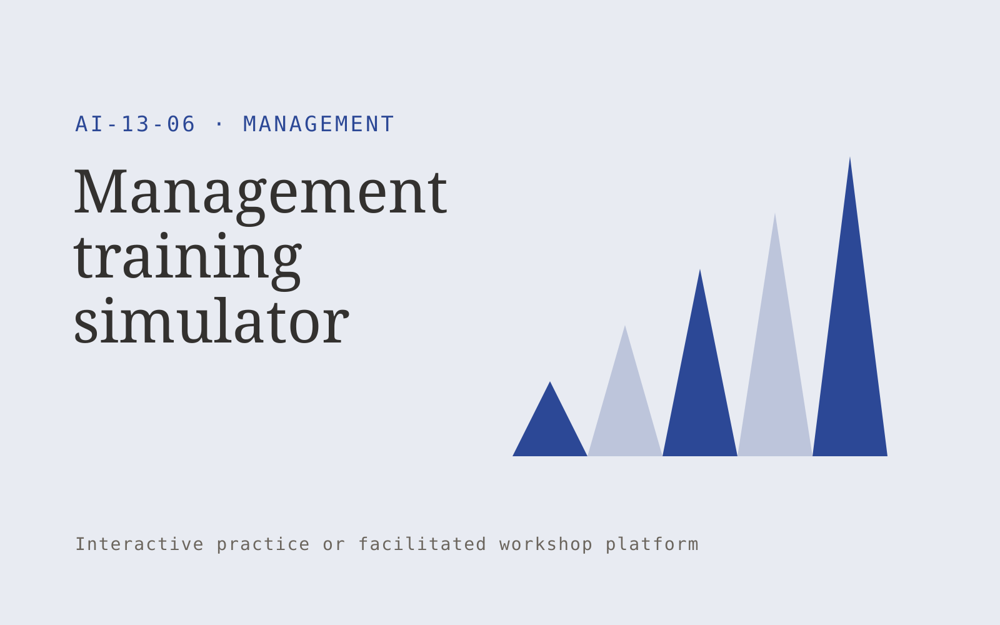

# Management training simulator

**Management** · Also fits: Operations; Human Resources; Education

> For leadership development providers, turn training scenarios and behavior rubrics into practice decisions and coaching plans. Address the recurring problem: managers receive theory without repeated decision practice. The value hypothesis is a more complete, reviewable deliverable with less repeated preparation; the pilot must establish whether that benefit is real.

| | |
|---|---|
| **Buyer** | Leadership development providers |
| **Problem** | Managers receive theory without repeated decision practice. |
| **Format** | Interactive practice or facilitated workshop platform |
| **USP** | Practice across management decisions with coach-calibrated rubrics. |

## The product
Key screens: Scenario library, decision practice, coach feedback. Use a scenario catalog with clear goals and difficulty settings. The main session area supports text, optional voice and visible context. Follow it with a replay or decision map, annotated feedback and a next-practice plan. Facilitators can author scenarios and review participant-selected sessions. In this product, the first view is scenario library, followed by decision practice and coach feedback.

## Core functionality
1. Simulate prioritization conflicts.
2. Practice negotiations.
3. Show consequences.
4. Capture reasoning.
5. Score observable behaviors.
6. Assign follow-up drills.

## Customer workflow
Set the participant’s goal, choose or customize a scenario, conduct an interactive session, record choices or dialogue, review evidence-based feedback with a facilitator when needed, and repeat selected parts with changed constraints. Start with training scenarios and behavior rubrics and finish with practice decisions and coaching plans.

## AI and human review
Generate responsive dialogue, alternative situations and structured reflection prompts. Ground feedback in agreed goals or rubrics. Treat creative choices and facilitator judgment as authoritative. Evaluate specific actions rather than infer personality or hidden traits.

## Customer inputs
Training scenarios and behavior rubrics

## Customer deliverables
Practice decisions and coaching plans

## Accounts and administration
Participant-controlled session sharing, scenario versions, facilitator tools, replay history, rubric calibration, practice goals and exportable feedback.

## MVP scope
Begin with leadership development providers and one recurring use case. Build the first two modules: simulate prioritization conflicts; practice negotiations. Provide operator assistance for the third module: show consequences. Deliver practice decisions and coaching plans through a manual review queue. Perform other necessary full-scope functions manually during the pilot. Include all applicable access, accuracy and professional-review controls from the start.

## After MVP validation
After paid pilots establish value, automate the remaining modules: capture reasoning; score observable behaviors; assign follow-up drills. Add one validated source integration, reusable customer configuration and recurring delivery. Expand to additional teams, document formats or languages only after testing the new scope.

## Build dependencies
Scenario state management, coherent dialogue, explicit rubrics, session replay and reviewer feedback. Voice interaction adds latency and audio QA requirements.

## Integrations and data access
Team updates, calendars, project records and agreed management routines. Learning portals, calendar scheduling and authorized session exports. Make recording, sharing and retention controls explicit in the product. These are candidate integration categories, not verified supported connectors.

## Defensibility
Realistic domain scenarios, qualified facilitator relationships and reviewed examples of useful feedback and successful practice. For this idea, build around practice across management decisions with coach-calibrated rubrics. This advantage requires execution and accumulated customer trust; the base model alone is not a defensible asset.

## Alternatives and positioning
Human coaching, workshops, static courses, roleplay with colleagues and general chat tools. Differentiate on this specific proposed advantage: practice across management decisions with coach-calibrated rubrics. Test it against the buyer's current method on the same task. Competitor coverage and uniqueness have not been established.

## Revenue model and test pricing (USD)
Test USD 300-1,500 for a facilitated team pilot, or USD 20-80 per participant monthly for self-serve practice with limited usage. Bespoke workshops and expert coaching are separately scoped. Pricing is hypothetical.

## Main delivery costs
Scenario design, voice processing if used, model interaction length, facilitator review, rubric calibration and learner support.

## Marketing message to test
> Management training simulator for leadership development providers. Practice across management decisions with coach-calibrated rubrics. Demonstrate the claim through a prioritization simulation with feedback.

## Acquisition channels
Leadership coaching networks

## Lead magnet
A prioritization simulation with feedback

## First 30 days of marketing
- Week 1: interview five prospective buyers in this segment: leadership development providers. Ask to see a recent example of the problem and their current process.
- Week 2: prepare this demonstration using authorized or synthetic material: a prioritization simulation with feedback.
- Week 3: present it through leadership coaching networks and seek one narrowly scoped paid pilot.
- Week 4: review coach-rated improvement, repeat learner usage, total delivery effort and a concrete renewal decision before increasing scope.

## Paid pilot and validation
Run a short scenario with representative participants, then repeat with a different case. Ask a qualified coach or facilitator to assess usefulness and observable improvement independently of the AI feedback. For this idea, use training scenarios and behavior rubrics and evaluate practice decisions and coaching plans. Agree success thresholds with the buyer before starting; collect a baseline for coach-rated improvement, repeat learner usage. A positive signal is payment and repeat use with acceptable quality and delivery cost, not a favorable demo reaction alone.

## Success metrics
Coach-rated improvement, repeat learner usage

## Retention and expansion
Release relevant new scenarios, support repeat practice and offer facilitator review. Expand to another role only with appropriate scenarios and calibrated feedback.

## Operating controls and limitations
Confirm owners, decisions and commitments. Keep employee discussion notes access-controlled and avoid covert individual performance inference. Validate source access and reviewer availability during the pilot. Maintain customer-level access, data deletion controls and a record of final approvals.

## Brand style (concept)

- Colors: `#273591` primary · `#c99954` accent · `#e4e6f1` surface · `#22201e` ink
- Type: Archivo for headings, Lora for text
- Voice: Practical, organised, candid
- Demo site: [https://nexibeo.com/ideas/management-training-simulator/demo/](https://nexibeo.com/ideas/management-training-simulator/demo/)

## Investment indication

Indicative build budget, from MVP to full product. This is a planning range, not a quote; it excludes running costs such as model usage, hosting and reviewer hours.

| Phase | Scope | Timeline | Indicative budget |
|---|---|---|---|
| MVP | One buyer segment, one recurring use case; first modules: simulate prioritization conflicts; practice negotiations. Manual review in the loop. | 5 weeks | $9,000 |
| Paid pilot | Accounts, roles, review states, audit trail and the first integration, hardened for two to three paying pilot customers. | 6 weeks | $11,500 |
| Full product | Remaining modules: capture reasoning; score observable behaviors; assign follow-up drills. Self-serve onboarding, billing, monitoring and the wider integration set. | 11 weeks | $15,500 |
| **Total** | | 22 weeks | **$36,000** |

### Running costs per month (rough indication, untested)

| Stage | Hosting and infrastructure | AI usage | Total per month |
|---|---|---|---|
| MVP and paid pilot (about 3 customers) | $30–$60 | $50–$110 | **$80–$170** |
| Full product (about 50 customers) | $110–$210 | $420–$840 | **$530–$1,050** |

**Co-create this project with us:** [contact Nexibeo](https://nexibeo.com/ideas/management-training-simulator/#apply) and we build it with you.

## Research status
Concept proposal expanded from the 315-idea conversation. Demand, pricing, differentiation, build scope and integration feasibility are hypotheses, not verified market findings. Category link is inspiration rather than evidence of business viability.

## Credits and next steps

- **Estimation and building this idea:** see the full idea page on [nexibeo.com](https://nexibeo.com/ideas/management-training-simulator/) for more detail on estimation, and to co-create and build this idea with Nexibeo.
- **Become an AI-optimized specialist for Management:** [Complete AI Training](https://completeaitraining.com/tag/management/?contentType=ai-certification).
- Field news: [AI news for Management](https://completeaitraining.com/all-ai-news-for-management/).
