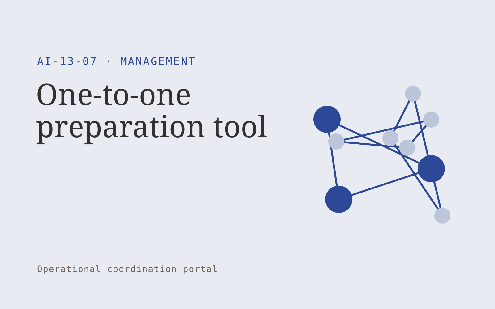

# One-to-one preparation tool

**Management** · Also fits: Operations; Human Resources

> For managers supporting distributed teams, turn employee-selected topics and agreed previous notes into agreed meeting agenda and follow-up record. Address the recurring problem: one-to-ones miss prior commitments and employee priorities. The value hypothesis is a more complete, reviewable deliverable with less repeated preparation; the pilot must establish whether that benefit is real.

| | |
|---|---|
| **Buyer** | Managers supporting distributed teams |
| **Problem** | One-to-ones miss prior commitments and employee priorities. |
| **Format** | Operational coordination portal |
| **USP** | Employee participation and explicit note visibility controls. |

## The product
Key screens: Shared agenda, commitment history, follow-up notes. Use a queue or timeline as the opening view, with clear owners, dates and current states. Each case opens into its source context, proposed actions and discussion. Give external participants a limited form or status page. Make the next required action visible without opening every record. In this product, the first view is shared agenda, followed by commitment history and follow-up notes.

## Core functionality
1. Collect employee topics.
2. Retrieve prior promises.
3. Prepare discussion prompts.
4. Record agreed actions.
5. Separate private notes.
6. Schedule follow-ups.

## Customer workflow
Create a case from approved inputs, identify required actions, confirm owners and dates, request missing information, approve proposed communications or changes, track completion, and retain a handover record. Start with employee-selected topics and agreed previous notes and finish with agreed meeting agenda and follow-up record.

## AI and human review
Extract candidate actions and relevant context, classify requests and draft communications. Use explicit rules for scheduling, state transitions and permissions. People confirm obligations and approve consequential actions before execution.

## Customer inputs
Employee-selected topics and agreed previous notes

## Customer deliverables
Agreed meeting agenda and follow-up record

## Accounts and administration
Role permissions, task ownership, deadlines, reminders, approval gates, exception handling, action history, duplicate prevention and reversible configuration.

## MVP scope
Begin with managers supporting distributed teams and one recurring use case. Build the first two modules: collect employee topics; retrieve prior promises. Provide operator assistance for the third module: prepare discussion prompts. Deliver agreed meeting agenda and follow-up record through a manual review queue. Perform other necessary full-scope functions manually during the pilot. Include all applicable access, accuracy and professional-review controls from the start.

## After MVP validation
After paid pilots establish value, automate the remaining modules: record agreed actions; separate private notes; schedule follow-ups. Add one validated source integration, reusable customer configuration and recurring delivery. Expand to additional teams, document formats or languages only after testing the new scope.

## Build dependencies
Explicit state definitions, owner mapping, approval rules, idempotent actions, notifications and recovery procedures. Workflow reliability matters more than fluent text.

## Integrations and data access
Team updates, calendars, project records and agreed management routines. Calendars, email, task managers and relevant business records. Use draft actions and supervised handoffs first, then enable only specifically authorized writes. These are candidate integration categories, not verified supported connectors.

## Defensibility
Customer-specific workflow rules, reliable handoffs, operational history and integrations that make the service part of daily work. For this idea, build around employee participation and explicit note visibility controls. This advantage requires execution and accumulated customer trust; the base model alone is not a defensible asset.

## Alternatives and positioning
Shared inboxes, spreadsheets, task boards and existing workflow automation products. Differentiate on this specific proposed advantage: employee participation and explicit note visibility controls. Test it against the buyer's current method on the same task. Competitor coverage and uniqueness have not been established.

## Revenue model and test pricing (USD)
Test USD 750-2,500 setup plus USD 200-800 monthly for one bounded workflow and team. Cap case volume and implementation scope. Larger operational integrations need separate quotes. Prices are hypotheses.

## Main delivery costs
Workflow configuration, integration maintenance, model calls, notification delivery, exception support and monitoring.

## Marketing message to test
> One-to-one preparation tool for managers supporting distributed teams. Employee participation and explicit note visibility controls. Demonstrate the claim through a shared agenda with commitment follow-through.

## Acquisition channels
Manager communities and HR coaches

## Lead magnet
A shared agenda with commitment follow-through

## First 30 days of marketing
- Week 1: interview five prospective buyers in this segment: managers supporting distributed teams. Ask to see a recent example of the problem and their current process.
- Week 2: prepare this demonstration using authorized or synthetic material: a shared agenda with commitment follow-through.
- Week 3: present it through manager communities and HR coaches and seek one narrowly scoped paid pilot.
- Week 4: review completed commitments, participant usefulness ratings, total delivery effort and a concrete renewal decision before increasing scope.

## Paid pilot and validation
Run one recurring workflow with a small team. Track every handoff and exception, verify completed actions, and compare handling time and missed commitments with the prior process. For this idea, use employee-selected topics and agreed previous notes and evaluate agreed meeting agenda and follow-up record. Agree success thresholds with the buyer before starting; collect a baseline for completed commitments, participant usefulness ratings. A positive signal is payment and repeat use with acceptable quality and delivery cost, not a favorable demo reaction alone.

## Success metrics
Completed commitments, participant usefulness ratings

## Retention and expansion
Report completed actions and recurring exceptions. Maintain the workflow as policies change, then add one adjacent handoff with clear ownership.

## Operating controls and limitations
Confirm owners, decisions and commitments. Keep employee discussion notes access-controlled and avoid covert individual performance inference. Validate source access and reviewer availability during the pilot. Maintain customer-level access, data deletion controls and a record of final approvals.

## Brand style (concept)

- Colors: `#274f91` primary · `#c98954` accent · `#e4e9f1` surface · `#22201e` ink
- Type: Archivo for headings, Lora for text
- Voice: Practical, organised, candid
- Demo site: [https://nexibeo.com/ideas/one-to-one-preparation-tool/demo/](https://nexibeo.com/ideas/one-to-one-preparation-tool/demo/)

## Investment indication

Indicative build budget, from MVP to full product. This is a planning range, not a quote; it excludes running costs such as model usage, hosting and reviewer hours.

| Phase | Scope | Timeline | Indicative budget |
|---|---|---|---|
| MVP | One buyer segment, one recurring use case; first modules: collect employee topics; retrieve prior promises. Manual review in the loop. | 5 weeks | $9,500 |
| Paid pilot | Accounts, roles, review states, audit trail and the first integration, hardened for two to three paying pilot customers. | 7 weeks | $12,000 |
| Full product | Remaining modules: record agreed actions; separate private notes; schedule follow-ups. Self-serve onboarding, billing, monitoring and the wider integration set. | 11 weeks | $16,000 |
| **Total** | | 23 weeks | **$37,500** |

### Running costs per month (rough indication, untested)

| Stage | Hosting and infrastructure | AI usage | Total per month |
|---|---|---|---|
| MVP and paid pilot (about 3 customers) | $30–$60 | $40–$90 | **$70–$150** |
| Full product (about 50 customers) | $110–$210 | $280–$560 | **$390–$770** |

**Co-create this project with us:** [contact Nexibeo](https://nexibeo.com/ideas/one-to-one-preparation-tool/#apply) and we build it with you.

## Research status
Concept proposal expanded from the 315-idea conversation. Demand, pricing, differentiation, build scope and integration feasibility are hypotheses, not verified market findings. Category link is inspiration rather than evidence of business viability.

## Credits and next steps

- **Estimation and building this idea:** see the full idea page on [nexibeo.com](https://nexibeo.com/ideas/one-to-one-preparation-tool/) for more detail on estimation, and to co-create and build this idea with Nexibeo.
- **Become an AI-optimized specialist for Management:** [Complete AI Training](https://completeaitraining.com/tag/management/?contentType=ai-certification).
- Field news: [AI news for Management](https://completeaitraining.com/all-ai-news-for-management/).
