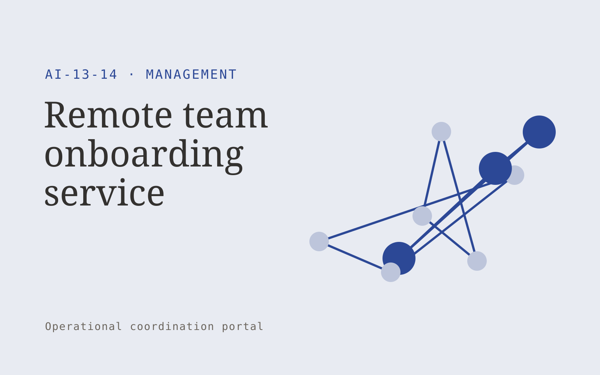

# Remote team onboarding service

**AI-13-14 · Management** · Also fits: Operations; Human Resources

> For founders hiring their first distributed team, turn role briefs, collaboration tools and team interviews into remote onboarding program. Address the recurring problem: remote hires lack clear communication norms and role expectations. The value hypothesis is a more complete, reviewable deliverable with less repeated preparation; the pilot must establish whether that benefit is real.

| | |
|---|---|
| **Buyer** | Founders hiring their first distributed team |
| **Problem** | Remote hires lack clear communication norms and role expectations. |
| **Format** | Operational coordination portal |
| **USP** | Practical team operating agreements embedded into onboarding. |

## The product
Key screens: Onboarding hub, communication map, first-month plan. Use a queue or timeline as the opening view, with clear owners, dates and current states. Each case opens into its source context, proposed actions and discussion. Give external participants a limited form or status page. Make the next required action visible without opening every record. In this product, the first view is onboarding hub, followed by communication map and first-month plan.

## Core functionality
1. Define role outcomes.
2. Document communication norms.
3. Organize key resources.
4. Schedule introductions.
5. Create first tasks.
6. Collect new-hire feedback.

## Customer workflow
Create a case from approved inputs, identify required actions, confirm owners and dates, request missing information, approve proposed communications or changes, track completion, and retain a handover record. Start with role briefs, collaboration tools and team interviews and finish with remote onboarding program.

## AI and human review
Extract candidate actions and relevant context, classify requests and draft communications. Use explicit rules for scheduling, state transitions and permissions. People confirm obligations and approve consequential actions before execution.

## Customer inputs
Role briefs, collaboration tools and team interviews

## Customer deliverables
Remote onboarding program

## Accounts and administration
Role permissions, task ownership, deadlines, reminders, approval gates, exception handling, action history, duplicate prevention and reversible configuration.

## MVP scope
Begin with founders hiring their first distributed team and one recurring use case. Build the first two modules: define role outcomes; document communication norms. Provide operator assistance for the third module: organize key resources. Deliver remote onboarding program through a manual review queue. Perform other necessary full-scope functions manually during the pilot. Include all applicable access, accuracy and professional-review controls from the start.

## After MVP validation
After paid pilots establish value, automate the remaining modules: schedule introductions; create first tasks; collect new-hire feedback. Add one validated source integration, reusable customer configuration and recurring delivery. Expand to additional teams, document formats or languages only after testing the new scope.

## Build dependencies
Explicit state definitions, owner mapping, approval rules, idempotent actions, notifications and recovery procedures. Workflow reliability matters more than fluent text.

## Integrations and data access
Team updates, calendars, project records and agreed management routines. Calendars, email, task managers and relevant business records. Use draft actions and supervised handoffs first, then enable only specifically authorized writes. These are candidate integration categories, not verified supported connectors.

## Defensibility
Customer-specific workflow rules, reliable handoffs, operational history and integrations that make the service part of daily work. For this idea, build around practical team operating agreements embedded into onboarding. This advantage requires execution and accumulated customer trust; the base model alone is not a defensible asset.

## Alternatives and positioning
Shared inboxes, spreadsheets, task boards and existing workflow automation products. Differentiate on this specific proposed advantage: practical team operating agreements embedded into onboarding. Test it against the buyer's current method on the same task. Competitor coverage and uniqueness have not been established.

## Revenue model and test pricing (USD)
Test USD 750-2,500 setup plus USD 200-800 monthly for one bounded workflow and team. Cap case volume and implementation scope. Larger operational integrations need separate quotes. Prices are hypotheses.

## Main delivery costs
Workflow configuration, integration maintenance, model calls, notification delivery, exception support and monitoring.

## Marketing message to test
> Remote team onboarding service for founders hiring their first distributed team. Practical team operating agreements embedded into onboarding. Demonstrate the claim through a first-month onboarding and communication blueprint.

## Acquisition channels
Remote recruitment partners

## Lead magnet
A first-month onboarding and communication blueprint

## First 30 days of marketing
- Week 1: interview five prospective buyers in this segment: founders hiring their first distributed team. Ask to see a recent example of the problem and their current process.
- Week 2: prepare this demonstration using authorized or synthetic material: a first-month onboarding and communication blueprint.
- Week 3: present it through remote recruitment partners and seek one narrowly scoped paid pilot.
- Week 4: review new-hire clarity, time to independent tasks, total delivery effort and a concrete renewal decision before increasing scope.

## Paid pilot and validation
Run one recurring workflow with a small team. Track every handoff and exception, verify completed actions, and compare handling time and missed commitments with the prior process. For this idea, use role briefs, collaboration tools and team interviews and evaluate remote onboarding program. Agree success thresholds with the buyer before starting; collect a baseline for new-hire clarity, time to independent tasks. A positive signal is payment and repeat use with acceptable quality and delivery cost, not a favorable demo reaction alone.

## Success metrics
New-hire clarity, time to independent tasks

## Retention and expansion
Report completed actions and recurring exceptions. Maintain the workflow as policies change, then add one adjacent handoff with clear ownership.

## Operating controls and limitations
Confirm owners, decisions and commitments. Keep employee discussion notes access-controlled and avoid covert individual performance inference. Validate source access and reviewer availability during the pilot. Maintain customer-level access, data deletion controls and a record of final approvals.

## Brand style (concept)

- Colors: `#273e91` primary · `#c3c954` accent · `#e4e7f1` surface · `#22201e` ink
- Type: Fraunces for headings, Inter for text
- Voice: Practical, organised, candid
- Demo site: [https://nexibeo.com/ideas/remote-team-onboarding-service/demo/](https://nexibeo.com/ideas/remote-team-onboarding-service/demo/)

## Investment indication

Indicative build budget, from MVP to full product. This is a planning range, not a quote; it excludes running costs such as model usage, hosting and reviewer hours.

| Phase | Scope | Timeline | Indicative budget |
|---|---|---|---|
| MVP | One buyer segment, one recurring use case; first modules: define role outcomes; document communication norms. Manual review in the loop. | 5 weeks | $9,500 |
| Paid pilot | Accounts, roles, review states, audit trail and the first integration, hardened for two to three paying pilot customers. | 7 weeks | $12,000 |
| Full product | Remaining modules: schedule introductions; create first tasks; collect new-hire feedback. Self-serve onboarding, billing, monitoring and the wider integration set. | 11 weeks | $16,500 |
| **Total** | | 23 weeks | **$38,000** |

**Co-create this project with us:** [contact Nexibeo](https://nexibeo.com/ideas/remote-team-onboarding-service/#apply) and we build it with you.

## Research status
Concept proposal expanded from the 315-idea conversation. Demand, pricing, differentiation, build scope and integration feasibility are hypotheses, not verified market findings. Category link is inspiration rather than evidence of business viability.

## Credits and next steps

- **Estimation and building this idea:** see the full idea page on [nexibeo.com](https://nexibeo.com/ideas/remote-team-onboarding-service/) for more detail on estimation, and to co-create and build this idea with Nexibeo.
- **Become an AI-optimized specialist for Management:** [Complete AI Training](https://completeaitraining.com/tag/management/?contentType=ai-certification).
- Field news: [AI news for Management](https://completeaitraining.com/all-ai-news-for-management/).
