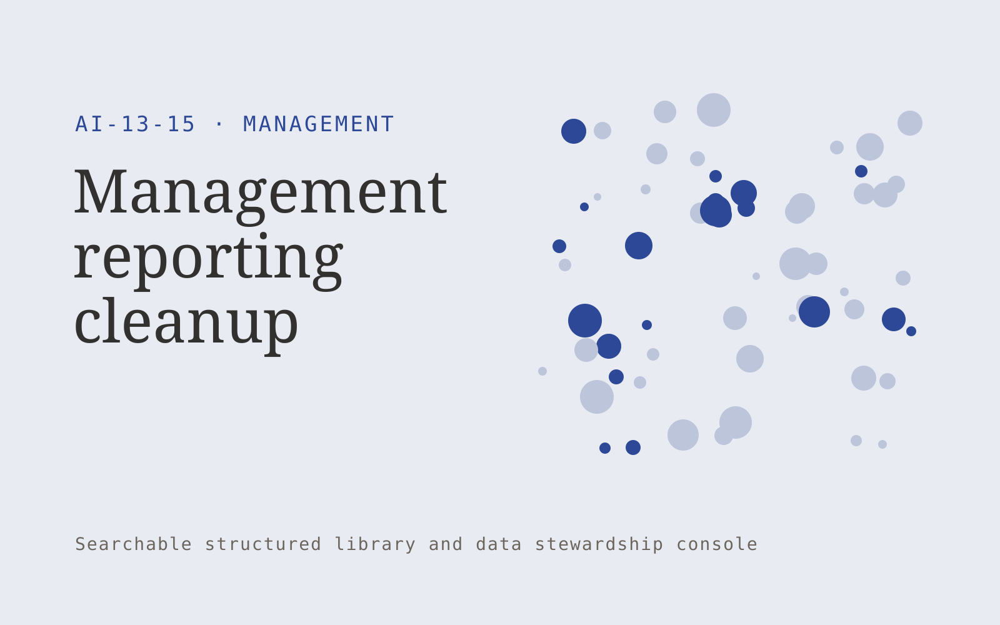

# Management reporting cleanup

**Management** · Also fits: Operations; Human Resources; IT and Development

> For operations leads consolidating inconsistent team reports, turn existing reports and agreed reporting definitions into standardized reporting system and definitions. Address the recurring problem: different status definitions make reports impossible to compare. The value hypothesis is a more complete, reviewable deliverable with less repeated preparation; the pilot must establish whether that benefit is real.

| | |
|---|---|
| **Buyer** | Operations leads consolidating inconsistent team reports |
| **Problem** | Different status definitions make reports impossible to compare. |
| **Format** | Searchable structured library and data stewardship console |
| **USP** | A stable reporting vocabulary and controlled collection process. |

## The product
Key screens: Field mapping, report templates, quality checks. Use a searchable table or visual gallery with filters for the domain’s important attributes. Open each item into a detail drawer containing source records, ownership and history. Put proposed merges and field changes in a separate review queue. Provide a preview before any bulk export. In this product, the first view is field mapping, followed by report templates and quality checks.

## Core functionality
1. Inventory report fields.
2. Standardize status meanings.
3. Map historical records.
4. Flag incompatible measures.
5. Create input templates.
6. Document reporting owners.

## Customer workflow
Import a limited collection, define canonical fields, suggest tags or mappings, review uncertain records, publish approved items, search and reuse them, and request periodic owner updates. Start with existing reports and agreed reporting definitions and finish with standardized reporting system and definitions.

## AI and human review
Suggest classifications, semantic tags, duplicate candidates and field mappings. Preserve original values. Use explicit validation for identifiers and units. Human stewards approve ambiguous merges and factual changes.

## Customer inputs
Existing reports and agreed reporting definitions

## Customer deliverables
Standardized reporting system and definitions

## Accounts and administration
Record ownership, access permissions, change proposals, original-value retention, version history, review dates, bulk import/export and duplicate resolution.

## MVP scope
Begin with operations leads consolidating inconsistent team reports and one recurring use case. Build the first two modules: inventory report fields; standardize status meanings. Provide operator assistance for the third module: map historical records. Deliver standardized reporting system and definitions through a manual review queue. Perform other necessary full-scope functions manually during the pilot. Include all applicable access, accuracy and professional-review controls from the start.

## After MVP validation
After paid pilots establish value, automate the remaining modules: flag incompatible measures; create input templates; document reporting owners. Add one validated source integration, reusable customer configuration and recurring delivery. Expand to additional teams, document formats or languages only after testing the new scope.

## Build dependencies
Stable identifiers, an agreed data schema, reversible imports, mapping review and source ownership. Data quality work can exceed model development effort.

## Integrations and data access
Team updates, calendars, project records and agreed management routines. Source systems, catalog exports and cloud file storage. Start with reversible CSV or file imports and validate identifiers before any direct writes. These are candidate integration categories, not verified supported connectors.

## Defensibility
A useful niche taxonomy, customer-approved mappings and accumulated correction history that improve retrieval and reduce repeated cleanup. For this idea, build around a stable reporting vocabulary and controlled collection process. This advantage requires execution and accumulated customer trust; the base model alone is not a defensible asset.

## Alternatives and positioning
Spreadsheets, shared folders, existing asset or information management systems and manual data cleanup. Differentiate on this specific proposed advantage: a stable reporting vocabulary and controlled collection process. Test it against the buyer's current method on the same task. Competitor coverage and uniqueness have not been established.

## Revenue model and test pricing (USD)
Test USD 500-2,500 for one collection cleanup and launch, followed by USD 100-500 monthly for maintenance within agreed record limits. Larger migrations and complex rights management are separately scoped. Prices are hypotheses.

## Main delivery costs
Import cleanup, extraction, storage, indexing, steward review, duplicate investigation and recurring source updates.

## Marketing message to test
> Management reporting cleanup for operations leads consolidating inconsistent team reports. A stable reporting vocabulary and controlled collection process. Demonstrate the claim through a report consistency audit.

## Acquisition channels
Fractional operations leaders

## Lead magnet
A report consistency audit

## First 30 days of marketing
- Week 1: interview five prospective buyers in this segment: operations leads consolidating inconsistent team reports. Ask to see a recent example of the problem and their current process.
- Week 2: prepare this demonstration using authorized or synthetic material: a report consistency audit.
- Week 3: present it through fractional operations leaders and seek one narrowly scoped paid pilot.
- Week 4: review comparable records, preparation time, total delivery effort and a concrete renewal decision before increasing scope.

## Paid pilot and validation
Clean and organize one representative collection. Have users perform real search or mapping tasks. Check every proposed merge in the sample and compare search success with the existing system. For this idea, use existing reports and agreed reporting definitions and evaluate standardized reporting system and definitions. Agree success thresholds with the buyer before starting; collect a baseline for comparable records, preparation time. A positive signal is payment and repeat use with acceptable quality and delivery cost, not a favorable demo reaction alone.

## Success metrics
Comparable records, preparation time

## Retention and expansion
Provide owner reminders and periodic cleanup. Add another collection only after record quality and retrieval are stable in the initial one.

## Operating controls and limitations
Confirm owners, decisions and commitments. Keep employee discussion notes access-controlled and avoid covert individual performance inference. Validate source access and reviewer availability during the pilot. Maintain customer-level access, data deletion controls and a record of final approvals.

## Brand style (concept)

- Colors: `#275891` primary · `#c97254` accent · `#e4eaf1` surface · `#22201e` ink
- Type: Fraunces for headings, Inter for text
- Voice: Practical, organised, candid
- Demo site: [https://nexibeo.com/ideas/management-reporting-cleanup/demo/](https://nexibeo.com/ideas/management-reporting-cleanup/demo/)

## Investment indication

Indicative build budget, from MVP to full product. This is a planning range, not a quote; it excludes running costs such as model usage, hosting and reviewer hours.

| Phase | Scope | Timeline | Indicative budget |
|---|---|---|---|
| MVP | One buyer segment, one recurring use case; first modules: inventory report fields; standardize status meanings. Manual review in the loop. | 5 weeks | $9,000 |
| Paid pilot | Accounts, roles, review states, audit trail and the first integration, hardened for two to three paying pilot customers. | 6 weeks | $10,500 |
| Full product | Remaining modules: flag incompatible measures; create input templates; document reporting owners. Self-serve onboarding, billing, monitoring and the wider integration set. | 10 weeks | $15,000 |
| **Total** | | 21 weeks | **$34,500** |

**Co-create this project with us:** [contact Nexibeo](https://nexibeo.com/ideas/management-reporting-cleanup/#apply) and we build it with you.

## Research status
Concept proposal expanded from the 315-idea conversation. Demand, pricing, differentiation, build scope and integration feasibility are hypotheses, not verified market findings. Category link is inspiration rather than evidence of business viability.

## Credits and next steps

- **Estimation and building this idea:** see the full idea page on [nexibeo.com](https://nexibeo.com/ideas/management-reporting-cleanup/) for more detail on estimation, and to co-create and build this idea with Nexibeo.
- **Become an AI-optimized specialist for Management:** [Complete AI Training](https://completeaitraining.com/tag/management/?contentType=ai-certification).
- Field news: [AI news for Management](https://completeaitraining.com/all-ai-news-for-management/).
