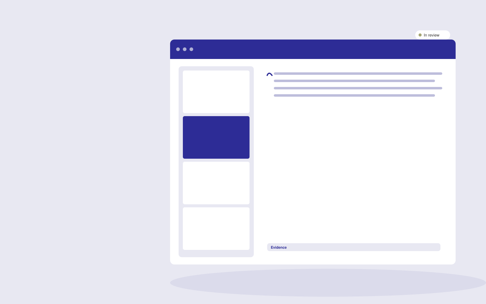

# Customer research synthesis

**Marketing** · Also fits: Creatives; Sales; Science and Research

> For brand strategists at small consumer businesses, turn authorized customer interviews and review exports into research synthesis and positioning options. Address the recurring problem: research interviews produce notes without clear positioning implications. The value hypothesis is a more complete, reviewable deliverable with less repeated preparation; the pilot must establish whether that benefit is real.

| | |
|---|---|
| **Buyer** | Brand strategists at small consumer businesses |
| **Problem** | Research interviews produce notes without clear positioning implications. |
| **Format** | Research evidence workspace with reviewed deliverables |
| **USP** | Customer wording and contradictory evidence remain visible in strategic recommendations. |

## The product
Key screens: Research questions, evidence themes, positioning options. Organize work by research question. Show a source library, an evidence matrix and a draft findings panel with linked quotations. Keep contradictory findings and unanswered questions visible. Allow reviewers to inspect the original context before accepting an interpretation. In this product, the first view is research questions, followed by evidence themes and positioning options.

## Core functionality
1. Tag customer situations.
2. Extract recurring language.
3. Preserve outliers.
4. Compare segments.
5. Formulate positioning hypotheses.
6. Link each hypothesis to evidence.

## Customer workflow
Agree the decision and research questions, define permitted sources or participants, collect evidence, code findings, compare supporting and contradictory material, review interpretations, and deliver a cited brief with next questions. Start with authorized customer interviews and review exports and finish with research synthesis and positioning options.

## AI and human review
Assist with retrieval, transcription, structured extraction and thematic synthesis. Preserve source passages and methodological context. Human researchers validate inclusion, quotations and conclusions. Use real participants when customer research is required.

## Customer inputs
Authorized customer interviews and review exports

## Customer deliverables
Research synthesis and positioning options

## Accounts and administration
Source provenance, participant consent where applicable, research questions, coding definitions, reviewer disagreements, citations and versioned conclusions.

## MVP scope
Begin with brand strategists at small consumer businesses and one recurring use case. Build the first two modules: tag customer situations; extract recurring language. Provide operator assistance for the third module: preserve outliers. Deliver research synthesis and positioning options through a manual review queue. Perform other necessary full-scope functions manually during the pilot. Include all applicable access, accuracy and professional-review controls from the start.

## After MVP validation
After paid pilots establish value, automate the remaining modules: compare segments; formulate positioning hypotheses; link each hypothesis to evidence. Add one validated source integration, reusable customer configuration and recurring delivery. Expand to additional teams, document formats or languages only after testing the new scope.

## Build dependencies
A clear research protocol, source access, citation tracking and qualified interpretation. Interview work also needs relevant participants and consent management.

## Integrations and data access
Approved brand material, campaign exports and authorized customer research. Permitted research libraries, interview recording imports, citation exports and document editors. Preserve original source metadata throughout the workflow. These are candidate integration categories, not verified supported connectors.

## Defensibility
Niche research protocols, credible researcher relationships and a rights-cleared evidence archive with consistent interpretation methods. For this idea, build around customer wording and contradictory evidence remain visible in strategic recommendations. This advantage requires execution and accumulated customer trust; the base model alone is not a defensible asset.

## Alternatives and positioning
Research consultants, internal analysts, literature databases and general search or summarization tools. Differentiate on this specific proposed advantage: customer wording and contradictory evidence remain visible in strategic recommendations. Test it against the buyer's current method on the same task. Competitor coverage and uniqueness have not been established.

## Revenue model and test pricing (USD)
Test USD 750-3,000 for one tightly bounded research question and evidence pack. Participant recruitment, specialist review and licensed data are separately scoped. Repeat tracking can become a retainer. Prices are hypotheses.

## Main delivery costs
Researcher time, source access, participant recruitment, transcription, evidence coding, expert review and report revisions.

## Marketing message to test
> Customer research synthesis for brand strategists at small consumer businesses. Customer wording and contradictory evidence remain visible in strategic recommendations. Demonstrate the claim through a customer-language insight report.

## Acquisition channels
Brand strategy consultants

## Lead magnet
A customer-language insight report

## First 30 days of marketing
- Week 1: interview five prospective buyers in this segment: brand strategists at small consumer businesses. Ask to see a recent example of the problem and their current process.
- Week 2: prepare this demonstration using authorized or synthetic material: a customer-language insight report.
- Week 3: present it through brand strategy consultants and seek one narrowly scoped paid pilot.
- Week 4: review evidence coverage, hypotheses tested, total delivery effort and a concrete renewal decision before increasing scope.

## Paid pilot and validation
Answer one practical question using a bounded evidence set. Ask a domain expert to review citations and reasoning, identify contrary evidence and assess whether the deliverable supports the intended decision. For this idea, use authorized customer interviews and review exports and evaluate research synthesis and positioning options. Agree success thresholds with the buyer before starting; collect a baseline for evidence coverage, hypotheses tested. A positive signal is payment and repeat use with acceptable quality and delivery cost, not a favorable demo reaction alone.

## Success metrics
Evidence coverage, hypotheses tested

## Retention and expansion
Maintain the research question and evidence archive, offer follow-up studies and refresh important sources. Build repeat work around the buyer’s decision cycle.

## Operating controls and limitations
Verify product claims and permissions. Distinguish observed campaign results from causal explanations and keep customer data collection authorized. Validate source access and reviewer availability during the pilot. Maintain customer-level access, data deletion controls and a record of final approvals.

## Brand style (concept)

- Colors: `#2e2791` primary · `#c9ba54` accent · `#e5e4f1` surface · `#22201e` ink
- Type: Playfair Display for headings, Source Sans 3 for text
- Voice: Energetic, specific, results-minded
- Demo site: [https://nexibeo.com/ideas/customer-research-synthesis/demo/](https://nexibeo.com/ideas/customer-research-synthesis/demo/)

## Investment indication

Indicative build budget, from MVP to full product. This is a planning range, not a quote; it excludes running costs such as model usage, hosting and reviewer hours. Built with Nexibeo's AI software development factory, most implementations take days to a few weeks of creation time, depending on availability.

| Phase | Scope | Creation time | Indicative budget |
|---|---|---|---|
| MVP | One buyer segment, one recurring use case; first modules: tag customer situations; extract recurring language. Manual review in the loop. | 3 days | $7,000 |
| Paid pilot | Accounts, roles, review states, audit trail and the first integration, hardened for two to three paying pilot customers. | 4 days | $7,500 |
| Full product | Remaining modules: compare segments; formulate positioning hypotheses; link each hypothesis to evidence. Self-serve onboarding, billing, monitoring and the wider integration set. | 8 days | $10,500 |
| **Total** | | about 3 weeks | **$25,000** |

### Running costs per month (rough indication, untested)

| Stage | Hosting and infrastructure | AI usage | Total per month |
|---|---|---|---|
| MVP and paid pilot (about 3 customers) | $30–$60 | $80–$160 | **$110–$220** |
| Full product (about 50 customers) | $110–$210 | $880–$1,750 | **$990–$1,960** |

**Co-create this project with us:** [contact Nexibeo](https://nexibeo.com/ideas/customer-research-synthesis/#apply) and we build it with you.

## Research status
Concept proposal expanded from the 315-idea conversation. Demand, pricing, differentiation, build scope and integration feasibility are hypotheses, not verified market findings. Category link is inspiration rather than evidence of business viability.

## Credits and next steps

- **Estimation and building this idea:** see the full idea page on [nexibeo.com](https://nexibeo.com/ideas/customer-research-synthesis/) for more detail on estimation, and to co-create and build this idea with Nexibeo.
- **Become an AI-optimized specialist for Marketing:** [Complete AI Training](https://completeaitraining.com/certification/12b-ai-certification-for-marketing-specialists/).
- Field news: [AI news for Marketing](https://completeaitraining.com/all-ai-news-for-marketing/).
