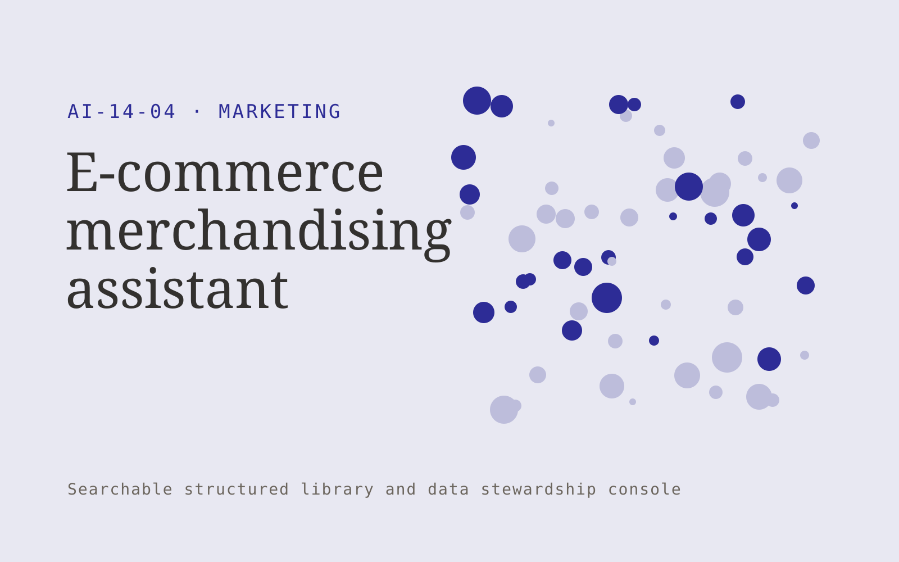

# E-commerce merchandising assistant

**Marketing** · Also fits: Creatives; Sales; IT and Development

> For catalog managers at specialist online stores, turn verified product specifications and catalog taxonomy into reviewed product catalog content. Address the recurring problem: inconsistent product information makes comparison difficult. The value hypothesis is a more complete, reviewable deliverable with less repeated preparation; the pilot must establish whether that benefit is real.

| | |
|---|---|
| **Buyer** | Catalog managers at specialist online stores |
| **Problem** | Inconsistent product information makes comparison difficult. |
| **Format** | Searchable structured library and data stewardship console |
| **USP** | Specification accuracy and consistent comparison attributes for one product niche. |

## The product
Key screens: Product table, attribute review, storefront preview. Use a searchable table or visual gallery with filters for the domain’s important attributes. Open each item into a detail drawer containing source records, ownership and history. Put proposed merges and field changes in a separate review queue. Provide a preview before any bulk export. In this product, the first view is product table, followed by attribute review and storefront preview.

## Core functionality
1. Normalize attributes.
2. Draft factual descriptions.
3. Flag missing specifications.
4. Suggest categories.
5. Build comparisons.
6. Export approved listings.

## Customer workflow
Import a limited collection, define canonical fields, suggest tags or mappings, review uncertain records, publish approved items, search and reuse them, and request periodic owner updates. Start with verified product specifications and catalog taxonomy and finish with reviewed product catalog content.

## AI and human review
Suggest classifications, semantic tags, duplicate candidates and field mappings. Preserve original values. Use explicit validation for identifiers and units. Human stewards approve ambiguous merges and factual changes.

## Customer inputs
Verified product specifications and catalog taxonomy

## Customer deliverables
Reviewed product catalog content

## Accounts and administration
Record ownership, access permissions, change proposals, original-value retention, version history, review dates, bulk import/export and duplicate resolution.

## MVP scope
Begin with catalog managers at specialist online stores and one recurring use case. Build the first two modules: normalize attributes; draft factual descriptions. Provide operator assistance for the third module: flag missing specifications. Deliver reviewed product catalog content through a manual review queue. Perform other necessary full-scope functions manually during the pilot. Include all applicable access, accuracy and professional-review controls from the start.

## After MVP validation
After paid pilots establish value, automate the remaining modules: suggest categories; build comparisons; export approved listings. Add one validated source integration, reusable customer configuration and recurring delivery. Expand to additional teams, document formats or languages only after testing the new scope.

## Build dependencies
Stable identifiers, an agreed data schema, reversible imports, mapping review and source ownership. Data quality work can exceed model development effort.

## Integrations and data access
Approved brand material, campaign exports and authorized customer research. Source systems, catalog exports and cloud file storage. Start with reversible CSV or file imports and validate identifiers before any direct writes. These are candidate integration categories, not verified supported connectors.

## Defensibility
A useful niche taxonomy, customer-approved mappings and accumulated correction history that improve retrieval and reduce repeated cleanup. For this idea, build around specification accuracy and consistent comparison attributes for one product niche. This advantage requires execution and accumulated customer trust; the base model alone is not a defensible asset.

## Alternatives and positioning
Spreadsheets, shared folders, existing asset or information management systems and manual data cleanup. Differentiate on this specific proposed advantage: specification accuracy and consistent comparison attributes for one product niche. Test it against the buyer's current method on the same task. Competitor coverage and uniqueness have not been established.

## Revenue model and test pricing (USD)
Test USD 500-2,500 for one collection cleanup and launch, followed by USD 100-500 monthly for maintenance within agreed record limits. Larger migrations and complex rights management are separately scoped. Prices are hypotheses.

## Main delivery costs
Import cleanup, extraction, storage, indexing, steward review, duplicate investigation and recurring source updates.

## Marketing message to test
> E-commerce merchandising assistant for catalog managers at specialist online stores. Specification accuracy and consistent comparison attributes for one product niche. Demonstrate the claim through a cleaned sample product category.

## Acquisition channels
E-commerce implementation partners

## Lead magnet
A cleaned sample product category

## First 30 days of marketing
- Week 1: interview five prospective buyers in this segment: catalog managers at specialist online stores. Ask to see a recent example of the problem and their current process.
- Week 2: prepare this demonstration using authorized or synthetic material: a cleaned sample product category.
- Week 3: present it through e-commerce implementation partners and seek one narrowly scoped paid pilot.
- Week 4: review attribute completeness, listing correction rate, total delivery effort and a concrete renewal decision before increasing scope.

## Paid pilot and validation
Clean and organize one representative collection. Have users perform real search or mapping tasks. Check every proposed merge in the sample and compare search success with the existing system. For this idea, use verified product specifications and catalog taxonomy and evaluate reviewed product catalog content. Agree success thresholds with the buyer before starting; collect a baseline for attribute completeness, listing correction rate. A positive signal is payment and repeat use with acceptable quality and delivery cost, not a favorable demo reaction alone.

## Success metrics
Attribute completeness, listing correction rate

## Retention and expansion
Provide owner reminders and periodic cleanup. Add another collection only after record quality and retrieval are stable in the initial one.

## Operating controls and limitations
Verify product claims and permissions. Distinguish observed campaign results from causal explanations and keep customer data collection authorized. Validate source access and reviewer availability during the pilot. Maintain customer-level access, data deletion controls and a record of final approvals.

## Brand style (concept)

- Colors: `#272a91` primary · `#c9c754` accent · `#e4e5f1` surface · `#22201e` ink
- Type: Playfair Display for headings, Source Sans 3 for text
- Voice: Energetic, specific, results-minded
- Demo site: [https://nexibeo.com/ideas/e-commerce-merchandising-assistant/demo/](https://nexibeo.com/ideas/e-commerce-merchandising-assistant/demo/)

## Investment indication

Indicative build budget, from MVP to full product. This is a planning range, not a quote; it excludes running costs such as model usage, hosting and reviewer hours.

| Phase | Scope | Timeline | Indicative budget |
|---|---|---|---|
| MVP | One buyer segment, one recurring use case; first modules: normalize attributes; draft factual descriptions. Manual review in the loop. | 4 weeks | $6,000 |
| Paid pilot | Accounts, roles, review states, audit trail and the first integration, hardened for two to three paying pilot customers. | 5 weeks | $6,500 |
| Full product | Remaining modules: suggest categories; build comparisons; export approved listings. Self-serve onboarding, billing, monitoring and the wider integration set. | 7 weeks | $8,500 |
| **Total** | | 16 weeks | **$21,000** |

### Running costs per month (rough indication, untested)

| Stage | Hosting and infrastructure | AI usage | Total per month |
|---|---|---|---|
| MVP and paid pilot (about 3 customers) | $30–$60 | $50–$100 | **$80–$160** |
| Full product (about 50 customers) | $110–$210 | $350–$700 | **$460–$910** |

**Co-create this project with us:** [contact Nexibeo](https://nexibeo.com/ideas/e-commerce-merchandising-assistant/#apply) and we build it with you.

## Research status
Concept proposal expanded from the 315-idea conversation. Demand, pricing, differentiation, build scope and integration feasibility are hypotheses, not verified market findings. Category link is inspiration rather than evidence of business viability.

## Credits and next steps

- **Estimation and building this idea:** see the full idea page on [nexibeo.com](https://nexibeo.com/ideas/e-commerce-merchandising-assistant/) for more detail on estimation, and to co-create and build this idea with Nexibeo.
- **Become an AI-optimized specialist for Marketing:** [Complete AI Training](https://completeaitraining.com/certification/12b-ai-certification-for-marketing-specialists/).
- Field news: [AI news for Marketing](https://completeaitraining.com/all-ai-news-for-marketing/).
