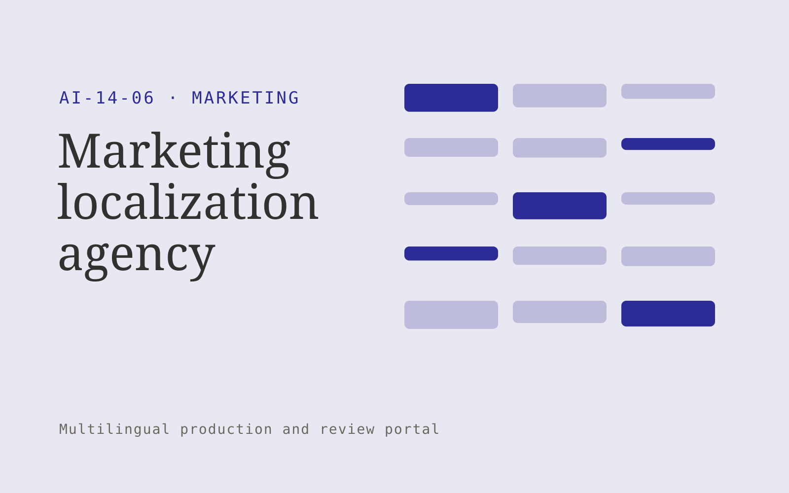

# Marketing localization agency

**Marketing** · Also fits: Creatives; Sales; PR and Communications

> For brands expanding into a second language market, turn approved campaigns, research and local reviewer guidance into localized campaign assets. Address the recurring problem: literal campaign translations miss customer context. The value hypothesis is a more complete, reviewable deliverable with less repeated preparation; the pilot must establish whether that benefit is real.

| | |
|---|---|
| **Buyer** | Brands expanding into a second language market |
| **Problem** | Literal campaign translations miss customer context. |
| **Format** | Multilingual production and review portal |
| **USP** | A connected campaign across ads, pages and email with local editorial review. |

## The product
Key screens: Campaign versions, bilingual editor, regional review. Use aligned source and target language panes with shared terminology highlights. Include a language status grid, reviewer assignment queue, and layout or timeline preview. Show unresolved ambiguities next to the affected passage. Keep approvals separate for each language and version. In this product, the first view is campaign versions, followed by bilingual editor and regional review.

## Core functionality
1. Translate core messages.
2. Adapt examples.
3. Check cultural context.
4. Preserve claims.
5. Localize landing pages.
6. Coordinate regional approval.

## Customer workflow
Upload authorized source content, confirm target languages and terminology, create translation drafts, assign qualified reviewers, reconcile source changes, check layout or timing, and deliver approved language versions. Start with approved campaigns, research and local reviewer guidance and finish with localized campaign assets.

## AI and human review
Draft translations, transcribe media when applicable, suggest terminology and detect inconsistencies. Deterministic checks compare dates, numbers and identifiers. Qualified language reviewers decide idiomatic phrasing and specialist meaning. Voice work requires explicit permissions for the intended use.

## Customer inputs
Approved campaigns, research and local reviewer guidance

## Customer deliverables
Localized campaign assets

## Accounts and administration
Language permissions, glossary versions, reviewer assignments, segment comments, source-change alerts, per-language approvals and delivery history.

## MVP scope
Begin with brands expanding into a second language market and one recurring use case. Build the first two modules: translate core messages; adapt examples. Provide operator assistance for the third module: check cultural context. Deliver localized campaign assets through a manual review queue. Perform other necessary full-scope functions manually during the pilot. Include all applicable access, accuracy and professional-review controls from the start.

## After MVP validation
After paid pilots establish value, automate the remaining modules: preserve claims; localize landing pages; coordinate regional approval. Add one validated source integration, reusable customer configuration and recurring delivery. Expand to additional teams, document formats or languages only after testing the new scope.

## Build dependencies
Segment alignment, glossary enforcement, multilingual text handling, comparison views and qualified reviewers. Media projects also need timing and audio/video QA.

## Integrations and data access
Approved brand material, campaign exports and authorized customer research. Document formats, subtitle formats, media storage and publishing systems. Confirm language, font and layout support for each requested output. These are candidate integration categories, not verified supported connectors.

## Defensibility
Customer-controlled approved terminology, reviewed translation examples and dependable specialist reviewer relationships. For this idea, build around a connected campaign across ads, pages and email with local editorial review. This advantage requires execution and accumulated customer trust; the base model alone is not a defensible asset.

## Alternatives and positioning
Translation agencies, freelance linguists, generic machine translation and internal bilingual staff. Differentiate on this specific proposed advantage: a connected campaign across ads, pages and email with local editorial review. Test it against the buyer's current method on the same task. Competitor coverage and uniqueness have not been established.

## Revenue model and test pricing (USD)
Quote an initial USD 300-1,200 batch for a defined word count or media duration and one target language. Charge separately for extra languages, specialist review and dubbing. Test recurring volume agreements after the pilot; prices are hypotheses.

## Main delivery costs
Source preparation, translation volume, transcription or dubbing, qualified reviewers, glossary maintenance and changed-source rework.

## Marketing message to test
> Marketing localization agency for brands expanding into a second language market. A connected campaign across ads, pages and email with local editorial review. Demonstrate the claim through a localized campaign comparison with reviewer notes.

## Acquisition channels
International growth consultants

## Lead magnet
A localized campaign comparison with reviewer notes

## First 30 days of marketing
- Week 1: interview five prospective buyers in this segment: brands expanding into a second language market. Ask to see a recent example of the problem and their current process.
- Week 2: prepare this demonstration using authorized or synthetic material: a localized campaign comparison with reviewer notes.
- Week 3: present it through international growth consultants and seek one narrowly scoped paid pilot.
- Week 4: review local reviewer acceptance, test conversion, total delivery effort and a concrete renewal decision before increasing scope.

## Paid pilot and validation
Translate a representative sample and have an independent qualified reviewer assess it. Include a source revision to measure update handling. Track corrections, meaning preservation and total delivery effort. For this idea, use approved campaigns, research and local reviewer guidance and evaluate localized campaign assets. Agree success thresholds with the buyer before starting; collect a baseline for local reviewer acceptance, test conversion. A positive signal is payment and repeat use with acceptable quality and delivery cost, not a favorable demo reaction alone.

## Success metrics
Local reviewer acceptance, test conversion

## Retention and expansion
Maintain approved terminology and reviewer continuity. Charge for ongoing source updates and add languages only when the buyer has a real publishing need.

## Operating controls and limitations
Verify product claims and permissions. Distinguish observed campaign results from causal explanations and keep customer data collection authorized. Validate source access and reviewer availability during the pilot. Maintain customer-level access, data deletion controls and a record of final approvals.

## Brand style (concept)

- Colors: `#273591` primary · `#bcc954` accent · `#e4e6f1` surface · `#22201e` ink
- Type: Playfair Display for headings, Source Sans 3 for text
- Voice: Energetic, specific, results-minded
- Demo site: [https://nexibeo.com/ideas/marketing-localization-agency/demo/](https://nexibeo.com/ideas/marketing-localization-agency/demo/)

## Investment indication

Indicative build budget, from MVP to full product. This is a planning range, not a quote; it excludes running costs such as model usage, hosting and reviewer hours. Built with Nexibeo's AI software development factory, most implementations take days to a few weeks of creation time, depending on availability.

| Phase | Scope | Creation time | Indicative budget |
|---|---|---|---|
| MVP | One buyer segment, one recurring use case; first modules: translate core messages; adapt examples. Manual review in the loop. | 6 days | $10,000 |
| Paid pilot | Accounts, roles, review states, audit trail and the first integration, hardened for two to three paying pilot customers. | 7 days | $13,000 |
| Full product | Remaining modules: preserve claims; localize landing pages; coordinate regional approval. Self-serve onboarding, billing, monitoring and the wider integration set. | 2 weeks | $17,500 |
| **Total** | | about 5 weeks | **$40,500** |

### Running costs per month (rough indication, untested)

| Stage | Hosting and infrastructure | AI usage | Total per month |
|---|---|---|---|
| MVP and paid pilot (about 3 customers) | $40–$80 | $100–$200 | **$140–$280** |
| Full product (about 50 customers) | $160–$320 | $1,230–$2,450 | **$1,390–$2,770** |

**Co-create this project with us:** [contact Nexibeo](https://nexibeo.com/ideas/marketing-localization-agency/#apply) and we build it with you.

## Research status
Concept proposal expanded from the 315-idea conversation. Demand, pricing, differentiation, build scope and integration feasibility are hypotheses, not verified market findings. Category link is inspiration rather than evidence of business viability.

## Credits and next steps

- **Estimation and building this idea:** see the full idea page on [nexibeo.com](https://nexibeo.com/ideas/marketing-localization-agency/) for more detail on estimation, and to co-create and build this idea with Nexibeo.
- **Become an AI-optimized specialist for Marketing:** [Complete AI Training](https://completeaitraining.com/certification/12b-ai-certification-for-marketing-specialists/).
- Field news: [AI news for Marketing](https://completeaitraining.com/all-ai-news-for-marketing/).
