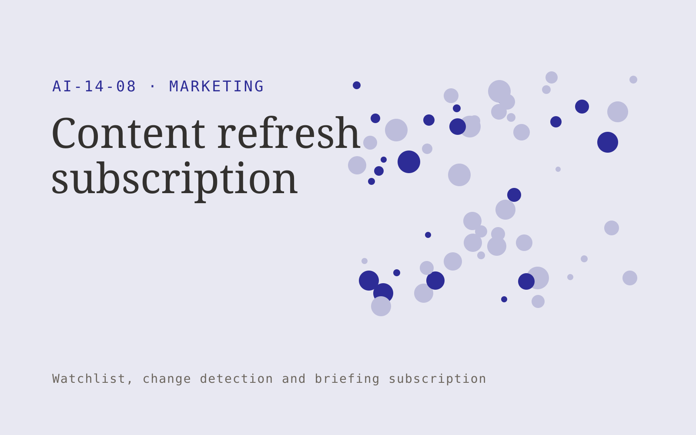

# Content refresh subscription

**Marketing** · Also fits: Creatives; Sales; Executives and Strategy

> For marketing teams with established educational websites, turn owned content, source references and update criteria into reviewed content updates and freshness register. Address the recurring problem: old claims and broken references undermine useful existing content. The value hypothesis is a more complete, reviewable deliverable with less repeated preparation; the pilot must establish whether that benefit is real.

| | |
|---|---|
| **Buyer** | Marketing teams with established educational websites |
| **Problem** | Old claims and broken references undermine useful existing content. |
| **Format** | Watchlist, change detection and briefing subscription |
| **USP** | Refreshes prioritize factual accuracy and source change rather than arbitrary rewrites. |

## The product
Key screens: Content inventory, change alerts, revision queue. Use a watchlist with source health and last-checked dates, a chronological change feed, and a reviewable briefing editor. Display original evidence beside each alert. Let users mute irrelevant topics and record whether a change led to action. In this product, the first view is content inventory, followed by change alerts and revision queue.

## Core functionality
1. Detect stale references.
2. Inspect broken links.
3. Identify outdated details.
4. Draft updates.
5. Assign subject reviewers.
6. Record refresh dates.

## Customer workflow
Agree a narrow watchlist, confirm lawful source access, collect dated snapshots, detect candidate changes, review relevance and accuracy, deliver a concise digest, and refine the watchlist from buyer feedback. Start with owned content, source references and update criteria and finish with reviewed content updates and freshness register.

## AI and human review
Classify source material, group related developments and summarize verified changes. Use deterministic snapshot comparison for factual changes where possible. Distinguish observed publication content from analyst interpretation and uncertain implications.

## Customer inputs
Owned content, source references and update criteria

## Customer deliverables
Reviewed content updates and freshness register

## Accounts and administration
Watchlist ownership, source health, dated evidence, deduplication, topic filters, editorial review, delivery preferences and alert feedback.

## MVP scope
Begin with marketing teams with established educational websites and one recurring use case. Build the first two modules: detect stale references; inspect broken links. Provide operator assistance for the third module: identify outdated details. Deliver reviewed content updates and freshness register through a manual review queue. Perform other necessary full-scope functions manually during the pilot. Include all applicable access, accuracy and professional-review controls from the start.

## After MVP validation
After paid pilots establish value, automate the remaining modules: draft updates; assign subject reviewers; record refresh dates. Add one validated source integration, reusable customer configuration and recurring delivery. Expand to additional teams, document formats or languages only after testing the new scope.

## Build dependencies
Reliable permitted source access, change history, publication dates, deduplication and editorial QA. Coverage limits and inaccessible sources must be visible.

## Integrations and data access
Approved brand material, campaign exports and authorized customer research. Permitted feeds, published document sources, email digests and internal briefing channels. Verify collection rights and source reliability before selling coverage commitments. These are candidate integration categories, not verified supported connectors.

## Defensibility
A curated source network, historical change archive and buyer-specific relevance judgments within a narrow topic. For this idea, build around refreshes prioritize factual accuracy and source change rather than arbitrary rewrites. This advantage requires execution and accumulated customer trust; the base model alone is not a defensible asset.

## Alternatives and positioning
Newsletters, search alerts, analysts and general media or website monitoring tools. Differentiate on this specific proposed advantage: refreshes prioritize factual accuracy and source change rather than arbitrary rewrites. Test it against the buyer's current method on the same task. Competitor coverage and uniqueness have not been established.

## Revenue model and test pricing (USD)
Test USD 100-500 monthly for a narrow shared briefing, or USD 750-2,500 monthly for bespoke analyst coverage. Licensed source access and unusual collection requirements are extra. Prices require validation.

## Main delivery costs
Source licensing, collection reliability, change processing, analyst verification, missed-signal review and digest production.

## Marketing message to test
> Content refresh subscription for marketing teams with established educational websites. Refreshes prioritize factual accuracy and source change rather than arbitrary rewrites. Demonstrate the claim through a factual freshness audit of ten pages.

## Acquisition channels
Content operations consultants

## Lead magnet
A factual freshness audit of ten pages

## First 30 days of marketing
- Week 1: interview five prospective buyers in this segment: marketing teams with established educational websites. Ask to see a recent example of the problem and their current process.
- Week 2: prepare this demonstration using authorized or synthetic material: a factual freshness audit of ten pages.
- Week 3: present it through content operations consultants and seek one narrowly scoped paid pilot.
- Week 4: review confirmed stale issues fixed, review time, total delivery effort and a concrete renewal decision before increasing scope.

## Paid pilot and validation
Deliver several scheduled digests for a small watchlist. Have the buyer label useful and irrelevant items, independently check important missed developments and assess whether the briefing changes a decision. For this idea, use owned content, source references and update criteria and evaluate reviewed content updates and freshness register. Agree success thresholds with the buyer before starting; collect a baseline for confirmed stale issues fixed, review time. A positive signal is payment and repeat use with acceptable quality and delivery cost, not a favorable demo reaction alone.

## Success metrics
Confirmed stale issues fixed, review time

## Retention and expansion
Tune relevance from buyer feedback, preserve historical changes and offer deeper analyst review for selected topics. Add sources only when they improve useful coverage.

## Operating controls and limitations
Verify product claims and permissions. Distinguish observed campaign results from causal explanations and keep customer data collection authorized. Validate source access and reviewer availability during the pilot. Maintain customer-level access, data deletion controls and a record of final approvals.

## Brand style (concept)

- Colors: `#382791` primary · `#c9c554` accent · `#e7e4f1` surface · `#22201e` ink
- Type: Playfair Display for headings, Source Sans 3 for text
- Voice: Energetic, specific, results-minded
- Demo site: [https://nexibeo.com/ideas/content-refresh-subscription/demo/](https://nexibeo.com/ideas/content-refresh-subscription/demo/)

## Investment indication

Indicative build budget, from MVP to full product. This is a planning range, not a quote; it excludes running costs such as model usage, hosting and reviewer hours. Built with Nexibeo's AI software development factory, most implementations take days to a few weeks of creation time, depending on availability.

| Phase | Scope | Creation time | Indicative budget |
|---|---|---|---|
| MVP | One buyer segment, one recurring use case; first modules: detect stale references; inspect broken links. Manual review in the loop. | 2 days | $5,000 |
| Paid pilot | Accounts, roles, review states, audit trail and the first integration, hardened for two to three paying pilot customers. | 3 days | $4,500 |
| Full product | Remaining modules: draft updates; assign subject reviewers; record refresh dates. Self-serve onboarding, billing, monitoring and the wider integration set. | 5 days | $6,500 |
| **Total** | | 10 days | **$16,000** |

### Running costs per month (rough indication, untested)

| Stage | Hosting and infrastructure | AI usage | Total per month |
|---|---|---|---|
| MVP and paid pilot (about 3 customers) | $30–$60 | $50–$100 | **$80–$160** |
| Full product (about 50 customers) | $110–$210 | $350–$700 | **$460–$910** |

**Co-create this project with us:** [contact Nexibeo](https://nexibeo.com/ideas/content-refresh-subscription/#apply) and we build it with you.

## Research status
Concept proposal expanded from the 315-idea conversation. Demand, pricing, differentiation, build scope and integration feasibility are hypotheses, not verified market findings. Category link is inspiration rather than evidence of business viability.

## Credits and next steps

- **Estimation and building this idea:** see the full idea page on [nexibeo.com](https://nexibeo.com/ideas/content-refresh-subscription/) for more detail on estimation, and to co-create and build this idea with Nexibeo.
- **Become an AI-optimized specialist for Marketing:** [Complete AI Training](https://completeaitraining.com/certification/12b-ai-certification-for-marketing-specialists/).
- Field news: [AI news for Marketing](https://completeaitraining.com/all-ai-news-for-marketing/).
