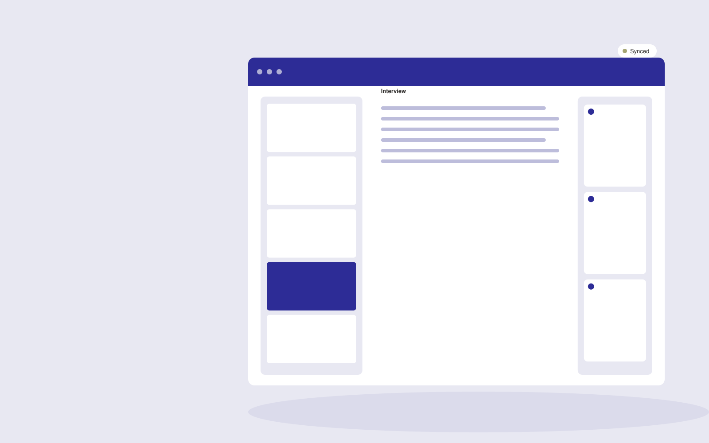

# Customer case study studio

**Marketing** · Also fits: Creatives; Sales; Writers

> For B2B marketing teams with willing reference customers, turn authorized interviews, verified metrics and permission records into approved case study and sales extracts. Address the recurring problem: strong customer outcomes remain undocumented. The value hypothesis is a more complete, reviewable deliverable with less repeated preparation; the pilot must establish whether that benefit is real.

| | |
|---|---|
| **Buyer** | B2B marketing teams with willing reference customers |
| **Problem** | Strong customer outcomes remain undocumented. |
| **Format** | Source-based content workspace with editorial delivery |
| **USP** | Customer permission and evidence verification remain part of the publishing workflow. |

## The product
Key screens: Interview workspace, evidence library, customer approval. Use a project list and editorial calendar beside a document editor. Keep original material and supporting passages in a collapsible side panel. Show outline, draft, review and approved stages. Provide tracked edits, comments, version comparisons and an export preview that reflects the final delivery format. In this product, the first view is interview workspace, followed by evidence library and customer approval.

## Core functionality
1. Prepare interview questions.
2. Extract outcome narratives.
3. Verify numerical claims.
4. Draft stories.
5. Coordinate customer approval.
6. Adapt sales formats.

## Customer workflow
Collect a structured brief and source material, identify unanswered questions, approve an outline, generate a draft, verify claims, gather reviewer edits, approve a final version and export the agreed formats. Start with authorized interviews, verified metrics and permission records and finish with approved case study and sales extracts.

## AI and human review
Extract and organize information, propose structure, draft prose and adapt approved content to audiences. Attach evidence to factual claims. Keep names, dates, amounts and quoted wording linked to their source. Editors resolve ambiguity and approve publication.

## Customer inputs
Authorized interviews, verified metrics and permission records

## Customer deliverables
Approved case study and sales extracts

## Accounts and administration
Client workspaces, source permissions, editorial assignments, change history, reviewer comments, approval gates, revision allowances and export templates.

## MVP scope
Begin with B2B marketing teams with willing reference customers and one recurring use case. Build the first two modules: prepare interview questions; extract outcome narratives. Provide operator assistance for the third module: verify numerical claims. Deliver approved case study and sales extracts through a manual review queue. Perform other necessary full-scope functions manually during the pilot. Include all applicable access, accuracy and professional-review controls from the start.

## After MVP validation
After paid pilots establish value, automate the remaining modules: draft stories; coordinate customer approval; adapt sales formats. Add one validated source integration, reusable customer configuration and recurring delivery. Expand to additional teams, document formats or languages only after testing the new scope.

## Build dependencies
Document parsing, a source-linked editor, tracked revisions, reviewer workflow and reliable document export. Rich presentation or print output needs format-specific QA.

## Integrations and data access
Approved brand material, campaign exports and authorized customer research. Document storage, word processor export, content management systems and approved publishing channels. Pilot with uploads and downloadable drafts before adding write integrations. These are candidate integration categories, not verified supported connectors.

## Defensibility
Customer-approved terminology, reusable structures, source libraries and editorial feedback tied to a specific audience and recurring publishing workflow. For this idea, build around customer permission and evidence verification remain part of the publishing workflow. This advantage requires execution and accumulated customer trust; the base model alone is not a defensible asset.

## Alternatives and positioning
Writers, editors, agencies, internal document templates and general-purpose chat tools. Differentiate on this specific proposed advantage: customer permission and evidence verification remain part of the publishing workflow. Test it against the buyer's current method on the same task. Competitor coverage and uniqueness have not been established.

## Revenue model and test pricing (USD)
Test USD 400-1,500 for a tightly scoped initial content package. Convert repeated work to a monthly retainer with explicit deliverable and revision limits. Specialist review and substantial research are separately scoped. Prices are hypotheses.

## Main delivery costs
Research and interview time, transcription, model usage, factual verification, subject-matter review, editing and revisions.

## Marketing message to test
> Customer case study studio for B2B marketing teams with willing reference customers. Customer permission and evidence verification remain part of the publishing workflow. Demonstrate the claim through a case study outline from a short interview.

## Acquisition channels
Customer marketing communities

## Lead magnet
A case study outline from a short interview

## First 30 days of marketing
- Week 1: interview five prospective buyers in this segment: B2B marketing teams with willing reference customers. Ask to see a recent example of the problem and their current process.
- Week 2: prepare this demonstration using authorized or synthetic material: a case study outline from a short interview.
- Week 3: present it through customer marketing communities and seek one narrowly scoped paid pilot.
- Week 4: review customer approval rate, sales reuse, total delivery effort and a concrete renewal decision before increasing scope.

## Paid pilot and validation
Complete one existing brief using the customer’s actual sources. Record reviewer edits, factual corrections and preparation time. Ask the same buyer to commission a second comparable deliverable. For this idea, use authorized interviews, verified metrics and permission records and evaluate approved case study and sales extracts. Agree success thresholds with the buyer before starting; collect a baseline for customer approval rate, sales reuse. A positive signal is payment and repeat use with acceptable quality and delivery cost, not a favorable demo reaction alone.

## Success metrics
Customer approval rate, sales reuse

## Retention and expansion
Maintain the approved source and voice library, schedule recurring editorial work, and expand into additional formats only after the core deliverable is repeatedly accepted.

## Operating controls and limitations
Verify product claims and permissions. Distinguish observed campaign results from causal explanations and keep customer data collection authorized. Validate source access and reviewer availability during the pilot. Maintain customer-level access, data deletion controls and a record of final approvals.

## Brand style (concept)

- Colors: `#272791` primary · `#c9a454` accent · `#e4e4f1` surface · `#22201e` ink
- Type: Sora for headings, Work Sans for text
- Voice: Energetic, specific, results-minded
- Demo site: [https://nexibeo.com/solutions/customer-case-study-studio/demo/](https://nexibeo.com/solutions/customer-case-study-studio/demo/)

## Investment indication

Indicative build budget, from MVP to full product. This is a planning range, not a quote; it excludes running costs such as model usage, hosting and reviewer hours. Built with Nexibeo's AI software development factory, most implementations take days to a few weeks of creation time, depending on availability.

| Phase | Scope | Creation time | Indicative budget |
|---|---|---|---|
| MVP | One buyer segment, one recurring use case; first modules: prepare interview questions; extract outcome narratives. Manual review in the loop. | 4 days | $7,000 |
| Paid pilot | Accounts, roles, review states, audit trail and the first integration, hardened for two to three paying pilot customers. | 5 days | $8,000 |
| Full product | Remaining modules: draft stories; coordinate customer approval; adapt sales formats. Self-serve onboarding, billing, monitoring and the wider integration set. | 8 days | $11,000 |
| **Total** | | about 3 weeks | **$26,000** |

### Running costs per month (rough indication, untested)

| Stage | Hosting and infrastructure | AI usage | Total per month |
|---|---|---|---|
| MVP and paid pilot (about 3 customers) | $30–$60 | $70–$140 | **$100–$200** |
| Full product (about 50 customers) | $110–$210 | $700–$1,400 | **$810–$1,610** |

**Get this built:** [contact Nexibeo](https://nexibeo.com/solutions/customer-case-study-studio/#apply). We build it with our AI software factory, usually in days to a few weeks, for you to run internally or offer to your clients.

## Research status
Concept proposal expanded from the 315-idea conversation. Demand, pricing, differentiation, build scope and integration feasibility are hypotheses, not verified market findings. Category link is inspiration rather than evidence of business viability.

## Credits and next steps

- **Estimation and having it built:** see the full solution page on [nexibeo.com](https://nexibeo.com/solutions/customer-case-study-studio/) for more detail on estimation. Nexibeo builds it for you as a custom AI implementation, to run internally or to offer to your own clients.
- **Become an AI-optimized specialist for Marketing:** [Complete AI Training](https://completeaitraining.com/certification/12b-ai-certification-for-marketing-specialists/).
- Field news: [AI news for Marketing](https://completeaitraining.com/all-ai-news-for-marketing/).
