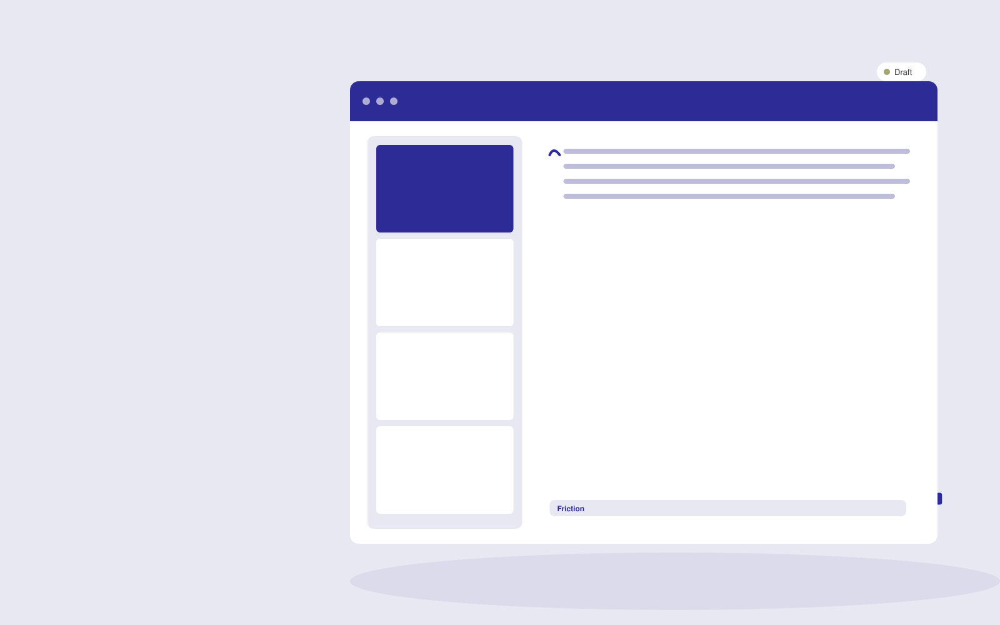

# Conversion research service

**AI-14-13 · Marketing** · Also fits: Creatives; Sales; Science and Research

> For online businesses with traffic but unclear customer friction, turn authorized surveys, journey observations and customer interviews into conversion research and testing roadmap. Address the recurring problem: teams optimize pages without understanding abandonment. The value hypothesis is a more complete, reviewable deliverable with less repeated preparation; the pilot must establish whether that benefit is real.

| | |
|---|---|
| **Buyer** | Online businesses with traffic but unclear customer friction |
| **Problem** | Teams optimize pages without understanding abandonment. |
| **Format** | Research evidence workspace with reviewed deliverables |
| **USP** | Recommendations connect to observed customer problems and testable hypotheses. |

## The product
Key screens: Journey map, evidence themes, experiment backlog. Organize work by research question. Show a source library, an evidence matrix and a draft findings panel with linked quotations. Keep contradictory findings and unanswered questions visible. Allow reviewers to inspect the original context before accepting an interpretation. In this product, the first view is journey map, followed by evidence themes and experiment backlog.

## Core functionality
1. Identify friction points.
2. Group objections.
3. Compare segments.
4. Document observed behavior.
5. Propose experiments.
6. Prioritize evidence gaps.

## Customer workflow
Agree the decision and research questions, define permitted sources or participants, collect evidence, code findings, compare supporting and contradictory material, review interpretations, and deliver a cited brief with next questions. Start with authorized surveys, journey observations and customer interviews and finish with conversion research and testing roadmap.

## AI and human review
Assist with retrieval, transcription, structured extraction and thematic synthesis. Preserve source passages and methodological context. Human researchers validate inclusion, quotations and conclusions. Use real participants when customer research is required.

## Customer inputs
Authorized surveys, journey observations and customer interviews

## Customer deliverables
Conversion research and testing roadmap

## Accounts and administration
Source provenance, participant consent where applicable, research questions, coding definitions, reviewer disagreements, citations and versioned conclusions.

## MVP scope
Begin with online businesses with traffic but unclear customer friction and one recurring use case. Build the first two modules: identify friction points; group objections. Provide operator assistance for the third module: compare segments. Deliver conversion research and testing roadmap through a manual review queue. Perform other necessary full-scope functions manually during the pilot. Include all applicable access, accuracy and professional-review controls from the start.

## After MVP validation
After paid pilots establish value, automate the remaining modules: document observed behavior; propose experiments; prioritize evidence gaps. Add one validated source integration, reusable customer configuration and recurring delivery. Expand to additional teams, document formats or languages only after testing the new scope.

## Build dependencies
A clear research protocol, source access, citation tracking and qualified interpretation. Interview work also needs relevant participants and consent management.

## Integrations and data access
Approved brand material, campaign exports and authorized customer research. Permitted research libraries, interview recording imports, citation exports and document editors. Preserve original source metadata throughout the workflow. These are candidate integration categories, not verified supported connectors.

## Defensibility
Niche research protocols, credible researcher relationships and a rights-cleared evidence archive with consistent interpretation methods. For this idea, build around recommendations connect to observed customer problems and testable hypotheses. This advantage requires execution and accumulated customer trust; the base model alone is not a defensible asset.

## Alternatives and positioning
Research consultants, internal analysts, literature databases and general search or summarization tools. Differentiate on this specific proposed advantage: recommendations connect to observed customer problems and testable hypotheses. Test it against the buyer's current method on the same task. Competitor coverage and uniqueness have not been established.

## Revenue model and test pricing (USD)
Test USD 750-3,000 for one tightly bounded research question and evidence pack. Participant recruitment, specialist review and licensed data are separately scoped. Repeat tracking can become a retainer. Prices are hypotheses.

## Main delivery costs
Researcher time, source access, participant recruitment, transcription, evidence coding, expert review and report revisions.

## Marketing message to test
> Conversion research service for online businesses with traffic but unclear customer friction. Recommendations connect to observed customer problems and testable hypotheses. Demonstrate the claim through a customer-friction research brief.

## Acquisition channels
Conversion-focused web agencies

## Lead magnet
A customer-friction research brief

## First 30 days of marketing
- Week 1: interview five prospective buyers in this segment: online businesses with traffic but unclear customer friction. Ask to see a recent example of the problem and their current process.
- Week 2: prepare this demonstration using authorized or synthetic material: a customer-friction research brief.
- Week 3: present it through conversion-focused web agencies and seek one narrowly scoped paid pilot.
- Week 4: review validated hypotheses, qualified conversions, total delivery effort and a concrete renewal decision before increasing scope.

## Paid pilot and validation
Answer one practical question using a bounded evidence set. Ask a domain expert to review citations and reasoning, identify contrary evidence and assess whether the deliverable supports the intended decision. For this idea, use authorized surveys, journey observations and customer interviews and evaluate conversion research and testing roadmap. Agree success thresholds with the buyer before starting; collect a baseline for validated hypotheses, qualified conversions. A positive signal is payment and repeat use with acceptable quality and delivery cost, not a favorable demo reaction alone.

## Success metrics
Validated hypotheses, qualified conversions

## Retention and expansion
Maintain the research question and evidence archive, offer follow-up studies and refresh important sources. Build repeat work around the buyer’s decision cycle.

## Operating controls and limitations
Verify product claims and permissions. Distinguish observed campaign results from causal explanations and keep customer data collection authorized. Validate source access and reviewer availability during the pilot. Maintain customer-level access, data deletion controls and a record of final approvals.

## Brand style (concept)

- Colors: `#2c2791` primary · `#c1c954` accent · `#e5e4f1` surface · `#22201e` ink
- Type: Sora for headings, Work Sans for text
- Voice: Energetic, specific, results-minded
- Demo site: [https://nexibeo.com/ideas/conversion-research-service/demo/](https://nexibeo.com/ideas/conversion-research-service/demo/)

## Investment indication

Indicative build budget, from MVP to full product. This is a planning range, not a quote; it excludes running costs such as model usage, hosting and reviewer hours.

| Phase | Scope | Timeline | Indicative budget |
|---|---|---|---|
| MVP | One buyer segment, one recurring use case; first modules: identify friction points; group objections. Manual review in the loop. | 4 weeks | $7,000 |
| Paid pilot | Accounts, roles, review states, audit trail and the first integration, hardened for two to three paying pilot customers. | 5 weeks | $8,000 |
| Full product | Remaining modules: document observed behavior; propose experiments; prioritize evidence gaps. Self-serve onboarding, billing, monitoring and the wider integration set. | 8 weeks | $11,000 |
| **Total** | | 17 weeks | **$26,000** |

**Co-create this project with us:** [contact Nexibeo](https://nexibeo.com/ideas/conversion-research-service/#apply) and we build it with you.

## Research status
Concept proposal expanded from the 315-idea conversation. Demand, pricing, differentiation, build scope and integration feasibility are hypotheses, not verified market findings. Category link is inspiration rather than evidence of business viability.

## Credits and next steps

- **Estimation and building this idea:** see the full idea page on [nexibeo.com](https://nexibeo.com/ideas/conversion-research-service/) for more detail on estimation, and to co-create and build this idea with Nexibeo.
- **Become an AI-optimized specialist for Marketing:** [Complete AI Training](https://completeaitraining.com/certification/12b-ai-certification-for-marketing-specialists/).
- Field news: [AI news for Marketing](https://completeaitraining.com/all-ai-news-for-marketing/).
