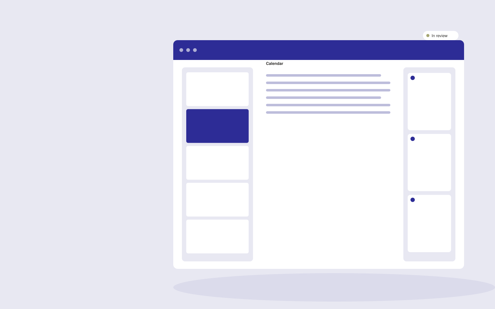

# Webinar promotion engine

**AI-14-14 · Marketing** · Also fits: Creatives; Sales; Writers

> For B2B firms running educational webinars, turn speaker brief, verified agenda and approved offers into approved webinar campaign package. Address the recurring problem: promotion and follow-up require repetitive coordinated content. The value hypothesis is a more complete, reviewable deliverable with less repeated preparation; the pilot must establish whether that benefit is real.

| | |
|---|---|
| **Buyer** | B2B firms running educational webinars |
| **Problem** | Promotion and follow-up require repetitive coordinated content. |
| **Format** | Source-based content workspace with editorial delivery |
| **USP** | One audience promise remains consistent before and after the webinar. |

## The product
Key screens: Webinar calendar, campaign builder, approval queue. Use a project list and editorial calendar beside a document editor. Keep original material and supporting passages in a collapsible side panel. Show outline, draft, review and approved stages. Provide tracked edits, comments, version comparisons and an export preview that reflects the final delivery format. In this product, the first view is webinar calendar, followed by campaign builder and approval queue.

## Core functionality
1. Draft registration pages.
2. Create invitation sequences.
3. Produce social assets.
4. Prepare speaker briefs.
5. Draft follow-ups.
6. Reuse approved recordings.

## Customer workflow
Collect a structured brief and source material, identify unanswered questions, approve an outline, generate a draft, verify claims, gather reviewer edits, approve a final version and export the agreed formats. Start with speaker brief, verified agenda and approved offers and finish with approved webinar campaign package.

## AI and human review
Extract and organize information, propose structure, draft prose and adapt approved content to audiences. Attach evidence to factual claims. Keep names, dates, amounts and quoted wording linked to their source. Editors resolve ambiguity and approve publication.

## Customer inputs
Speaker brief, verified agenda and approved offers

## Customer deliverables
Approved webinar campaign package

## Accounts and administration
Client workspaces, source permissions, editorial assignments, change history, reviewer comments, approval gates, revision allowances and export templates.

## MVP scope
Begin with B2B firms running educational webinars and one recurring use case. Build the first two modules: draft registration pages; create invitation sequences. Provide operator assistance for the third module: produce social assets. Deliver approved webinar campaign package through a manual review queue. Perform other necessary full-scope functions manually during the pilot. Include all applicable access, accuracy and professional-review controls from the start.

## After MVP validation
After paid pilots establish value, automate the remaining modules: prepare speaker briefs; draft follow-ups; reuse approved recordings. Add one validated source integration, reusable customer configuration and recurring delivery. Expand to additional teams, document formats or languages only after testing the new scope.

## Build dependencies
Document parsing, a source-linked editor, tracked revisions, reviewer workflow and reliable document export. Rich presentation or print output needs format-specific QA.

## Integrations and data access
Approved brand material, campaign exports and authorized customer research. Document storage, word processor export, content management systems and approved publishing channels. Pilot with uploads and downloadable drafts before adding write integrations. These are candidate integration categories, not verified supported connectors.

## Defensibility
Customer-approved terminology, reusable structures, source libraries and editorial feedback tied to a specific audience and recurring publishing workflow. For this idea, build around one audience promise remains consistent before and after the webinar. This advantage requires execution and accumulated customer trust; the base model alone is not a defensible asset.

## Alternatives and positioning
Writers, editors, agencies, internal document templates and general-purpose chat tools. Differentiate on this specific proposed advantage: one audience promise remains consistent before and after the webinar. Test it against the buyer's current method on the same task. Competitor coverage and uniqueness have not been established.

## Revenue model and test pricing (USD)
Test USD 400-1,500 for a tightly scoped initial content package. Convert repeated work to a monthly retainer with explicit deliverable and revision limits. Specialist review and substantial research are separately scoped. Prices are hypotheses.

## Main delivery costs
Research and interview time, transcription, model usage, factual verification, subject-matter review, editing and revisions.

## Marketing message to test
> Webinar promotion engine for B2B firms running educational webinars. One audience promise remains consistent before and after the webinar. Demonstrate the claim through a complete promotion kit for one webinar.

## Acquisition channels
Webinar producers and B2B agencies

## Lead magnet
A complete promotion kit for one webinar

## First 30 days of marketing
- Week 1: interview five prospective buyers in this segment: B2B firms running educational webinars. Ask to see a recent example of the problem and their current process.
- Week 2: prepare this demonstration using authorized or synthetic material: a complete promotion kit for one webinar.
- Week 3: present it through webinar producers and B2B agencies and seek one narrowly scoped paid pilot.
- Week 4: review qualified attendance, follow-up engagement, total delivery effort and a concrete renewal decision before increasing scope.

## Paid pilot and validation
Complete one existing brief using the customer’s actual sources. Record reviewer edits, factual corrections and preparation time. Ask the same buyer to commission a second comparable deliverable. For this idea, use speaker brief, verified agenda and approved offers and evaluate approved webinar campaign package. Agree success thresholds with the buyer before starting; collect a baseline for qualified attendance, follow-up engagement. A positive signal is payment and repeat use with acceptable quality and delivery cost, not a favorable demo reaction alone.

## Success metrics
Qualified attendance, follow-up engagement

## Retention and expansion
Maintain the approved source and voice library, schedule recurring editorial work, and expand into additional formats only after the core deliverable is repeatedly accepted.

## Operating controls and limitations
Verify product claims and permissions. Distinguish observed campaign results from causal explanations and keep customer data collection authorized. Validate source access and reviewer availability during the pilot. Maintain customer-level access, data deletion controls and a record of final approvals.

## Brand style (concept)

- Colors: `#3a2791` primary · `#a4c954` accent · `#e7e4f1` surface · `#22201e` ink
- Type: Sora for headings, Work Sans for text
- Voice: Energetic, specific, results-minded
- Demo site: [https://nexibeo.com/ideas/webinar-promotion-engine/demo/](https://nexibeo.com/ideas/webinar-promotion-engine/demo/)

## Investment indication

Indicative build budget, from MVP to full product. This is a planning range, not a quote; it excludes running costs such as model usage, hosting and reviewer hours.

| Phase | Scope | Timeline | Indicative budget |
|---|---|---|---|
| MVP | One buyer segment, one recurring use case; first modules: draft registration pages; create invitation sequences. Manual review in the loop. | 4 weeks | $7,000 |
| Paid pilot | Accounts, roles, review states, audit trail and the first integration, hardened for two to three paying pilot customers. | 5 weeks | $8,000 |
| Full product | Remaining modules: prepare speaker briefs; draft follow-ups; reuse approved recordings. Self-serve onboarding, billing, monitoring and the wider integration set. | 9 weeks | $11,000 |
| **Total** | | 18 weeks | **$26,000** |

**Co-create this project with us:** [contact Nexibeo](https://nexibeo.com/ideas/webinar-promotion-engine/#apply) and we build it with you.

## Research status
Concept proposal expanded from the 315-idea conversation. Demand, pricing, differentiation, build scope and integration feasibility are hypotheses, not verified market findings. Category link is inspiration rather than evidence of business viability.

## Credits and next steps

- **Estimation and building this idea:** see the full idea page on [nexibeo.com](https://nexibeo.com/ideas/webinar-promotion-engine/) for more detail on estimation, and to co-create and build this idea with Nexibeo.
- **Become an AI-optimized specialist for Marketing:** [Complete AI Training](https://completeaitraining.com/certification/12b-ai-certification-for-marketing-specialists/).
- Field news: [AI news for Marketing](https://completeaitraining.com/all-ai-news-for-marketing/).
