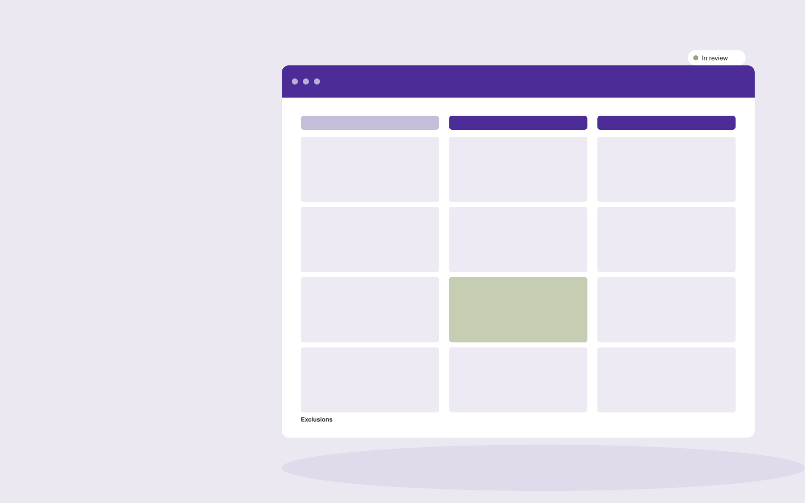

# Supplier quote comparison

**Operations** · Also fits: Finance; Management

> For purchasing managers at small manufacturers, turn supplier quotes and purchasing requirements into supplier comparison and question pack. Address the recurring problem: supplier offers differ in units and hidden exclusions. The value hypothesis is a more complete, reviewable deliverable with less repeated preparation; the pilot must establish whether that benefit is real.

| | |
|---|---|
| **Buyer** | Purchasing managers at small manufacturers |
| **Problem** | Supplier offers differ in units and hidden exclusions. |
| **Format** | Structured comparison and clarification workspace |
| **USP** | Comparable landed-scope analysis with unresolved assumptions visible. |

## The product
Key screens: Quote matrix, exclusion notes, clarification queue. Use a side-by-side matrix with the same fields for every document or option. Clicking a value reveals its original passage. Highlight missing, different and uncertain items separately. Provide a clarification queue and reviewer annotations before exporting a decision pack. In this product, the first view is quote matrix, followed by exclusion notes and clarification queue.

## Core functionality
1. Normalize units.
2. Align specifications.
3. Identify exclusions.
4. Compare delivery terms.
5. Flag currency differences.
6. Draft supplier questions.

## Customer workflow
Define comparison fields, upload source versions or offers, extract candidate values, normalize only agreed units, inspect differences, resolve questions with reviewers, and export an evidence-linked comparison. Start with supplier quotes and purchasing requirements and finish with supplier comparison and question pack.

## AI and human review
Align document sections and extract proposed comparable fields. Deterministic checks handle units and arithmetic. Preserve original wording and label assumptions. Professional reviewers assess the meaning and significance of differences.

## Customer inputs
Supplier quotes and purchasing requirements

## Customer deliverables
Supplier comparison and question pack

## Accounts and administration
Document versions, field definitions, source references, reviewer corrections, unresolved questions, comparison history and exportable matrices.

## MVP scope
Begin with purchasing managers at small manufacturers and one recurring use case. Build the first two modules: normalize units; align specifications. Provide operator assistance for the third module: identify exclusions. Deliver supplier comparison and question pack through a manual review queue. Perform other necessary full-scope functions manually during the pilot. Include all applicable access, accuracy and professional-review controls from the start.

## After MVP validation
After paid pilots establish value, automate the remaining modules: compare delivery terms; flag currency differences; draft supplier questions. Add one validated source integration, reusable customer configuration and recurring delivery. Expand to additional teams, document formats or languages only after testing the new scope.

## Build dependencies
Document alignment, field provenance, unit normalization, missing-value handling and reviewer correction. Similar-looking documents may contain materially different terms.

## Integrations and data access
Orders, inventory, supplier files, process documents and workflow records. Document repositories, procurement or contract records and spreadsheet exports. Preserve originals and avoid writing back interpretations without approval. These are candidate integration categories, not verified supported connectors.

## Defensibility
A niche comparison schema, reviewed extraction examples and clear handling of the differences that matter to a specific buyer. For this idea, build around comparable landed-scope analysis with unresolved assumptions visible. This advantage requires execution and accumulated customer trust; the base model alone is not a defensible asset.

## Alternatives and positioning
Spreadsheet comparisons, professional reviewers, document diff tools and manual quote or contract review. Differentiate on this specific proposed advantage: comparable landed-scope analysis with unresolved assumptions visible. Test it against the buyer's current method on the same task. Competitor coverage and uniqueness have not been established.

## Revenue model and test pricing (USD)
Test USD 300-1,500 for one bounded comparison package, then USD 150-600 monthly for recurring volume with review limits. Complex expert interpretation is separately priced. Figures are hypotheses.

## Main delivery costs
Document parsing, field alignment, source verification, expert interpretation, clarification rounds and changing document formats.

## Marketing message to test
> Supplier quote comparison for purchasing managers at small manufacturers. Comparable landed-scope analysis with unresolved assumptions visible. Demonstrate the claim through a three-quote comparison with scope gaps.

## Acquisition channels
Purchasing adviser networks

## Lead magnet
A three-quote comparison with scope gaps

## First 30 days of marketing
- Week 1: interview five prospective buyers in this segment: purchasing managers at small manufacturers. Ask to see a recent example of the problem and their current process.
- Week 2: prepare this demonstration using authorized or synthetic material: a three-quote comparison with scope gaps.
- Week 3: present it through purchasing adviser networks and seek one narrowly scoped paid pilot.
- Week 4: review comparison accuracy, clarification rounds, total delivery effort and a concrete renewal decision before increasing scope.

## Paid pilot and validation
Compare a known set already reviewed by a domain expert. Check meaningful differences, false alarms and missing fields. Measure reviewer time including corrections rather than extraction speed alone. For this idea, use supplier quotes and purchasing requirements and evaluate supplier comparison and question pack. Agree success thresholds with the buyer before starting; collect a baseline for comparison accuracy, clarification rounds. A positive signal is payment and repeat use with acceptable quality and delivery cost, not a favorable demo reaction alone.

## Success metrics
Comparison accuracy, clarification rounds

## Retention and expansion
Save reviewer-approved comparison fields and recurring document formats. Offer repeat comparisons and explicit updates when the source options change.

## Operating controls and limitations
Make operational states and ownership explicit. Validate data and require appropriate approval before purchases, scheduling commitments or external system writes. Validate source access and reviewer availability during the pilot. Maintain customer-level access, data deletion controls and a record of final approvals.

## Brand style (concept)

- Colors: `#5a2791` primary · `#6ac954` accent · `#eae4f1` surface · `#22201e` ink
- Type: Archivo for headings, Lora for text
- Voice: Calm, reliable, step-by-step
- Demo site: [https://nexibeo.com/ideas/supplier-quote-comparison/demo/](https://nexibeo.com/ideas/supplier-quote-comparison/demo/)

## Investment indication

Indicative build budget, from MVP to full product. This is a planning range, not a quote; it excludes running costs such as model usage, hosting and reviewer hours.

| Phase | Scope | Timeline | Indicative budget |
|---|---|---|---|
| MVP | One buyer segment, one recurring use case; first modules: normalize units; align specifications. Manual review in the loop. | 3 weeks | $6,000 |
| Paid pilot | Accounts, roles, review states, audit trail and the first integration, hardened for two to three paying pilot customers. | 5 weeks | $6,000 |
| Full product | Remaining modules: compare delivery terms; flag currency differences; draft supplier questions. Self-serve onboarding, billing, monitoring and the wider integration set. | 7 weeks | $8,000 |
| **Total** | | 15 weeks | **$20,000** |

### Running costs per month (rough indication, untested)

| Stage | Hosting and infrastructure | AI usage | Total per month |
|---|---|---|---|
| MVP and paid pilot (about 3 customers) | $30–$60 | $50–$100 | **$80–$160** |
| Full product (about 50 customers) | $110–$210 | $350–$700 | **$460–$910** |

**Co-create this project with us:** [contact Nexibeo](https://nexibeo.com/ideas/supplier-quote-comparison/#apply) and we build it with you.

## Research status
Concept proposal expanded from the 315-idea conversation. Demand, pricing, differentiation, build scope and integration feasibility are hypotheses, not verified market findings. Category link is inspiration rather than evidence of business viability.

## Credits and next steps

- **Estimation and building this idea:** see the full idea page on [nexibeo.com](https://nexibeo.com/ideas/supplier-quote-comparison/) for more detail on estimation, and to co-create and build this idea with Nexibeo.
- **Become an AI-optimized specialist for Operations:** [Complete AI Training](https://completeaitraining.com/tag/operations/?contentType=ai-certification).
- Field news: [AI news for Operations](https://completeaitraining.com/all-ai-news-for-operations/).
