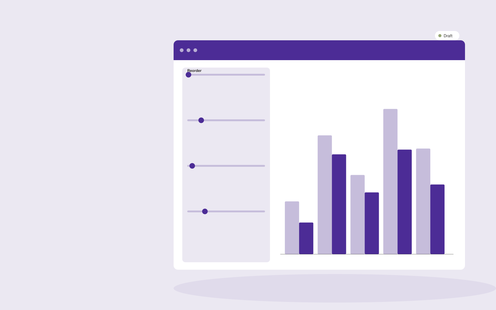

# Inventory planning service

**Operations** · Also fits: Finance; Management

> For owners of specialist online retailers, turn sales history, stock counts and lead-time assumptions into reviewed replenishment plan. Address the recurring problem: reordering is driven by intuition and inconsistent data. The value hypothesis is a more complete, reviewable deliverable with less repeated preparation; the pilot must establish whether that benefit is real.

| | |
|---|---|
| **Buyer** | Owners of specialist online retailers |
| **Problem** | Reordering is driven by intuition and inconsistent data. |
| **Format** | Assumption-driven planning and decision workspace |
| **USP** | Transparent replenishment assumptions for a narrow catalog type. |

## The product
Key screens: Stock outlook, reorder scenarios, reviewer decisions. Place editable drivers and constraints beside a clearly labeled scenario output. Include a baseline view, comparison chart or schedule, and an assumptions history. Let users trace a proposed quantity or date back to its inputs. Keep forecasts distinct from actual results. In this product, the first view is stock outlook, followed by reorder scenarios and reviewer decisions.

## Core functionality
1. Validate stock records.
2. Estimate demand ranges.
3. Include lead times.
4. Model safety assumptions.
5. Suggest order quantities.
6. Compare actual outcomes.

## Customer workflow
Validate baseline inputs, confirm definitions and constraints, select editable assumptions, calculate feasible alternatives, inspect sensitivities, let the responsible person approve a plan, and compare later actuals with the recorded assumptions. Start with sales history, stock counts and lead-time assumptions and finish with reviewed replenishment plan.

## AI and human review
Extract input context and explain scenario differences. Use deterministic calculations or explicit optimization for quantities, compatibility, dates and prices. Show uncertain assumptions. Never let generated prose silently change the calculation rules.

## Customer inputs
Sales history, stock counts and lead-time assumptions

## Customer deliverables
Reviewed replenishment plan

## Accounts and administration
Scenario versions, baseline reconciliation, constraint checks, assumption ownership, reviewer approvals, plan exports and actual-versus-plan tracking.

## MVP scope
Begin with owners of specialist online retailers and one recurring use case. Build the first two modules: validate stock records; estimate demand ranges. Provide operator assistance for the third module: include lead times. Deliver reviewed replenishment plan through a manual review queue. Perform other necessary full-scope functions manually during the pilot. Include all applicable access, accuracy and professional-review controls from the start.

## After MVP validation
After paid pilots establish value, automate the remaining modules: model safety assumptions; suggest order quantities; compare actual outcomes. Add one validated source integration, reusable customer configuration and recurring delivery. Expand to additional teams, document formats or languages only after testing the new scope.

## Build dependencies
A defensible calculation model, explicit units, constraint validation and representative boundary tests. Advanced forecasting or optimization needs adequate historical data.

## Integrations and data access
Orders, inventory, supplier files, process documents and workflow records. Read-only operational exports, calendars and finance or inventory records as relevant. Start with plan exports and retain human approval for execution. These are candidate integration categories, not verified supported connectors.

## Defensibility
A validated domain model, customer-approved constraints and forecast or decision history that improves practical planning. For this idea, build around transparent replenishment assumptions for a narrow catalog type. This advantage requires execution and accumulated customer trust; the base model alone is not a defensible asset.

## Alternatives and positioning
Spreadsheets, planners, specialist forecasting tools and existing scheduling or configuration software. Differentiate on this specific proposed advantage: transparent replenishment assumptions for a narrow catalog type. Test it against the buyer's current method on the same task. Competitor coverage and uniqueness have not been established.

## Revenue model and test pricing (USD)
Test USD 750-3,000 for a scoped planning setup and review, then USD 200-900 monthly for refreshes within agreed complexity. Data integration and optimization are separately scoped. All ranges are hypotheses.

## Main delivery costs
Data preparation, domain modeling, validation, scenario computation, reviewer support and ongoing assumption maintenance.

## Marketing message to test
> Inventory planning service for owners of specialist online retailers. Transparent replenishment assumptions for a narrow catalog type. Demonstrate the claim through a historical replenishment backtest.

## Acquisition channels
Inventory software consultants

## Lead magnet
A historical replenishment backtest

## First 30 days of marketing
- Week 1: interview five prospective buyers in this segment: owners of specialist online retailers. Ask to see a recent example of the problem and their current process.
- Week 2: prepare this demonstration using authorized or synthetic material: a historical replenishment backtest.
- Week 3: present it through inventory software consultants and seek one narrowly scoped paid pilot.
- Week 4: review stockouts, excess inventory, forecast error, total delivery effort and a concrete renewal decision before increasing scope.

## Paid pilot and validation
Reproduce a known historical plan, test missing inputs and boundary constraints, then run a new scenario. Compare feasibility, reconciliation and observed error rather than judging the quality of the explanation alone. For this idea, use sales history, stock counts and lead-time assumptions and evaluate reviewed replenishment plan. Agree success thresholds with the buyer before starting; collect a baseline for stockouts, excess inventory, forecast error. A positive signal is payment and repeat use with acceptable quality and delivery cost, not a favorable demo reaction alone.

## Success metrics
Stockouts, excess inventory, forecast error

## Retention and expansion
Refresh inputs, compare recorded assumptions with actual outcomes and refine validated constraints. Expand scenario complexity only when the buyer uses it for a decision.

## Operating controls and limitations
Make operational states and ownership explicit. Validate data and require appropriate approval before purchases, scheduling commitments or external system writes. Validate source access and reviewer availability during the pilot. Maintain customer-level access, data deletion controls and a record of final approvals.

## Brand style (concept)

- Colors: `#332791` primary · `#bcc954` accent · `#e6e4f1` surface · `#22201e` ink
- Type: Archivo for headings, Lora for text
- Voice: Calm, reliable, step-by-step
- Demo site: [https://nexibeo.com/ideas/inventory-planning-service/demo/](https://nexibeo.com/ideas/inventory-planning-service/demo/)

## Investment indication

Indicative build budget, from MVP to full product. This is a planning range, not a quote; it excludes running costs such as model usage, hosting and reviewer hours.

| Phase | Scope | Timeline | Indicative budget |
|---|---|---|---|
| MVP | One buyer segment, one recurring use case; first modules: validate stock records; estimate demand ranges. Manual review in the loop. | 3 weeks | $6,000 |
| Paid pilot | Accounts, roles, review states, audit trail and the first integration, hardened for two to three paying pilot customers. | 5 weeks | $6,000 |
| Full product | Remaining modules: model safety assumptions; suggest order quantities; compare actual outcomes. Self-serve onboarding, billing, monitoring and the wider integration set. | 7 weeks | $8,000 |
| **Total** | | 15 weeks | **$20,000** |

**Co-create this project with us:** [contact Nexibeo](https://nexibeo.com/ideas/inventory-planning-service/#apply) and we build it with you.

## Research status
Concept proposal expanded from the 315-idea conversation. Demand, pricing, differentiation, build scope and integration feasibility are hypotheses, not verified market findings. Category link is inspiration rather than evidence of business viability.

## Credits and next steps

- **Estimation and building this idea:** see the full idea page on [nexibeo.com](https://nexibeo.com/ideas/inventory-planning-service/) for more detail on estimation, and to co-create and build this idea with Nexibeo.
- **Become an AI-optimized specialist for Operations:** [Complete AI Training](https://completeaitraining.com/tag/operations/?contentType=ai-certification).
- Field news: [AI news for Operations](https://completeaitraining.com/all-ai-news-for-operations/).
