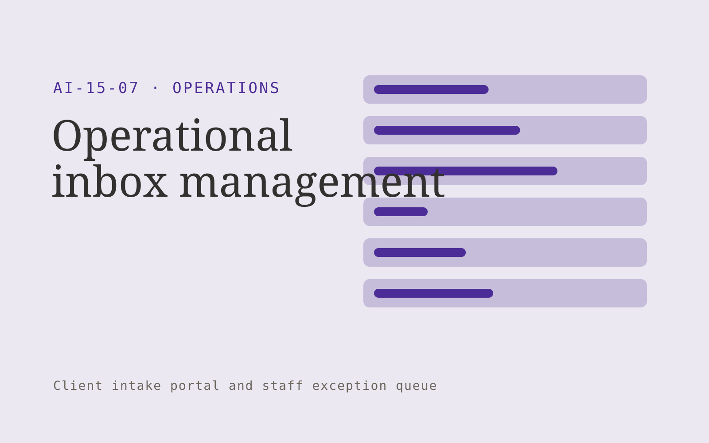

# Operational inbox management

**Operations** · Also fits: Finance; Management; Customer Support

> For operations teams at logistics service firms, turn authorized mailbox messages and routing rules into structured operational request queue. Address the recurring problem: orders and urgent requests are buried in email. The value hypothesis is a more complete, reviewable deliverable with less repeated preparation; the pilot must establish whether that benefit is real.

| | |
|---|---|
| **Buyer** | Operations teams at logistics service firms |
| **Problem** | Orders and urgent requests are buried in email. |
| **Format** | Client intake portal and staff exception queue |
| **USP** | Business identifiers and deadlines drive routing rather than subject keywords alone. |

## The product
Key screens: Shared inbox, extracted requests, owner queue. Give submitters a mobile-friendly step-by-step form with document uploads and a visible completeness checklist. Staff see a queue with missing items and extracted fields. Place the original document beside each uncertain value. Show submitted, clarification required and ready-for-review states. In this product, the first view is shared inbox, followed by extracted requests and owner queue.

## Core functionality
1. Classify messages.
2. Extract deadlines.
3. Recognize order references.
4. Detect missing information.
5. Draft replies.
6. Assign responsible teams.

## Customer workflow
Choose the request type, collect declared facts and required documents, extract relevant fields, show missing or inconsistent information, let the submitter correct it, and route the complete package to an authorized reviewer. Start with authorized mailbox messages and routing rules and finish with structured operational request queue.

## AI and human review
Classify submitted material, extract candidate fields and draft clarification questions. Deterministic rules test required fields and formats. Keep uncertain extraction visible and preserve the original statement. Do not infer missing material facts.

## Customer inputs
Authorized mailbox messages and routing rules

## Customer deliverables
Structured operational request queue

## Accounts and administration
Secure uploads, configurable checklists, progress saving, duplicate handling, reviewer assignments, clarification threads, deadlines and submission history.

## MVP scope
Begin with operations teams at logistics service firms and one recurring use case. Build the first two modules: classify messages; extract deadlines. Provide operator assistance for the third module: recognize order references. Deliver structured operational request queue through a manual review queue. Perform other necessary full-scope functions manually during the pilot. Include all applicable access, accuracy and professional-review controls from the start.

## After MVP validation
After paid pilots establish value, automate the remaining modules: detect missing information; draft replies; assign responsible teams. Add one validated source integration, reusable customer configuration and recurring delivery. Expand to additional teams, document formats or languages only after testing the new scope.

## Build dependencies
Secure upload handling, reliable extraction, versioned completeness rules, submitter identity and staff routing. Third-party checklist changes require maintenance.

## Integrations and data access
Orders, inventory, supplier files, process documents and workflow records. Case management, customer records, document storage and notification systems. Begin with an exportable review pack before automating destination writes. These are candidate integration categories, not verified supported connectors.

## Defensibility
Document-type expertise, tested completeness rules and a low-friction client experience embedded in a repeat administrative process. For this idea, build around business identifiers and deadlines drive routing rather than subject keywords alone. This advantage requires execution and accumulated customer trust; the base model alone is not a defensible asset.

## Alternatives and positioning
Email collection, generic web forms, spreadsheets and existing case management systems. Differentiate on this specific proposed advantage: business identifiers and deadlines drive routing rather than subject keywords alone. Test it against the buyer's current method on the same task. Competitor coverage and uniqueness have not been established.

## Revenue model and test pricing (USD)
Test USD 500-2,000 setup plus USD 150-750 monthly for one form family and a capped submission volume. Quote specialist review and unusual document formats separately. Prices are experimental.

## Main delivery costs
Document processing, storage, exception review, support, checklist maintenance and customer-specific integration work.

## Marketing message to test
> Operational inbox management for operations teams at logistics service firms. Business identifiers and deadlines drive routing rather than subject keywords alone. Demonstrate the claim through an anonymized inbox-to-work-queue demonstration.

## Acquisition channels
Logistics operations advisers

## Lead magnet
An anonymized inbox-to-work-queue demonstration

## First 30 days of marketing
- Week 1: interview five prospective buyers in this segment: operations teams at logistics service firms. Ask to see a recent example of the problem and their current process.
- Week 2: prepare this demonstration using authorized or synthetic material: an anonymized inbox-to-work-queue demonstration.
- Week 3: present it through logistics operations advisers and seek one narrowly scoped paid pilot.
- Week 4: review routing accuracy, missed requests, total delivery effort and a concrete renewal decision before increasing scope.

## Paid pilot and validation
Process a bounded set of historical and new submissions. Include missing, duplicate and unreadable documents. Compare complete submissions and clarification effort with the current intake method. For this idea, use authorized mailbox messages and routing rules and evaluate structured operational request queue. Agree success thresholds with the buyer before starting; collect a baseline for routing accuracy, missed requests. A positive signal is payment and repeat use with acceptable quality and delivery cost, not a favorable demo reaction alone.

## Success metrics
Routing accuracy, missed requests

## Retention and expansion
Review incomplete submissions and simplify recurring friction. Expand to another form or document family after the first workflow reliably produces review-ready cases.

## Operating controls and limitations
Make operational states and ownership explicit. Validate data and require appropriate approval before purchases, scheduling commitments or external system writes. Validate source access and reviewer availability during the pilot. Maintain customer-level access, data deletion controls and a record of final approvals.

## Brand style (concept)

- Colors: `#532791` primary · `#7fc954` accent · `#eae4f1` surface · `#22201e` ink
- Type: Archivo for headings, Lora for text
- Voice: Calm, reliable, step-by-step
- Demo site: [https://nexibeo.com/ideas/operational-inbox-management/demo/](https://nexibeo.com/ideas/operational-inbox-management/demo/)

## Investment indication

Indicative build budget, from MVP to full product. This is a planning range, not a quote; it excludes running costs such as model usage, hosting and reviewer hours. Built with Nexibeo's AI software development factory, most implementations take days to a few weeks of creation time, depending on availability.

| Phase | Scope | Creation time | Indicative budget |
|---|---|---|---|
| MVP | One buyer segment, one recurring use case; first modules: classify messages; extract deadlines. Manual review in the loop. | 3 days | $7,000 |
| Paid pilot | Accounts, roles, review states, audit trail and the first integration, hardened for two to three paying pilot customers. | 4 days | $7,500 |
| Full product | Remaining modules: detect missing information; draft replies; assign responsible teams. Self-serve onboarding, billing, monitoring and the wider integration set. | 8 days | $10,000 |
| **Total** | | about 3 weeks | **$24,500** |

### Running costs per month (rough indication, untested)

| Stage | Hosting and infrastructure | AI usage | Total per month |
|---|---|---|---|
| MVP and paid pilot (about 3 customers) | $30–$60 | $40–$90 | **$70–$150** |
| Full product (about 50 customers) | $110–$210 | $280–$560 | **$390–$770** |

**Co-create this project with us:** [contact Nexibeo](https://nexibeo.com/ideas/operational-inbox-management/#apply) and we build it with you.

## Research status
Concept proposal expanded from the 315-idea conversation. Demand, pricing, differentiation, build scope and integration feasibility are hypotheses, not verified market findings. Category link is inspiration rather than evidence of business viability.

## Credits and next steps

- **Estimation and building this idea:** see the full idea page on [nexibeo.com](https://nexibeo.com/ideas/operational-inbox-management/) for more detail on estimation, and to co-create and build this idea with Nexibeo.
- **Become an AI-optimized specialist for Operations:** [Complete AI Training](https://completeaitraining.com/tag/operations/?contentType=ai-certification).
- Field news: [AI news for Operations](https://completeaitraining.com/all-ai-news-for-operations/).
