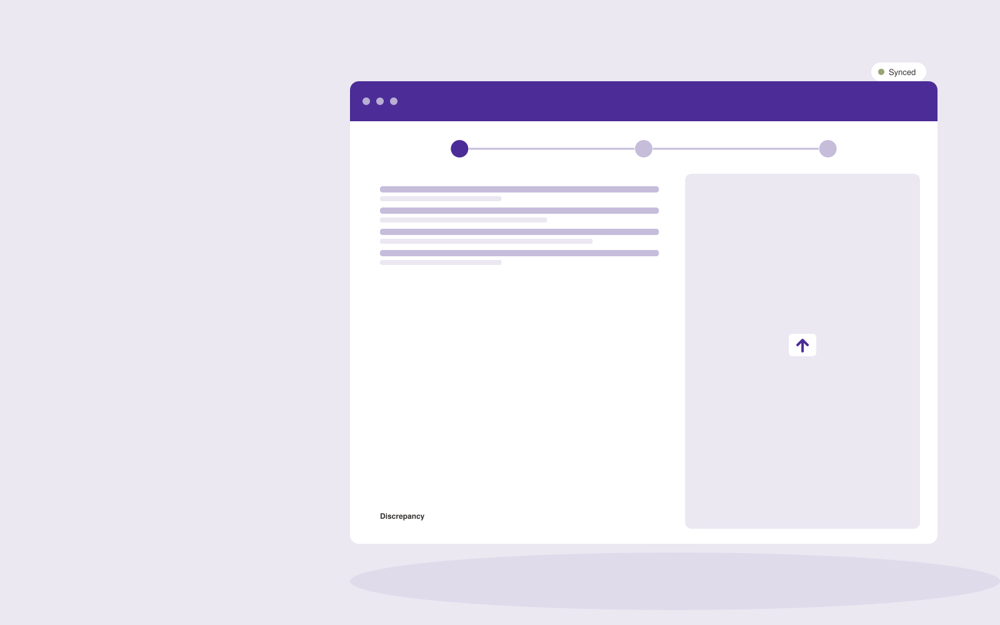

# Logistics document processing

**AI-15-09 · Operations** · Also fits: Finance; Management; Customer Support

> For freight forwarding operations teams, turn shipping instructions, invoices and transport documents into structured shipment record and exceptions. Address the recurring problem: shipment details disagree across documents. The value hypothesis is a more complete, reviewable deliverable with less repeated preparation; the pilot must establish whether that benefit is real.

| | |
|---|---|
| **Buyer** | Freight forwarding operations teams |
| **Problem** | Shipment details disagree across documents. |
| **Format** | Client intake portal and staff exception queue |
| **USP** | Cross-document consistency checks for one transport document workflow. |

## The product
Key screens: Shipment workspace, field evidence, discrepancy queue. Give submitters a mobile-friendly step-by-step form with document uploads and a visible completeness checklist. Staff see a queue with missing items and extracted fields. Place the original document beside each uncertain value. Show submitted, clarification required and ready-for-review states. In this product, the first view is shipment workspace, followed by field evidence and discrepancy queue.

## Core functionality
1. Extract shipment identifiers.
2. Align parties.
3. Compare quantities.
4. Flag date inconsistencies.
5. Preserve source coordinates.
6. Export reviewed records.

## Customer workflow
Choose the request type, collect declared facts and required documents, extract relevant fields, show missing or inconsistent information, let the submitter correct it, and route the complete package to an authorized reviewer. Start with shipping instructions, invoices and transport documents and finish with structured shipment record and exceptions.

## AI and human review
Classify submitted material, extract candidate fields and draft clarification questions. Deterministic rules test required fields and formats. Keep uncertain extraction visible and preserve the original statement. Do not infer missing material facts.

## Customer inputs
Shipping instructions, invoices and transport documents

## Customer deliverables
Structured shipment record and exceptions

## Accounts and administration
Secure uploads, configurable checklists, progress saving, duplicate handling, reviewer assignments, clarification threads, deadlines and submission history.

## MVP scope
Begin with freight forwarding operations teams and one recurring use case. Build the first two modules: extract shipment identifiers; align parties. Provide operator assistance for the third module: compare quantities. Deliver structured shipment record and exceptions through a manual review queue. Perform other necessary full-scope functions manually during the pilot. Include all applicable access, accuracy and professional-review controls from the start.

## After MVP validation
After paid pilots establish value, automate the remaining modules: flag date inconsistencies; preserve source coordinates; export reviewed records. Add one validated source integration, reusable customer configuration and recurring delivery. Expand to additional teams, document formats or languages only after testing the new scope.

## Build dependencies
Secure upload handling, reliable extraction, versioned completeness rules, submitter identity and staff routing. Third-party checklist changes require maintenance.

## Integrations and data access
Orders, inventory, supplier files, process documents and workflow records. Case management, customer records, document storage and notification systems. Begin with an exportable review pack before automating destination writes. These are candidate integration categories, not verified supported connectors.

## Defensibility
Document-type expertise, tested completeness rules and a low-friction client experience embedded in a repeat administrative process. For this idea, build around cross-document consistency checks for one transport document workflow. This advantage requires execution and accumulated customer trust; the base model alone is not a defensible asset.

## Alternatives and positioning
Email collection, generic web forms, spreadsheets and existing case management systems. Differentiate on this specific proposed advantage: cross-document consistency checks for one transport document workflow. Test it against the buyer's current method on the same task. Competitor coverage and uniqueness have not been established.

## Revenue model and test pricing (USD)
Test USD 500-2,000 setup plus USD 150-750 monthly for one form family and a capped submission volume. Quote specialist review and unusual document formats separately. Prices are experimental.

## Main delivery costs
Document processing, storage, exception review, support, checklist maintenance and customer-specific integration work.

## Marketing message to test
> Logistics document processing for freight forwarding operations teams. Cross-document consistency checks for one transport document workflow. Demonstrate the claim through a shipment document discrepancy demonstration.

## Acquisition channels
Freight forwarding networks

## Lead magnet
A shipment document discrepancy demonstration

## First 30 days of marketing
- Week 1: interview five prospective buyers in this segment: freight forwarding operations teams. Ask to see a recent example of the problem and their current process.
- Week 2: prepare this demonstration using authorized or synthetic material: a shipment document discrepancy demonstration.
- Week 3: present it through freight forwarding networks and seek one narrowly scoped paid pilot.
- Week 4: review accepted field accuracy, handling time, total delivery effort and a concrete renewal decision before increasing scope.

## Paid pilot and validation
Process a bounded set of historical and new submissions. Include missing, duplicate and unreadable documents. Compare complete submissions and clarification effort with the current intake method. For this idea, use shipping instructions, invoices and transport documents and evaluate structured shipment record and exceptions. Agree success thresholds with the buyer before starting; collect a baseline for accepted field accuracy, handling time. A positive signal is payment and repeat use with acceptable quality and delivery cost, not a favorable demo reaction alone.

## Success metrics
Accepted field accuracy, handling time

## Retention and expansion
Review incomplete submissions and simplify recurring friction. Expand to another form or document family after the first workflow reliably produces review-ready cases.

## Operating controls and limitations
Make operational states and ownership explicit. Validate data and require appropriate approval before purchases, scheduling commitments or external system writes. Validate source access and reviewer availability during the pilot. Maintain customer-level access, data deletion controls and a record of final approvals.

## Brand style (concept)

- Colors: `#482791` primary · `#bfc954` accent · `#e8e4f1` surface · `#22201e` ink
- Type: Archivo for headings, Lora for text
- Voice: Calm, reliable, step-by-step
- Demo site: [https://nexibeo.com/ideas/logistics-document-processing/demo/](https://nexibeo.com/ideas/logistics-document-processing/demo/)

## Investment indication

Indicative build budget, from MVP to full product. This is a planning range, not a quote; it excludes running costs such as model usage, hosting and reviewer hours.

| Phase | Scope | Timeline | Indicative budget |
|---|---|---|---|
| MVP | One buyer segment, one recurring use case; first modules: extract shipment identifiers; align parties. Manual review in the loop. | 4 weeks | $7,000 |
| Paid pilot | Accounts, roles, review states, audit trail and the first integration, hardened for two to three paying pilot customers. | 5 weeks | $7,500 |
| Full product | Remaining modules: flag date inconsistencies; preserve source coordinates; export reviewed records. Self-serve onboarding, billing, monitoring and the wider integration set. | 8 weeks | $10,000 |
| **Total** | | 17 weeks | **$24,500** |

**Co-create this project with us:** [contact Nexibeo](https://nexibeo.com/ideas/logistics-document-processing/#apply) and we build it with you.

## Research status
Concept proposal expanded from the 315-idea conversation. Demand, pricing, differentiation, build scope and integration feasibility are hypotheses, not verified market findings. Category link is inspiration rather than evidence of business viability.

## Credits and next steps

- **Estimation and building this idea:** see the full idea page on [nexibeo.com](https://nexibeo.com/ideas/logistics-document-processing/) for more detail on estimation, and to co-create and build this idea with Nexibeo.
- **Become an AI-optimized specialist for Operations:** [Complete AI Training](https://completeaitraining.com/tag/operations/?contentType=ai-certification).
- Field news: [AI news for Operations](https://completeaitraining.com/all-ai-news-for-operations/).
