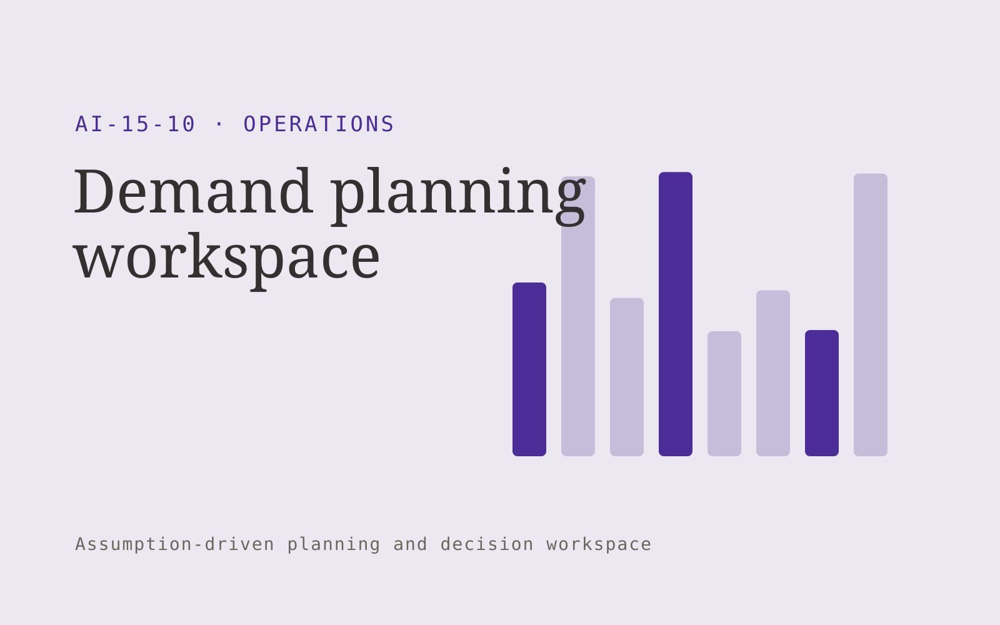

# Demand planning workspace

**Operations** · Also fits: Finance; Management

> For commercial planners at specialist distributors, turn historical demand, promotions and customer commitments into demand scenarios and assumption history. Address the recurring problem: forecasts hide assumptions and cannot explain revisions. The value hypothesis is a more complete, reviewable deliverable with less repeated preparation; the pilot must establish whether that benefit is real.

| | |
|---|---|
| **Buyer** | Commercial planners at specialist distributors |
| **Problem** | Forecasts hide assumptions and cannot explain revisions. |
| **Format** | Assumption-driven planning and decision workspace |
| **USP** | Versioned assumptions and honest error measurement for planners. |

## The product
Key screens: Demand drivers, scenario view, backtest results. Place editable drivers and constraints beside a clearly labeled scenario output. Include a baseline view, comparison chart or schedule, and an assumptions history. Let users trace a proposed quantity or date back to its inputs. Keep forecasts distinct from actual results. In this product, the first view is demand drivers, followed by scenario view and backtest results.

## Core functionality
1. Validate historical periods.
2. Model seasonality.
3. Add promotion assumptions.
4. Compare demand cases.
5. Track forecast revisions.
6. Calculate backtest errors.

## Customer workflow
Validate baseline inputs, confirm definitions and constraints, select editable assumptions, calculate feasible alternatives, inspect sensitivities, let the responsible person approve a plan, and compare later actuals with the recorded assumptions. Start with historical demand, promotions and customer commitments and finish with demand scenarios and assumption history.

## AI and human review
Extract input context and explain scenario differences. Use deterministic calculations or explicit optimization for quantities, compatibility, dates and prices. Show uncertain assumptions. Never let generated prose silently change the calculation rules.

## Customer inputs
Historical demand, promotions and customer commitments

## Customer deliverables
Demand scenarios and assumption history

## Accounts and administration
Scenario versions, baseline reconciliation, constraint checks, assumption ownership, reviewer approvals, plan exports and actual-versus-plan tracking.

## MVP scope
Begin with commercial planners at specialist distributors and one recurring use case. Build the first two modules: validate historical periods; model seasonality. Provide operator assistance for the third module: add promotion assumptions. Deliver demand scenarios and assumption history through a manual review queue. Perform other necessary full-scope functions manually during the pilot. Include all applicable access, accuracy and professional-review controls from the start.

## After MVP validation
After paid pilots establish value, automate the remaining modules: compare demand cases; track forecast revisions; calculate backtest errors. Add one validated source integration, reusable customer configuration and recurring delivery. Expand to additional teams, document formats or languages only after testing the new scope.

## Build dependencies
A defensible calculation model, explicit units, constraint validation and representative boundary tests. Advanced forecasting or optimization needs adequate historical data.

## Integrations and data access
Orders, inventory, supplier files, process documents and workflow records. Read-only operational exports, calendars and finance or inventory records as relevant. Start with plan exports and retain human approval for execution. These are candidate integration categories, not verified supported connectors.

## Defensibility
A validated domain model, customer-approved constraints and forecast or decision history that improves practical planning. For this idea, build around versioned assumptions and honest error measurement for planners. This advantage requires execution and accumulated customer trust; the base model alone is not a defensible asset.

## Alternatives and positioning
Spreadsheets, planners, specialist forecasting tools and existing scheduling or configuration software. Differentiate on this specific proposed advantage: versioned assumptions and honest error measurement for planners. Test it against the buyer's current method on the same task. Competitor coverage and uniqueness have not been established.

## Revenue model and test pricing (USD)
Test USD 750-3,000 for a scoped planning setup and review, then USD 200-900 monthly for refreshes within agreed complexity. Data integration and optimization are separately scoped. All ranges are hypotheses.

## Main delivery costs
Data preparation, domain modeling, validation, scenario computation, reviewer support and ongoing assumption maintenance.

## Marketing message to test
> Demand planning workspace for commercial planners at specialist distributors. Versioned assumptions and honest error measurement for planners. Demonstrate the claim through a demand scenario and backtest report.

## Acquisition channels
Distribution planning consultants

## Lead magnet
A demand scenario and backtest report

## First 30 days of marketing
- Week 1: interview five prospective buyers in this segment: commercial planners at specialist distributors. Ask to see a recent example of the problem and their current process.
- Week 2: prepare this demonstration using authorized or synthetic material: a demand scenario and backtest report.
- Week 3: present it through distribution planning consultants and seek one narrowly scoped paid pilot.
- Week 4: review forecast error, planning adoption, total delivery effort and a concrete renewal decision before increasing scope.

## Paid pilot and validation
Reproduce a known historical plan, test missing inputs and boundary constraints, then run a new scenario. Compare feasibility, reconciliation and observed error rather than judging the quality of the explanation alone. For this idea, use historical demand, promotions and customer commitments and evaluate demand scenarios and assumption history. Agree success thresholds with the buyer before starting; collect a baseline for forecast error, planning adoption. A positive signal is payment and repeat use with acceptable quality and delivery cost, not a favorable demo reaction alone.

## Success metrics
Forecast error, planning adoption

## Retention and expansion
Refresh inputs, compare recorded assumptions with actual outcomes and refine validated constraints. Expand scenario complexity only when the buyer uses it for a decision.

## Operating controls and limitations
Make operational states and ownership explicit. Validate data and require appropriate approval before purchases, scheduling commitments or external system writes. Validate source access and reviewer availability during the pilot. Maintain customer-level access, data deletion controls and a record of final approvals.

## Brand style (concept)

- Colors: `#512791` primary · `#81c954` accent · `#e9e4f1` surface · `#22201e` ink
- Type: Fraunces for headings, Inter for text
- Voice: Calm, reliable, step-by-step
- Demo site: [https://nexibeo.com/ideas/demand-planning-workspace/demo/](https://nexibeo.com/ideas/demand-planning-workspace/demo/)

## Investment indication

Indicative build budget, from MVP to full product. This is a planning range, not a quote; it excludes running costs such as model usage, hosting and reviewer hours.

| Phase | Scope | Timeline | Indicative budget |
|---|---|---|---|
| MVP | One buyer segment, one recurring use case; first modules: validate historical periods; model seasonality. Manual review in the loop. | 3 weeks | $6,000 |
| Paid pilot | Accounts, roles, review states, audit trail and the first integration, hardened for two to three paying pilot customers. | 5 weeks | $6,000 |
| Full product | Remaining modules: compare demand cases; track forecast revisions; calculate backtest errors. Self-serve onboarding, billing, monitoring and the wider integration set. | 7 weeks | $8,500 |
| **Total** | | 15 weeks | **$20,500** |

### Running costs per month (rough indication, untested)

| Stage | Hosting and infrastructure | AI usage | Total per month |
|---|---|---|---|
| MVP and paid pilot (about 3 customers) | $30–$60 | $50–$100 | **$80–$160** |
| Full product (about 50 customers) | $110–$210 | $350–$700 | **$460–$910** |

**Co-create this project with us:** [contact Nexibeo](https://nexibeo.com/ideas/demand-planning-workspace/#apply) and we build it with you.

## Research status
Concept proposal expanded from the 315-idea conversation. Demand, pricing, differentiation, build scope and integration feasibility are hypotheses, not verified market findings. Category link is inspiration rather than evidence of business viability.

## Credits and next steps

- **Estimation and building this idea:** see the full idea page on [nexibeo.com](https://nexibeo.com/ideas/demand-planning-workspace/) for more detail on estimation, and to co-create and build this idea with Nexibeo.
- **Become an AI-optimized specialist for Operations:** [Complete AI Training](https://completeaitraining.com/tag/operations/?contentType=ai-certification).
- Field news: [AI news for Operations](https://completeaitraining.com/all-ai-news-for-operations/).
