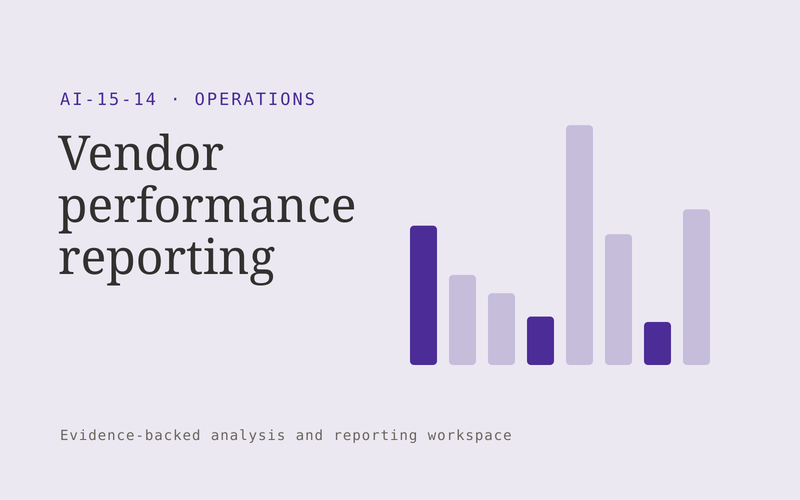

# Vendor performance reporting

**Operations** · Also fits: Finance; Management; Science and Research

> For procurement managers at growing businesses, turn delivery records, quality issues and agreed service measures into vendor performance review and action log. Address the recurring problem: vendor reviews rely on inconsistent anecdotal evidence. The value hypothesis is a more complete, reviewable deliverable with less repeated preparation; the pilot must establish whether that benefit is real.

| | |
|---|---|
| **Buyer** | Procurement managers at growing businesses |
| **Problem** | Vendor reviews rely on inconsistent anecdotal evidence. |
| **Format** | Evidence-backed analysis and reporting workspace |
| **USP** | Every performance finding links to agreed measures and supporting records. |

## The product
Key screens: Vendor scorecard, evidence detail, review actions. Open with a compact overview and filters for the relevant period or segment. Let users drill from each theme or metric into underlying records. Keep source definitions and missing-data notes near the result. Use an action panel to assign investigations and record what was learned. In this product, the first view is vendor scorecard, followed by evidence detail and review actions.

## Core functionality
1. Define comparable measures.
2. Reconcile records.
3. Flag missing data.
4. Summarize service failures.
5. Capture supplier responses.
6. Track agreed improvements.

## Customer workflow
Agree definitions, import authorized data, validate coverage and identifiers, compute transparent measures, group relevant evidence, review findings, assign investigations or improvements, and repeat on a comparable period. Start with delivery records, quality issues and agreed service measures and finish with vendor performance review and action log.

## AI and human review
Classify text, summarize evidence and propose explanations to investigate. Compute financial or operational measures with deterministic code. Separate observed patterns from causal claims and preserve examples that contradict the summary.

## Customer inputs
Delivery records, quality issues and agreed service measures

## Customer deliverables
Vendor performance review and action log

## Accounts and administration
Dataset permissions, field mappings, metric definitions, source drill-down, saved filters, reviewer annotations, recurring reports and action ownership.

## MVP scope
Begin with procurement managers at growing businesses and one recurring use case. Build the first two modules: define comparable measures; reconcile records. Provide operator assistance for the third module: flag missing data. Deliver vendor performance review and action log through a manual review queue. Perform other necessary full-scope functions manually during the pilot. Include all applicable access, accuracy and professional-review controls from the start.

## After MVP validation
After paid pilots establish value, automate the remaining modules: summarize service failures; capture supplier responses; track agreed improvements. Add one validated source integration, reusable customer configuration and recurring delivery. Expand to additional teams, document formats or languages only after testing the new scope.

## Build dependencies
Stable identifiers, consistent metric definitions, deterministic calculations, source lineage and representative review samples. Poor coverage must remain visible.

## Integrations and data access
Orders, inventory, supplier files, process documents and workflow records. Read-only business data exports, reporting databases and task trackers. Reconcile source totals before scheduling recurring data refreshes. These are candidate integration categories, not verified supported connectors.

## Defensibility
Domain-specific definitions, trusted source mappings and a history connecting findings to actions and observed results. For this idea, build around every performance finding links to agreed measures and supporting records. This advantage requires execution and accumulated customer trust; the base model alone is not a defensible asset.

## Alternatives and positioning
Analysts, business intelligence dashboards, spreadsheets and general text summarization tools. Differentiate on this specific proposed advantage: every performance finding links to agreed measures and supporting records. Test it against the buyer's current method on the same task. Competitor coverage and uniqueness have not been established.

## Revenue model and test pricing (USD)
Test USD 500-2,000 for an initial analysis of one bounded dataset. Offer USD 250-1,000 monthly for repeat reporting at agreed volume. Data cleanup and specialist analysis are separately priced. These are test ranges.

## Main delivery costs
Data preparation, reconciliation, classification, expert interpretation, customer-specific definitions and recurring reporting support.

## Marketing message to test
> Vendor performance reporting for procurement managers at growing businesses. Every performance finding links to agreed measures and supporting records. Demonstrate the claim through an evidence-backed vendor review pack.

## Acquisition channels
Procurement advisory firms

## Lead magnet
An evidence-backed vendor review pack

## First 30 days of marketing
- Week 1: interview five prospective buyers in this segment: procurement managers at growing businesses. Ask to see a recent example of the problem and their current process.
- Week 2: prepare this demonstration using authorized or synthetic material: an evidence-backed vendor review pack.
- Week 3: present it through procurement advisory firms and seek one narrowly scoped paid pilot.
- Week 4: review metric accuracy, completed supplier actions, total delivery effort and a concrete renewal decision before increasing scope.

## Paid pilot and validation
Analyze one historical period and review findings with the responsible domain owner. Reconcile headline measures, inspect counterexamples and ask the buyer to choose a concrete follow-up action. For this idea, use delivery records, quality issues and agreed service measures and evaluate vendor performance review and action log. Agree success thresholds with the buyer before starting; collect a baseline for metric accuracy, completed supplier actions. A positive signal is payment and repeat use with acceptable quality and delivery cost, not a favorable demo reaction alone.

## Success metrics
Metric accuracy, completed supplier actions

## Retention and expansion
Repeat the same definitions each reporting period and track whether findings lead to useful action. Expand data sources without breaking historical comparability.

## Operating controls and limitations
Make operational states and ownership explicit. Validate data and require appropriate approval before purchases, scheduling commitments or external system writes. Validate source access and reviewer availability during the pilot. Maintain customer-level access, data deletion controls and a record of final approvals.

## Brand style (concept)

- Colors: `#3c2791` primary · `#b4c954` accent · `#e7e4f1` surface · `#22201e` ink
- Type: Fraunces for headings, Inter for text
- Voice: Calm, reliable, step-by-step
- Demo site: [https://nexibeo.com/ideas/vendor-performance-reporting/demo/](https://nexibeo.com/ideas/vendor-performance-reporting/demo/)

## Investment indication

Indicative build budget, from MVP to full product. This is a planning range, not a quote; it excludes running costs such as model usage, hosting and reviewer hours.

| Phase | Scope | Timeline | Indicative budget |
|---|---|---|---|
| MVP | One buyer segment, one recurring use case; first modules: define comparable measures; reconcile records. Manual review in the loop. | 4 weeks | $6,000 |
| Paid pilot | Accounts, roles, review states, audit trail and the first integration, hardened for two to three paying pilot customers. | 5 weeks | $6,500 |
| Full product | Remaining modules: summarize service failures; capture supplier responses; track agreed improvements. Self-serve onboarding, billing, monitoring and the wider integration set. | 7 weeks | $8,500 |
| **Total** | | 16 weeks | **$21,000** |

**Co-create this project with us:** [contact Nexibeo](https://nexibeo.com/ideas/vendor-performance-reporting/#apply) and we build it with you.

## Research status
Concept proposal expanded from the 315-idea conversation. Demand, pricing, differentiation, build scope and integration feasibility are hypotheses, not verified market findings. Category link is inspiration rather than evidence of business viability.

## Credits and next steps

- **Estimation and building this idea:** see the full idea page on [nexibeo.com](https://nexibeo.com/ideas/vendor-performance-reporting/) for more detail on estimation, and to co-create and build this idea with Nexibeo.
- **Become an AI-optimized specialist for Operations:** [Complete AI Training](https://completeaitraining.com/tag/operations/?contentType=ai-certification).
- Field news: [AI news for Operations](https://completeaitraining.com/all-ai-news-for-operations/).
